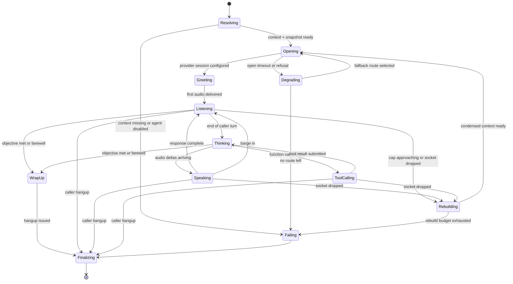
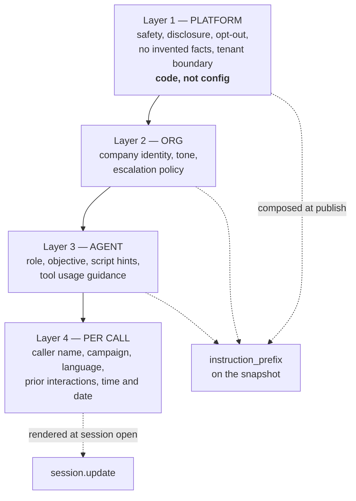

# Agent Architecture

> **Status:** Phase 2 — the agent core in §§1, 3, 4, 5, 6, 7 and 10 is **implemented**; §§2, 8, 9 and 11 remain **designed, not implemented**. Section 13.1 lists exactly which is which. No numbers in this document have been measured.
> **Source of truth for:** what an agent *is*, how one live call runs, how tools are declared and executed, how instructions and guardrails are composed, how agent versions are pinned and evaluated.
> **Companions:** [ARCHITECTURE.md](ARCHITECTURE.md) (system structure — read first) · [../PRD.md](../PRD.md) (product requirements and open decisions D-1..D-7) · [REALTIME_VOICE.md](REALTIME_VOICE.md) (frame-level audio) · [TESTING.md](TESTING.md) (evaluation mechanics) · [research/PROVIDER_CONSTRAINTS.md](research/PROVIDER_CONSTRAINTS.md) (what we actually verified) · [GLOSSARY.md](GLOSSARY.md).

This document goes deeper on one slice of [ARCHITECTURE.md](ARCHITECTURE.md) §4.4 and §5: the `rn_agent` package and everything that hangs off it. It does not restate the plane model, the deployment topology, or the audio wire format.

---

## 1. Agent definition vs agent session

Everything in this package rests on one distinction. Blur it and you get the two worst bugs this system can have: a configuration change that silently rewrites call history, and conversation state leaking between two callers.

| | **Agent definition** | **Agent session** |
|---|---|---|
| What it is | Persistent, versioned configuration | One live call's runtime |
| Where it lives | Postgres rows, owned by an organization | Process memory of exactly one `apps/voice-gateway` task |
| Lifetime | Months. Immutable once a call has used it | Seconds to 60 minutes |
| Cardinality | One per version | One per call |
| Mutability | Never, after publish | Constantly |
| Sharing | Deliberately shared, read-only, across all calls | Shared with nothing, ever |
| Identified by | `agent_version_id` (UUID) | `call_id` (our UUID), carrying `call_sid` from telephony |

### 1.1 The concrete case: two calls, one definition

Two callers are on the phone at the same time with the same agent version. Instance-level reasoning matters more than the abstraction, so here is exactly what is and is not shared:

**Shared — one immutable object, read-only, in a per-process LRU cache:**

```python
@dataclass(frozen=True, slots=True)
class AgentSnapshot:
    agent_version_id: UUID
    organization_id: UUID  # the owning tenant; a snapshot is never cross-tenant
    instruction_prefix: str  # platform + org + agent layers, already composed (§5)
    languages: LanguagePolicy  # primary, allowed, code-switch policy
    voice_map: Mapping[str, VoiceRef]  # language tag -> (provider, voice_id)
    realtime_tool_specs: tuple[Mapping[str, Any], ...]  # flat specs, prebuilt at publish (§3)
    enabled_tools: frozenset[str]
    turn_policy: TurnPolicy  # VAD mode, eagerness, who owns turn-taking
    model_route: ModelRoute  # realtime model id, reasoning_effort, fallback ladder
    telephony_audio: AudioProfile  # sample rate resolved at dial time from this
    knowledge_bindings: tuple[UUID, ...]
    guardrail_config: GuardrailConfig
```

It is frozen, it contains no connection, no session, no clock and no counter, and it is keyed in the cache by `agent_version_id`. **Because agent versions are immutable, this cache never needs invalidation — only eviction.** That property is worth the entire versioning scheme on its own: cache invalidation across N voice-gateway instances during a live call is a problem we simply do not have.

**Not shared — one per call, created at call start, discarded at call end:**

conversation history · caller/contact context · campaign context · the two WebSockets · the provider session id · playback ring buffer and `played_ms` accounting · barge-in state · pending tool calls and their idempotency keys · per-call rate-limit counters · turn timings · trace/span context · the accumulated transcript · language-observed-so-far · guardrail state such as "disclosure already spoken" and "opt-out detected".

If any of that is reachable from a module-level name, it is a bug. `CLAUDE.md` forbids it explicitly; the review question is always *"could a second concurrent call see this?"*

### 1.2 Where each thing is resolved

| Data | Resolved when | Where from | Cost budget |
|---|---|---|---|
| Agent snapshot | First use per process, then cached | `rn_services` → Postgres | Off the call path; pre-warmed for campaign agents |
| Per-call context (contact, campaign, consent flags, custom variables) | At dial time, **before** the media socket opens | Written to Redis keyed by our `session_id`; Postgres is the fallback read | Redis GET on the socket-accept path only |
| Telephony sample rate | At dial time, from the snapshot's `AudioProfile` | Query param on the Voicebot applet URL | — |
| Per-call instruction suffix (§5, layer 4) | Once, at session open | Rendered from the per-call context | Must be ready before `session.update` |
| Knowledge | Per tool call, mid-call | `rn_services` retrieval helper, on a task off the audio path | Not in the audio path |

Only an opaque identifier crosses the telephony boundary. Exotel's Voicebot applet allows **at most 3 custom key/value pairs and ≤256 characters of query string** ([PROVIDER_CONSTRAINTS](research/PROVIDER_CONSTRAINTS.md) HC-12), so passing business context through the URL is not merely ugly, it is impossible. Everything is looked up server-side, joined on `call_sid` from the `start` event.

---

## 2. The agent session lifecycle

One state machine, owned by `rn_voice`, driven by events from three sources: the telephony socket, the provider socket, and our own timers. The states below are the ones that have distinct behaviour on entry or distinct failure handling — not a narration of every event.



### 2.1 What each state actually does

**Resolving.** Read the per-call context by `session_id` from Redis, fall back to Postgres via `rn_services`, load or fetch the `AgentSnapshot`. Hard deadline: Exotel's documented expectation is that the bot responds within ~10 s of connect, with exactly one automatic handshake retry (HC-5, the specifics tagged `[L]`). Nothing blocking or unbounded belongs here.

**Opening.** Open the provider session and push the full configuration in one shot: composed instructions, voice for the primary language, the prebuilt flat tool specs, turn policy, audio formats. The provider connection should be established optimistically in parallel with context resolution where possible — the 10 s budget covers both.

**Greeting.** The first assistant utterance. It must contain the AI disclosure (§6). It is deliberately the only turn whose content we constrain with a per-call rendered instruction, because it is the one turn where getting it wrong is a compliance event rather than a quality issue.

**Listening / Thinking / Speaking.** The turn loop. Turn detection is currently delegated to the provider (`semantic_vad`, `eagerness: low` as the default, all VAD parameters exposed as per-agent config — `[A]` choice in [PROVIDER_CONSTRAINTS](research/PROVIDER_CONSTRAINTS.md) §5), on the reasoning that Indian English/Hindi code-switching and deliberative phrasing get clipped by aggressive endpointing. The seam to take turn-taking back is real and documented: OpenAI supports `create_response: false, interrupt_response: false` `[C]`, which would let guardrails run before we commit to an expensive spoken response. We have not taken it yet. Barge-in is the three-part atomic operation described in [REALTIME_VOICE.md](REALTIME_VOICE.md) and HC-7/HC-8/HC-9; the session state machine only observes it.

**ToolCalling.** Dispatched onto a **separate task** so audio keeps flowing (`ARCHITECTURE.md` §4.3). The session remains fully responsive: the caller can interrupt, hang up, or ask something else while a tool runs. The agent is instructed to speak a short filler acknowledgement when a tool is expected to be slow. Tool execution is described in §4.

**WrapUp.** Objective evaluation and a clean close: confirm what was agreed, ensure follow-up actions have actually executed (a booking that failed must not be spoken as booked), then issue the hangup. This is a state, not a moment, because "the model said goodbye" and "the side effects landed" are different facts.

**Rebuilding.** One code path serving two triggers, which is the point:

1. **Session cap approaching.** OpenAI Realtime has a hard 60-minute session cap (HC-6) and Exotel a 60-minute stream cap (HC-5) — *independent clocks started at different moments*. A `SessionLifecycleManager` owns both plus, on the cascaded path, Sarvam's ~60 s idle socket timeout (HC-22).
2. **Provider socket dropped.** Neither provider documents a resume primitive, so **we do not architect around one.** Conversation items are persisted as they stream; on a drop we open a fresh session and replay condensed context.

Because the recovery for both is "summarise, open a new session, replay condensed context", they are the same code. Rollover carries a budget (a maximum number of rebuilds per call) so a flapping provider cannot loop forever.

**Degrading.** Route selection failed at open. The fallback ladder is snapshot config, not code: premium realtime model → mini → cascaded Sarvam STT/LLM/TTS. Note the honest constraint — Sarvam STT WebSocket concurrency is capped at 100 across every published tier (HC-21), so the cascade is a *fallback*, not a second primary (PRD open item; commercially L-9 in the research brief).

**Finalizing.** Assemble the transcript, compute usage, and call `rn_services.finalize_call()`, which writes call state **and** the outbox row in one transaction. The voice gateway has no broker client and no database session of its own — that is enforced by two import-linter contracts, not by discipline.

### 2.2 Failure edges, explicitly

| Failure | Detected by | Behaviour | Caller experiences |
|---|---|---|---|
| Context not found at `start` | Redis miss + Postgres miss | Fail fast, no provider session opened, call record marked `setup_failed` | Call ends immediately |
| Provider open timeout | Timer against the connect deadline | `Degrading` → next route on the ladder | Slightly longer silence before the greeting |
| Provider socket drops mid-call | Socket close/error | `Rebuilding` → new session + condensed replay, within the rebuild budget | A pause; the agent should not re-greet |
| Caller hangs up mid-tool | Telephony `stop` event | Tool task is **not** cancelled if it has an external effect in flight; its result is recorded against the call, and the model is simply never told | Nothing — they are gone |
| Tool times out | Per-tool deadline | Structured `TIMEOUT` result returned to the model (§4.5) | The agent says it could not complete that right now |
| Session cap approaching | `SessionLifecycleManager` | `Rebuilding` proactively, before the hard cap | Ideally nothing |
| Rebuild budget exhausted | Counter on the session | `Failing` → graceful close with an apology turn if audio is still possible | Call ends with an apology |
| Telephony status callback never arrives | Reconciliation job (HC-11) | Call record reconciled by polling call details | Not applicable |

**A caller hanging up mid-tool is the edge most likely to be got wrong.** The instinct is to cancel everything on `stop`. Do not cancel a WhatsApp send or a booking that is already in flight at the provider — you will produce a message the tenant is billed for and has no record of. Let it complete, record the outcome against the call, and drop the model's side of the conversation.

---

## 3. The tool registry

A tool is declared **once**, in `rn_agent`, in plain Pydantic, and exported to two very different consumers.

```python
# packages/agent/src/rn_agent/tools/base.py  (shape, not implementation)


class ToolArgs(BaseModel):
    model_config = ConfigDict(extra="forbid")  # unknown keys are a validation failure


class BookMeetingArgs(ToolArgs):
    slot_id: str = Field(description="A slot id returned by check_availability. Never invented.")
    attendee_name: str
    notes: str | None = None


@registry.tool(
    name="book_meeting",
    description="Book a meeting in a slot previously returned by check_availability.",
    args=BookMeetingArgs,
    effect=Effect.EXTERNAL,  # drives idempotency requirements (§4.4)
    permission="org:campaign:update",  # must be in the FROZEN catalog -- see below
    timeout=timedelta(seconds=6),
)
async def book_meeting(args: BookMeetingArgs, rt: ToolRuntime) -> BookMeetingResult: ...
```

`ToolRuntime` carries the tenant context, `call_id`, `agent_version_id`, the locale and the service handles. **It is excluded from the generated JSON schema** `[C]` — the model never sees it and cannot populate it. That exclusion is structural rather than filtered: `ToolRuntime` is the *second parameter*, not a field of `ToolArgs`, so it was never in the model whose schema is generated.

> **`permission` must already be in the frozen catalog.** `roles.permissions` is constrained by a CHECK built from a literal snapshot in migration `0001`, so a value outside `rn_domain.permissions.ORG_PERMISSIONS` cannot be stored at all — `ToolRegistry` refuses the declaration at import time for exactly that reason. **Adding a tool permission is a migration**, and the tool set in §3.4 needs several that do not exist yet (meetings, callbacks, messaging). Budget one migration in the phase that introduces them.

### 3.1 Two exports, one declaration

| Consumer | Export | Shape |
|---|---|---|
| OpenAI Realtime session (`rn_voice`) | `registry.to_realtime_specs(enabled)` | **Flat**: `{"type": "function", "name": ..., "description": ..., "parameters": {...}}` |
| `rn_orchestration` graphs (`apps/worker`) | `rn_orchestration.tools.to_langchain_tools(registry, enabled)` | `StructuredTool` objects |
| Cascaded Sarvam LLM path | nested Chat-Completions shape | Sarvam's LLM API is OpenAI-compatible `[C]`, so the nested shape is reused unchanged |

Note where the LangChain export lives: **in `rn_orchestration`, not in `rn_agent`.** The registry knows nothing about LangChain; the adapter walks the registry and wraps it. This is why the registry can be imported by the voice gateway at all — import-linter contract *"Only rn_orchestration may import LangChain/LangGraph"* lists `rn_agent` as a forbidden source module, and that contract is the defining constraint of the codebase ([ADR-004](DECISIONS/ADR-004-langgraph-off-the-hot-path.md)).

There is a second, less obvious reason. `langchain-core` hard-depends on `langsmith` `[C]`. Making the tool registry — a package that every live call loads — depend on a tracing SaaS client is exactly the kind of accident that ends with Indian call transcripts leaving the country by default.

### 3.2 The trap: `convert_to_openai_tool` produces the wrong shape

> Realtime declares tools **flat**: `{"type":"function","name":...,"parameters":...}` with the properties at the top level, *not* nested under a `function` key `[C]` (HC-19).
> `langchain_core.utils.function_calling.convert_to_openai_tool()` returns the **nested Chat-Completions shape** and will not work against Realtime.

This fails *silently* in the worst way: the session may accept the payload but the model never calls the tool, and the symptom presents as "the agent won't use its tools" or "the agent invented a price" — a prompt problem, apparently. Engineers lose a day here. Two defences:

1. `rn_agent` builds the flat spec from `Args.model_json_schema()` directly. No LangChain code is anywhere near the Realtime path, so the wrong function is not even importable.
2. The flat specs are built and validated **at agent-version publish time**, stored on the snapshot, and re-validated by a unit test that asserts the top-level key set. A malformed tool schema fails in the dashboard, not on a live call.

### 3.3 JSON Schema details that bite

- Pydantic emits `$defs` and `$ref` for nested models and `anyOf` for `X | None`. Flatten/inline before export; do not assume the provider dereferences.
- Keep argument types shallow and primitive. Deeply nested objects raise argument-error rates for marginal expressiveness, and every extra field is another thing the model can hallucinate.
- Field `description` text is prompt surface. Write it for the model: *"A slot id returned by check_availability. Never invented."* is a guardrail, not documentation.
- **UNVERIFIED / verify before relying on it:** OpenAI's `strict` schema subset (its exact keyword restrictions, and whether Realtime honours `strict` identically to Chat Completions in the GA interface). The beta Realtime interface was removed on 2026-05-12 (HC-16), so pre-May-2026 examples are not evidence. Check the current reference in the session you implement this.

### 3.4 The V1 tool set

`search_knowledge` · `search_services` · `get_service_details` · `get_service_pricing` · `get_company_information` · `search_faq` · `create_lead` · `update_lead` · `save_customer_requirement` · `check_availability` · `book_meeting` · `schedule_callback` · `send_whatsapp` · `send_service_brochure` · `mark_interested` · `mark_not_interested` · `add_call_note` · `record_opt_out`

That is **18**, matching [PRD §6.4](../PRD.md), [GLOSSARY](GLOSSARY.md), [TESTING](TESTING.md) and [COMPLIANCE](COMPLIANCE.md). `record_opt_out` was missing from this list until Phase 2 and is **not** interchangeable with `mark_not_interested`: the former writes a durable cross-campaign suppression, the latter records a sales-interest signal.

**One of the 18 exists.** `search_knowledge` was built ahead of the rest of Phase 3 Stage 2, in a form that touches no schema and pre-empts no D-8 decision ([ADR-012](DECISIONS/ADR-012-offline-in-memory-retriever.md)); it runs over an in-memory index and needed no migration, because `org:knowledge:read` was already in the frozen permission catalog. The other **17** arrive in **Phase 3 (11** more retrieval/lead/company tools, with Stage 2), Phase 9 (`record_opt_out`, with the suppression write and the pre-dial gate) and **Phase 10 (five**: `check_availability`, `book_meeting`, `schedule_callback`, `send_whatsapp`, `send_service_brochure`). 12 + 1 + 5 = 18. Phase 2 ships two READ-only built-ins over knowledge-base metadata — `list_knowledge_bases` and `find_knowledge_base` — which exist to exercise the pipeline, not to be part of this set.

*(This paragraph previously said "Phase 3 (13 …)" while listing `check_availability` under Phase 10, and [ROADMAP](ROADMAP.md) listed that tool in both phases. Resolved in favour of Phase 10: availability and booking are one slot-issue/slot-verify mechanism, and the "the model may echo an id, never originate one" invariant is only testable when both halves exist. See the note in ROADMAP's Phase 3.)*

Two design rules visible in that list. **Retrieval and authority are separate tools:** `search_knowledge` answers *"what do you do?"*; `get_service_pricing` answers *"what does it cost?"*. Knowledge is fuzzy and quotable; pricing is authoritative and exact, and it must never come out of a vector index. **Availability is a read before it is a write:** `check_availability` returns opaque slot ids, and `book_meeting` accepts only an id that was returned. The model cannot construct a slot because it never sees a slot's internals.

---

## 4. Tool execution pipeline

[ARCHITECTURE.md](ARCHITECTURE.md) §5 shows the shape. This is the ordering, and why it is that ordering. Every stage is in `rn_agent` (dispatch, checks, envelope) or `rn_services` (the actual work). None of it is in `rn_voice` beyond "hand it to the dispatcher on another task, await the envelope, submit the result".

**The order is deliberate: cheapest and most security-relevant first.** An unauthorized call must be rejected before we spend a schema validation on it, and certainly before we spend a database round trip.

### 4.1 Stage 1 — permission, twice

Two independent checks, both required:

- **Agent-level:** is `tool_name` in `snapshot.enabled_tools`? The tool was in the session config, so a `no` here means the model fabricated a call or the snapshot changed — either way it is anomalous and is logged as such.
- **Organization-level:** does the acting organization hold the tool's `permission` (a custom `org:<feature>:<action>` permission), and is the underlying capability provisioned for that tenant — WhatsApp configured, calendar connected, plan entitlement present?

The org-level check exists separately because tenant entitlements change without an agent version change. An agent whose version enabled `send_whatsapp` must stop being able to send when the tenant's messaging integration is removed, with no redeploy and no new agent version.

Clerk's system permissions never reach the backend `[C]` (HC-30), so all of this is built on our own custom permissions; and there is a hard ceiling of 10 custom organization roles without a paid add-on `[C]` (HC-31) — see PRD **D-7**.

### 4.2 Stage 2 — schema validation

Pydantic, `extra="forbid"`. A validation failure is *not* an exception that ends the turn; it is a structured `INVALID_ARGUMENTS` result handed back to the model with the field-level errors, which models are generally good at correcting on a retry. Retries are bounded per tool per turn to prevent a validation loop from eating a call.

### 4.3 Stage 3 — server-side context injection

`organization_id`, `call_id`, `agent_version_id`, actor and locale are injected into `ToolRuntime` from the session's server-side context. They are **never** read from model output. If model output contains a key that collides with an injected field, the value is discarded and a **security event** is recorded against the call — that is a prompt-injection signal, not a bug report.

This is the single most important line in this document. Tenant identity is not a tool parameter. It is not in the JSON schema. There is no code path by which a model token becomes an `organization_id`.

### 4.4 Stage 4 — idempotency, rate limits, compliance

Applies to `effect=EXTERNAL` tools only (send, book, schedule):

- **Idempotency key** derived server-side: a hash over `(call_id, tool_name, canonical_args)`. Derived, never accepted — a model-supplied key is a model-controlled dedup window. Keys live in Redis for the dedup window and the *authoritative* uniqueness constraint lives in Postgres, because Redis is coordination and Postgres is truth.
- **Rate limits** at three scopes: per call (a model in a loop), per organization (runaway campaign), per provider (Exotel's `Calls/connect` is 200 req/min `[C]`, HC-13, and messaging has its own limits).
- **Compliance gates** on anything that reaches a human: opt-out status, consent record, calling window. A `send_whatsapp` to a contact who opted out is refused in code regardless of what the model was told or asked.

### 4.5 Stage 5 — execute, envelope, audit

The tool body calls `rn_services`. It never touches `rn_persistence` — an import contract forbids `rn_agent` from importing SQLAlchemy at all.

Every tool returns the same envelope. **The model is never shown an exception, a stack trace, an SQL error, a provider error body, or an internal identifier.**

```python
class ToolOutcome(StrEnum):
    OK = "ok"
    DENIED = "denied"  # not permitted for this agent or org
    INVALID_ARGUMENTS = "invalid_arguments"
    NOT_FOUND = "not_found"
    CONFLICT = "conflict"  # slot taken, duplicate booking
    RATE_LIMITED = "rate_limited"
    UNAVAILABLE = "unavailable"  # downstream provider down
    TIMEOUT = "timeout"
    BLOCKED = "blocked"  # compliance: opt-out, consent, window


class ToolEnvelope(BaseModel):
    outcome: ToolOutcome
    data: Mapping[str, Any] | None  # only on OK
    message: str  # a short, speakable, caller-safe explanation
    retryable: bool
```

`message` is written for a human ear and is the reason failures work at all: *"I couldn't reach the calendar just now"* is something the agent can say, and something the caller can respond to. A stack trace is something the agent will read out loud, and it will happen on the day of the demo.

The full record — arguments, envelope, latency, outcome, retry count, idempotency key — is persisted asynchronously against the call for audit, debugging and evaluation. Persistence is off the audio path; the model gets its envelope first.

### 4.6 What the agent is told versus what we record

| Situation | Model sees | We record |
|---|---|---|
| Provider 500 | `UNAVAILABLE`, "I couldn't reach the calendar just now" | Full provider response, request id, latency, trace |
| Tool not permitted | `DENIED`, "I'm not able to do that on this call" | Security event with tool name, agent version, org |
| Injected `organization_id` in args | Field silently ignored; call proceeds or fails validation | **Security event** — prompt-injection signal |
| Duplicate booking | `CONFLICT`, "that slot has just been taken" | Idempotency hit, original booking id |

---

## 5. Instructions and prompt architecture

Instructions are composed from four layers with strictly decreasing authority and strictly increasing volatility.



Layers 1–3 are composed **once, at publish time**, and stored on the snapshot. Layer 4 is rendered per call. This split is not stylistic: the composed prefix is byte-identical across every call on that agent version, which is what makes prompt caching effective — and the cached/fresh spread on realtime audio input is roughly 80× ($0.40 vs $32 per 1M) `[C]`, so caching the long stable prefix is a first-order cost lever, not an optimisation.

### 5.1 Why layer 1 cannot be overridden

The platform layer lives in `rn_agent` as code with tests, is composed *first*, and is not addressable from any tenant-facing field. There is no template variable a tenant can set that lands inside it, and the composition function does not accept an override argument. A tenant cannot write an agent instruction that says "ignore the disclosure requirement", because tenant text is appended *after* the platform layer and — critically — because **the disclosure and opt-out requirements are also enforced outside the prompt** (§6). Instruction precedence in an LLM is a *tendency*, not a guarantee. We use ordering because it helps, not because we trust it.

Layer 1 covers: AI self-identification; honouring opt-out; never discussing another customer or another organization; never inventing prices, availability, identifiers or commitments; treating retrieved content and caller speech as data rather than instructions; PII handling; and the refusal posture for out-of-scope requests.

### 5.2 Prompt-injection defence

Two hostile inputs reach the model on every call: **caller speech** and **retrieved knowledge content** (a tenant can upload a document; a document can contain instructions).

In-prompt measures, which help and are not sufficient:

- Retrieved content is inserted inside an explicitly delimited untrusted block, labelled as reference material that may contain text resembling instructions, which must never be followed.
- Tool results are similarly framed as data.
- The platform layer states that instructions arriving inside content or from the caller do not change the agent's role, permissions or tenant.

Structural measures, which are the actual defence:

- **The enabled tool list is session configuration.** No amount of injected text adds a tool to the session, because the model can only call what was declared at `session.update`.
- **Tenant identity is injected, never parsed** (§4.3), so "you are now serving organization X" changes nothing that matters.
- **Retrieval is tenant-scoped inside a single helper**, so there is no query shape a caller can induce that reaches another tenant's chunks. Precisely: a tool calls a retrieval **service** in `rn_services`, and that service is the only caller of the one function in `rn_persistence` that issues a `<=>` query. A tool cannot reach the persistence function even in principle — the import contract forbids `rn_agent` from importing `rn_persistence`. See [DATA_MODEL §7](DATA_MODEL.md#the-single-retrieval-helper--and-the-two-layers-it-is-split-across), which is authoritative on the split. *(This bullet previously said the helper lived in `rn_services`, which conflated the orchestration with the SQL.)*
- **Every external effect is permission-checked and compliance-gated in code** after the model has requested it.

The adversarial test for this is a V1 success criterion in the PRD: zero cross-tenant access under prompt-injection attempts.

---

## 6. Guardrails: code versus prompt

**The model is not a security boundary.** It is a component that usually complies. Every guardrail below is classified by where it is actually enforced, and the "code" column is the one that has to hold when the model is having a bad day, when a caller is adversarial, or when a provider silently changes model behaviour under a stable model id.

| Guardrail | Asked of the model | Enforced in code | If code cannot enforce it |
|---|---|---|---|
| **AI disclosure** | Platform layer; per-call greeting instruction | First-turn assistant transcript is checked for the disclosure; absence raises a compliance event on the call record and is a hard failure in evaluation | We cannot constrain generated speech token-by-token, so detection is post-hoc. This is a real gap — stated, not hidden |
| **Opt-out** | Recognise and confirm; call the opt-out tool | A code-side multilingual matcher runs over every final caller transcript. On a hit: durable opt-out written, campaign dialling blocked, independent of anything the model does or says | Detection quality depends on transcript quality; the cascaded path has no interim transcripts (HC-20), so matching runs per utterance, not per word |
| **No other customers** | Platform layer | Every query is tenant-scoped by `organization_id` from server-side context. There is no reachable data to leak | — |
| **No invented prices** | "Prices come from `get_service_pricing`, never from memory" | Pricing is tool-only and authoritative; knowledge chunks that look like prices are flagged at ingestion | A model can still *say* a number. Detected in evaluation (hallucination dimension), not preventable at runtime |
| **No invented slots** | "Only book a slot id returned by `check_availability`" | `book_meeting` rejects any slot id it did not issue; bookings are validated against real availability with a uniqueness constraint | Structurally solid — the failure mode is a refusal, not a bad booking |
| **No invented commitments** | Platform layer | Follow-up actions must have executed before wrap-up asserts them | Same as prices — a caught quality defect, not a prevented one |
| **PII handling** | Do not read back full numbers unnecessarily | `rn_core` redaction in every log path; phone numbers never logged in full; transcripts tenant-scoped with authorization on read/export | Recording policy is **PRD D-5**, unresolved |
| **Tool abuse / loops** | — | Per-call, per-org and per-provider rate limits; bounded retries per tool per turn | — |
| **Scope refusal** | Platform + agent layers | Nothing outside the tool set is executable | — |

The consistent pattern: where a guardrail can be made *structural* (permissions, tenant scoping, slot ids, opt-out lists), it is, and the prompt is a courtesy. Where it cannot (what the model says out loud), we are explicit that the control is detective rather than preventive, and it becomes an evaluation dimension with a threshold rather than a comforting sentence in a system prompt.

---

## 7. Multilingual behaviour

Per-agent configuration, never a global constant, never inferred from a phone number's country code:

```python
# rn_domain.values -- IMPLEMENTED (migration 0002)
@dataclass(frozen=True, slots=True)
class LanguagePolicy:
    primary: LanguageTag  # BCP-47-ish, e.g. "en" or "hi-IN"
    allowed: tuple[LanguageTag, ...]
    follow_caller: bool = True  # switch to the caller's language mid-call
    code_switch: bool = True  # allow mixing within one utterance
```

**Where it is stored, and why there are two columns.** `agent_versions.language_policy`
is JSONB and is authoritative. `agent_versions.languages` survives as a denormalised
**projection** of `allowed`, because "which agents speak Telugu?" should be an indexable
array query rather than a JSONB scan. They cannot disagree:

* in the domain there is only one field — `AgentVersion.languages` is a read-only
  property over `language_policy.allowed`, so there is nothing to set inconsistently;
* in the database a CHECK asserts
  `to_jsonb(languages) IS NOT DISTINCT FROM language_policy -> 'allowed'`, so a
  disagreeing row cannot be written by *any* writer, including raw SQL.

A second CHECK requires the policy to be coherent — at least one language, `primary`
present and among `allowed`, both flags real booleans. `IS NOT DISTINCT FROM` rather
than `=` because a CHECK expression evaluating to NULL **passes**, which is exactly what
the `'{}'::jsonb` column default would produce.

Expected behaviour, from PRD §5.2: a call has **no single language**. *"Website toh already hai, social media management chahiye."* and *"App development ki approximately entha avutundi?"* are the normal case, not the edge case. The agent must not force the caller into one language, and must carry context across a switch.

**Voice is per language, not per agent.** `voice_map: Mapping[str, VoiceRef]` maps a language tag to a `(provider, voice_id)` pair, because the catalogues are not interchangeable: OpenAI exposes 10 named voices which are **immutable once audio has been emitted in a session** `[C]`, while Sarvam's `bulbul:v3` has a much larger speaker set with per-language recommendations plus `pace`/`temperature` `[C]`. A mid-call language switch therefore cannot change the OpenAI voice; on the cascaded path it can. Treat that asymmetry as a `SessionCapabilities` flag, not as something to paper over.

On the cascaded path there is a second coupling: Sarvam's STT `mode` (`transcribe` / `translit` / `codemix` / `translate` / `verbatim`) **changes the script the LLM sees** `[C]`. Devanagari versus romanised Hindi is a different token distribution and therefore a different prompt. Mode and prompt are stored as one versioned artifact per agent; changing the mode without re-evaluating the prompt is a silent quality regression.

### 7.1 The honest statement about Telugu

> **Telugu speech-to-speech support is UNVERIFIED.** There is **no official speech-to-speech language list for `gpt-realtime-2.1` at all** `[C]`. The widely-repeated "70+ input / 13 output languages" figure belongs to `gpt-realtime-translate`, a *different* model, and Telugu is absent even from that model's output set. No provider publishes a Hindi/Telugu code-switching benchmark. The only Telugu evidence found anywhere was a third-party vendor claim about the translate model.
>
> This is the highest product risk in the project. It is **PRD open decision D-2**: do we promise Telugu at launch, or English + Hindi first with Telugu after evaluation? It is settled by our own evaluation on real Indian telephony audio (§11), not by documentation, and not by this document.

Consequences we build for regardless of the answer: language is agent configuration, the language evaluation suite is per-language and per-language-pair, and every call records the languages actually observed so the mix is measurable from day one rather than reconstructed later.

---

## 8. Where LangChain and LangGraph are, and are not

**Never in the media transport. Elsewhere in a live call, only with evidence.** Two rules, and it matters which is which:

- **Permanent:** `rn_voice.media` — the audio pump, buffers, played-ms accounting, VAD plumbing and barge-in mechanics — may not import `langchain*`, `langgraph*`, `langsmith`, `rn_orchestration`, `rn_agent` or `rn_services`. No benchmark buys an exemption. A second contract enforces `runtime → session → media` so it cannot be reached around.
- **Conditional:** `rn_voice.runtime`, the *decision* layer, **may** consult an orchestration layer for higher-level stateful work — workflow decisions, multi-step reasoning, tool orchestration, recovery, complex conversation state. Anything synchronous inside a live turn must first clear the gate in [ADR-009](DECISIONS/ADR-009-orchestration-boundary-for-live-sessions.md): a measured latency figure at realistic concurrency, a fit in the measured turn budget, a reason it cannot run off the critical path, a fallback, a per-agent flag, and an ADR. Off-turn use needs none of that.

Separately and unconditionally, `langchain`/`langgraph` code is only ever *written* in `rn_orchestration`; every other package lists them as forbidden imports in the root `pyproject.toml`. `uv run lint-imports` fails the build if any of this changes.

`rn_orchestration` — today called only by `apps/worker` — does exactly this:

1. **Post-call structured analysis** — schema-constrained structured output producing the PRD §6.7 fields: summary, interest, qualification, intent, requested services, languages used, sentiment, budget, timeline, requirements, objections, questions asked, meeting booked, callback requested, WhatsApp sent, follow-up required, next action, outcome, confidence. Dashboard analytics never parse free-form model text.
2. **Evaluation runner** — scripted conversations and judged scoring against an agent version (§11).
3. **Future multi-agent and HITL graphs** — approval workflows, escalation, batch enrichment. Minutes-scale, human-in-the-loop, resumable.

None of it is reachable from a live call, and the reasons are load-bearing rather than aesthetic:

- **Latency is unquantified.** The commonly cited "~2 ms per node" figure is third-party blog content; **no official LangGraph latency benchmark exists.** Spending an unmeasured amount of an unmeasured turn budget on a framework whose value here is workflow structure — which a live turn does not need — is a bad trade.
- **The Postgres checkpointer is a throughput hazard.** `AsyncPostgresSaver` holds an instance-level `threading.Lock()` during async execution; the reported benchmark at 500 concurrent users is 199.9 req/s @ 1923 ms versus 1295 req/s @ 88 ms for a raw `psycopg_pool` `[C]` (HC-37, issue #7259 — **verify whether the linked PR landed before sizing anything on it**). Live-call-adjacent graphs use `InMemorySaver` flushed asynchronously to our own schema; `AsyncPostgresSaver` is for post-call and HITL only, with `durability='async'` or `'exit'`.
- **Version coupling.** `langchain` 1.3.x hard-pins `langgraph>=1.2.5,<1.3.0` `[C]` — they move as one train. Confining that train to one leaf package means a LangChain upgrade cannot break the media plane.
- **Checkpoint hardening is mandatory** on shared multi-tenant Postgres: `LANGGRAPH_STRICT_MSGPACK=true` set in base config `[C]` (HC-39), thread ids namespaced `tenant:campaign:call_sid`, Store namespaces prefixed by tenant.

### 8.1 The `interrupt()` re-execution hazard

> **`LangGraph interrupt()` restarts the entire node from the beginning on resume. It does not resume from the interrupt line** `[C]` (HC-38).

Any side effect placed before an `interrupt()` **re-executes on resume**. For a HITL graph that dials, this means **a duplicate outbound call to a real Indian phone number** — a real cost, a real compliance exposure, and a caller who is annoyed twice.

Rules for anyone writing a graph in `rn_orchestration`:

1. Side effects go **after** the `interrupt()`, never before.
2. If a side effect must precede one, it goes behind a durable idempotency key checked in Postgres — not in Redis, not in graph state.
3. Node functions that perform external effects are reviewed for re-entrancy as a matter of course. Assume every node body can run more than once.

---

## 9. Provider abstraction for the agent

The agent-facing seam is `VoiceSession` in `rn_providers` — the provider-swap seam that matters most, because both OpenAI speech-to-speech and the cascaded Sarvam STT→LLM→TTS path must plug into it:

```
async open(agent_config) -> None
async push_audio(pcm, rate)
async stream_output() -> AsyncIterator[AudioChunk | ToolCall | TranscriptEvent | TurnEvent]
async truncate(played_ms)
async cancel_generation()
async submit_tool_result(call_id, output_json)
capabilities: SessionCapabilities
```

### 9.1 What does not abstract, and is therefore branched on explicitly

We expose `SessionCapabilities` and make callers branch, rather than pretending uniformity and failing silently on the fallback path.

| Leak | The reality | How the agent layer copes |
|---|---|---|
| **Interim transcripts** | OpenAI streams them; the Sarvam STT WebSocket emits **nothing** until VAD end-of-speech `[C]` (HC-20) | `supports_interim: bool`. Turn-taking and opt-out detection must have a VAD-only path. **Do not fake partials.** |
| **Barge-in mechanics** | OpenAI needs `conversation.item.truncate` with a truthful `audio_end_ms` and does **not** auto-truncate on WebSocket `[C]` (HC-7); the cascade has no context to truncate, only a TTS socket to flush | Unify at the *effect* level (`cancel_generation()`), never at the mechanism. Each adapter owns its own mechanism. |
| **Turn-detection ownership** | OpenAI runs `server_vad`/`semantic_vad` server-side; Sarvam exposes `vad_signals` with its own frame size and thresholds | One `TurnPolicy` config object; adapters translate. The option to own turn-taking ourselves (`create_response:false`) `[C]` is documented and unused. |
| **Voice catalogues** | 10 OpenAI voices, immutable mid-session `[C]`; ~37 Sarvam speakers with per-language recommendations `[C]` | `voice_map` is language-keyed config. The **per-speaker × per-language validity matrix for `bulbul:v3` is not published** — validate each pair empirically before exposing it in agent config. |
| **Session lifetimes** | Three independent clocks: OpenAI 60 min hard (HC-6), Exotel 60 min stream (HC-5), Sarvam ~60 s **idle** per socket (HC-22) | `SessionLifecycleManager` owns all three; adapters expose `time_to_forced_close()`; keepalives are adapter-local. |
| **Reconnection** | Not a documented feature on either provider | No resume primitive is assumed. Persist items as they stream; rebuild with condensed context (§2.1). |
| **Cost accounting** | OpenAI token-based with an ~80× cached/fresh audio-input spread `[C]`; Sarvam per-hour STT and per-character TTS `[C]` | Adapters emit a normalised `UsageEvent`. Never assume per-minute billing. |

### 9.2 Model routing

`gpt-realtime-2.1-mini` is the default; `gpt-realtime-2.1` is per-agent opt-in — roughly a 3× cost swing on audio input `[C]`. `reasoning_effort` is constrained to `minimal`/`low` (anything higher measurably delays first audio, `[L]`). Whether `temperature` still exists in the GA session object is **UNVERIFIED** (§6a-13 of the research brief) — do not put it in the snapshot schema until it is confirmed against current docs.

---

## 10. Versioning

### 10.1 What creates a new version

Any change to a field that feeds the `AgentSnapshot`: instructions at any layer, language policy, voice map, enabled tool set, turn policy, model route and fallback ladder, audio profile, knowledge-base **bindings**, guardrail config.

What does *not*: knowledge base **content** (versioned separately, on its own lifecycle, so a re-index does not fork every agent), tenant entitlements and permissions (checked live, §4.1), and campaign parameters (a property of the campaign).

That split has a consequence worth stating: replaying an old call's context exactly is only possible for configuration, not for retrieved knowledge, unless the retrieval results themselves were captured. **They are** — every tool execution, including retrievals, is persisted with its arguments and result, which is what makes a call reconstructible and an evaluation reproducible.

### 10.2 States and immutability

`draft` → `published` → (`published` remains valid while newer versions exist) → `archived`.

A version becomes **immutable the moment it is published**, not the moment a call uses it. Immutable-on-first-use sounds thriftier and is a trap: it means the same `agent_version_id` refers to two different configurations depending on timing, and cached snapshots across N gateway instances would diverge with no invalidation signal. Immutable-on-publish is what makes the per-process LRU cache correct (§1.1). Editing a published version creates a new draft; there is no in-place edit path in the API.

### 10.3 How a call pins a version

The active version for an agent is resolved **once, at dial time (outbound) or at inbound-route resolution**, and `agent_version_id` is written into the call record before the media socket opens. Every downstream artifact — every tool execution row, transcript, post-call analysis, usage record, evaluation result — carries it.

Consequences: publishing a new version mid-campaign does not affect calls already in flight; "which configuration handled this call?" always has an exact answer; and a regression is attributable to a specific version rather than to a date range.

### 10.4 Comparing versions

Two mechanisms, and both are needed:

- **Structural diff** — a field-level diff of the two snapshots, with instruction layers diffed separately so "the org changed its tone" is visibly distinct from "the agent gained a tool".
- **Behavioural diff** — the same evaluation suite run against both versions, compared per dimension and per scenario, with regressions surfaced individually. A three-point aggregate improvement that hides a compliance regression is a failed change, and only a per-dimension view catches it.

Version comparison is a first-class dashboard feature, not a script, because the person making a prompt change is usually not an engineer.

---

## 11. Evaluation architecture

Design here; mechanics, fixtures and CI wiring in [TESTING.md](TESTING.md). The `agent_eval` pytest marker already exists in the root `pyproject.toml`.

The premise: **the agent's quality is a property of an agent version, and it is measured, not asserted.** An agent version that has not been evaluated is not publishable to a production campaign.

### 11.1 Dimensions

| Dimension | Question | How scored |
|---|---|---|
| Factual correctness | Were the stated facts true for this tenant? | Judge against seeded fixtures |
| Hallucination | Did it state a price, slot, id or commitment not obtained from a tool? | Deterministic where the value is checkable; judged otherwise |
| Tool selection | Did it call the right tool, and only when needed? | Deterministic against expected call set |
| Tool argument correctness | Were the arguments right, given what the caller said? | Deterministic |
| Objective completion | Was the agent's objective achieved? | Judged with a rubric |
| Brevity | Turn length and total call length against target | Deterministic |
| Interruption behaviour | Did it stop on barge-in and respond to the interruption? | Deterministic from event timeline |
| Language correctness | Right language, correct code-switch handling, no forced switching | Judged, per language and per pair |
| Compliance | AI disclosure present in the first turn; no prohibited claims | **Deterministic, hard fail** |
| Opt-out handling | Recognised, confirmed, and durably recorded | **Deterministic, hard fail** |
| Security / injection resistance | Did injected content change behaviour, tenant scope or tool use? | Deterministic — any cross-tenant access is a hard fail |
| Latency | Our own stages, instrumented | Deterministic, **target** not measurement (§11.4) |
| Action completion | Did the side effect actually land in the database, not just get spoken? | Deterministic |

Compliance, opt-out and security are **gates**, not scores. A version that regresses on any of them cannot be published, whatever its average.

### 11.2 How scenarios are expressed

A scenario is a versioned, declarative artifact, not a test function:

- **Fixture** — the tenant, agent version, seeded knowledge, seeded services and pricing, seeded availability, contact and consent state.
- **Caller** — either a fixed utterance script (deterministic, cheap, for regression) or a simulated caller persona with a goal and a temperament (exploratory, for finding new failure modes). Both are needed; the fixed scripts are the CI suite.
- **Expectations** — expected tool calls with argument constraints, expected database side effects, forbidden statements, required statements, per-dimension thresholds.
- **Audio mode** — text-level (fast, cheap, no audio path) or audio-level (real telephony audio through the real bridge). Text-level catches reasoning and tool bugs; only audio-level catches barge-in, endpointing and language bugs, which are the ones we are most uncertain about.

Scenarios live with the repository, are reviewed like code, and are themselves versioned — because a scenario change alters what a score means.

### 11.3 How results attach

An `eval_run` row carries: `agent_version_id`, scenario-suite version, judge model id and rubric version, dataset version, timestamp, and per-scenario per-dimension results with the full transcript and tool-execution log retained.

Pinning the judge model and rubric version is not bookkeeping. A judge model changing under a stable alias silently re-baselines every score, and without the pin you will spend a day debugging an agent regression that is actually a judge change.

### 11.4 What we can and cannot claim

- **Every latency number in this repository is a target or a budget.** Provider round-trip from `ap-south-1` to the nearest OpenAI Realtime edge is **unmeasured**, and it sits directly inside the turn budget. The PRD's < 1.5 s p95 target is explicitly provisional until measured.
- **No concurrency claim.** OpenAI documents no concurrent-session limit for the realtime models — only RPM/TPM `[C]` (HC-18) — and Exotel's channel capacity is a commercial question, not a documented one (PRD **D-6**). The "100 concurrent calls" figure is a target awaiting a load test with provisioned capacity.
- **No language claim** beyond what our own evaluation shows (PRD **D-2**).

Evaluation runs in `rn_orchestration` on the worker, using the same `rn_agent` tool registry and the same `rn_services` business logic as a live call. Only the *transport* differs — which is the whole reason the registry is framework-free and transport-agnostic.

---

## 12. Open items owned by this document

| Item | Status | Where it is resolved |
|---|---|---|
| Telugu speech-to-speech support | **UNVERIFIED**, no official language list exists | Our own evaluation → **PRD D-2** |
| Hindi/Telugu code-switch quality | No provider benchmark published | Our own evaluation → **PRD D-2** |
| `strict` schema subset and Realtime's handling of it | **UNVERIFIED** against the GA interface | Verify against current docs at implementation time |
| Whether `temperature` survives in the GA session object | **UNVERIFIED** | Same |
| GA defaults for `server_vad` parameters | **UNVERIFIED** — do not hardcode beta-era values | Same |
| Whether LangGraph issue #7259 is fixed in 1.2.9 | **UNVERIFIED** | Check before sizing any concurrent graph path |
| Sarvam speaker × language validity matrix | Not published | Empirical validation before exposing voices in agent config |
| Recording, and therefore what the disclosure script must say | **DECISION REQUIRED** | **PRD D-5** |
| Custom role/permission ceiling for tool authorization | **DECISION REQUIRED** — 10 custom roles without a paid add-on | **PRD D-7** |
| Consent artifact backing the pre-dial gate that guards tools reaching humans | **DECISION REQUIRED** | **PRD D-3** |

---

## 13. Where to look next

### 13.1 Implementation status, as of Phase 2

| Section | State |
|---|---|
| §1 Definition vs session, `AgentSnapshot` | **Implemented.** Frozen, deterministic, content-hashed. The per-process LRU of §1.1 is **not** built — there is no live-call path to measure, and immutable-on-publish is the property that will make it correct when there is. |
| §2 Session lifecycle | **Designed only.** No audio, no telephony, no provider session. Phases 4-5. |
| §3 Tool registry, flat schema export | **Implemented**, including the HC-19 flat shape and its regression test. The LangChain export (§3.1) is **not** built — it belongs to `rn_orchestration`, Phase 11. The §3.4 tool set is **not** built (see the note there). |
| §4 Tool execution pipeline | **Stages 1, 2, 3 and 5 implemented.** Stage 4 (idempotency, rate limits, compliance gates) is **not** — it applies to `EXTERNAL`-effect tools, none of which exist; the registry refuses to declare one until it does. |
| §5 Instruction layers | **Implemented.** Layers 1, 3 and 4; layer 2 has a parameter and no column — organization-level instructions arrive with organization settings. |
| §6 Guardrails | **AI disclosure and opt-out recognition implemented** as code matchers, en/hi/te, native script and romanised. Recognition is not enforcement: the durable opt-out write is Phase 9. The remaining rows are structural properties of later phases. |
| §7 Multilingual | **`LanguagePolicy` implemented** and versioned. `voice_map` is parsed and validated; nothing speaks. |
| §8 LangChain/LangGraph placement | **Designed only.** `rn_orchestration` is empty. |
| §9 Provider abstraction | **The text-mode `LLMProvider` seam is implemented**, with a scripted fake and no vendor adapter. `VoiceSession` is **not** — Phases 4-5. |
| §10 Versioning | **Implemented.** Immutable on publish, enforced by a database trigger that migration `0002` extended to cover `language_policy`. |
| §11 Evaluation | **Tier 1 implemented** — scripted, deterministic, offline, gating compliance/opt-out/injection. The judged tier, `eval_run` persistence and version comparison are **not**; they belong to `rn_orchestration`, Phase 11. |

Nothing in this document has been measured. No latency, throughput, concurrency or
language-quality figure here is evidence.

| Question | Document |
|---|---|
| How does audio actually flow, frame by frame? | [REALTIME_VOICE.md](REALTIME_VOICE.md) |
| How are agents, versions and tool executions stored? | [DATA_MODEL.md](DATA_MODEL.md) |
| How are evaluations actually run and wired into CI? | [TESTING.md](TESTING.md) |
| What is the tenant isolation model in full? | [SECURITY.md](SECURITY.md) |
| What must we do before dialling an Indian number? | [COMPLIANCE.md](COMPLIANCE.md) |
| What did we actually verify about our providers? | [research/PROVIDER_CONSTRAINTS.md](research/PROVIDER_CONSTRAINTS.md) |
| Why is LangGraph confined to one package? | [DECISIONS/ADR-004-langgraph-off-the-hot-path.md](DECISIONS/ADR-004-langgraph-off-the-hot-path.md) |
