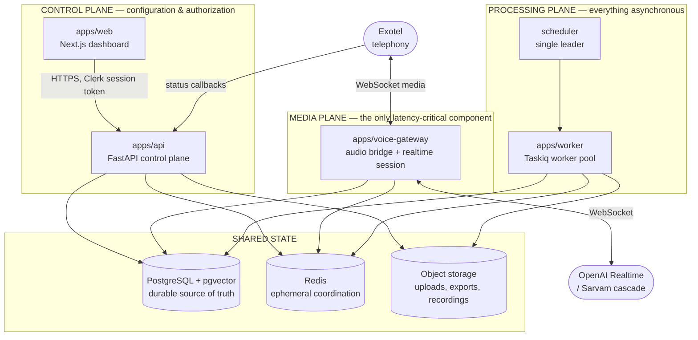
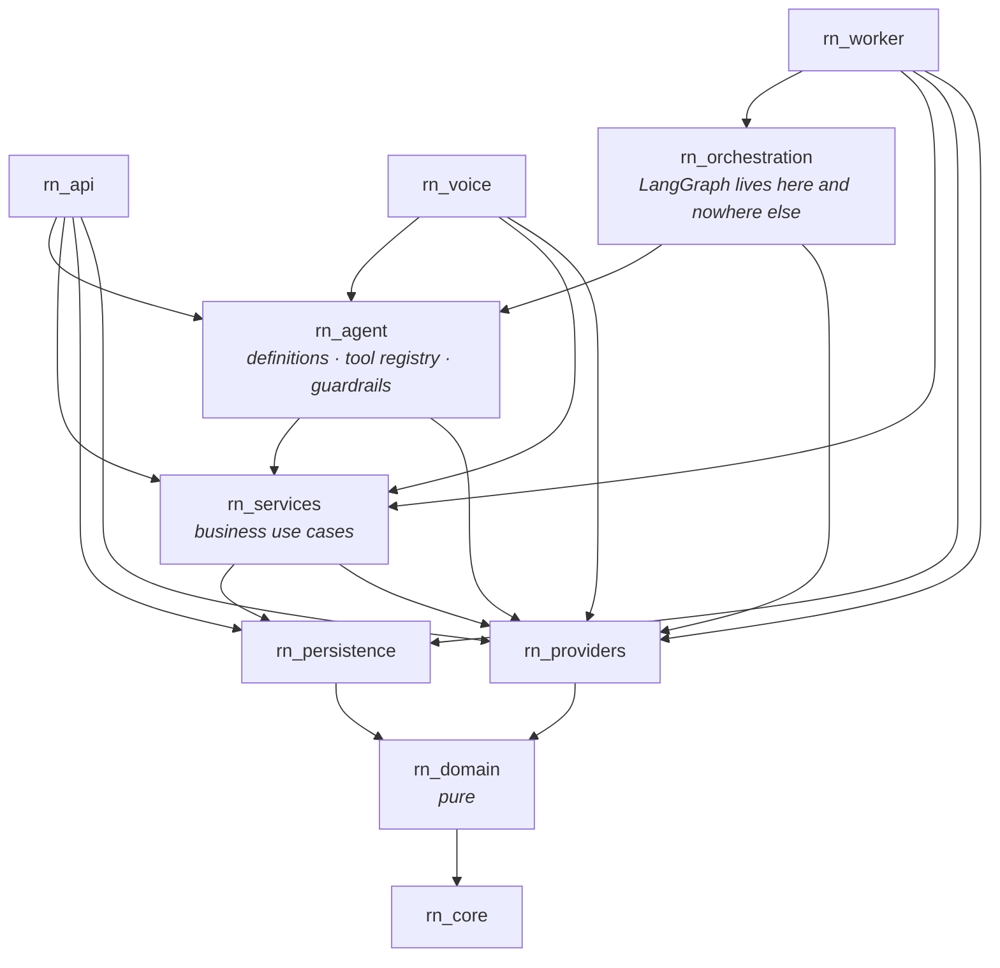
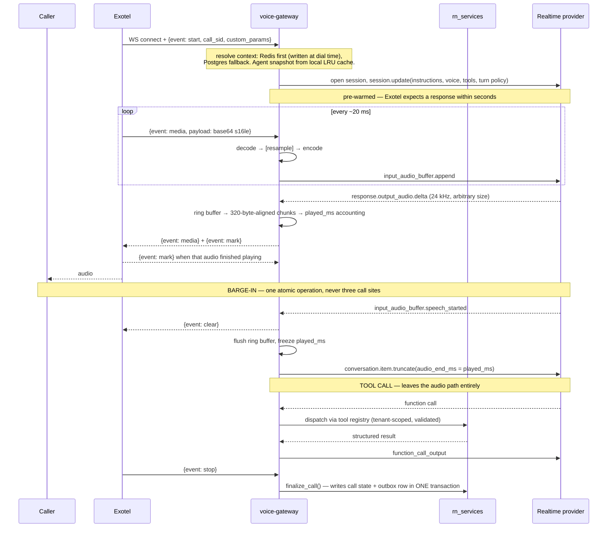
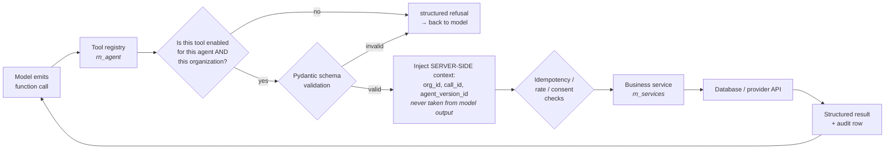
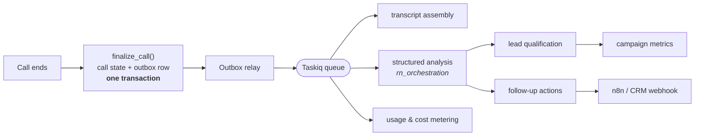
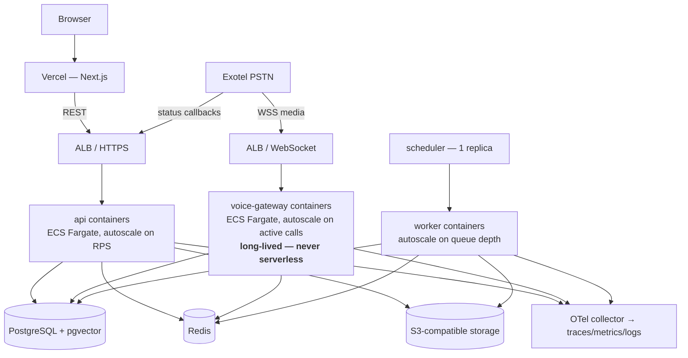

# Architecture

> **Status:** Phase 0 — architecture defined, nothing implemented.
> **Source of truth for:** how the system is structured and why.
> **Companion docs:** [PRD.md](../PRD.md) (what we are building) · [ROADMAP.md](ROADMAP.md) (where we are) · [research/PROVIDER_CONSTRAINTS.md](research/PROVIDER_CONSTRAINTS.md) (verified provider facts) · [DECISIONS/](DECISIONS/) (why).

---

## 1. The organising idea: three planes

Almost every design decision in this platform falls out of one observation: **exactly one part of the system has a hard latency budget, and it is very small.** Everything else can take seconds or minutes.

So the system is split into three planes with different rules:

| Plane | Components | Latency budget | Rule |
|---|---|---|---|
| **Control plane** | `apps/api`, `apps/web` | ~200 ms p95 HTTP | Correctness and authorization first. Ordinary web-app engineering. |
| **Media plane** | `apps/voice-gateway` | **~20 ms of our own work per audio frame**; sub-second turn latency | Nothing enters this plane without a latency argument. No database session, no vector search, no synchronous logging. The **transport layer** (`rn_voice.media`) additionally admits no framework and no business layer, permanently — §4.5. |
| **Processing plane** | `apps/worker`, scheduler | seconds to minutes | Everything expensive, retryable and analytical lives here. |

The planes share **libraries**, not processes. A tool such as `get_service_pricing` must behave identically whether it is invoked mid-call by the media plane or replayed by an evaluation harness in the processing plane — so its definition and its business logic are shared code, while the *transport* around it differs per plane.



**Consequence to internalise:** the voice gateway is the only component we cannot fix by scaling out later. Everything else is ordinary. Protect it.

One honesty note about the media plane, because the distinction matters when you are debugging: SQLAlchemy, the Postgres driver and the Redis client are all **present in the voice gateway's image** — it depends on `rn_services`, which depends on `rn_persistence`. What is prevented is the gateway *opening a session of its own*, and that is enforced by an import contract, not by packaging. "No database in the media plane" means no database **call**, not no database **library**. See [ADR-008](DECISIONS/ADR-008-transactional-outbox-for-call-events.md).

---

## 2. Deployment units

**Five deployment units: four self-hosted container services plus the Vercel-hosted dashboard.** This is a **modular monolith plus a separately scalable realtime service** — not microservices. (`scheduler` is the worker image with a different entrypoint, so there are four container *images* and five deployable things.)

| Unit | Runtime | Scaling trigger | Statefulness |
|---|---|---|---|
| `apps/web` | Vercel (Next.js) | CDN/edge | stateless |
| `apps/api` | container, N replicas behind an ALB | HTTP RPS | stateless |
| `apps/voice-gateway` | container, N replicas behind an ALB with WebSocket support | **concurrent calls** | stateless process, but **owns live connections** — see §7 |
| `apps/worker` | container, N replicas | queue depth | stateless |
| `scheduler` | container, **exactly one active replica** | never | holds a leader lease |

`worker` and `scheduler` are the same image with different entrypoints. `scheduler` must be a single active instance — two schedulers means a duplicated dial storm into real phone numbers ([PROVIDER_CONSTRAINTS](research/PROVIDER_CONSTRAINTS.md) §5). Leadership is a Postgres advisory lock held on a **direct** (non-pooled) connection.

### Why these boundaries and not others

- **api / voice-gateway split is mandatory.** They scale on different signals (RPS vs. concurrent calls), have different failure blast radii, and a slow dashboard query must never be able to add jitter to an audio path. This is the one split we would regret not making.
- **worker split is mandatory.** Post-call analysis is an LLM call taking seconds. It cannot share a process with either of the above.
- **Further splitting is not justified yet.** Campaigns, knowledge, contacts and analytics are separate *modules* inside `api`, with their own service classes and no cross-module imports except through published interfaces. When one of them needs independent scaling or an independent release cadence, it can be extracted — the module boundary is already there. See [ADR-001](DECISIONS/ADR-001-modular-monolith-monorepo.md).

---

## 3. Repository layout

A single monorepo, two package managers, each doing what it is good at: **uv workspace** for Python, **npm workspaces** for the frontend. See [ADR-001](DECISIONS/ADR-001-modular-monolith-monorepo.md).

```text
risenext-voice-ai/
├── apps/
│   ├── api/                  rn_api      — control plane (FastAPI)
│   ├── voice-gateway/        rn_voice    — media plane (WebSocket bridge)
│   ├── worker/               rn_worker   — processing plane (Taskiq) + scheduler entrypoint
│   └── web/                  @risenext/web — Next.js dashboard
├── packages/
│   ├── core/                 rn_core          — config, errors, IDs, time, logging, telemetry, redaction
│   ├── domain/               rn_domain        — entities, value objects, events, policies (pure, no I/O)
│   ├── persistence/          rn_persistence   — SQLAlchemy models, Alembic, repositories, unit of work
│   ├── providers/            rn_providers     — every external system, behind an interface
│   ├── services/             rn_services      — application use cases / business services
│   ├── agent/                rn_agent         — agent definitions, tool registry, guardrails (framework-free)
│   └── orchestration/        rn_orchestration — LangGraph/LangChain workflows (non-realtime ONLY)
├── infrastructure/
│   ├── docker/               Dockerfiles per deployment unit
│   └── local/                docker-compose for Postgres+pgvector and Redis
├── docs/
│   ├── DECISIONS/            ADRs
│   └── research/             verified provider capability findings
├── scripts/
└── tests/                    cross-cutting: e2e, load, agent_eval
```

### The layer graph

Arrows point **downward only**. This is enforced by `import-linter`, not by convention — run `uv run lint-imports`.



Note what the graph does **not** contain today: no edge from `rn_api` or `rn_voice` into `rn_orchestration`. `rn_worker` is its only caller, because nothing else needs one yet — not because the architecture forbids it. `rn_voice.runtime` and `rn_api` are permitted to depend on it; the permanent prohibition applies only to `rn_voice.media`. See §4.5 and [ADR-009](DECISIONS/ADR-009-orchestration-boundary-for-live-sessions.md).

The executable contracts — ten of them, all in the root `pyproject.toml`:

1. **Layered architecture** — no upward imports, ever.
2. **Domain is pure** — `rn_domain` may not import SQLAlchemy, FastAPI, Redis, httpx, LangChain, Taskiq or any vendor SDK.
3. **The media transport layer is framework-free and orchestration-free** — `rn_voice.media` may not import `langchain*`, `langgraph*`, `langsmith`, `rn_orchestration`, `rn_agent` or `rn_services`. **This is the permanent invariant of the codebase and it does not relax** — see §4.5 and [ADR-009](DECISIONS/ADR-009-orchestration-boundary-for-live-sessions.md).
4. **Voice gateway internal layering** — `rn_voice.runtime → rn_voice.session → rn_voice.media`. Only `runtime` may reach an orchestration layer; `media` knows nothing above it.
5. **LangChain/LangGraph is written only in `rn_orchestration`.** This governs where framework code may be *authored*, not who may call orchestration. See [ADR-004](DECISIONS/ADR-004-langgraph-off-the-hot-path.md).
6. **Vendor SDKs stay inside `rn_providers`** — `openai`, `boto3`/`aioboto3`, `clerk_backend_api` and `svix` appear in no other package.
7. **The agent layers reach domain data only through `rn_services`** — no `rn_persistence`, `sqlalchemy` or `asyncpg` in `rn_agent`/`rn_orchestration`. (`psycopg` is deliberately permitted in `rn_orchestration`: it backs the LangGraph checkpointer, which is framework state for a graph run, not business data.)
8. **The voice gateway holds no database session of its own.**
9. **The HTTP framework stays in the app layer, never in a shared package** — `rn_api` and `rn_voice` both serve HTTP/WebSocket; no `packages/*` may.
10. **The job broker is owned by `rn_api` and `rn_worker` only** — everything else records intent in the transactional outbox (§6.4).

Contracts 3 and 5–10 set `allow_indirect_imports = true`, because they are about what a package may import **directly**. The whole point of the layering is that lower layers reach infrastructure *on behalf of* higher ones: `rn_voice → rn_services → rn_persistence → sqlalchemy` is the intended path, not a violation. Indirect reachability is governed by contracts 1 and 4.

These have been negative-tested: a deliberate `import sqlalchemy` in `rn_voice` breaks the build, and adding `import langgraph` / `import rn_orchestration` / `import rn_voice.session` to `rn_voice.media` breaks three contracts at once — while the legitimate transitive chains pass.

If a change requires relaxing one of these contracts, that is an architecture change: write an ADR, do not edit the contract in passing.

---

## 4. The realtime call path

This is the heart of the product. Full detail in [REALTIME_VOICE.md](REALTIME_VOICE.md); this is the structural summary.

### 4.1 Verified wire facts that shape the design

These are confirmed against provider documentation ([PROVIDER_CONSTRAINTS](research/PROVIDER_CONSTRAINTS.md)) and they are not negotiable:

- Exotel's Voicebot applet sends and receives **base64-encoded raw PCM (`s16le`, mono) inside JSON text frames** — *not* G.711, *not* binary frames. It supports 8000 / 16000 / 24000 Hz, selected per call.
- OpenAI Realtime accepts `audio/pcm` at **24 kHz only**, or G.711 (`pcmu`/`pcma`, inherently 8 kHz).
- **Therefore the popular "G.711 passes straight through, no resampling needed" telephony pattern does not apply to this stack.** Either we run Exotel at 24 kHz, or we resample. There is no third option.
- Audio sent to Exotel must be **a multiple of 320 bytes, ≥ 3200 and ≤ 100000 bytes**. Model output deltas arrive at arbitrary sizes, so a pacing/alignment ring buffer is a *required component*, not an optimisation.
- On the WebSocket transport OpenAI does **not** auto-truncate on barge-in. We must send `conversation.item.truncate` with a truthful `audio_end_ms`, which means we must know exactly how much assistant audio the caller actually heard.

### 4.2 Session bridge



### 4.3 What is explicitly forbidden inside the audio path

No Postgres query. No vector search. No synchronous log write. No blocking file or network I/O other than the two WebSockets. Tool calls are dispatched to `rn_services` on a **separate task** so that audio keeps flowing while a tool runs, and the agent is instructed to speak a filler acknowledgement when a tool is expected to be slow.

### 4.4 Agent definition vs. agent session

The distinction the whole runtime model rests on:

- An **agent definition** is persistent configuration — instructions, languages, voice, enabled tools, knowledge-base bindings, turn policy. It is versioned and immutable once used by a call. It is *data*, not a running process.
- An **agent session** is one live call. It owns its conversation history, customer context, audio sockets, model session, tool-execution state and trace context — and it shares **none** of that with any other call.

100 concurrent calls means ~100 independent sessions reading the *same* cached agent-definition snapshot. Mutable per-call state is never shared, never global, never module-level. Every call records the exact `agent_version_id` that served it, so "which configuration handled this call?" is always answerable.

### 4.5 The orchestration boundary

The voice gateway is not one undifferentiated block. It has three layers, and they have different rules:

```
rn_voice.media      MEDIA TRANSPORT    bytes, buffers, timings.        framework-free. PERMANENT.
      ▲
rn_voice.session    REALTIME SESSION   provider session, turn lifecycle, tool dispatch.
      ▲
rn_voice.runtime    AGENT RUNTIME      agent definition, guardrails, turn decisions.
      ▲                                MAY consult orchestration — gated, not forbidden.
rn_orchestration    OPTIONAL ORCHESTRATION
      ▲
rn_agent / rn_services   TOOLS AND SERVICES
```

**What is permanent:** LangChain and LangGraph must never touch audio frames, WebSocket media transport, buffering, VAD mechanics, playback mechanics, or the interruption/barge-in sequence. That is contract 3, and no benchmark buys an exemption from it — the reason is not mainly latency, it is that a framework in the byte loop destroys the transport's independent testability and replaceability.

**What is not permanent:** whether a live session's *decision* layer uses orchestration for higher-level stateful work — workflow decisions, multi-step reasoning, tool orchestration, recovery, complex conversation state. That is an engineering question with an evidence bar, not an architectural prohibition. Today `rn_voice` declares no dependency on `rn_orchestration` because nothing needs one; adding it is an ordinary change.

Anything synchronous introduced **inside a live turn** must clear the gate in [ADR-009](DECISIONS/ADR-009-orchestration-boundary-for-live-sessions.md): a measured latency figure at realistic concurrency, a fit inside the measured turn budget, a reason it cannot run off the critical path, a working fallback, a per-agent flag, and an ADR. Off-turn and background orchestration needs none of that.

---

## 5. Tools: how the model is allowed to affect the world

The model may *request* a tool. It may never *perform* one.



Non-negotiable rules:

- **Tenant identity is never a tool parameter.** `organization_id`, `call_id` and `agent_version_id` are injected from the session's server-side context. A model that emits an `organization_id` is ignored, and the attempt is logged as a security event.
- **Prices, availability and IDs are never accepted from the model.** They are looked up. The model's job is to ask the right question, not to know the answer.
- **Every tool execution is persisted** — arguments, result, latency, outcome — for audit, evaluation and debugging.
- **No tool may execute arbitrary SQL, arbitrary HTTP, or arbitrary code.** Ever.
- RAG content and caller speech are **untrusted input**. Retrieved text is data to be quoted, never instructions to be followed.

The registry lives in `rn_agent` and is declared once with plain Pydantic models. It is exported two ways — flat function specs for the OpenAI Realtime session, and LangChain `StructuredTool`s for `rn_orchestration` — which is precisely why it must not itself depend on LangChain. (Note: `langchain-core`'s `convert_to_openai_tool()` emits the *nested* Chat-Completions shape, which the Realtime API rejects; the flat shape is generated from the Pydantic schema directly.)

---

## 6. Asynchronous processing

### 6.1 Job system

**Taskiq** with `taskiq-redis`'s `RedisStreamBroker`. ARQ — the otherwise-obvious choice for an async FastAPI stack — is in maintenance-only mode by maintainer statement, and Celery has no native async execution. Only the *stream* broker acknowledges messages; the PubSub and List brokers silently drop in-flight work when a worker dies, so they are prohibited. See [ADR-005](DECISIONS/ADR-005-taskiq-job-system.md).

Taskiq has no dead-letter queue, so we write one as middleware into a `dead_letter_jobs` table.

### 6.2 Domain events

Events are published where they buy decoupling — not for every row change.

`call.started` · `call.answered` · `call.completed` · `call.failed` · `campaign.started` · `campaign.completed` · `lead.qualified` · `meeting.booked` · `callback.scheduled` · `message.sent` · `contact.opted_out`

### 6.3 Post-call pipeline



Post-call analysis uses **schema-constrained structured output**. Dashboard analytics never parse free-form model text.

### 6.4 The transactional outbox

The voice gateway must not dual-write to Postgres and Redis — a crash between the two loses the call-completion event or duplicates it. Instead, the state change and the intent-to-publish are written in the **same transaction**, and a relay in the worker publishes them. This is why `rn_voice` has no broker dependency at all, and it is enforced by an import contract.

### 6.5 Campaign dispatch

Never a loop over contacts. The dispatcher is a scheduled job that, each tick, computes an eligible dial budget from the **minimum** of: per-organization concurrency, platform concurrency, telephony provider rate limit (Exotel's `Calls/connect` is 200 req/min), and provisioned channel capacity. Each candidate contact then passes a **pre-dial compliance gate** — consent record, DND/NCPR status, IST calling window, retry policy, opt-out list, duplicate guard — before a dial job is enqueued with an idempotency key.

Because Exotel's status callbacks are explicitly documented as possibly delayed or dropped with no retry, a **reconciliation job** that polls call details for calls stuck without a terminal event is a required component, not a safety net.

---

## 7. Scaling model

Summary here; detail in [SCALABILITY.md](SCALABILITY.md).

The voice gateway is **stateless as a process but stateful as a connection holder**. A live call is pinned to the instance holding its two sockets; that instance owns the call's in-memory session. What is *shared* goes to Redis: concurrency counters, idempotency keys, distributed locks, call-context handoff, rate-limit budgets.

- **Redis is coordination, never truth.** Losing Redis degrades dispatch and slows lookups; it must never lose a call record.
- **Postgres is truth.** Every durable business fact lives there.
- Per-frame audio events are never written to either. They live in process memory for the duration of the call and are persisted as an assembled transcript at the end.
- Scaling out = more voice-gateway instances. Draining = stop accepting new calls, let existing ones finish (graceful shutdown must wait for calls, and calls can run up to 60 minutes).

**We do not claim a concurrency number we have not load-tested.** OpenAI publishes no concurrent-session limit for the realtime models — only RPM/TPM — so the real ceiling must be derived empirically and confirmed commercially before any capacity promise is made.

---

## 8. Provider abstractions

Every external system sits behind an interface in `rn_providers`. Interfaces are written when the *second* implementation is imminent or when the seam protects the hot path — not speculatively for all ten at once.

| Seam | First implementation | Notes |
|---|---|---|
| `TelephonyProvider` | Exotel | vocabulary maps closely onto Twilio/Plivo media streams |
| `RealtimeVoiceProvider` | OpenAI Realtime | the provider-swap seam that matters most |
| `STTProvider` / `TTSProvider` | Sarvam | for the cascaded fallback path |
| `LLMProvider` | OpenAI (+ Sarvam is OpenAI-compatible) | non-realtime reasoning |
| `EmbeddingProvider` | OpenAI `text-embedding-3-small` | dimension is baked into the schema — see [DATA_MODEL.md](DATA_MODEL.md) |
| `MessagingProvider` | Exotel WhatsApp | template rules are provider-specific |
| `StorageProvider` | S3-compatible | uploads, exports, recordings |
| `IdentityProvider` | Clerk | verification + org claim extraction |
| `CalendarProvider` / `CRMProvider` | none yet | interface only when needed |

**What does not abstract cleanly** is documented honestly rather than hidden behind a leaky interface — interim transcripts (OpenAI streams them, Sarvam's WebSocket emits none until end-of-speech), barge-in mechanics, turn-detection ownership, voice catalogues, and session lifetimes. These are exposed as an explicit `SessionCapabilities` object that callers must branch on. Pretending they are uniform would produce a bridge that fails silently on the fallback path.

---

## 9. Multi-tenancy

Tenancy is a **security boundary**, not a filter.

- Every tenant-owned row carries `organization_id`.
- The internal tenant key is our own UUID. Clerk's `org_id` is a unique *column*, never the primary key — telephony entities, call records, billing ledgers and retained recordings must outlive an auth-provider migration or a deleted Clerk org.
- Authorization is a policy layer in `rn_services`, not `if` statements in route handlers. Routes ask "may this actor do this to this resource?" and get a yes/no.
- The frontend never supplies an organization ID that the backend trusts; the acting organization is derived from the verified token.
- **RAG retrieval is always tenant-scoped**, and the scoping is applied inside the single retrieval helper so no caller can forget it.
- Row-Level Security in Postgres is defence in depth, on top of — not instead of — application authorization.

A subtle correctness trap that shapes retrieval: with approximate vector indexes, filters are applied *after* the index scan, so a naive `WHERE organization_id = ? ORDER BY embedding <=> ?` on a shared HNSW index silently returns too few rows. It does not error — the agent just appears to have forgotten its knowledge base. This is why every retrieval goes through one shared helper, whatever index sits underneath it.

The *physical* vector layout — column type, dimension, index and partitioning — is **not decided yet**. It is open decision **D-8**, resolved in Phase 3 after a bake-off on real Indic data ([ADR-010](DECISIONS/ADR-010-defer-vector-storage-layout.md)). Tenant isolation does not depend on it: scoped repositories plus RLS are independent of physical layout, and partitioning was never the isolation mechanism.

---

## 10. Deployment topology



- **Containers on ECS/Fargate, not Kubernetes.** Kubernetes becomes justified when we need multi-tenant node isolation, complex service meshes, or a platform team that operates it — none of which apply at four container services. Revisit at ~15+ deployment units or when we need scheduling behaviour Fargate cannot express.
- **Serverless functions are disqualified for the media plane.** Cold starts and execution-time limits are fatal to a 60-minute WebSocket with a seconds-level connect deadline.
- **Region matters.** The voice gateway should sit in `ap-south-1` (Mumbai) to keep the telephony leg short. Note that neither the managed database's available regions nor OpenAI's realtime media regions include India — this is a live open question with legal implications, flagged in [COMPLIANCE.md](COMPLIANCE.md) and the PRD's open decisions.

---

## 11. Things we deliberately did not do

Recorded so they are not re-proposed without new information:

| Not done | Why | Revisit when |
|---|---|---|
| Microservices | four container services with clear module seams inside; extraction is cheap later, premature splitting is not | a module needs independent scaling or release cadence |
| Kubernetes | operational cost with no current benefit | ~15+ deployment units, or Fargate can't express what we need |
| Kafka | Redis Streams covers current volume; Taskiq's broker abstraction is the exit | sustained multi-thousand msg/s, or we need event replay/log compaction |
| An orchestration framework in `rn_voice.media` | a framework in the byte loop ends the transport's independent testability and replaceability; latency is the lesser problem | **never.** Higher layers are a different question — [ADR-009](DECISIONS/ADR-009-orchestration-boundary-for-live-sessions.md) |
| Orchestration inside a live turn *today* | nothing needs it yet, and nothing about turn latency has been measured | a concrete flow wants it — then walk the ADR-009 gate rather than reopening this row |
| Freezing the embedding dimension or vector partitioning | the dimension is part of the column type and partitioning cannot be retrofitted; the placeholder was a vendor default, not a measurement | the Phase 3 Indic bake-off closes open decision D-8 — [ADR-010](DECISIONS/ADR-010-defer-vector-storage-layout.md) |
| n8n as the conversation engine | the realtime brain belongs in typed, tested, versioned code | never — n8n handles post-call business automation only |
| Direct SIP to the model provider | removes our media tap: no recording, no custom barge-in policy, no per-call fallback, and media terminates outside India | as a documented degraded fast-path |
| A no-code agent builder | premature; the data model supports it | clients need self-service configuration |
| Human call transfer | out of scope for V1 | the telephony seam keeps it addable — do not design it out |

---

## 12. Where to look next

| Question | Document |
|---|---|
| What are we building, for whom, and what counts as done? | [PRD.md](../PRD.md) |
| What entities exist and how are they scoped? | [DATA_MODEL.md](DATA_MODEL.md) |
| How does an agent think, and how is it versioned and evaluated? | [AGENT_ARCHITECTURE.md](AGENT_ARCHITECTURE.md) |
| How does audio actually flow, frame by frame? | [REALTIME_VOICE.md](REALTIME_VOICE.md) |
| How do we get from 1 call to 1000? | [SCALABILITY.md](SCALABILITY.md) |
| How is a tenant isolated and a caller's data protected? | [SECURITY.md](SECURITY.md) |
| What does Indian telecom regulation require of us? | [COMPLIANCE.md](COMPLIANCE.md) |
| How do we know what the system is doing? | [OBSERVABILITY.md](OBSERVABILITY.md) |
| How do we know it works? | [TESTING.md](TESTING.md) |
| What is a "session" vs a "definition" vs a "campaign"? | [GLOSSARY.md](GLOSSARY.md) |
| Why was a decision made this way? | [DECISIONS/](DECISIONS/) |
| What did we actually verify about our providers? | [research/PROVIDER_CONSTRAINTS.md](research/PROVIDER_CONSTRAINTS.md) |
