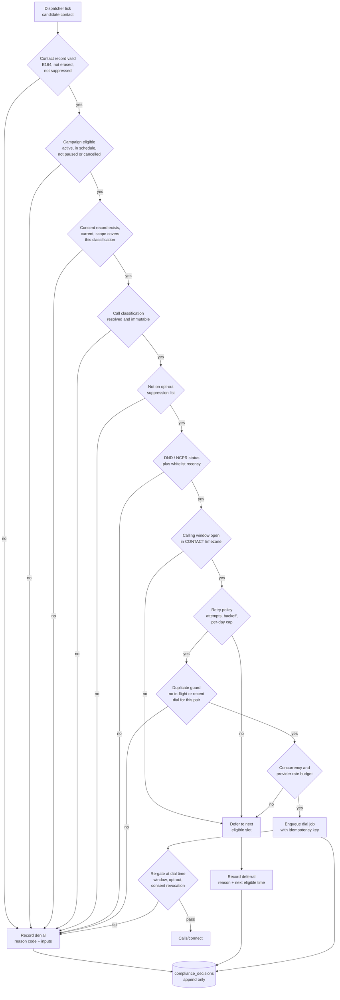

# Compliance Architecture

> **Status:** Phase 0 — architecture defined; the repository scaffolding is real (CI workflow, local compose, multi-stage Dockerfile, workspace-layout tests, and a green `ruff` / `mypy --strict` / `lint-imports` / `pytest` toolchain), but **no compliance behaviour is implemented**. No item in this document has been reviewed by legal counsel.
> **Scope:** how the platform *mechanically enforces* rules about commercial telephone calls in India and about recorded/transcribed personal data — and what still has to be confirmed by counsel or by the telephony provider before those mechanisms can be trusted.
> **This document is written by engineers, not lawyers. It contains no legal advice and no legal conclusions.** Where a rule is asserted, it is either quoted from provider documentation or marked as unverified.
> **Companions:** [../PRD.md](../PRD.md) §12 open decisions · [ARCHITECTURE.md](ARCHITECTURE.md) · [research/PROVIDER_CONSTRAINTS.md](research/PROVIDER_CONSTRAINTS.md) (the only source of verified provider facts) · [DATA_MODEL.md](DATA_MODEL.md) · [SECURITY.md](SECURITY.md) · [TESTING.md](TESTING.md) · [ROADMAP.md](ROADMAP.md)

---

## 1. Scope, and what this document is not

**In scope**

1. **Outbound commercial telephone communications originated in India** by a tenant of this platform, placed through Exotel to Indian mobile and landline numbers.
2. **Personal data captured because a call happened**: the callee's phone number, anything they said, our transcript of it, our structured analysis of it, any recording, and any derived artifact (embeddings, exports, CRM pushes, WhatsApp messages).
3. **Inbound calls**, which do not pass the pre-dial gate but still carry disclosure, opt-out and recording obligations.

**Explicitly out of scope of this document:** employment law, tax, telecom licensing of the *provider* (that is Exotel's obligation under its own licence), and any jurisdiction other than India. If the platform is ever sold to a tenant calling numbers outside India, this document does not cover that call and the gate must be extended before it is allowed.

**What this document is not.** It is not a compliance certification, not a legal opinion, and not a substitute for a review by counsel. Its job is narrower and more useful to an engineer: define the *architecture* that makes compliance enforceable and provable, and enumerate exactly which inputs to that architecture are still guesses.

### 1.1 Labelling convention — read this before quoting anything below

Every regulatory or provider claim in this document carries one of four labels. **An unlabelled sentence is our own design intent, not a fact about the world.**

| Label | Means |
|---|---|
| **CONFIRMED** | Traceable to primary provider documentation via a hard-constraint ID in [research/PROVIDER_CONSTRAINTS.md](research/PROVIDER_CONSTRAINTS.md). Still a *provider* statement, not a legal ruling. |
| **REQUIRES VERIFICATION** | We could not confirm it. It may be true. It may not be. It must be settled by the named owner before the dependent code ships. |
| **OPEN DECISION** | A business/legal question already tracked in [../PRD.md](../PRD.md) §12 as **D-1 … D-7**. |
| **DESIGN** | Our architectural choice. Binding on the codebase, carries no regulatory authority. |

Two standing rules that follow from this:

- **No number in this document is a measurement.** We have measured nothing. Any figure is a target or a budget and is labelled as such.
- **Section 7 of PROVIDER_CONSTRAINTS ("Anti-facts") lists plausible claims that could not be confirmed.** Several of them are compliance-shaped — calling hours, DLT-for-voice, provider-side DND scrubbing, Sarvam's certifications. None of them appear in this document as fact, and none of them may be promoted into code or a customer conversation.

---

## 2. What IS confirmed from provider documentation

Only one block of telephony-compliance fact survived the research pass with a primary source. It is **HC-14** in [research/PROVIDER_CONSTRAINTS.md](research/PROVIDER_CONSTRAINTS.md) §1, and the entire pre-dial gate is built on it.

| # | Confirmed statement (provider documentation) | Direct consequence for the system |
|---|---|---|
| C-1 | **CONFIRMED (HC-14)** — Calls to NCPR-registered numbers must be **transactional**, not promotional. | Every dial must carry an explicit `call_classification` resolved *before* dispatch, stored on the call record, and immutable afterwards. Classification is a property of the **campaign and the agent's purpose**, never inferred at runtime and never chosen by the model. |
| C-2 | **CONFIRMED (HC-14)** — An NCPR-registered number must additionally be **whitelisted**, on the basis of the subscriber having contacted the business inbound within the last **6 months**. | Recency is a *computed, expiring* fact, not a checkbox. It requires a durable record of inbound contact events per `(organization_id, phone_number)` with timestamps, and the gate must recompute the window at dial time. A contact that was dialable yesterday can be undialable today with no data change. |
| C-3 | **CONFIRMED (HC-14)** — Enabling DND calling on an Exotel account requires **filing opt-in evidence** with the provider. | Consent evidence is not an internal nicety we might add later. It is an onboarding artifact that gates the tenant's ability to dial at all, so the consent entity must exist before the first production campaign, not after. |
| C-4 | **CONFIRMED (HC-14)** — Exotel requires **producing that opt-in evidence within 24 hours** of a violation being raised. | This is the single hardest engineering requirement in this document. It sets a **retrieval SLA on cold data**: given a phone number and a date, we must produce the evidence bundle within 24 hours, including the artifact itself. That rules out archival storage tiers with multi-hour restore, rules out "the tenant has it in their CRM somewhere", and forces the artifact to be uploaded to our object storage at consent-capture time. |
| C-5 | **CONFIRMED (HC-10, HC-11)** — Exotel does not sign status callbacks, and states delivery may be delayed or fail with no retry. | Compliance state can never be driven by a webhook alone. Opt-out, call outcome and consent state are reconciled from Postgres and from the Call Details poll, not from a callback we hope arrived. |
| C-6 | **CONFIRMED (HC-13)** — `Calls/connect` is rate limited to 200 req/min; campaigns default to a 60 calls/min throttle. | The dispatch budget is a *minimum* of several ceilings; the compliance gate sits inside that dispatcher and is evaluated per contact per tick. See [ARCHITECTURE.md](ARCHITECTURE.md) §6.5. |

> **Honesty note on the source.** The HC-14 support-article URL is recorded truncated in the research brief. The claims above are tagged `[C]` by the research pass, but before the gate is implemented, someone must re-open both Exotel pages, re-read them, and paste the full URLs into PROVIDER_CONSTRAINTS. Building a legal control on a truncated citation is exactly the kind of thing this repository's rules exist to prevent.

### 2.1 What C-1 through C-4 mean architecturally, in one paragraph

They mean the dialer cannot be a loop. Before a phone number is handed to Exotel, the platform must be able to answer, from durable storage and without a human: *why is this call permitted, under what classification, on the strength of which consent artifact, and where is that artifact right now?* If the platform cannot answer all four in the time it takes to enqueue a job, it must not enqueue the job. Everything in §4 is the implementation of that sentence.

---

## 3. What is NOT confirmed — and must not be guessed

These are open. Writing any of them into code as a constant would be a defect, not a shortcut.

| # | Open question | Status | Maps to |
|---|---|---|---|
| U-1 | **The permitted calling window.** Two different windows appear in secondary sources; neither is stated on any Exotel page we reviewed. | **REQUIRES VERIFICATION** — Exotel compliance team + counsel. Listed as an anti-fact (PROVIDER_CONSTRAINTS §7 item 11). | **D-4** |
| U-2 | **Whether DLT registration applies to voice**, or only to SMS sender IDs and templates. All confirmed Exotel DLT documentation concerns SMS. | **REQUIRES VERIFICATION** — Exotel account team. Anti-fact §7 item 21. | **D-4** |
| U-3 | **Whether Exotel performs server-side NCPR/DND scrubbing**, or whether scrubbing is entirely ours. Not stated in any document reviewed. | **REQUIRES VERIFICATION** — Exotel. Anti-fact §7 item 22: *assume it is our responsibility until confirmed.* | **D-4** |
| U-4 | **What artifact counts as proof of opt-in**, how long it is retained, and **who is liable** when a tenant uploads a non-consented list — the platform or the tenant. | **OPEN DECISION** — counsel + commercial. | **D-3** |
| U-5 | **Whether caller PII, transcripts and recordings may leave India.** | **OPEN DECISION** — counsel. Everything in §9 is downstream. | **D-1** |
| U-6 | **Whether we record calls at all in V1**, and under what disclosure. | **OPEN DECISION** — counsel + product. | **D-5** |
| U-7 | **Whether a recorded voice attracts any additional category of obligation** beyond ordinary personal data. | **REQUIRES VERIFICATION** — counsel. We take no position. | D-5 |
| U-8 | **Sarvam's data-residency, retention and training-use posture.** Their privacy policy returned HTTP 403 and could not be fetched; certifications are third-party claims only. | **REQUIRES VERIFICATION** — written DPA required. Anti-fact §7 item 7. | D-1 |

### 3.1 The calling window is configuration. Permanently.

This deserves its own subsection because it is the most likely place for a well-meaning engineer to do the wrong thing.

**DESIGN — binding:** the permitted calling window is **per-organization configuration with a platform-level default and a platform-level maximum envelope**, stored in the database, versioned, and evaluated against **the contact's timezone**, not the server's and not the tenant's. There is no module-level constant, no `CALLING_WINDOW_START = time(9, 0)`, no default argument. A unit test asserts that no calling-window literal appears in `rn_domain` or `rn_services`.

Three reasons, in order of importance:

1. **We do not know the correct value** (U-1). A constant would encode a guess as a fact.
2. **The value can change** by regulation or by provider policy, and when it does, the fix must be a configuration change with an audit row, not a deploy.
3. **It is not one value.** A transactional service reminder and a promotional campaign may plausibly sit under different rules, and a tenant in a different vertical may be contractually stricter than the law. The envelope model — platform maximum, tenant narrows it, campaign narrows it further, never widens — handles all three without code changes.

Until U-1 closes, the platform default ships **narrow**, and the narrow default is documented as *our conservative guess, not a legal boundary*. Narrow-by-default is the only direction in which being wrong is cheap.

---

## 4. The pre-dial compliance gate

The gate is a **named architectural component**, not a coding convention. It is the reason `apps/worker` cannot dial in a loop and the reason the dispatcher exists at all ([ARCHITECTURE.md](ARCHITECTURE.md) §6.5).

### 4.1 The rule that makes it work

> **A dial job is enqueued only by the dispatcher, and the dispatcher enqueues only through the gate. There is no second path to Exotel's `Calls/connect`, and the gate has no bypass parameter.**

No `force=True`. No `skip_compliance`. No "super admin can override". No dashboard toggle that disables it. If a bypass is ever genuinely needed, that is an ADR and a schema change, not a keyword argument — because a keyword argument is exactly what someone will pass at 2 a.m. during an incident.

**Dashboard policy is not enforcement.** The import preview described in [../PRD.md](../PRD.md) §6.3 — showing a tenant which rows will be rejected and why — is a *usability* feature that runs the same predicates early. It has no authority. A row that passes the preview and fails the gate is not dialled, and a row that fails the preview but is somehow enqueued is still stopped by the gate. The preview is allowed to be wrong; the gate is not allowed to be skipped.

### 4.2 The ordered checks

### 4.3 Why this order

The order is not arbitrary and must not be reshuffled for performance without thought, because **the recorded reason is the first failing check**. Ordering therefore determines the story the audit trail tells about a blocked call — and the story should name the most serious reason, not the cheapest one.

| Position | Check | Why here |
|---|---|---|
| 1 | Contact validity | A malformed or erased contact is a data bug; catching it first keeps garbage out of the compliance statistics. Also honours a completed erasure request (§10) before anything else looks at the row. |
| 2 | Campaign eligibility | Cheap, tenant-controlled, and blocks the largest volume. A paused campaign should not generate thousands of consent lookups. |
| 3 | Consent record | **The most serious check.** If there is no consent artifact we cannot satisfy C-4 in 24 hours, so a call placed here is the worst kind we can place. It must be the first *substantive* reason recorded. |
| 4 | Classification resolved | C-1 requires transactional classification for NCPR numbers; the DND check at position 6 cannot be evaluated without it. Ordering dependency, not preference. |
| 5 | Opt-out suppression | An explicit human "stop" outranks every automated status. It is evaluated before DND so that "the caller told us to stop" is recorded rather than "the number happens to be registered". Those are different facts and we want the honest one. |
| 6 | DND / NCPR + whitelist recency | C-1 and C-2. Depends on 4. May require an external lookup (see U-3) — so it sits after everything cheap. |
| 7 | Calling window, in the contact's timezone | Produces a **deferral**, not a denial. The contact is fine; the clock is wrong. Recording this as a denial would corrupt campaign metrics and hide genuine problems. |
| 8 | Retry policy | Attempt count, backoff, per-day cap per contact. Deferral or exhaustion. |
| 9 | Duplicate guard | Last, because it is the most expensive stateful check and by this point the candidate set is small. Keyed on `(organization_id, phone_hash, campaign_id)` plus an in-flight lock. |
| 10 | Concurrency and rate budget | Not a compliance rule — an operational ceiling from C-6 and provisioned capacity (**D-6**). It sits inside the same gate so there is one place that decides "dial or not". |

**Timezone note.** The evaluation timezone is the **contact's**, resolved at import from the number and any supplied metadata, defaulting to `Asia/Kolkata`. Using the server's timezone is a latent bug that only appears when someone deploys outside `ap-south-1`; using the tenant's is wrong the first time a Bengaluru tenant buys a list from another region. `ruff` rule `DTZ` is enabled repo-wide precisely because naive datetimes in this code path produce illegal calls, not just wrong-looking dashboards.

### 4.4 The gate runs twice

**DESIGN:** the gate is evaluated at **enqueue** and again **immediately before** the provider call, inside the dial job.

A queue introduces time. A dial job can sit behind a backlog, be retried after a broker redelivery, or be delayed by a `SmartRetryMiddleware` backoff — and cross the edge of the calling window while it waits, or be overtaken by an opt-out recorded during another call two minutes ago. The second evaluation is deliberately narrower and cheaper: **window, opt-out, consent revocation, campaign still running**. It is the check that stops us dialling someone who opted out while our job was queued, which is precisely the failure a caller notices and complains about.

### 4.5 Where the code lives

| Concern | Package | Why there |
|---|---|---|
| The decision function | `rn_domain` | Pure. Takes a fully-populated `ComplianceFacts` value object, returns `Allowed` / `Denied(reason_code)` / `Deferred(reason_code, next_eligible_at)`. No I/O, no clock, no config lookup — the clock and the window are *inputs*. This is what makes it exhaustively unit-testable with `freezegun` and no database. |
| Fact gathering | `rn_services` | Reads consent, suppression, DND status, attempt history, campaign state. The only layer allowed to touch `rn_persistence` and `rn_providers`. |
| Enforcement call site | `rn_services` dispatcher, invoked from `apps/worker` | One call site. A test asserts that `Calls/connect` is reachable from exactly one code path. |
| Decision record | `rn_persistence` | Append-only `compliance_decisions`. |

The voice gateway is not in this list and never will be: it holds no database session and it is on the audio hot path. The gate is a dispatch-time concern. Note the precise claim — the ORM *is present in the gateway image* (`rn_voice` depends on `rn_services`, which depends on `rn_persistence`, so SQLAlchemy, asyncpg and the Redis client all ship inside it). What is prevented is the gateway **opening a session of its own**, and it is prevented by the import contract *"Voice gateway holds no database session of its own"* — excluded by contract, not by packaging.

**Budget, not measurement:** target < 50 ms p95 per contact evaluation with warm caches, and a dispatcher tick that can evaluate a few thousand candidates within its interval. Nothing has been measured. If the gate turns out to be the dispatch bottleneck, the answer is batching the fact-gathering queries — never trimming checks.

---

## 5. Consent and opt-in evidence

C-3 and C-4 make consent a **first-class persisted entity with a retrieval SLA**, not a boolean column on `contacts`.

### 5.1 What is captured

| Field group | Contents | Why |
|---|---|---|
| Identity | `organization_id`, `phone_e164` (plaintext, protected by storage-level encryption), `phone_hash` (peppered deterministic hash, for lookup), `contact_id` (nullable — consent can predate the contact row) | Consent is about a *number*, not a CRM row. Re-importing a CSV must not create a second consent story for the same number. The number is stored **in the clear** because C-4 requires producing readable opt-in evidence within 24 hours and a hash cannot be shown to a regulator; there is no application-level column encryption here, and none anywhere else in this platform (it would break the exact-match indexes dedup and suppression depend on). Application-level encryption is used **only** for per-tenant provider credentials. |
| Provenance | `channel` (web form, WhatsApp opt-in, IVR, inbound call, tenant attestation on import), `source_ref` (form URL, page, campaign, call SID), `captured_at` (tz-aware) | C-4 asks *where did this come from*. "The tenant said so" is a distinct channel from "they filled in a form", and the difference is exactly what liability under **D-3** turns on. |
| Artifact | `artifact_object_key`, `artifact_sha256`, `artifact_content_type`, `artifact_bytes` | The evidence itself, in our object storage, hashed at upload so we can prove it was not altered. Not a link to the tenant's system — a link is not producible in 24 hours when the tenant's system is down. |
| Attribution | `uploaded_by_actor_id`, `uploaded_at`, `attestation_text`, `attestation_version` | Who at the tenant asserted this, in what words, against which version of our attestation wording. Without this, **D-3** liability is unanswerable after the fact. |
| Scope | `consent_scope` (transactional / promotional / both), `language`, `expires_at` (nullable) | C-1 means a promotional-scope consent does not authorise a promotional call to an NCPR number. The gate checks scope against classification, not just existence. |
| Lifecycle | `revoked_at`, `revocation_source`, `superseded_by_id` | Consent is revocable and re-grantable. History is append-only; the current state is derived. |

### 5.2 The 24-hour retrievability requirement

C-4 is a **CONFIRMED** provider requirement and it constrains storage, not just schema:

- **Object storage class must support immediate retrieval.** No Glacier-class tier for consent artifacts, ever, regardless of what the retention job does to recordings.
- **Lookup must work from what a complaint gives you**: a phone number and an approximate date. The query is the hash-first index `(phone_hash, captured_at DESC)` plus a date range — deliberately *not* tenant-scoped first, because lookup must work **without tenant context**. Any tenant-scoped index is an addition to it, never a replacement.
- **Protection is storage-level, not application-level.** `phone_e164` is stored in plaintext and protected by storage-level encryption at rest (disk/volume and backup encryption on the database, server-side encryption on the artifact objects); the deterministic `phone_hash` exists for lookup, not for hiding the number. Encrypting the column in the application would make the evidence unproducible under the 24-hour clock and would break the exact-match indexes.
- **An "evidence bundle" export is a build item, not an ops improvisation.** One operation produces: the consent record, the artifact, its hash, the attestation, the gate decision for the disputed call, the call record, and the disclosure line from the transcript. Building that by hand under a 24-hour clock is how organisations miss the clock.
- **Target: bundle produced in minutes, not hours.** A target. Nothing measured.

### 5.3 The unresolved question: whose liability

**OPEN DECISION D-3 — REQUIRES VERIFICATION by counsel.** When a tenant uploads a list and attests that everyone on it consented, and that attestation is false, who answers to the provider and to the subscriber — the tenant or the platform?

We do not answer this here. We note the engineering consequences of each answer so the decision can be made with them in view:

| If the answer is… | The platform must build |
|---|---|
| **Tenant bears it** | A strong, versioned, per-import attestation captured with actor identity and timestamp; contractual pass-through; and evidence sufficient to *show* the tenant attested. Broadly what §5.1 already describes. |
| **Platform bears it** | Materially more: per-contact artifact required at import time (attestation alone insufficient), rejection of imports without artifacts, possibly independent verification of a sample, and a much higher-touch onboarding. This changes the import pipeline and the product's self-service story. |
| **Shared / undecided** | The conservative build is the platform-bears-it schema with tenant-bears-it defaults, so that tightening later is configuration rather than a migration. **This is what we build until D-3 closes.** |

There is also a live tension between **retaining consent evidence as proof** and **erasing personal data on request** (§10). We do not resolve it; it is explicitly part of D-3.

---

## 6. Opt-out

Opt-out is simultaneously a legal control and, per [../PRD.md](../PRD.md) §5.4, a **product requirement**. It is judged by the caller, and the caller does not care which of our layers failed.

### 6.1 Three layers, because one is not enough

| Layer | Where | What it does | Why it exists |
|---|---|---|---|
| 1. Model-initiated | `rn_agent` tool `record_opt_out` | The agent recognises the intent and calls the tool. Dispatched off the audio path onto a separate task, like every tool ([ARCHITECTURE.md](ARCHITECTURE.md) §5). | Handles the long tail of phrasings — *"main busy hoon, aage se mat karna"* — that no matcher will catch. |
| 2. Deterministic backstop | `rn_agent` guardrails, evaluated on streamed input transcripts | A curated multilingual phrase matcher over English, Hindi and Telugu, including romanised forms. Fires the same service call as layer 1. | The model is not a control. If it fails to call the tool, or is mid-response, the platform still stops. This layer is the one we can *test exhaustively*. |
| 3. Post-call sweep | `apps/worker`, over the assembled transcript | Re-runs the matcher and the analysis output; records any missed opt-out and raises a compliance alert. | Catches layers 1 and 2 failing, and gives us the metric "opt-outs first detected at layer 3", which should be zero and which tells us the truth about layers 1 and 2. |

`record_opt_out` is a **real tool** — one of the **18 tools in the V1 registry**, and not a rename of `mark_not_interested`. The two are semantically distinct: `mark_not_interested` records a *sales-interest* signal about this campaign, while `record_opt_out` performs a durable, cross-campaign **suppression write** (§6.3). Layer 2 is not a fallback inside layer 1's code path: the code-side guardrail matcher is an **independent second path** that fires **even when the model never calls the tool**, and it makes the same `rn_services` write. Belt and braces, deliberately.

Layer 2 exists because of a rule from [CLAUDE.md](../CLAUDE.md): *the model requests, the platform decides.* An opt-out honoured only when the model chooses to honour it is not a control.

### 6.2 Honoured within the live call

On detection, in the same call:

1. The agent stops the campaign flow immediately. No further pitch, no "before you go", no retention attempt.
2. It confirms in the caller's current language that the number will be removed.
3. It closes politely.

The durable write goes through `rn_services` on a separate task, so it does not block audio. **The durable write is the source of truth; the spoken confirmation is not.** If the write fails, the job retries; if it exhausts retries it lands in `dead_letter_jobs` and raises a compliance alert, because a caller who was told they were removed and was not is the worst outcome in this document.

### 6.3 Durable and cross-campaign

**DESIGN:** the suppression list is keyed on `(organization_id, phone_hash)` in its **own table**, independent of `contacts` and of any campaign. `organization_id` is **nullable**, and a `NULL` means a platform-wide suppression. `phone_hash` is a peppered deterministic hash and **no plaintext number is stored** — a blocklist should not also be a phone-number database. Unlike `consent_records` (§5.1), suppression never has to be *shown* to anyone, so it carries the minimum that makes the lookup work.

That independence is the whole point:

- Deleting a contact does not resurrect dialability.
- Re-importing the same CSV next quarter does not resurrect it. The import pipeline checks suppression at preview time and marks matching rows as permanently excluded, with the reason shown to the tenant.
- A new campaign, a new agent, or a different phone number of the same tenant does not resurrect it.
- Suppression outlives the contact row and is **never** deleted by campaign cleanup jobs.

**Scope, tenant vs platform.** Default is **tenant-scoped**: opting out of tenant A does not silence tenant B, because those are different business relationships. **Platform-level** suppression — the `organization_id IS NULL` rows in the same table — exists for abuse reports and legal takedowns; it is checked first and cannot be edited by tenants. Whether tenant-scoped is the right default is a question for counsel — **REQUIRES VERIFICATION**, and it interacts with **D-3**.

### 6.4 Verified by test

[../PRD.md](../PRD.md) §13 requires opt-out honoured 100% of the time, verified by test. Concretely, and blocking merge:

- A phrase corpus per supported language — English, Hindi, Telugu, romanised Hindi/Telugu, and code-mixed — as a fixture. Unit-tested against the layer-2 matcher, including near-miss negatives (*"stop calling me"* opts out; *"stop, I didn't catch that"* does not).
- `agent_eval` scripted conversations asserting the agent stops, confirms, and closes.
- An integration test asserting the suppression row exists after the call, and that the gate denies the same number in a *different* campaign.
- A test asserting a CSV re-import of a suppressed number is rejected at preview and at dispatch.

---

## 7. AI disclosure

**Product requirement, [../PRD.md](../PRD.md) §5.3:** the agent identifies as an AI and never claims to be human when asked.

**DESIGN — enforced structurally, not by prompt phrasing:**

1. **The disclosure is a required field on the agent definition**, per configured language. An agent version cannot be created without a non-empty disclosure for every language it declares. This is a validation error at write time, not a runtime warning, so a misconfigured agent cannot exist.
2. **The identity clause is platform-injected.** Tenants customise wording and tone; the platform appends a non-removable clause to the compiled instructions. A tenant editing the prompt cannot delete it, because they never had it in their editable text.
3. **Disclosure is spoken in the opening turn.** If recording is enabled (§8), disclosure precedes it.
4. **A guardrail covers the direct question.** "Are you a human?", "क्या आप इंसान हैं?", and the Telugu equivalent, in every supported language and romanisation, must produce an answer that asserts AI status. This is asserted in `agent_eval`, not hoped for.
5. **Sounding natural is a quality goal; passing as human is not a goal and is not permitted.** That sentence belongs in the agent-definition documentation, because the failure mode is a well-meaning prompt engineer optimising for "sounds human" and quietly deleting the disclosure to improve answer rates.

Every call records its `agent_version_id`, so "what exactly did the agent say it was, on that call, on that date" is answerable from the version snapshot plus the transcript — not from today's prompt.

**REQUIRES VERIFICATION:** whether any Indian rule *mandates* AI disclosure on a voice call, and in what form. We do not know, we make no claim, and it does not matter for the build — we disclose because the PRD requires it.

---

## 8. Recording

**OPEN DECISION D-5.** Whether we record at all in V1 is unresolved. The architecture assumes the answer might be yes and refuses to make that free.

**DESIGN — binding regardless of how D-5 resolves:**

- **Recording is OFF by default**, at the platform level and for every newly created tenant and agent. Enabling it is an explicit, audited configuration change with an actor and a timestamp.
- **Per-tenant and per-agent configurable**, never a global switch, because tenants in different verticals will land in different places and a global switch guarantees the strictest tenant blocks the loosest.
- **Disclosure precedes capture.** If a tenant enables recording, the agent-definition validation requires a recording-disclosure line in every configured language, and the runtime does not begin persisting audio until that line has been spoken. Buffering audio and deciding later is not acceptable.
- **We own the tap.** The bridge topology (Exotel ⇄ our gateway ⇄ model) was chosen partly because it keeps raw audio in our process ([research/PROVIDER_CONSTRAINTS.md](research/PROVIDER_CONSTRAINTS.md) §2). Recording is therefore *our* capability and our responsibility. Direct SIP would move media outside India (**HC-17, CONFIRMED**) and remove the tap entirely — which is one reason it stays documented as a degraded fast path only.
- **The audio path stays clean.** Recording writes go to a buffered, off-hot-path sink and upload after the call. Per [CLAUDE.md](../CLAUDE.md) rule 1, nothing synchronous joins the media loop for this.

**Storage and protection**

| Aspect | Design |
|---|---|
| Location | Object storage, per-tenant key prefix, **immediate-retrieval class** — recordings may be needed for an evidence bundle (§5.2). |
| Encryption | Server-side encryption at rest with a **per-tenant key**; TLS in transit. Per-contact data keys where crypto-shredding is used (§10.3). |
| Access | Never a public URL. Short-lived signed URLs only, issued after a tenant authorization check in `rn_services`, and every issuance is audited. |
| Retention | Per-tenant, with a platform maximum, enforced by a scheduled purge job — not by a bucket lifecycle rule alone, because the database rows and the objects must go together and stay consistent. |
| Default retention | **DECISION REQUIRED (D-5).** We propose **no default until D-5 closes**; recording stays off, so there is nothing to retain. Any number written here would be an invented legal figure. |

**REQUIRES VERIFICATION (U-7):** whether a recorded voice attracts obligations beyond ordinary personal data. We take no position and build for the stricter reading: recordings are the most sensitive artifact in the system and are treated that way in access control, retention and erasure.

---

## 9. Data protection and the residency question

### 9.1 Principles we build to

Stated as engineering commitments, not as legal conclusions.

| Principle | What it means in this codebase |
|---|---|
| **Data minimisation** | We store what a call requires and no more. Phone numbers are never written to logs (a [CLAUDE.md](../CLAUDE.md) rule, implemented as a redaction filter in `rn_core` used by every logger). Per-frame audio is never persisted anywhere ([ARCHITECTURE.md](ARCHITECTURE.md) §7). Tool arguments are persisted for audit but pass through the same redactor. |
| **Purpose limitation** | Transcripts and analysis exist to serve the call, the tenant's follow-up and the tenant's analytics. They are not used to train models — ours or a provider's — and provider zero-retention posture is a **REQUIRES VERIFICATION** item (PROVIDER_CONSTRAINTS §6a-18, ZDR for the Realtime API specifically is unconfirmed). Cross-tenant use is prohibited by the tenancy boundary, which is a security control, not a policy ([SECURITY.md](SECURITY.md)). |
| **Retention limits** | Every entity holding caller data carries a retention policy in a central registry (§10.2). "Keep forever" must be an explicit, justified entry, not the default that arises from nobody writing a purge job. |
| **Deletion rights** | See §10. |
| **Telemetry containment** | OTel to our own collector; LangSmith tracing off by default with `LANGSMITH_OTEL_ONLY` (**CONFIRMED** as an env-var mechanism, PROVIDER_CONSTRAINTS §5). Indian call transcripts do not leave for a US SaaS as a side effect of observability configuration. |

### 9.2 The gating issue: residency — OPEN DECISION D-1

Two confirmed facts collide:

- **CONFIRMED (HC-27):** the managed Postgres we planned to use has **no India region**, and **a project's region cannot be changed after creation**. Nearest is Singapore.
- **CONFIRMED (HC-17):** the realtime model provider's media originates from Europe and the US. **No India, no Asia.**

So both the durable store and the live media leg currently sit outside India. **Whether that is permissible for this use case is a question for counsel, and we do not answer it.** What we can do is state the consequences of each answer precisely, so the decision is made with the bill visible.

| Counsel's answer | Consequence |
|---|---|
| **A. PII may leave India** | Nothing in [ARCHITECTURE.md](ARCHITECTURE.md) changes. Requires a DPA with each processor and a clear position on what the tenant tells callers. Cheapest path; entirely dependent on a ruling we do not have. |
| **B. PII must remain in India** | The managed Postgres is **disqualified** (HC-27) — the OLTP + pgvector tier moves to `ap-south-1` on RDS/Aurora or self-hosted, taking connection pooling, branching workflows and scale-to-zero assumptions with it. The realtime model as primary is also disqualified, which **inverts the architecture** toward a Sarvam-primary cascade — except Sarvam's residency posture is itself unverifiable (U-8) and its STT WebSocket concurrency caps at ~100 (**CONFIRMED, HC-21**), which collides with the 100-concurrent-call target. Answer B is not "swap a provider"; it is a re-plan of the media plane and a commercial negotiation. |
| **C. Hybrid — audio may transit for processing; derived artifacts stay in India** | The bridge topology already holds: our tap, recordings, transcripts and analysis stay in `ap-south-1`; only ephemeral audio and model output cross the boundary. Database moves to `ap-south-1`. Direct SIP becomes permanently disqualified rather than merely degraded (HC-17). The highest-leverage answer, and the one this architecture is already shaped for — **but whether it satisfies counsel is REQUIRES VERIFICATION.** |

**Concrete engineering consequence, effective now:** because the region is immutable at project creation (HC-27), **the production database project must not be created until D-1 is answered.** This is a **Phase 1 warning** — Phase 1 is where the data model, migrations and the managed database would otherwise be provisioned — and D-1 itself blocks **Phase 5 onward** ([ROADMAP.md](ROADMAP.md)). Development and preview branches may run on the managed service with synthetic data only — no real caller data, per [CLAUDE.md](../CLAUDE.md) rule 8. This is the cheapest possible hedge: it costs nothing today and saves a migration that cannot be undone.

---

## 10. Data subject requests

"Delete my data" is one sentence for a caller and a fan-out for us. If the erasure map is not written down, it will be incomplete — and it will be incomplete in the places nobody thinks about, which are the queues and the logs.

### 10.1 What a deletion must actually touch

| Store | What lives there | Erasure action |
|---|---|---|
| `contacts`, import staging rows, campaign membership | Number, name, custom fields | Hard delete or crypto-shred |
| `consent_records` + evidence artifacts | Proof of opt-in | **Conflict — see §10.4.** Not deleted by default. |
| `suppression_list` | Opt-out record | **Retained.** Deleting it would re-enable calling. Stored as a hash, minimal by construction. |
| `calls` / CDR | Number, timings, outcome, `agent_version_id` | Pseudonymise; billing and audit aggregates survive without identifying the caller |
| Call status events, webhook inbox | Raw provider payloads containing the number | Delete, or redact in place |
| Transcript turns | Everything the caller said | Delete |
| Tool execution log | Arguments and results — names, addresses, requirements | Delete or redact; **easy to forget**, and it is dense PII |
| Post-call analysis | Structured output and free-text summary | Delete |
| Recordings + derivatives | Audio, transcodes, waveform artifacts | Delete objects and rows together |
| Messages (WhatsApp) | Content and delivery status | Delete our copy. **We cannot delete the provider's or the platform's copy — REQUIRES VERIFICATION** whether any provider deletion API exists. This limitation must be stated to tenants, not hidden. |
| Exports | Generated XLSX/CSV in object storage, expiring links | Delete objects; revoke outstanding links |
| Vector chunks + embeddings | If caller-derived text was ever embedded | Delete rows; embeddings are derived personal data and are not exempt because they are numbers |
| **Queues and outbox** | `dead_letter_jobs` payloads, outbox rows, Redis idempotency and context keys | **The commonly missed one.** Job payloads carry phone numbers. Erasure must sweep them; Redis keys carry TTLs and hold identifiers only. |
| Graph checkpoints | `rn_orchestration` post-call checkpoints and Store namespaces | Delete by thread ID. TTL support in the checkpointer is **unverified** (PROVIDER_CONSTRAINTS §6a-45) — assume we write the pruner. |
| Observability | Traces, logs, metrics | Redaction at source is the control; the sink is not individually addressable. Retention limits are the backstop. |
| Backups and PITR | Everything, historically | **Cannot be surgically edited.** See §10.3. |

### 10.2 The erasure registry — how this stays correct in six months

**DESIGN:** a declarative registry maps every entity that can hold caller data to an erasure strategy (`hard_delete` / `crypto_shred` / `pseudonymise` / `retain_with_justification`). A test enumerates every SQLAlchemy model and every object-storage prefix and **fails if one is not registered.**

That test is the entire point. Any list in prose rots the moment someone adds a table; a failing test on an unregistered model does not. It also forces the author of a new table to make an explicit decision, which is when the decision is cheapest.

### 10.3 Backups, and crypto-shredding

Live-store deletion is achievable. Backup deletion is not, without destroying the backup. **DESIGN:** high-sensitivity artifacts — recordings above all — are encrypted with a **per-contact data key**; erasure destroys the key, rendering every copy including backups unreadable. Lower-sensitivity rows are deleted from live storage and expire from backups within the backup retention window.

The tenant-facing statement must then be honest and precise: *deleted from live systems within N days; unreadable in backups immediately where crypto-shredding applies; otherwise expired from backups within the backup retention window.* **Whether that is sufficient is REQUIRES VERIFICATION by counsel.** N is a service-level target we choose, not a legal deadline we know.

### 10.4 The conflict we are not resolving here

Erasing consent evidence destroys our ability to answer C-4 for calls already placed. Retaining it means retaining a phone number and an artifact about a person who asked to be forgotten. **This is squarely inside D-3 and must be answered by counsel.**

Until it is, the build is: **retain consent evidence, flag the record as erasure-requested, minimise it to hash plus artifact plus timestamps, and surface it in the DSR response as a documented exception.** Silently deleting it and silently keeping it are both worse than a documented exception.

---

## 11. Auditability

The question this section answers: **six months from now, someone disputes a call. What can we prove, and from what?**

### 11.1 What must be provable for any single call

| Claim | Evidence |
|---|---|
| We were permitted to place it | `compliance_decisions` row: every check, its inputs, the outcome, the wall-clock time, the resolved calling window and timezone |
| On the strength of what consent | Consent record ID referenced by that decision, plus the immutable artifact and its hash |
| Under what classification | `call_classification` on the call record, immutable after dispatch |
| Who caused it | Actor who created and started the campaign; agent version; campaign version |
| What the agent was | `agent_version_id` snapshot — the instructions *as they were*, not as they are now |
| That we disclosed AI status | The opening turn in the stored transcript |
| Whether they asked us to stop, and when we honoured it | Opt-out detection event with layer and timestamp, suppression row creation time, and the gate denial on any subsequent attempt |
| What we did with the data afterwards | Access log of every export, signed URL issuance and DSR action |

### 11.2 Properties of the audit store

- **Append-only.** The application database role has `INSERT` and `SELECT` on `compliance_decisions` and the audit log, and no `UPDATE` or `DELETE`. Enforced by grants, not by discipline.
- **Both outcomes recorded.** Allows *and* denies. Compliance cannot be proven from denials alone — the interesting row is the one that let the call through.
- **Inputs, not just verdicts.** A row saying `denied: dnd` is useless in a year. The row must carry the facts the decision saw, so a decision can be replayed against the pure `rn_domain` function and reproduced exactly. This is why that function takes the clock and the window as inputs.
- **Written in the same transaction as the dispatch decision.** No dual-write; same discipline as the outbox ([ARCHITECTURE.md](ARCHITECTURE.md) §6.4).
- **Tenant-scoped and readable by the tenant.** A tenant must be able to answer their own complaint without a support ticket to us.

### 11.3 For how long

**DECISION REQUIRED.** We do not know the required retention for call records, consent evidence or audit trails, and we will not invent one.

What we know: C-4 sets a *retrieval* deadline (24 hours), not a *retention* period. The two are unrelated and are frequently confused.

Interim engineering posture, to be replaced by counsel's answer under **D-3**: audit and gate decisions are retained **longer than the business data they describe**, and no purge job may delete an audit row that references a still-retained call. Every retention period in the registry is a placeholder carrying a `pending: D-3` marker until it is confirmed.

---

## 12. Compliance checklist

Status values: **CONFIRMED** (primary provider source) · **REQUIRES VERIFICATION** (unknown; named owner must settle it) · **OPEN DECISION** (PRD D-n) · **DESIGN** (our commitment; build item).

**Phase numbers in the "Blocks" column follow the 0–17 sequence in [ROADMAP.md](ROADMAP.md), which is the source of truth.** In short: the pre-dial gate and everything consent-shaped lands in **Phase 9** (telephony outbound + pre-dial compliance gate), recording and erasure land in **Phase 8** (telephony inbound), residency (**D-1**) blocks **Phase 5** onward with a warning that bites in **Phase 1**, and provisioned capacity (**D-6**) blocks **Phase 16**. PRD §12 still carries the older numbers; ROADMAP wins.

| # | Item | Status | Owner | Blocks |
|---|---|---|---|---|
| 1 | NCPR numbers require transactional classification | **CONFIRMED** (HC-14) | — | — |
| 2 | NCPR numbers require whitelist based on inbound contact within 6 months | **CONFIRMED** (HC-14) | — | — |
| 3 | Enabling DND calling requires filing opt-in evidence with the provider | **CONFIRMED** (HC-14) | Ops / Exotel onboarding | Phase 9 |
| 4 | Opt-in evidence producible within 24 hours of a violation | **CONFIRMED** (HC-14) | Platform eng | Phase 9 |
| 5 | Re-open both Exotel compliance pages and record full, untruncated URLs | **REQUIRES VERIFICATION** | Platform eng | Phase 9 |
| 6 | Permitted calling window — actual value | **REQUIRES VERIFICATION** → **D-4** | Exotel compliance + counsel | Phase 9 |
| 7 | Calling window implemented as configuration, never a constant | **DESIGN** | Platform eng | Phase 9 |
| 8 | Whether DLT registration applies to voice | **REQUIRES VERIFICATION** → **D-4** | Exotel account team | Phase 9 |
| 9 | Whether Exotel scrubs DND/NCPR server-side | **REQUIRES VERIFICATION** → **D-4** | Exotel account team | Phase 9 |
| 10 | If not: select and integrate a DND/NCPR scrubbing source | **OPEN DECISION** (contingent on 9) | Product + platform eng | Phase 9 |
| 11 | Pre-dial compliance gate, single call site, no bypass | **DESIGN** | Platform eng | Phase 9 |
| 12 | Gate re-evaluated at dial time as well as at enqueue | **DESIGN** | Platform eng | Phase 9 |
| 13 | Consent + opt-in evidence as a first-class entity with artifact storage | **DESIGN** | Platform eng | Phase 9 |
| 14 | What artifact counts as proof of opt-in; retention; tenant vs platform liability | **OPEN DECISION D-3** | Counsel + commercial | Phase 9 |
| 15 | Evidence-bundle export as a single operation | **DESIGN** | Platform eng | Phase 9 |
| 16 | Opt-out: three layers, durable, cross-campaign, survives re-import | **DESIGN** | Platform eng | Demo → Phase 9 |
| 17 | Opt-out phrase corpus and tests in all supported languages | **DESIGN** | Platform eng | Demo |
| 18 | Whether opt-out should be tenant-scoped or platform-wide | **REQUIRES VERIFICATION** | Counsel | Phase 9 |
| 19 | AI disclosure required on the agent definition, validated at write time | **DESIGN** | Platform eng | Demo |
| 20 | "Are you human?" guardrail asserted in agent_eval, all languages | **DESIGN** | Platform eng | Demo |
| 21 | Whether AI disclosure is legally mandated, and in what form | **REQUIRES VERIFICATION** | Counsel | — (we disclose regardless) |
| 22 | Recording: on/off in V1, per-tenant config, disclosure script | **OPEN DECISION D-5** | Counsel + product | Phase 8 |
| 23 | Recording default OFF, encryption, access control, retention job | **DESIGN** | Platform eng | Phase 8 |
| 24 | Whether recorded voice attracts additional obligations | **REQUIRES VERIFICATION** | Counsel | Phase 8 |
| 25 | **Data residency: may caller PII, transcripts, recordings leave India** | **OPEN DECISION D-1** | Counsel | **Phase 5 onward — everything** |
| 26 | Do not create the production database project until 25 is answered | **DESIGN** | Platform eng | Phase 1 (warning) |
| 27 | Written DPA / residency / retention statement from Sarvam | **REQUIRES VERIFICATION** | Commercial | Phase 5 (contingent on 25) |
| 28 | Zero-retention posture for the realtime model provider | **REQUIRES VERIFICATION** (§6a-18) | Commercial | Phase 5 |
| 29 | Erasure registry + test that fails on an unregistered PII-bearing model | **DESIGN** | Platform eng | Phase 8 |
| 30 | DSR fan-out covers queues, outbox, dead-letter, checkpoints, exports | **DESIGN** | Platform eng | Phase 8 |
| 31 | Crypto-shredding for recordings so backups are covered | **DESIGN** | Platform eng | Phase 8 |
| 32 | Whether backup-expiry-plus-crypto-shred is a sufficient erasure story | **REQUIRES VERIFICATION** | Counsel | Phase 8 |
| 33 | Whether messaging providers offer a deletion API for sent messages | **REQUIRES VERIFICATION** | Platform eng | Phase 8 |
| 34 | Append-only audit store; allows and denies; inputs not just verdicts | **DESIGN** | Platform eng | Phase 9 |
| 35 | Retention periods for calls, transcripts, consent, audit | **OPEN DECISION D-3** | Counsel | Phase 9 |
| 36 | Demo dials only an explicit internal consented allowlist, enforced in code | **DESIGN** | Platform eng | Demo |
| 37 | Provisioned channel capacity and realtime concurrency, confirmed commercially | **OPEN DECISION D-6** | Commercial | Phase 16 |

---

## 13. What the demo must do

The demo ([../PRD.md](../PRD.md) §9) places **real calls to real Indian phones** while items 6, 9, 14, 22, 25 and 35 above are all open. That is acceptable exactly once, under exactly one condition.

**Internal, consented test numbers only. Enforced in code.**

- A `demo_allowlist` table of explicitly enrolled internal numbers. The dial path refuses any number not on it while the platform runs in demo mode, and demo mode is an environment-level setting, not a per-request flag.
- Each allowlisted number has a **real consent record with a real artifact** — a signed internal consent form, uploaded through the same pipeline a tenant would use. Not a synthetic row. Two reasons: C-4's 24-hour requirement applies to any call, not just paying-customer calls; and the consent pipeline is exercised for real before a tenant ever touches it, which is the only way we find out it does not work.
- The allowlist is not a substitute for the gate. Every demo dial passes the full gate, with the allowlist as an **additional** check. Shipping a demo path that bypasses the gate creates the code shape we spent §4 forbidding, and that shape survives into production.
- **No real customer lists, no purchased lists, no "just one test call" to a prospect.** [CLAUDE.md](../CLAUDE.md) rule 8 already says this; the allowlist makes it true rather than aspirational.

**Why this is not excessive caution.** We do not know the permitted calling window (U-1). We do not know whether DND scrubbing is ours (U-3). We do not know who is liable for a non-consented list (U-4). Every one of those unknowns is survivable when the person receiving the call works here and signed a form. None of them is survivable when they do not.

**Demo-scope claim discipline.** The demo may show the gate running and show its decisions. It may not be described to anyone — customer, investor or internal — as evidence that the platform is compliant with Indian telecom regulation. It is evidence that the platform *enforces the rules we have configured*, which is a different and smaller claim, and the only one this document supports.
