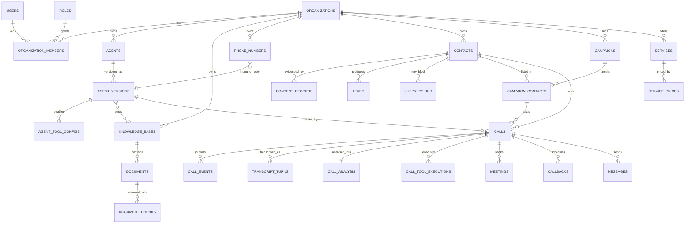
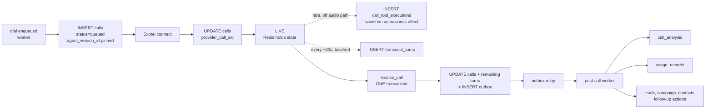

# Data Model

> **Status:** **Phase 1 implemented, in part.** 21 of the 34 tables below exist in migration `0001`; the rest belong to later phases and are marked as such. `packages/persistence` holds the models, repositories and Unit of Work.
> **Not implemented:** row-level security (Phase 15 — see §4.2), the vector column and `document_chunks` (Phase 3, open decision **D-8** — see §6), and every table in the *Knowledge documents*, *Business catalog*, *Call outcomes* and *Platform integrations* groups.
> **Scope:** the durable schema — entities, tenancy, indexing, lifecycle, retention and migration safety. It does **not** cover Redis keys (coordination only, see [ARCHITECTURE.md](ARCHITECTURE.md) §7) or API response shapes (never the same thing as a table).
> **Companions:** [../PRD.md](../PRD.md) (what the entities are *for*) · [ARCHITECTURE.md](ARCHITECTURE.md) (planes, layers, outbox) · [research/PROVIDER_CONSTRAINTS.md](research/PROVIDER_CONSTRAINTS.md) (the verified provider facts several decisions below depend on).
> **Honesty:** every number in this document is a **target**, a **budget**, or a **projection from the PRD's targets**. Nothing here has been measured. Provider facts are cited by their `HC-n` id from PROVIDER_CONSTRAINTS; anything not cited there is our own design decision and is labelled as such.

---

## 1. Ground rules

These apply to every table. They are boring on purpose — the interesting decisions come later, and they are only affordable because the basics are uniform.

**Identifiers.** Every table has a UUID primary key generated **in the application**, in `rn_core.ids`, not by the database. Two reasons: the domain layer needs an entity's identity before anything is flushed (a `Call` aggregate builds its outbox event referencing its own id), and generating server-side keeps ids stable across the retry of a job that already partially ran. We use **UUIDv7** (time-ordered) everywhere — one code path — because random v4 keys scatter B-tree inserts across the whole index and turn a write-heavy table like `calls` or `outbox` into a page-split machine.

Python 3.12's stdlib has no `uuid7`, so `rn_core.ids.new_id()` delegates to the **`uuid-utils`** library (Rust, RFC 9562), which returns a genuine `uuid.UUID`. *Implemented as of Phase 1 — an earlier draft of this document said we would write the generator ourselves; we do not. Getting the millisecond-boundary monotonic counter right is fiddly, and a subtly wrong implementation produces duplicate or non-monotonic keys under load, which is invisible until it is an incident.* Postgres 18 has a native `uuidv7()`, but we do not depend on it — the PG major version is downstream of **D-1** and generation stays in one place regardless. Columns keep a `DEFAULT gen_random_uuid()` purely as a safety net for rows inserted by hand.

**v7 ordering is not a timestamp.** Ids sort in generation order, which is what keeps inserts local, and that is all it is used for. No business logic derives a time from an id: temporal semantics always come from an explicit `timestamptz` column. The outbox relay, for example, claims work ordered by `(created_at, id)` — the timestamp carries the meaning and the id is only a deterministic tiebreak.

*No sequential integer ids anywhere.* They leak tenant volume, they make multi-tenant merges painful, and they invite the "id in the URL is guessable" class of bug.

**Timestamps.** `timestamptz`, always, everywhere, no exceptions — ruff's `DTZ` rules enforce the Python side. Storage is UTC; IST is a rendering concern.
One subtlety that costs a day if you get it wrong: `now()` in Postgres is *transaction start time*, and the finalize transaction starts well after the call actually ended. **Call timing instants (`started_at`, `answered_at`, `ended_at`) are supplied by the application from measured monotonic clocks**, never from `now()`. `created_at`/`updated_at` bookkeeping columns may use `now()`; they are metadata, not business facts.
Where a user expressed local intent ("Friday evening", "9 AM their time"), we store **both** the resolved instant and the IANA zone it was resolved in (`scheduled_at timestamptz`, `scheduled_tz text`). Storing only the instant means a later timezone-rule change or a reschedule silently moves the appointment.

**Enums.** `text` + a `CHECK` constraint, with the canonical value list owned by `rn_domain`. Native Postgres enum types are avoided: they cannot be reordered, values cannot be removed, and `ALTER TYPE ... ADD VALUE` has awkward transaction rules. A `CHECK` can be replaced with `ADD CONSTRAINT ... NOT VALID` + `VALIDATE CONSTRAINT`, which never blocks writes.

**JSONB only where the shape is genuinely open.** The permitted list is short and closed:
`integrations.config`, `webhook_events.payload`, `outbox.payload`, `call_tool_executions.arguments` / `.result`, `call_analysis.raw_output`, `document_chunks.metadata`, `audit_logs.metadata`, `agent_versions.turn_policy` / `.voice_map`.
Everything else is a column. The rule that keeps this honest: **nothing a dashboard filters or sorts on may live only in JSONB.** If you need to filter on it, promote it to a column (or a generated column with an index) in the same PR.

**Soft delete only where a user can "delete" something that history still points at.** `deleted_at timestamptz` exists on `organizations`, `agents`, `agent_versions`, `phone_numbers`, `knowledge_bases`, `documents`, `campaigns`, `contacts`, `services`, `integrations`. It does **not** exist on `calls`, `call_events`, `transcript_turns`, `call_analysis`, `usage_records`, `audit_logs` — those are append-only records of things that happened, removed only by retention or erasure.
**Soft delete is a UX affordance, not a privacy control.** A DPDP erasure request is a hard delete or a redaction — see §11.

**Money and durations.** Durations in integer **milliseconds** (`duration_ms`), never floats. Money in `numeric(18,6)` plus a `currency` column, never a float, never a bare "amount in paise" integer without the currency beside it. We have no verified provider pricing (PROVIDER_CONSTRAINTS §6a-11 — Exotel publishes none), so cost columns are **nullable** and populated later by a rating job; quantities are always recorded. See §10.

---

## 2. Entity inventory

34 tables in ten groups. This is derived from the PRD, not copied from the candidate list — the differences are the point, and each is justified below.

| Group | Tables |
|---|---|
| Tenancy & identity | `organizations` · `users` · `organization_members` · `roles` |
| Agent configuration | `agents` · `agent_versions` · `agent_tool_configs` · `agent_version_knowledge_bases` |
| Telephony assets | `phone_numbers` |
| Knowledge | `knowledge_bases` · `documents` · `document_chunks` |
| Business catalog | `services` · `service_prices` |
| People & compliance | `contacts` · `leads` · `consent_records` · `suppressions` |
| Campaigns | `campaigns` · `campaign_contacts` |
| Calls | `calls` · `call_events` · `transcript_turns` · `call_analysis` · `call_tool_executions` |
| Call outcomes | `meetings` · `callbacks` · `messages` |
| Platform & ops | `integrations` · `usage_records` · `audit_logs` · `webhook_events` · `outbox` · `dead_letter_jobs` |

### 2.1 What we merged, and why

**`roles` absorbs `role_permissions`.** A role carries `permissions text[]` directly. The permission *catalog* is a frozen list of `org:<feature>:<action>` strings in `rn_domain`, validated by a **CHECK against a literal array** — not a table of its own.

*Corrected in Phase 1: an earlier draft said "a CHECK against a small reference table", which Postgres 17 cannot do — a CHECK may not reference another table, and array-element foreign keys do not exist. The implemented form is `CHECK (permissions <@ ARRAY[...]::text[])`, where the array is a **frozen snapshot** written into migration `0001`. Migrations never import the live catalog: an old migration whose meaning changes because today's code changed is not a migration. Adding a permission therefore needs a new migration, and `tests/integration/test_schema_invariants.py` fails if the application catalog drifts from the constraint.* We never ask "which roles have permission X" at scale; we always load one role and read the whole set. A join table would be three tables to answer a question we ask once per request from cache.
This is also forced by HC-30/HC-31: Clerk system permissions never reach the backend, so authorization is entirely ours, and Clerk's ≤10 custom-role ceiling means per-tenant roles must live in our DB anyway (`roles.organization_id` nullable — `NULL` = platform catalog row). See **D-7**.

**`transcripts` is deleted; only `transcript_turns` exists.** A transcript header row is 1:1 with a call and holds nothing the call doesn't already hold. Storing an assembled `full_text` alongside the turns creates two copies of the same words, which then have to be redacted twice and drift the first time assembly changes. Full text is a **derived artifact**: rendered on demand for the UI, and written to object storage as part of an export job. Search runs over `transcript_turns` (§9), which is better anyway — you want to highlight the turn that matched, not a blob.

**`contacts` and `leads` both survive, sharply separated.** A `contact` is *a phone number this organization may dial* — the dedup and suppression key. A `lead` is *a qualified commercial opportunity* discovered in a conversation. One contact can produce several leads over a year (different services, different campaigns) and merging them would make "interest level" a permanent property of a human being, which is wrong and gets worse as the platform ages. `leads.contact_id` is NOT NULL; leads never float free.

**`campaign_contacts` is a dispatch state machine, not a join table.** It carries `status`, `attempt_count`, `next_attempt_at`, `last_call_id`, `excluded_reason`. Each dial attempt creates a `calls` row; retries are multiple calls pointing at one `campaign_contacts` row. We did **not** create a separate `call_attempts` table — the attempt *is* the call.

**`call_events` and `webhook_events` are different things and stay apart.** `webhook_events` is the raw inbound-delivery ledger used for idempotency and replay (mandatory because Exotel callbacks are unsigned, unretried and droppable — HC-10, HC-11). `call_events` is *our* domain state machine for a call. One is "what a provider claimed"; the other is "what we believe". Collapsing them means a provider replay can rewrite our state.

### 2.2 What we split, against the candidate list

**`consent_records` and `suppressions` are two tables, not one "consent/opt-out" table.** They have opposite lifecycles:

- `consent_records` — append-only **evidence** of opt-in: source, captured_at, artifact reference, who uploaded it, which tenant asserts it. It stores **both** `phone_hash` (the peppered deterministic hash, for lookup) **and** `phone_e164` in **plaintext**, because Exotel contractually requires producing this evidence within 24 hours (HC-14) and a hash cannot be shown to a regulator. Retrievability is a hard requirement, and it must work **without tenant context** — hence the hash-first index in §9.
- `suppressions` — the **blocklist**, checked before every single dial. `(organization_id nullable, phone_hash, reason, source, created_at)` — **no plaintext number is stored**; `phone_hash` is a peppered deterministic hash. A blocklist should not also be a phone-number database. `organization_id IS NULL` means platform-wide ("never call me from this platform again"), which a per-org design cannot express. This table is on the dispatch hot path and must answer in one indexed lookup.

The consent evidence *schema* is blocked on **D-3** (what artifact counts, retention, liability). We are building the table with the columns we are confident about and leaving the artifact representation to that decision.

**`services` and `service_prices` are separate, and prices are effective-dated.** `service_prices (service_id, currency, amount, unit, effective_from, effective_to)`. A mutable price column cannot answer "what did the agent quote on that call in March", and PRD §6.5 makes the pricing tool authoritative — an authoritative answer needs an auditable history. The pricing tool always resolves *as of now*; post-call analysis records the `service_price_id` actually returned.

**`agent_version_knowledge_bases` exists** because a knowledge-base binding is part of the agent's behaviour and therefore belongs to the *version*, not the definition (§5).

### 2.3 What we deliberately did NOT create yet

| Not created | Why | Create it when |
|---|---|---|
| `agent_sessions` | A session is a live in-memory runtime, not a row. Its durable projection **is** the `calls` row plus `call_events`. A table here would be a second source of truth for something that dies with the process. | never |
| `call_recordings` | **D-5** is unresolved — we may not record at all in V1. The shape is known (`call_id`, object key, `duration_ms`, `consent_record_id`, `retention_expires_at`, per-call data key for crypto-shredding), so this is a one-migration addition. | D-5 says yes |
| `plans`, `subscriptions`, `invoices`, `price_book` | Billing needs prices we do not have (PROVIDER_CONSTRAINTS §6a-11 — Exotel publishes no voice pricing; this is *not* D-6, which is provisioned capacity). `usage_records` captures the *quantities*, which is the part that cannot be retrofitted. Rating is a pure function applied later. | commercial terms exist |
| `retention_policies` | Retention *durations* are blocked on D-3/D-5; platform defaults live in config until then. The expensive part is the deletion machinery (§11), which we are designing now regardless. | D-3 and D-5 land |
| `data_subject_requests` | The erasure *traversal* (§11) is the hard part and is specified now. The request-tracking table arrives with the compliance phase. | erasure flow is built |
| `document_versions` | Superseding is modelled inside `documents` (`replaces_document_id`, `status`) so the old chunks stay queryable until the new ones are indexed, then swap in one transaction. A version table adds a level of indirection to every retrieval join for no gain. | never, probably |
| `contact_lists` / segments | The PRD imports contacts *into a campaign*. A reusable list is a saved filter over `contacts`, not a new entity. | tenants ask for reuse across campaigns |
| `call_metrics_daily` and friends | Rollups are a cache with a real correctness cost (§10). Introducing them before the trigger fires buys latency we do not need and double-counting bugs we do not want. | §10's stated trigger |
| `agent_eval_runs` | The eval harness is Phase 2 (language evaluation is Phase 6) and this schema should follow the harness, not lead it. | the eval harness exists |
| anything per-audio-frame | Non-negotiable. See §7. | never |

---

## 3. Core ER diagram

The ~17 tables that carry the product. Platform/ops tables (`outbox`, `webhook_events`, `audit_logs`, `dead_letter_jobs`, `usage_records`, `integrations`) are deliberately omitted — they connect to everything and would make the diagram unreadable.



Two edges worth pausing on. `PHONE_NUMBERS → AGENT_VERSIONS` is the inbound route: a number points at a *published version*, not at an agent, so republishing an agent does not silently change what answers the phone (§5). `CALLS → AGENT_VERSIONS` is `ON DELETE RESTRICT` — an agent version that has ever served a call can never be deleted, only archived.

---

## 4. The tenant boundary

Tenancy is a security boundary ([ARCHITECTURE.md](ARCHITECTURE.md) §9), and PRD §13 makes "zero cross-tenant access in an adversarial test" a V1 success criterion. That means three independent mechanisms, none of which is allowed to be the only one.

### 4.1 Which tables carry `organization_id`

| Class | Tables | Rule |
|---|---|---|
| **Tenant-owned** | everything in groups *Agent configuration* through *Call outcomes*, plus `integrations`, `usage_records`, `audit_logs` | `organization_id uuid NOT NULL REFERENCES organizations(id)`, on **every** table including children |
| **Platform-global** | `users`, `roles` (catalog rows), `dead_letter_jobs` | no `organization_id` |
| **Nullable-tenant** | `roles` (custom rows), `suppressions` (NULL = platform-wide), `webhook_events` (org unknown until the payload is parsed), `outbox` (NULL for platform events) | `organization_id uuid NULL`, and the NULL case has an explicit documented meaning |

**`organization_id` is denormalised onto every child table.** `transcript_turns` carries it even though it could be reached through `calls`. This is deliberate:

1. An RLS policy needs the tenant key **locally**; a policy that has to join to the parent is slow and easy to get wrong.
2. It is a partition key candidate (`document_chunks`, §8).
3. A repository that forgets a join is exactly the bug we are defending against, and a local column means the predicate is trivially always present.

The denormalisation is kept honest by a **composite foreign key**, which makes cross-tenant parentage structurally impossible rather than merely unlikely:

```sql
-- ILLUSTRATIVE, not final
ALTER TABLE calls ADD CONSTRAINT calls_org_id_key UNIQUE (organization_id, id);

CREATE TABLE transcript_turns (
    id               uuid PRIMARY KEY,
    organization_id  uuid NOT NULL,
    call_id          uuid NOT NULL,
    turn_index       int  NOT NULL,
    speaker          text NOT NULL CHECK (speaker IN ('caller','agent','system')),
    text             text NOT NULL,
    started_at       timestamptz NOT NULL,
    duration_ms      int,
    language_tag     text,
    UNIQUE (call_id, turn_index),
    -- a turn can never point at another tenant's call, enforced by the database
    FOREIGN KEY (organization_id, call_id) REFERENCES calls (organization_id, id)
);
```

### 4.2 How a query that forgets the scope is prevented

**Layer 1 — repositories.** There is no unscoped read path. `rn_persistence` exposes `TenantScopedRepository`, constructed with an `OrganizationId` taken from the verified `AuthContext` (or, on a call, from the server-side session context — never from a request body, never from model output; CLAUDE.md rules 3 and 4). It has no method that accepts a bare filter. Platform-global access lives in a separately named `PlatformRepository` that is only reachable from super-admin services, so a grep for it is a security review.

**Layer 2 — RLS, as defence in depth. NOT IMPLEMENTED IN PHASE 1.**

> Row-level security lands in **Phase 15** (multi-tenant hardening and adversarial verification), not with the baseline schema. Phase 1 ships Layer 1 and Layer 3 only. Nothing in the current codebase provides RLS, and no test covers it — do not read the tenant-isolation suite as evidence that it exists.
>
> Phase 1's isolation is application scoping *plus* a structural defence the original design did not spell out: **composite foreign keys**. `(organization_id, parent_id) → parent(organization_id, id)` makes cross-tenant parentage impossible in the database regardless of what the application does, and it is enforced today. That is weaker than RLS against a bug in a repository, and stronger than nothing.

The design below is what Phase 15 will implement:

```sql
-- ILLUSTRATIVE
ALTER TABLE calls ENABLE ROW LEVEL SECURITY;
ALTER TABLE calls FORCE ROW LEVEL SECURITY;
CREATE POLICY calls_tenant_isolation ON calls
    USING (organization_id = current_setting('app.organization_id', true)::uuid);
```

`SET LOCAL` inside an explicit transaction is the *only* form that works — Neon's PgBouncer runs `pool_mode=transaction`, where session-level `SET` is unsupported (HC-26). Migrations and the scheduler's advisory lock use the second, **direct** DSN. The application role does not have `BYPASSRLS`; the migration role is separate and does.

We set the GUC ourselves rather than using a JWT-derived RLS integration, because the tenant key in our schema is **our** UUID, not `clerk_org_id` (that is a unique column on `organizations`, never the PK — telephony entities, CDRs, billing ledgers and retained recordings must outlive an auth-provider migration).

#### The one relationship a composite FK cannot express: `organization_members.role_id`

A membership may reference a role only if the role is a **platform catalog role** (`roles.organization_id IS NULL`, assignable by anyone) or belongs to the **same organization** as the membership. Otherwise organization B could decide what organization A's members may do.

No declarative constraint covers both cases, because `roles.organization_id` is nullable:

| Approach | Why it fails |
|---|---|
| Composite FK, `MATCH SIMPLE` (the default) | Skipped entirely whenever a referencing column is NULL, so a forged NULL bypasses it |
| Composite FK, `MATCH FULL` | Rejects NULLs outright, making every platform catalog role unassignable |
| Split into `platform_roles` + `organization_roles` | Expresses it declaratively, at the cost of two tables and a branch in every role read |

So it is enforced by a **trigger** — `organization_members_role_scope`, `BEFORE INSERT OR UPDATE` — plus a companion trigger making `roles.organization_id` immutable, which closes the "assign legally, then re-home the role" path that a write-time check alone would miss. A trigger states the rule once, applies to every writer including raw SQL, and costs nothing on a table written only at invite/remove time.

`build_tenant_context` **also** refuses a cross-tenant role at read time. That is not redundancy for its own sake: authorization integrity must not depend on the database having been correct, so a row that predates the trigger, arrives through a restore, or is written with `session_replication_role = replica` still cannot produce an authorized context. `tests/integration/test_role_ownership.py` proves this by disabling the trigger and asserting the read boundary still holds.

**Layer 3 — tests that fail on schema drift.** Two, both cheap and both mandatory:

- A test that enumerates `information_schema` for every table with an `organization_id` column and asserts RLS is enabled and a policy exists. Adding a table without a policy fails CI. This is the only defence that survives someone adding a table in six months without reading this document.
- An adversarial integration test that seeds two organizations, runs every read path as org A, and asserts zero rows of org B — with RLS active, so it catches both a missing repository filter and a missing policy.

**RLS does not rescue vector recall.** An RLS predicate post-filters exactly like any other filter, so it makes the problem in §8 *worse*, not better. Never reason "RLS handles tenancy, so the retrieval query can be naive."

---

## 5. Agent definition vs. version vs. session

The distinction the runtime rests on ([ARCHITECTURE.md](ARCHITECTURE.md) §4.4), expressed in tables:

| Concept | Table | Mutability | Lifetime |
|---|---|---|---|
| **Definition** | `agents` | mutable metadata only: `name`, `description`, `status`, `current_version_id`, `deleted_at` | forever |
| **Version** | `agent_versions` + `agent_tool_configs` + `agent_version_knowledge_bases` | **immutable once published** | forever, never hard-deleted |
| **Session** | *no table* — in-process state in the voice gateway | ephemeral | one call |

`agent_versions` holds everything that changes behaviour: `instructions`, `language_policy` (JSONB), `languages` (`text[]`), `voice_map` (JSONB — a `language → (provider, voice_id)` map, per PROVIDER_CONSTRAINTS §3), `turn_policy` (JSONB — VAD mode, eagerness, thresholds), `realtime_model`, `telephony_sample_rate`, `guardrail_config`, `version_number`, `published_at`, `created_by_user_id`.

**`language_policy` and `languages` are one fact, not two** (migration `0002`).
`language_policy` is authoritative and holds `primary`, `allowed`, `follow_caller` and
`code_switch`. `languages` is a denormalised **projection** of `allowed`, kept as a real
array so "which agents speak Telugu?" is an indexable query rather than a JSONB scan.
Two CHECK constraints stop them diverging:

```sql
CHECK (to_jsonb(languages) IS NOT DISTINCT FROM language_policy -> 'allowed')
CHECK (cardinality(languages) >= 1
   AND jsonb_typeof(language_policy -> 'allowed') = 'array'
   AND language_policy ? 'primary'
   AND language_policy -> 'allowed' @> jsonb_build_array(language_policy ->> 'primary')
   AND coalesce(jsonb_typeof(language_policy -> 'follow_caller'), '') = 'boolean'
   AND coalesce(jsonb_typeof(language_policy -> 'code_switch'), '') = 'boolean')
```

`IS NOT DISTINCT FROM` rather than `=`, and `coalesce(jsonb_typeof(...), '')` rather than
a bare comparison, because **a CHECK whose expression evaluates to NULL passes** — and a
missing key is exactly the row that must be rejected. On the Python side there is only
one field: `AgentVersion.languages` is a read-only property over
`language_policy.allowed`, so the projection cannot be authored independently.

`reasoning_effort` is **not** a column. Whether it survives in the GA session object is
listed UNVERIFIED in AGENT_ARCHITECTURE §12, and a column for an unconfirmed provider
field is a migration waiting to be reverted.

**Tool enablement belongs to the version, not the agent.** Turning on `send_whatsapp` changes what the agent can do to the world; if that lived on `agents`, "which configuration handled this call" would be answerable for the prompt but not for the tools, which is worse than not answerable at all. Same argument for knowledge-base bindings.

**Immutability is enforced in the database**, not by convention:

```sql
-- ILLUSTRATIVE: reject any UPDATE to behaviour columns once published
CREATE OR REPLACE FUNCTION agent_versions_freeze() RETURNS trigger AS $$
BEGIN
    IF OLD.published_at IS NOT NULL
       AND (NEW.instructions, NEW.turn_policy, NEW.voice_map, NEW.realtime_model)
        IS DISTINCT FROM
           (OLD.instructions, OLD.turn_policy, OLD.voice_map, OLD.realtime_model)
    THEN RAISE EXCEPTION 'agent_versions.% is immutable after publish', OLD.id;
    END IF;
    RETURN NEW;
END $$ LANGUAGE plpgsql;
```

Only `status` (`draft → published → archived`) and `deleted_at` may change after publish. Editing a published agent in the UI creates a new draft row; publishing it bumps `agents.current_version_id`.

`agents.current_version_id` and `agent_versions.agent_id` form a cycle. Resolve it with a nullable `current_version_id` set after the first version is inserted, inside the same transaction — not with a `DEFERRABLE` constraint, because deferred constraint failures surface at COMMIT with unhelpful stack traces.

### How a call pins its version

`calls.agent_version_id uuid NOT NULL` — no default, no nullable, `ON DELETE RESTRICT`.

**Resolution happens exactly once, before any media flows:**

- **Outbound:** at dial-enqueue time in the worker. The `calls` row is inserted with the resolved `agent_version_id` *before* the Exotel request is made. If someone publishes a new version while the campaign is mid-flight, in-flight calls keep the version they were enqueued with. This is the correct behaviour and it falls out of the write ordering.
- **Inbound:** at `start`-event handling, resolved from `phone_numbers.inbound_agent_version_id`. Because the phone number points at a *version*, an inbound call cannot be handed a half-published draft.

The voice gateway **never** re-resolves mid-call, and never looks up "the current version" — it receives an already-resolved snapshot (from the Redis context written at dial time, Postgres as fallback) and caches it in a process-local LRU keyed by `agent_version_id`, which is safe precisely because versions are immutable.

A call that outlives the provider's 60-minute session cap (HC-5, HC-6) and rolls over into a new provider session is still **one** `calls` row with the **same** `agent_version_id`; the rollover is a `call_events` row of type `session.rollover`. Creating a second call row would break every count in the product.

---

## 6. Vector storage — DEFERRED, not decided

> **This section describes a decision that has NOT been made.** The column type, the dimension, the index and the partitioning scheme are **open decision D-8**, resolved in Phase 3 after a bake-off on real Indic data. See [ADR-010](DECISIONS/ADR-010-defer-vector-storage-layout.md), which supersedes the decision in [ADR-006](DECISIONS/ADR-006-pgvector-tenant-isolation-and-embeddings.md).
>
> **Phase 1 creates no vector column and no `document_chunks` table.** Nothing in Phases 1–2 needs one, and the two choices below are the least reversible in the system — the dimension is part of the Postgres type, and partitioning cannot be retrofitted onto live data.

### Why it is deferred

The previously-recorded `halfvec(1536)` was not a measured choice:

- **1536 is the native width of `text-embedding-3-small`** — a vendor default we adopted before evaluating anything. No official per-language benchmark exists for OpenAI embeddings on Indic languages (PROVIDER_CONSTRAINTS **L-8**; [anti-fact 17](research/PROVIDER_CONSTRAINTS.md) also invalidates the commonly-cited `3-large` shortened-dimension comparison). This is an India-first product whose corpus is English/Hindi/Telugu and code-mixed.
- **`halfvec` was chosen to dodge a cap we are not near.** HNSW caps `vector` at 2000 dims and `halfvec` at 4000 (**HC-24**), so at 1536 *both* are indexable. The remaining argument is storage and build time against an unmeasured recall delta — an optimisation ahead of a measurement.
- **A width baked into the column type makes the `EmbeddingProvider` seam nominal**, which contradicts the platform's provider-independence requirement.

### The starting position for Phase 3

The simplest thing that is correct: one `document_chunks` table, tenant-scoped, **exact (non-ANN) search**. At single-digit tenants with modest corpora that is 100% recall and zero exposure to the filtered-ANN trap in §7. An index is added when a measurement says exact search is too slow.

```sql
-- ILLUSTRATIVE and INCOMPLETE. The embedding column's type and the physical key
-- layout are BOTH open decision D-8 -- see the note below the block.
CREATE TABLE document_chunks (
    id               uuid NOT NULL,
    organization_id  uuid NOT NULL,
    knowledge_base_id uuid NOT NULL,
    document_id      uuid NOT NULL,
    chunk_index      int  NOT NULL,
    content          text NOT NULL,
    token_count      int  NOT NULL,
    metadata         jsonb NOT NULL DEFAULT '{}',
    -- embedding     <type>(<dim>)     -- D-8: type, width, index, partitioning
    embedding_model  text NOT NULL,    -- recorded from the first migration, not later
    embedding_dim    int  NOT NULL,
    embedded_at      timestamptz,
    created_at       timestamptz NOT NULL DEFAULT now()
    -- PRIMARY KEY   -- D-8 / ADR-011. See below.
);
```

> **The physical key layout is D-8-dependent and is NOT decided here.**
>
> An earlier revision of this block specified `PRIMARY KEY (organization_id, id)`. That
> composite key existed for exactly one reason: **a partitioned table requires the
> partition key in every unique constraint**, and the design at the time was
> `PARTITION BY LIST (organization_id)`. [ADR-010](DECISIONS/ADR-010-defer-vector-storage-layout.md) withdrew the partitioning, so the *reason* for the composite key
> went with it — but the key stayed in the sketch and started reading as a decision.
>
> It is also the one place the whole schema would deviate from its own base class:
> every other table uses `id` as the primary key plus a `UNIQUE (organization_id, id)`
> that serves as the composite-FK target.
>
> **Both options remain open, and the choice belongs to ADR-011** because it depends on
> D-8's answer to partitioning:
>
> | If D-8 says | Then |
> |---|---|
> | no partitioning (the ADR-010 starting position) | `id` PK + `UNIQUE (organization_id, id)`, consistent with every other table |
> | partitioning is justified by a measurement | `PRIMARY KEY (organization_id, id)`, because Postgres requires the partition key in it |
>
> **What is NOT open, under either layout:** `organization_id` is `NOT NULL`, the table
> is tenant-owned, the parent references are **composite** foreign keys
> (`(organization_id, document_id) → documents (organization_id, id)`) so cross-tenant
> parentage is impossible in the database, and the tenant predicate is applied inside the
> single `<=>`-issuing function from a `TenantContext` rather than a parameter. Tenant
> ownership and cross-tenant isolation are mandatory regardless of which physical key
> lands — they do not depend on the key at all, and they never did.

**`embedding_model` and `embedding_dim` are recorded from day one.** They cost almost nothing and they are what makes model migration and coexistence tractable at all.

**Coexistence is designed in.** A knowledge base carries an *active model version*; a re-embed runs as a background job writing new rows alongside the old and flips the pointer when complete — a rolling per-tenant operation, not a platform outage. Whether different widths need separate tables (they cannot share a typed column) is part of D-8.

**`content` stays in the row.** Never store chunk text only in object storage. Re-embedding must never require re-parsing and re-chunking the source documents — that turns a mechanical migration into a pipeline replay with different chunk boundaries and therefore different results.

**Tenant isolation does not depend on any of this.** Scoped repositories plus RLS (§4) are independent of physical layout; partitioning was never the isolation mechanism.

### Why the dimension decision is near-irreversible once made

A typmod'd vector column bakes the width into the type. Changing the embedding model to anything of different dimensionality is not an `ALTER COLUMN`; it is:

1. re-embed **every chunk of every tenant** through a paid API (cost scales with total corpus, not with change size),
2. a full table rewrite (`ALTER TYPE` on a typmod'd vector column rewrites; on a partitioned table, once per partition),
3. a full HNSW rebuild per partition — hours of `maintenance_work_mem`-bound work,
4. a dual-read window during which retrieval quality is inconsistent between migrated and unmigrated tenants.

The only sane execution is **additive**: add `embedding_v2 <type>(N)` (or a `document_chunks_v2` table), backfill per tenant, have the retrieval helper select the column by `embedding_model`, then drop the old column in a much later release. Design that path now; do not discover it under pressure.

This is precisely why the choice is deferred rather than made early: the migration above is the *cheap* version, and it still costs a full paid re-embed of every tenant. Making the decision after the bake-off costs nothing.

> **D-8 — DECISION REQUIRED** ([PRD §12](../PRD.md#12-open-decisions), [ADR-010](DECISIONS/ADR-010-defer-vector-storage-layout.md)). Which embedding model, at what width, in which column type, with what index and partitioning. Resolved in Phase 3 by a bake-off on real Hindi/Telugu/code-mixed content — **before the first tenant ingests at production scale**, because after that the change is measured in API spend and downtime rather than a config edit.

---

## 7. The filtered-ANN recall trap, and the index strategy it forces

pgvector's own documentation states it plainly (HC-25): *"With approximate indexes, filtering is applied after the index is scanned… if a condition matches 10% of rows, with default `hnsw.ef_search` of 40, only 4 rows will match on average."*

So this query is a **silent correctness bug**:

```sql
SELECT content FROM document_chunks
WHERE organization_id = $1
ORDER BY embedding <=> $2 LIMIT 8;   -- returns 1 row. No error. Ever.
```

It does not fail. The agent simply appears to have forgotten its knowledge base, on some calls, for some tenants, non-deterministically — and the smaller the tenant's share of the table, the worse it gets.

**Note what this trap is and is not.** It is a property of *approximate* indexes. Exact search has no such failure mode: a sequential scan with a tenant predicate returns exactly the top-k within that tenant, always. So the trap does not argue for partitioning — it argues that **the moment we adopt an ANN index we owe ourselves iterative scans, a raised `ef_search`, and a recall measurement.** Starting exact means starting correct.

### Index strategy — a decision to be made against measurements

| Tier | Corpus size | Index | Recall |
|---|---|---|---|
| **Small** (the default; every tenant on day one, and the only tier at V1) | ≲ 10k chunks | **none** — exact scan, B-tree on `(organization_id, knowledge_base_id)` | 100%, exact |
| **Large** | above whatever the measured latency budget allows | ANN (HNSW `m=16, ef_construction=64` is the starting candidate) with `hnsw.iterative_scan='relaxed_order'` and a raised `hnsw.ef_search` | approximate, must be measured |

The 10k figure is a **starting default, not a measurement**; PROVIDER_CONSTRAINTS records ~36 ms for an exact scan at 10k chunks [C]. Re-tune once we have production corpora. Promotion is an operational job, not a code path.

### Partitioning: NOT adopted (open decision D-8)

`PARTITION BY LIST (organization_id)` was previously recorded as the design. It is **not approved** — see [ADR-010](DECISIONS/ADR-010-defer-vector-storage-layout.md). The reasoning:

- **Our tenant count does not justify it.** V1 is single-digit organizations; the roadmap's ambition is tens to low hundreds. Partitioning solves a planner problem that appears when one table's index no longer serves selective per-tenant queries. At this scale a single table with a `(organization_id, …)` B-tree and an exact scan is not merely adequate — it is faster *and* exactly correct.
- **Per-tenant index strategy, the main argument for LIST, only matters once there is an ANN index to vary.** There is not one yet.
- Introducing it now would be structure for architectural appearance, which this codebase explicitly refuses.

What was true and remains true: **partitioning cannot be usefully retrofitted.** You can attach an existing table as a partition, but every existing row stays in it — you get the structure without the benefit until you physically move every row of every tenant. So the trigger for adopting it must be a *measured* planner or index-maintenance problem at the actual tenant count, and it must be caught before the corpus is large, not after. That is a thing to monitor for, not a reason to pre-build it.

The genuine benefit we give up meanwhile: `DROP TABLE` on a partition as the tenant-knowledge-erasure primitive. Without partitions that becomes a bounded `DELETE` plus vacuum — slower and noisier, but correct, and §11 covers it.

### Why partial-index-per-tenant does not scale

The tempting alternative is `CREATE INDEX ... ON document_chunks USING hnsw (embedding halfvec_cosine_ops) WHERE organization_id = '...'` per tenant. pgvector recommends partial indexes for a **few** distinct filter values and partitioning for **many** (anti-fact 24 explicitly flags the "it scales" claim as unconfirmed). Concretely:

1. **Each HNSW partial index is a full independent graph** with its own build cost and its own resident memory. N tenants means N graphs competing for shared buffers.
2. **The planner evaluates every candidate index on every query.** Thousands of indexes on one table adds planning time to *all* queries against it, including inserts.
3. **Tenant onboarding becomes DDL.** Creating an index at signup means running `CREATE INDEX` in the request path (or a job), taking locks on a live table, with no transactional rollback story. Partitions have the same issue but at a far lower rate, because only *promoted* tenants get one.
4. **Catalog and autovacuum bloat** scale with index count, and `pg_class`/`pg_index` growth is felt by everything, not just this table.

### The single retrieval helper — and the two layers it is split across

> **This subsection is the authoritative statement of where retrieval lives.** Earlier
> prose put the helper in `rn_persistence` ([ADR-006](DECISIONS/ADR-006-pgvector-tenant-isolation-and-embeddings.md), this document, `packages/persistence/README.md`) and other prose put it in `rn_services` ([AGENT_ARCHITECTURE §5.2](AGENT_ARCHITECTURE.md), [ROADMAP](ROADMAP.md) Phase 1). Both were describing something real and neither was complete. The resolution is that **there are two things, at two layers, with two different jobs** — and conflating them is what made the documents disagree.

**Business retrieval orchestration is not the SQL vector-search implementation.**

| | Orchestration | Implementation |
|---|---|---|
| Where | `rn_services` — a retrieval **service** / use case | `rn_persistence` — one **function** |
| Job | embed the query text through `EmbeddingProvider`; resolve which knowledge bases are in scope from the agent version's bindings; apply the active embedding model/width; decide `k`; shape the result for a tool envelope; emit the `recall_warning` / underfill signal | build and issue exactly one parameterised SQL statement: the tenant predicate, the knowledge-base filter, the model/width filter, the `documents.status = 'active'` join, the `SET LOCAL` tuning, the `<=>` ordering, the over-fetch and trim |
| Knows about | tenants, agent versions, embedding providers, tool semantics | SQL, pgvector, `SET LOCAL`, transactions |
| Knows nothing about | SQL or pgvector | why the caller wants these chunks |
| How many | as many callers as need retrieval | **exactly one** |

Why the split, rather than one function in either layer:

- **`<=>` and `SET LOCAL` are pgvector- and transaction-specific.** They belong at the persistence boundary for the same reason every other query does — putting them in `rn_services` would make the business layer the place SQL is written, and there is nowhere below it to enforce anything.
- **`rn_agent` may not import `rn_persistence` at all** (import-linter contract *"Agent layers reach domain data only through `rn_services`"*). A tool therefore *cannot* reach the persistence function; it reaches the service, which is exactly the layering the contract exists to produce.
- **Tenant scoping has to be structurally unavoidable, not merely applied.** The persistence function takes its `organization_id` from the `TenantContext` its repository was constructed with — there is no parameter by which a caller supplies a tenant, so there is nothing to pass wrongly. The orchestration layer cannot widen that scope even if it wanted to.

**The invariant, stated precisely, and it is the one to enforce in review:**

> **Exactly one function in `rn_persistence` may construct or issue a `<=>` query** (or a pgvector distance helper equivalent to one). Everything else — `rn_services`, `rn_agent`, `rn_api`, `rn_voice`, `rn_worker`, a job, a script, a test — goes through it. A raw ORM vector query anywhere else is a review stop.

Phase 3 Stage 2 makes that mechanical rather than a rule people remember: a structural test greps the tracked source for `<=>`, `cosine_distance`, `l2_distance`, `max_inner_product` and `.op("<=>")`, and asserts the only match is inside that one module.

**Neither half exists yet.** The physical schema it queries is open decision **D-8**, so the function cannot be written until [ADR-011](research/D8_BAKEOFF.md) fixes the column type and width. What Stage 1 delivered is the layer *below* both: the `EmbeddingProvider` seam that the orchestration layer will call.

---

Every vector read in the platform goes through that one function in `rn_persistence`. Nothing else may issue a `<=>` query, and that is a review rule made mechanical by the test above.

```sql
-- ILLUSTRATIVE: what the helper emits, per call, inside its own transaction
BEGIN;
  SET LOCAL app.organization_id = $org;
  SET LOCAL hnsw.ef_search = 200;               -- never the 40 default
  SET LOCAL hnsw.iterative_scan = 'relaxed_order';
  SELECT id, content, metadata, embedding <=> $q AS distance
    FROM document_chunks
   WHERE organization_id = $org
     AND knowledge_base_id = ANY($kb_ids)
     AND embedding_model = $model
   ORDER BY embedding <=> $q
   LIMIT $k;
COMMIT;
```

The helper additionally: over-fetches (`LIMIT k * 2`) and trims after post-filtering; **emits a `recall_warning` metric whenever it returns fewer than `k` rows**, which is the only observable symptom of the trap; and joins/filters on `documents.status = 'active'` so a mid-reindex document never leaks half-old, half-new context.

Two honest caveats: `SET LOCAL` is confirmed to work through Neon's pooler for `hnsw.ef_search` but is **unverified for `hnsw.iterative_scan` and the `max_scan_tuples`/`scan_mem_multiplier` GUCs** (PROVIDER_CONSTRAINTS §6a-35) — test it against the `-pooler` DSN before relying on it. And if retrieval is routed to a read replica for latency, replicas are **asynchronous and eventually consistent** (anti-fact 23): the UI must say "indexing", not "ready".

---

## 8. Call and transcript lifecycle

The governing rule: **the media plane writes as close to nothing as possible while a call is live** ([ARCHITECTURE.md](ARCHITECTURE.md) §4.3), and the voice gateway has no database session at all — every write goes through `rn_services` (enforced by an import-linter contract).



### Written before the call

The `calls` row is inserted **before** the provider request, in `status = 'queued'`, carrying `organization_id`, `campaign_id`, `campaign_contact_id`, `contact_id`, `agent_version_id`, `direction`, `from_number`, `to_number` and a unique `idempotency_key`. Ordering matters: if the process dies between insert and dial, we have a record of an intent we can reconcile; if we dialled first, we would have a real phone ringing with no row anywhere. `provider_call_sid` is nullable until the provider responds and carries a **partial** unique index (`WHERE provider_call_sid IS NOT NULL`) scoped by provider.

The `idempotency_key` (deterministic from campaign_contact + attempt number) is what stops a redelivered Taskiq message or a re-executed graph node from dialling a real Indian phone number twice — the failure mode HC-38 describes.

Inbound calls have no pre-dial phase: the row is created by `rn_services` when the media socket's `start` event arrives, from the opaque session id (HC-12 limits us to 3 custom params / 256 chars, so *everything* else is looked up server-side).

### Written during the call — and nothing else

Exactly three things may touch Postgres while audio is flowing, and each has to justify itself:

1. **`call_tool_executions`** — one row per tool call, written by the tool dispatcher, which already runs on a separate task off the audio path (ARCHITECTURE §4.3). It is written **in the same transaction as the tool's business effect** (the `leads` insert, the `meetings` insert). That is not incidental: it makes the audit row and the effect atomic, and it gives idempotent replay a single row to check.
2. **`call_events`** — coarse state transitions only: `answered` (written by the *API* from the Exotel status callback, not by the gateway), `session.rollover`, `provider.error`, `barge_in.divergence` above a threshold. Roughly single digits per call.
3. **`transcript_turns`** — batched flush, see below.

Everything else lives in **Redis**: live status, `played_ms` accounting, per-org and platform concurrency counters, rate-limit budgets, the call-context handoff. All of it is disposable by design (ARCHITECTURE §7).

**Per-frame audio events are never persisted. Anywhere.** Not to Postgres, not to Redis, not to the log pipeline. Audio messages arrive at **~10–20 messages/second/direction** per call — 50–100 ms of audio per message (HC-1) — so ~20–40 messages/second per call across both directions, and 100 concurrent calls would be **~2,000–4,000 writes/second** of data with no analytical value. Frame-level facts (sequence numbers, marks, buffer depth) are **metrics and traces**, sampled, in the OTel pipeline. The same rule covers VAD events, `mark` echoes and interim transcripts.

### Transcript flush policy

Default would be "write turns only at finalize", and that is what we would do for a 3-minute call. But calls can run to the 60-minute cap (HC-5/HC-6), and losing an entire hour-long transcript to a gateway crash is not acceptable. So: **turns are buffered in process memory and flushed through `rn_services` every ~30 seconds or ~20 turns, whichever comes first, on a background task.** The trade-off is explicit and bounded — a crash loses up to 30 seconds of transcript tail and never loses the call record itself. The 30 s interval is a decision, not a measurement; tune it once we can observe flush cost against turn-latency jitter.

### At finalize — one transaction, deliberately tiny

`finalize_call()` writes, atomically: the terminal `calls` update (`ended_at`, `duration_ms`, `status`, `end_reason`, provider metadata), any un-flushed `transcript_turns`, and **one `outbox` row** for `call.completed`.

Nothing else. No analysis, no usage rating, no campaign counter update, no metrics rollup. The reason is lock duration on the hottest table in the system: at the V1 target of 100 concurrent calls this transaction runs several times a second, and anything expensive inside it turns into lock contention on `calls` that shows up as latency everywhere.

```sql
-- ILLUSTRATIVE: the outbox, the reason the gateway needs no broker client
CREATE TABLE outbox (
    id              uuid PRIMARY KEY,          -- uuidv7: relay reads in insertion order
    organization_id uuid,
    aggregate_type  text NOT NULL,             -- 'call'
    aggregate_id    uuid NOT NULL,
    event_type      text NOT NULL,             -- 'call.completed'
    payload         jsonb NOT NULL,
    created_at      timestamptz NOT NULL DEFAULT now(),
    published_at    timestamptz,
    attempts        int NOT NULL DEFAULT 0,
    last_error      text
);
CREATE INDEX outbox_unpublished ON outbox (id) WHERE published_at IS NULL;
```

The relay claims rows with `WHERE published_at IS NULL ORDER BY id FOR UPDATE SKIP LOCKED LIMIT n`, publishes to Taskiq, and stamps `published_at`. Ordering is by `id`, not `created_at`, because `outbox.id` is a **uuidv7** — it is already insertion-ordered, it is the primary key, and it is unique, so it cannot tie the way a `created_at` timestamp can. Delivery is **at-least-once**, so every consumer must be idempotent — that is a property of the design, not a bug to fix.

### After the call — the post-call worker

Triggered by the relayed `call.completed`: transcript normalisation, `call_analysis` (schema-constrained structured output — PRD §6.7; analytics never parse free-form text), `usage_records`, lead upsert, `campaign_contacts` status and retry scheduling, campaign counters, follow-up actions and outbound webhooks.

`call_analysis` is 1:1 with `calls` and stores the fields the dashboard filters on as **real columns** (`outcome`, `interest_level`, `sentiment`, `qualification`, `languages_used text[]`, `meeting_booked bool`, `callback_requested bool`, `confidence numeric`) with the complete model output in `raw_output jsonb` and an `analysis_version` so a re-run is distinguishable from the original. Re-analysis **replaces** the row and bumps `analysis_version`; it never appends, because "which analysis is current" must not be a query.

### Reconciliation is a required component

Exotel status callbacks are unsigned, may be delayed, may never arrive, and have no documented retry (HC-10, HC-11). A scheduled job finds calls stuck in a non-terminal status past a threshold, polls Call Details, and closes them out. Without it, `calls.status` drifts permanently and every downstream count is wrong. `webhook_events` gives the idempotency: Exotel documents only two event types (`answered`, `terminal`, HC-15) and no unique event id, so the dedup key is `(provider, provider_call_sid, event_type)` with an upsert — a direct consequence of the provider's design, not a choice.

---

## 9. Indexing for the queries we will actually run

Indexes are designed from query shapes, not from "columns that look filtery". Every index below exists because a named screen or job needs it.

| Query | Shape | Index |
|---|---|---|
| **Dashboard call list** | `WHERE organization_id=$1 AND started_at >= $2 AND started_at < $3 ORDER BY started_at DESC` | `calls (organization_id, started_at DESC)` — the workhorse |
| ...filtered by campaign | adds `AND campaign_id=$4` | `calls (organization_id, campaign_id, started_at DESC)` |
| ...filtered by outcome | adds a join to `call_analysis` | `call_analysis (organization_id, outcome)`; consider a denormalised `calls.outcome` **only** if EXPLAIN on real data demands it |
| **Campaign dispatch selection** | `WHERE campaign_id=$1 AND status='pending' AND next_attempt_at <= now() ORDER BY next_attempt_at LIMIT n FOR UPDATE SKIP LOCKED` | **partial** `campaign_contacts (campaign_id, next_attempt_at) WHERE status='pending'` |
| **Contact dedup on import** | `WHERE organization_id=$1 AND phone_e164 = ANY($2)` | `UNIQUE (organization_id, phone_e164)` on `contacts` |
| **Pre-dial suppression check** | `WHERE phone_hash=$1 AND (organization_id=$2 OR organization_id IS NULL)` | `suppressions (phone_hash, organization_id)` — the table stores no plaintext number |
| **Consent evidence retrieval** (24 h SLA, HC-14) | `WHERE organization_id=$1 AND phone_hash=$2 ORDER BY captured_at DESC` | `consent_records (organization_id, phone_hash, captured_at DESC)` |
| **Consent evidence retrieval, tenant-less** (24 h SLA, HC-14) | `WHERE phone_hash=$1 ORDER BY captured_at DESC` — a regulator or Exotel asks about a *number*, not about a tenant | **hash-first** `consent_records (phone_hash, captured_at DESC)` |
| **Call detail page** | `WHERE call_id=$1 ORDER BY turn_index` | `transcript_turns UNIQUE (call_id, turn_index)`; `call_tool_executions (call_id, started_at)` |
| **Outbox relay** | `WHERE published_at IS NULL ORDER BY id FOR UPDATE SKIP LOCKED LIMIT n` (`id` is uuidv7, so this *is* insertion order) | partial index above, `(id) WHERE published_at IS NULL` |
| **Webhook dedup** | upsert on `(provider, provider_call_sid, event_type)` | unique constraint, doubles as the idempotency guard |

Rules that go with them:

- **Keyset pagination, never `OFFSET`.** `WHERE (started_at, id) < ($cursor_ts, $cursor_id) ORDER BY started_at DESC, id DESC LIMIT 50`. `OFFSET` degrades linearly *and* is silently wrong when rows are inserted during paging — which, on a live call list, they constantly are.
- **Partial indexes are right here and wrong in §7.** The dispatch index is partial because `status` has few distinct values and the pending set shrinks to nothing as a campaign completes. That is exactly the "few distinct filter values" case pgvector endorses; per-tenant vector indexes are the "many distinct values" case it does not.
- **Do not build the cartesian product of filter combinations.** PRD §6.9 lists seven filters. Fourteen composite indexes would cost more on every insert than they save on a dashboard that loads twice an hour. Start with the org+time index, add composites only where a real `EXPLAIN (ANALYZE, BUFFERS)` on production-shaped data justifies it, and record the justification in the migration.
- **Transcript search: `pg_trgm`, not `tsvector`.** Postgres ships no Hindi or Telugu text-search configuration, and the transcript's *script* varies with agent configuration (Sarvam's `mode` changes whether the LLM sees Devanagari, Telugu script or Latin transliteration — PROVIDER_CONSTRAINTS §3). A language-specific FTS config would work for exactly one configuration. A GIN trigram index on `transcript_turns.text` degrades gracefully across scripts and code-mixing. Add it when transcript search is actually built; it is not free on a table projected at ~15M rows/month (§10).

### Should `calls` be partitioned?

**Not initially**, and this is a considered asymmetry with `document_chunks`. A partitioned table requires the partition key in every unique constraint, so `calls` PK would become `(started_at, id)` and *every child table* would have to carry `call_started_at` to keep its foreign key. That is a real, permanent ergonomic tax paid immediately for a benefit that arrives much later.

Unlike `document_chunks`, `calls` **can** be retrofitted usefully: `started_at` is a real, range-checkable column, so the existing table can be given a matching CHECK constraint and attached as the first partition of a new range-partitioned parent, with new months landing in new partitions. The migration is genuinely painful but it is not a full row rewrite.

**Trigger:** partition `calls` by `RANGE (started_at)`, monthly, when retention deletion becomes the dominant vacuum cost (a monthly bulk `DELETE` that leaves bloat autovacuum cannot keep up with), or when the table passes roughly 50M rows — whichever comes first.

---

## 10. Analytics: when raw scans stop working

**Projected volume at the PRD's V1 target** — a projection from a target, not a measurement. 100 concurrent calls at ~3 minutes average, sustained 8 hours/day, is ~2,000 calls/hour → ~16,000/day → **~0.5M `calls` rows/month** platform-wide. Fan-out per call: ~30 `transcript_turns` (~15M/month), ~4 `usage_records` (~2M/month), ~5 `call_events`, 1 `call_analysis`, 0–5 `call_tool_executions`.

At that scale a single tenant's 90-day analytics query touches tens of thousands of `calls` rows joined to `call_analysis`. Postgres does that in tens of milliseconds with the org+time index. **So we do not build rollups now.** Doing so early buys nothing and imports the two failure modes rollups always bring: backfill bugs, and double-counting when `call_analysis` is re-run and an outcome changes after the rollup was computed.

**The trigger — build `call_metrics_daily` when any one of these is true:**

1. p95 latency of the analytics endpoint exceeds **500 ms** on production data for three consecutive days (target/budget, per the control plane's ~200 ms p95 HTTP budget in ARCHITECTURE §1 — analytics gets a looser one);
2. any single tenant passes **~2M rows** in `calls`;
3. the default dashboard range query stops using the index and starts a parallel sequential scan — visible in `pg_stat_statements` before it is visible to a user.

**When it is built, it must be recompute-from-source, not incremental.** A nightly job recomputes the last N days for `(organization_id, day, campaign_id, agent_id)` with an idempotent upsert. Incremental deltas cannot survive re-analysis, late-arriving reconciliation (§8), or a bug fix in the analyser. Rollups are a **cache**: droppable and rebuildable from `calls` + `call_analysis` at any time, with the raw tables remaining the source of truth.

Exports (PRD §6.9) always run from raw tables, never from rollups — they are asynchronous and delivered by expiring link, so they can afford the scan, and an export that disagrees with the raw data is a support ticket that takes a day to diagnose.

**Do not reach for ClickHouse, Timescale or a warehouse** until Postgres-with-rollups has been measured insufficient. Revisit around 100M `calls` rows or when a genuinely multi-dimensional ad-hoc analytics product (rather than a fixed dashboard) is on the roadmap.

---

## 11. Sensitive data, retention and erasure

### PII inventory

| Table.column | Class | Note |
|---|---|---|
| `contacts.phone_e164`, `.full_name`, `.email` | direct identifiers | the dedup key; cannot be hashed |
| `calls.from_number`, `.to_number` | direct identifiers | required for CDR reconciliation |
| `transcript_turns.text` | **highest risk** | contains everything the caller said, including things nobody asked for |
| `call_analysis.summary`, `.requirements`, `.budget`, `.objections` | derived personal data | free text derived from the above |
| `call_tool_executions.arguments`, `.result` | mixed | tool payloads routinely contain names and phone numbers |
| `messages.body`, `.to_number` | direct | WhatsApp content |
| `meetings`, `callbacks` attendee fields | direct | |
| `consent_records.phone_e164`, `.*` | direct + evidentiary | plaintext **on purpose** — the artifact *is* the proof and a hash cannot be shown to a regulator (HC-14). `phone_hash` sits beside it for lookup. Deletion policy is **D-3** |
| `suppressions.phone_hash` | pseudonymous | the blocklist stores **no** plaintext number; the peppered hash is enough to answer "may we dial this?" |
| `document_chunks.content` | **tenant-uploaded, unknown** | a tenant can upload a customer list into a knowledge base. Treat as PII by default. |
| `audit_logs.metadata` | mixed | keep it structured and minimal; it is the easiest place to leak by accident |
| object storage | direct | uploads, **exports**, recordings if D-5 says yes |

**Logging rule (CLAUDE.md):** the full E.164 lives in the database and nowhere else. Logs, traces, metrics labels and error messages carry a masked form (`+91XXXXXX1234`). `rn_core` owns the redaction helper and it is the only correct way to render a number outside a DB row.

**Encryption** is storage-level (managed provider) plus TLS everywhere. Application-level envelope encryption of PII columns is **not** implemented **anywhere in this platform**, because it would break the exact-match indexes that dedup and suppression depend on. That includes `consent_records.phone_e164`: it is plaintext in the column, protected by storage-level encryption, **not** by application-level column encryption — otherwise the 24-hour evidence request (HC-14) could not be answered by an indexed lookup. The **only** application-level encryption in the platform is for per-tenant provider credentials. If **D-1** rules that PII may not leave India, the answer is a different database region — not encrypting our way around a residency requirement.

### Retention

Per-organization retention windows per data class (call records, transcripts, analysis, recordings, consent evidence, audit logs) with platform defaults. The **durations** are blocked on **D-3** and **D-5**; the **mechanism** is not, and is designed now: a scheduled job deletes or redacts by class, in batches, with `statement_timeout` set, writing an `audit_logs` row per batch. Audit logs themselves have the longest window and are never deleted by a tenant-initiated action.

### "Delete this customer" — what it must actually touch

A caller's erasure request is the test of whether this schema was designed or accumulated. The traversal is **`contacts.id` → everything**, which is why every table that can hold caller PII carries either `contact_id` or `call_id`. That is a schema invariant, not a convenience.

1. `contacts` — hard delete or redact to a tombstone.
2. `leads`, `campaign_contacts` — hard delete.
3. `calls` — **redact, do not delete.** Null/mask `from_number`, `to_number`, `contact_id`; set `pii_erased_at`. The row survives so usage, billing and audit counts stay correct. *Preserve the event, destroy the identity.*
4. `transcript_turns` — delete the rows. Not redact: the text is unstructured and cannot be reliably scrubbed.
5. `call_analysis` — delete free-text columns, keep the structured categorical fields (outcome, interest) which are not personal once the identity is gone.
6. `call_tool_executions.arguments` / `.result` — delete the JSONB payloads, keep the row shell for audit.
7. `messages`, `meetings`, `callbacks` — delete.
8. `consent_records` — **retain or delete per D-3.** Legal tension: deleting the opt-in evidence removes our ability to answer Exotel's 24-hour evidence request (HC-14).
9. `suppressions` — **must survive**, otherwise erasing someone re-enables calling them. Nothing to redact: the table is keyed `(organization_id nullable, phone_hash)` and never held the plaintext number in the first place, so the blocklist stays checkable after erasure by hashing the incoming number with the same pepper. This is designed in from the start, not retrofitted at the first erasure.
10. **Object storage** — recordings (D-5), and **every previously generated export**, which is the one everyone forgets: a `.xlsx` sitting in a bucket from three months ago contains the number in plaintext. Exports are therefore tracked as rows with an object key and an expiry, and expiry is enforced by a lifecycle policy *and* a job.
11. `document_chunks` — only if the tenant embedded the customer's data into a knowledge base. There is no automatic link, so this needs a tenant-triggered re-index, and the product must say so honestly rather than implying we can find it.
12. **Redis** — call context keys; they expire anyway, but delete on erasure.
13. **Observability backends** — OTel spans carrying masked numbers are fine; anything carrying an unmasked one is a bug to fix, not an erasure step. This is why the redaction rule is absolute.
14. **Backups and PITR** — cannot be surgically edited. The honest documented answer is that backups age out within the backup retention window; state that window in the privacy policy rather than implying instant erasure.

> **DR-2 / DR-3 / DR-4 — DECISION REQUIRED**, all pointing at PRD open decisions: consent artifact + retention + liability (**D-3**), whether we record at all (**D-5**), and data residency (**D-1**, which is upstream of the database itself — Neon has no India region and the region is immutable at project creation, HC-27).

---

## 12. Migration safety rules for this stack

These are specific to *this* database topology. Generic Alembic advice will produce an outage here.

**Two DSNs, always.** Pooled (`-pooler`, PgBouncer transaction mode) for application traffic; **direct** for migrations, index builds, advisory locks and any session-level `SET` (HC-26). Alembic runs on the direct DSN. The scheduler's leader lease is a Postgres advisory lock and therefore also direct — advisory locks do not survive transaction-mode pooling, and losing one means two schedulers and a duplicate dial storm.

**Every migration starts by bounding its own blast radius:**

```sql
-- ILLUSTRATIVE: first statement of every migration
SET lock_timeout = '3s';
SET statement_timeout = '60s';
```

Without `lock_timeout`, an `ALTER TABLE` that queues behind a long-running query blocks **every subsequent query on that table**, including reads, because they queue behind the waiting `ACCESS EXCLUSIVE` request. On `calls`, that is a full platform outage caused by a one-line migration. Fail fast and retry instead.

**`CREATE INDEX CONCURRENTLY` for anything on a live table.** It cannot run inside a transaction, so it needs Alembic's `autocommit_block()`:

```python
# ILLUSTRATIVE
with op.get_context().autocommit_block():
    op.create_index(
        "calls_org_started_idx",
        "calls",
        ["organization_id", "started_at"],
        postgresql_concurrently=True,
        postgresql_using="btree",
    )
```

A failed `CONCURRENTLY` build leaves an **invalid** index behind. The runbook step is: check `pg_index.indisvalid`, `DROP INDEX CONCURRENTLY`, then retry. Not knowing this is how a "successful" deploy ships an index the planner ignores.

**Adding a column:** nullable, no volatile default. A constant default is cheap on modern Postgres; a volatile one (`gen_random_uuid()`, `now()`) rewrites the whole table. Backfill in batches from a job, then `ALTER TABLE ... ADD CONSTRAINT ... CHECK (col IS NOT NULL) NOT VALID`, then `VALIDATE CONSTRAINT` (a `SHARE UPDATE EXCLUSIVE` lock that does not block writes), then `SET NOT NULL` — which can use the validated check and skip the full scan.

**Adding a foreign key to `calls`:** `ADD CONSTRAINT ... NOT VALID` then `VALIDATE CONSTRAINT`, never in one step.

**Changing a column type on `calls`, `transcript_turns` or `document_chunks`:** don't. Add a new column, backfill, dual-write, switch reads, drop later.

**Vector index builds are not migrations.** An HNSW build on a large partition is minutes-to-hours of `maintenance_work_mem`-bound work. It runs as an **operational job on a direct connection** with `SET LOCAL maintenance_work_mem`, never inside a deploy-blocking Alembic step. Tenant promotion (§7) is that same job.

**Attaching a partition:** create the partition table *and its indexes* first, give it a `CHECK` constraint that exactly matches the partition bound so `ATTACH PARTITION` does not have to scan it, then attach inside a `lock_timeout` window off-peak. Verify the lock level for the target Postgres major before running — it has changed across versions and this is not a place to work from memory.

**Expand/contract, with a call-shaped twist.** Every migration must be safe with the *previous* application version still running. That is standard. What is not standard here: a voice-gateway instance can hold a **60-minute** call (HC-5/HC-6), so old code stays live for up to an hour after a deploy completes. **Therefore contraction — dropping a column, tightening a constraint, renaming — never happens in the same release as the expansion, and never within an hour of it.** One release adds; a later release removes.

**No data migrations inside schema migrations** for any table with meaningful volume. Schema change in Alembic, backfill in a batched, resumable, rate-limited Taskiq job that can be stopped mid-run.

**Review every migration for lock behaviour before it reaches production** (CLAUDE.md). The reviewable artifact is the lock level each statement takes and how long it holds it — not just whether the DDL is correct.

---

## 13. Open items

| Id | Item | Blocked on | Consequence of guessing |
|---|---|---|---|
| **DR-1** | Embedding model, width, column type, index and partitioning — the whole vector layout. Now tracked as PRD open decision **D-8** ([ADR-010](DECISIONS/ADR-010-defer-vector-storage-layout.md)), resolved in Phase 3 by an Indic bake-off. | **D-8**, PROVIDER_CONSTRAINTS L-8 | The dimension is a typmod; changing it is a full re-embed + table rewrite of every tenant, and partitioning cannot be retrofitted at all (§6, §7). Phase 1 therefore creates no vector column. |
| **DR-2** | Consent evidence artifact, retention window, and tenant-vs-platform liability | **D-3** | `consent_records` columns and the 24-hour retrieval path (HC-14) |
| **DR-3** | Whether we record calls at all, and per-tenant configurability | **D-5** | `call_recordings` and a crypto-shredding key design |
| **DR-4** | Data residency for transcripts, recordings and caller PII | **D-1** | the database itself — Neon has no India region and it is immutable at creation (HC-27) |
| **DR-5** | Rating and billing: no verified provider pricing exists | PROVIDER_CONSTRAINTS §6a-11 (unpublished pricing — *not* D-6, which is provisioned capacity) | `usage_records` cost columns stay nullable; quantities are recorded regardless |
| **DR-6** | Role catalog size and whether per-tenant custom roles are needed | **D-7** | `roles.organization_id` nullability is already designed for it; the Clerk plan tier is not decided |
| **U-1** | Whether Neon's pooler honours `SET LOCAL` for `hnsw.iterative_scan` and the scan-budget GUCs | PROVIDER_CONSTRAINTS §6a-35 — **unverified**, needs a hands-on test | the retrieval helper's tuning may silently not apply through the pooler |
| **U-2** | Small/large tenant promotion threshold (currently 10k chunks) and the 30 s transcript flush interval | needs production measurement | both are defaults chosen from a single cited figure, not measurements |
