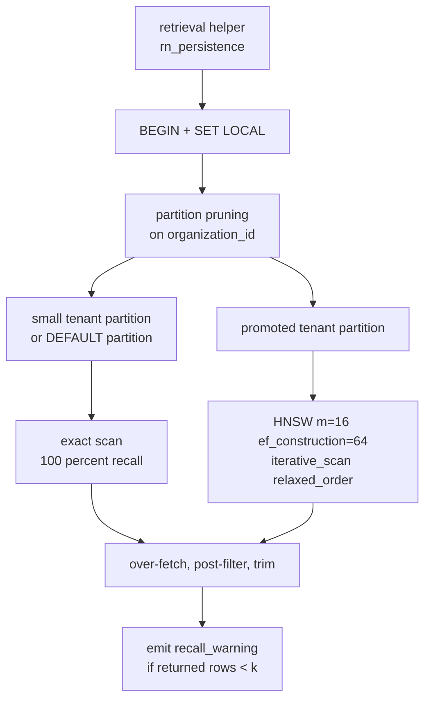

# ADR-006: Postgres + pgvector with tiered indexing, halfvec(1536), and LIST partitioning by tenant

> **SUPERSEDED IN PART — read this first.**
> The **Decision** of this ADR (`halfvec(1536)`, `PARTITION BY LIST (organization_id)`) is **superseded by [ADR-010](ADR-010-defer-vector-storage-layout.md)**, which defers both to the RAG architecture phase and records them as open decision **D-8**. The dimension was a provider default rather than a measured choice, and partitioning is unjustified at our actual tenant count.
>
> **What survives and is still authoritative:** everything in Context and the constraint analysis — in particular **HC-25** (filtered approximate search post-filters and silently under-returns), **HC-24** (HNSW dimension caps), **HC-26** (transaction-mode pooling forbids session-level `SET`), the single-retrieval-helper requirement, and the argument against partial-index-per-tenant. Those constrain whatever layout D-8 selects.
>
> Also still authoritative: **vectors live in the same Postgres as everything else** (the "where the vectors live" decision), and **RLS is defence in depth, not the isolation mechanism**.

- Status: **Decision superseded by [ADR-010](ADR-010-defer-vector-storage-layout.md); constraint analysis remains valid**
- Date: 2026-07-28
- Deciders: Platform architecture
- Supersedes / Superseded by: none

> **Scope:** where embeddings live, how they are indexed per tenant, and what the embedding dimension commits us to.
> **Companions:** [../DATA_MODEL.md](../DATA_MODEL.md) §6–§7 (the schema and the retrieval helper) · [../ARCHITECTURE.md](../ARCHITECTURE.md) §9 (multi-tenancy) · [../research/PROVIDER_CONSTRAINTS.md](../research/PROVIDER_CONSTRAINTS.md) (HC-24, HC-25, HC-26, HC-27, L-8, anti-fact 24) · [../SECURITY.md](../SECURITY.md) (tenant isolation as a security boundary).

---

## Context

Agents answer *"what do you do?"* from a tenant's knowledge base and *"what does it cost today?"* from an authoritative tool (PRD §6.5). The knowledge half is retrieval: chunk, embed, index, search — always scoped to one organization, on a platform designed for fifty organizations with wildly different corpus sizes, where the largest tenant on day one has zero documents.

Four verified facts shape everything below.

**HC-25 — filtered approximate search post-filters and silently under-returns.** pgvector's own documentation: *"With approximate indexes, filtering is applied after the index is scanned… if a condition matches 10% of rows, with default `hnsw.ef_search` of 40, only 4 rows will match on average."*

This is the single most important fact in this ADR, because of how it fails. `WHERE organization_id = $1 ORDER BY embedding <=> $2 LIMIT 8` does not error. It returns one row. The call proceeds, the agent answers from a fragment of its knowledge base, the caller gets a worse answer, and the ticket that eventually arrives says **"the agent forgot our knowledge base"** — non-deterministically, on some calls, for some tenants, and worse the smaller a tenant's share of the table. There is no exception to catch and no log line to grep. It is a correctness bug wearing a quality-complaint costume.

**HC-24 — HNSW dimension caps: `vector` ≤ 2000 dims, `halfvec` ≤ 4000 dims.** `text-embedding-3-large` at its native 3072 dimensions **cannot be indexed as `vector`** at all.

**HC-26 — Neon's PgBouncer runs `pool_mode=transaction`**: session-level `SET`, advisory locks, LISTEN/NOTIFY and temp tables are unsupported. Every pgvector GUC we need to tune has to be `SET LOCAL` inside an explicit transaction.

**HC-27 / PRD D-1 — Neon has no India region and a project's region is immutable after creation.** Every option below assumes Postgres; *which* Postgres is gated on the data-residency ruling and is not this ADR's decision.

**L-8 — no official per-language benchmark exists for OpenAI embeddings on Indic languages.** For an India-first product this is first-class retrieval risk, and it interacts badly with the irreversibility described later.

---

## Options considered — where the vectors live

| Option | Real appeal | Why it lost |
|---|---|---|
| **Dedicated vector database** | Purpose-built ANN, native per-namespace isolation that sidesteps HC-25 entirely, operationally proven at scales we will not reach for years | Adds a **second stateful system with its own tenancy model, its own backup story, its own residency posture and its own failure mode**, holding data that must stay consistent with Postgres rows it cannot transact with. Chunk text, document status and knowledge-base bindings live in Postgres; a delete would have to be dual-written to two systems with no transaction across them — the exact dual-write problem [ADR-008](ADR-008-transactional-outbox-for-call-events.md) exists to eliminate. And under PRD D-1, a second vendor means a second residency review. |
| **pgvector in the same Postgres** *(chosen)* | One transaction covers "document deleted" and "its chunks are gone". One backup, one residency posture, one connection pool, one thing to operate. Joins against `documents.status` are free, which is what stops a mid-reindex document leaking half-old, half-new context | HC-25 is now our problem to solve in schema design. Vector search competes with OLTP for the same buffers and the same compute. |
| **pgvector in a separate Postgres** | Isolates vector workload from call-path OLTP without a new technology | Keeps every downside of separation — cross-database consistency, two migrations, two pools — and gives up the transactional integrity that was the reason to pick Postgres in the first place. If read isolation is the goal, a **read replica** achieves it without splitting the write path. |

We are not doing ANN at a scale where a dedicated engine's advantages materialise. We *are* doing multi-tenant correctness and deletion semantics on day one.

## Options considered — how to index per tenant

| Option | Verdict |
|---|---|
| **One shared HNSW index + `WHERE organization_id = $1`** | **Rejected: this is HC-25 in its purest form.** It is also the option every engineer writes first, which is precisely why the schema must make it impossible rather than merely discouraged. |
| **Partial HNSW index per tenant** | **Rejected.** pgvector recommends partial indexes for a *few* distinct filter values and partitioning for *many*; anti-fact 24 explicitly flags "partial-index-per-tenant scales" as unconfirmed. Concretely: each partial HNSW is a full independent graph with its own build cost and resident memory, so N tenants means N graphs competing for shared buffers; the planner evaluates every candidate index on every query against the table, adding planning time to reads *and* inserts; tenant onboarding becomes `CREATE INDEX` on a live table with no transactional rollback story; and `pg_class`/`pg_index` bloat is felt by everything, not just this table. Unbounded catalogue growth keyed to signups is not a design. |
| **Exact scan for small tenants** | **Accepted — as tier one, not as the whole answer.** With no ANN index, there is no post-filter and recall is 100% by construction. PROVIDER_CONSTRAINTS records ~36 ms for an exact scan at 10k chunks [C]. It simply does not survive a tenant with a large corpus. |
| **`PARTITION BY LIST (organization_id)`** *(chosen)* | Each tenant's data is a physically separate relation, so the tenant predicate is satisfied by **partition pruning before any index is consulted** — the post-filter problem does not arise, rather than being tuned around. It also lets index strategy differ per tenant, which is the whole point. |

LIST, not HASH: hashing would spread every tenant across every partition and make per-tenant index strategy impossible.

---

## Decision

**Embeddings live in the same Postgres as everything else, in a `document_chunks` table typed `halfvec(1536)`, partitioned `BY LIST (organization_id)`, with a tiered index strategy and exactly one retrieval helper in `rn_persistence` allowed to issue a `<=>` query.**

| Tier | Corpus | Index | Recall |
|---|---|---|---|
| **Small** — the default, and every tenant on day one | ≲ 10k chunks | none; exact scan inside the tenant's partition, B-tree on `(organization_id, knowledge_base_id)` | exact |
| **Large** | ≳ 10k chunks | HNSW `m=16, ef_construction=64` on that tenant's partition, with `SET LOCAL hnsw.iterative_scan='relaxed_order'` and `hnsw.ef_search` raised well above the 40 default | approximate, tuned |

The 10k threshold is a **starting default, not a measurement**. Promotion from small to large is an operational job, never a code path. A `DEFAULT` partition holds the long tail; a tenant gets its own partition only on promotion, which bounds partition count to hundreds — a number the planner tolerates — rather than tracking signups.

**Why `halfvec(1536)`.** The model is `text-embedding-3-small` at `dimensions=1536`, where both `vector` and `halfvec` are indexable, so HC-24 does not force the type at this dimension. It is chosen for storage and build cost: Neon's published benchmark reports halfvec at ~50% storage and ~23% faster index builds with equivalent recall and latency [C]. The 4000-dim headroom is the secondary benefit — if the bake-off below picks a larger model, `halfvec` is at least *capable* of indexing it where `vector` is not.

**RLS is defence in depth, not the mechanism.** Postgres row-level security predicates post-filter exactly like any other filter — RLS does not rescue ANN recall. It sits on top of application authorization and partition pruning, never instead of them.

---

## The dimension is baked into the column type. Treat this as close to irreversible.

`halfvec(1536)` is a typmod, not a hint. Changing the embedding model to anything with different dimensionality is **not** an `ALTER COLUMN`:

1. Re-embed **every chunk of every tenant** through a paid API. Cost scales with total corpus size, not with the size of the change.
2. A full table rewrite — and on a partitioned table, once per partition.
3. A full HNSW rebuild per promoted partition: hours of `maintenance_work_mem`-bound work.
4. A dual-read window during which retrieval quality is inconsistent between migrated and unmigrated tenants — meaning agent answer quality visibly differs by tenant, mid-migration.

The only sane execution is **additive**: add `embedding_v2 halfvec(N)` or a `document_chunks_v2` table, backfill tenant by tenant, have the retrieval helper select the column by the row's `embedding_model`, then drop the old column in a much later release. This is why `embedding_model` and `dims` are stored **per row** — twenty bytes that convert an all-or-nothing migration into an incremental one. Design that path now; do not discover it under deadline.

> **DECISION REQUIRED (PROVIDER_CONSTRAINTS L-8, tracked as DR-1 in [../DATA_MODEL.md](../DATA_MODEL.md)).** No official per-language benchmark exists for OpenAI embeddings on Indic languages, and anti-fact 17 invalidates the commonly-cited shortened-`3-large` comparison. **Run the bake-off on real Hindi, Telugu and code-mixed content before the first tenant ingests at production scale.** After that point the change is measured in API spend and downtime rather than in a config edit. Until then, 1536 is our decision, not a validated result.

---

## Consequences

**Positive**

- The default configuration is the *correct* one. A new tenant gets exact search with 100% recall and no ANN tuning, and stays there until someone deliberately promotes them.
- Deleting a tenant's knowledge is `DROP TABLE` on a partition: instant, no vacuum debt, no bloat, and a clean answer to a DPDP erasure request.
- One backup, one restore, one residency posture, one connection pool. Deleting a document and its chunks is one transaction.
- HC-25 is structurally avoided rather than tuned around. Correct behaviour does not depend on remembering to raise `ef_search`.

**Negative — accepted knowingly**

- **Partitioning cannot be usefully retrofitted.** You can attach an existing table as a partition, but every existing row stays in it — you get the structure without the benefit until you physically move every row of every tenant. We are paying the complexity now specifically to refuse that migration later.
- **Promotion is an operational procedure we have to build**: detect the threshold, create the partition, move the rows, build the index, all without breaking live retrieval.
- **`SET LOCAL` through the pooler is only partly verified.** It is confirmed for `hnsw.ef_search`; it is **unverified for `hnsw.iterative_scan`, `max_scan_tuples` and `scan_mem_multiplier`** (§6a-35). Must be tested against the `-pooler` DSN before it is relied on.
- **Vector search shares compute with OLTP.** The mitigation is routing retrieval to a read replica — but replicas are explicitly asynchronous and eventually consistent (anti-fact 23), so the UI says *"indexing"*, never *"ready"*, after an upload.
- **Retrieval is not on the audio path and never will be.** A vector search is forbidden inside the voice gateway ([../ARCHITECTURE.md](../ARCHITECTURE.md) §4.3); it happens in a tool call dispatched off the audio path.

**What this forces us to do**

1. **Exactly one function in `rn_persistence` may issue a `<=>` query.** It opens its own transaction, issues `SET LOCAL`, over-fetches (`LIMIT k * 2`) and trims after post-filtering, and joins `documents.status = 'active'`. Nothing else does vector search — that is a review rule with no exceptions.
2. **The helper emits a `recall_warning` metric whenever it returns fewer than `k` rows.** This is the *only* observable symptom of HC-25, and without it the bug is invisible until a customer complains.
3. Store `embedding_model` and dimensionality per row, from the very first migration.
4. Keep chunk `content` in the row, never only in object storage — re-embedding must never require re-parsing and re-chunking, which would change chunk boundaries and therefore change results.
5. Two DSNs: pooled for app traffic, direct for migrations, index builds and advisory locks (HC-26).
6. An adversarial cross-tenant retrieval test, including prompt-injection attempts, is a release gate (PRD §13).

---

## Revisit when

1. **The Indic-language embedding bake-off (DR-1) returns a model that beats `text-embedding-3-small` by a margin that justifies a full re-embed.** This must happen *before* the first production-scale ingestion. After that, the trigger is not "a better model exists" — it is "a better model exists **and** measured answer quality on real Indian call transcripts is materially worse with the current one".
2. **Partition count approaches four figures.** Hundreds of partitions is fine; thousands degrades planning time and catalogue size. That is the signal to raise the promotion threshold, add hash sub-partitioning under the largest tenants, or reconsider the store.
3. **A single tenant's corpus outgrows what one Postgres instance can hold in RAM for its HNSW graph**, and read-replica routing plus compute sizing stops being economic (§6a-37: always-on compute TCO for a RAM-resident graph is currently unquantified). That is the first honest case for a dedicated vector database.
4. **PRD D-1 rules that data must be India-resident.** Neon is disqualified (HC-27) and the OLTP+vector tier moves to `ap-south-1`. The pgvector decision survives that move; the *provider* decision does not.
5. **pgvector changes the post-filter semantics** such that a shared HNSW index with a tenant predicate returns correct results at bounded cost. That would make partitioning an optimisation rather than a correctness requirement, and the tiering could be simplified. Verify against release notes, not blog posts.
