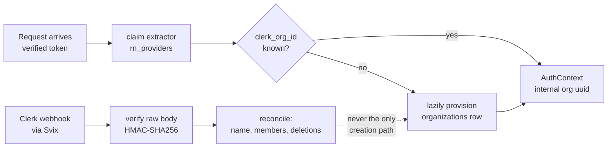

# ADR-007: Clerk for identity, behind an IdentityProvider seam, with our own tenant primary key

- Status: Accepted
- Date: 2026-07-28
- Deciders: Platform architecture
- Supersedes / Superseded by: none

> **Scope:** who the actor is, which organization they are acting for, and what they are permitted to do.
> **Companions:** [../SECURITY.md](../SECURITY.md) (the authorization model in full) · [../ARCHITECTURE.md](../ARCHITECTURE.md) §9 (multi-tenancy) · [../DATA_MODEL.md](../DATA_MODEL.md) (tenant scoping columns) · [../research/PROVIDER_CONSTRAINTS.md](../research/PROVIDER_CONSTRAINTS.md) (HC-29 to HC-33, L-7, anti-facts 12–14) · [../../PRD.md](../../PRD.md) §12 (open decision D-7).

---

## Context

The platform has three human roles — `SUPER_ADMIN`, `CLIENT_ADMIN`, `CLIENT_USER` (PRD §3) — across many organizations, with B2B expectations: invite a colleague, manage a team, eventually auto-join by verified email domain. Tenant isolation is a **security boundary, not a filter** (PRD §7), which means the acting organization must be derived from a verified token and never from a request body or a frontend-supplied value.

Building that from scratch is weeks of work in the most consequence-heavy part of any product. So the real question was never "auth or no auth" — it was *which vendor, and how deeply are we allowed to marry it.*

Five verified facts set the shape of the answer:

- **HC-30** — *"System Permissions aren't included in session claims. If you need to check Permissions on the server-side, you must create Custom Permissions."* Clerk's nine built-in system permissions **never reach FastAPI.** Any backend authorization built on them would silently check nothing.
- **HC-29** — the org claim shape **differs between token versions**. v1 is flat (`org_id`, `org_role`, `org_permissions`) with roles carrying an `org:` prefix; v2 nests everything under a single `o` claim (`o.id`, `o.slg`, `o.rol`, `o.per`) with roles **not** prefixed. And the vendor's own Python SDK — `RequestState.to_auth()` — reads the flat names in its v2 branch, returning `None`. Anti-fact 12 records that the two sources are in direct tension and unresolved.
- **HC-33** — Clerk webhooks are **eventually consistent** and *"deliveries are not guaranteed."*
- **HC-31 / L-7 / PRD D-7** — maximum **10 custom organization roles** per instance without the $100/mo Enhanced B2B add-on, and custom claims must stay under roughly 1.2 KB (cookie limit).
- **HC-32** — Svix webhook signatures are HMAC-SHA256 over `{svix-id}.{svix-timestamp}.{raw_body}`.

HC-29 deserves its own sentence, because it is not a papercut. **Reading the wrong claim name, or comparing `"org:admin"` against `"admin"`, is an authorization-bypass class bug.** Whether it fails open or closed depends entirely on how the comparison happens to be written, and both directions exist in real codebases. A vendor helper that returns `None` for org context is the worst possible failure shape: a `None` organization is either a crash or, in a carelessly written guard, a permission check that never runs.

---

## Options considered

| Option | Real appeal | Why it lost |
|---|---|---|
| **Build authentication ourselves** | Total control, no vendor claim shapes to reverse-engineer, no per-MRO pricing, no third-party holding user PII — which under PRD D-1 is not nothing | Password storage, session management, MFA, SSO, email deliverability, invitation flows, org membership, account recovery, and the security response when any of it breaks. This is a product in itself, and it is not our product. We would ship it late and worse. |
| **Clerk called directly in route handlers** | Fastest path. The SDK is designed to be used this way and the tutorials all do | Two disqualifying problems. First, it violates the standing rule that **business logic never lives in a route handler** and that vendor SDKs stay inside `rn_providers` — a rule the import-linter enforces by naming `clerk_backend_api` explicitly. Second, and worse: **HC-29 means claim extraction is subtle, and calling it directly means writing that subtlety once per route.** Get it right in nineteen handlers and wrong in the twentieth and you have a bypass. Correctness here demands exactly one implementation. |
| **Clerk behind an `IdentityProvider` seam** *(chosen)* | One place that knows about Clerk. Routes and services deal in an internal `AuthContext`. Authorization becomes testable without a vendor, and a vendor migration touches one package | An extra layer, and a mapping to maintain between Clerk's model and ours. Cheap. |
| **Another identity vendor** | Several are credible, some with clearer India data-residency stories | Every managed vendor has *some* claim-shape quirk, some role-count tier and some webhook-consistency caveat; switching vendors does not remove this class of problem, it renames it. Clerk's organization model maps directly onto our tenancy, which is the feature we actually need. **The seam is what makes this decision cheap to revisit** — and that is deliberate, because Clerk's India/APAC residency posture for user PII is an open question (§6a-32). |

---

## Decision

**Clerk is the identity provider, reached only through an `IdentityProvider` interface in `rn_providers`. Nothing above that layer imports `clerk_backend_api`. The tenant primary key is our own UUID; `clerk_org_id` is a unique column.**

### One authentication dependency, one internal type

A single FastAPI dependency verifies the request and returns an internal dataclass:

```python
@dataclass(frozen=True)
class AuthContext:
    user_id: UUID
    organization_id: UUID  # OUR uuid, resolved from clerk_org_id
    clerk_org_id: str
    ...  # role, permissions, acting_as_organization_id
```

Everything downstream — routes, `rn_services`, the policy layer — deals in `AuthContext` and nothing else. That is what makes authorization testable without Clerk in the loop, and what makes replacing Clerk a change to one package rather than an archaeology project.

Verification uses `authenticate_request(..., jwt_key=CLERK_JWT_KEY, authorized_parties=[...], accepts_token=['session_token'])`. **`jwt_key` is not optional for us**: without it, every single request costs a JWKS round-trip from India to `api.clerk.com`, which is latency we pay on the control plane for no benefit.

### Our own claim extractor. Never `to_auth()`.

Because of HC-29, org context is extracted by **our** code in `rn_providers`, handling both the flat v1 shape and the nested v2 `o` shape, and normalising the `org:` role prefix in exactly one place. Rules:

- `to_auth()` is not used for organization context. Ever. Its v2 branch reads the wrong names (HC-29).
- Prefix normalisation happens once, at extraction, before any comparison. No code above the seam ever sees a raw claim string.
- A token that yields **no resolvable organization is a rejection, not a `None` organization.** There is no code path in which an unset `organization_id` reaches a query.
- Anti-fact 12 is unresolved — whether v2 tokens also emit flat aliases is in tension between the docs and the SDK. **Resolve it empirically** by decoding a real token from our instance (§6a-26). Until then the extractor treats `o` as authoritative and tolerates flat as a fallback.
- Adversarial unit tests cover both shapes, both prefix states, missing claims and empty-string claims. This is the highest-value test file in the auth layer.

### Custom permissions, because system permissions do not exist server-side

HC-30 forces it: all backend authorization is built on **custom** permissions in an `org:<feature>:<action>` shape — `org:campaigns:create`, `org:contacts:export`, `org:calls:read_transcript`, `org:agents:publish`, `org:team:manage`, `org:audit:read`. Clerk's built-in nine are a dashboard-UI concept and are irrelevant to us.

Authorization is a **policy layer in `rn_services`**, not `if` statements in route handlers. Routes ask *"may this actor do this to this resource?"* and receive a yes or no. This also keeps the model portable across an identity-provider change — the same argument that makes `clerk_org_id` a column and not a primary key.

The role catalogue is fixed at **≤ 10** (HC-31). Per-tenant custom roles, if we ever need them, live in our own database, not in Clerk. Claims stay small: **no tenant configuration, phone numbers or agent lists in a token** — the ~1.2 KB ceiling is real, and a token is not a cache.

### A webhook may never be the only path that creates a tenant

HC-33 is explicit: deliveries are eventually consistent and not guaranteed. So the provisioning model is inverted from the tutorial version:



- **Lazy provisioning on first sight of an unknown `clerk_org_id`** in the auth dependency is the primary creation path. It is idempotent and races safely on a unique constraint.
- **The webhook is a reconciler** — it updates names, memberships and deletion state. It is never load-bearing for existence.
- Svix verification reads `await request.body()` **before any JSON parsing** (HC-32). Re-serializing the payload changes the bytes and breaks the signature. This is a specific, easy, silent mistake.
- Webhook handling is idempotent on the event id and lands in `webhook_events`, because Svix retries and Clerk's retry schedule is not documented to us (§6a-28).

### The tenant primary key is ours

`organizations.id` is an internal UUID. `organizations.clerk_org_id` is a **unique, nullable-in-principle column**. Clerk's `org_id` is never a foreign key target anywhere in the schema.

This is not tidiness. The things keyed to a tenant have lifetimes that are longer than, and independent of, an auth vendor's records:

- **Telephony entities** — ExoPhone assignments, Exotel subaccount mappings, caller-ID configuration. Provisioned commercially; they cannot be re-keyed because someone deleted an org in a dashboard.
- **Call records, recordings, and consent evidence** — CDRs are retained for regulatory and dispute purposes (PRD D-3, D-5), and Exotel contractually requires producing opt-in proof within 24 hours (HC-14). A retained artifact whose tenant key vanished is an unanswerable compliance request.
- **Billing and usage ledgers** — usage is metered from day one (PRD §7). A ledger cannot be keyed to a mutable external identifier.
- **Vector partitions** — `document_chunks` is partitioned by our `organization_id` ([ADR-006](ADR-006-pgvector-tenant-isolation-and-embeddings.md)). Re-keying that is a table rewrite per tenant.

An auth migration should be an afternoon of writing a new adapter and backfilling one column. If Clerk's `org_id` were the primary key, it would instead be a rewrite of every tenant-scoped table in the system — which is to say, it would never happen, and we would be married to the vendor by schema. Clerk's own guidance for *users* is to store the Clerk id as a column; the organization-level version of that argument is ours [A], and it is stronger, because organizations own regulated artifacts and users do not.

---

## Consequences

**Positive**

- Authorization is testable without a network, a vendor account or a token fixture: construct an `AuthContext`, call the policy layer, assert.
- The HC-29 bypass class exists in exactly one file, with adversarial tests pointed at it.
- Replacing Clerk means writing a second `IdentityProvider` implementation and backfilling one column. It does not mean touching business logic.
- Tenant-owned data survives an org deletion, a plan downgrade, or a vendor migration.

**Negative — accepted knowingly**

- **A mapping layer to maintain.** Clerk's role and permission model must stay in sync with our catalogue, and dashboard-vs-code drift is possible. Mitigation: permission strings live in code as constants and are asserted in tests, never typed into a dashboard from memory.
- **The 10-role ceiling is a real product constraint** (HC-31). Exceeding it, or wanting verified-domain auto-join for enterprise Indian customers with `@company.in` domains, costs the $100/mo Enhanced B2B add-on plus MRO overage above 100 — **PRD D-7, unresolved.** Design the role catalogue as if the answer is "no add-on".
- **Vendor residency for user PII is unverified** (§6a-32) and must be raised in the PRD D-1 review. **Session token lifetime is also unknown** — a dashboard setting with no stated default, and the widely-cited 60 seconds is unconfirmed (anti-fact 13). Do not build refresh assumptions on it.
- **The Python SDK has no `has()` helper** like the JS SDK (anti-fact 14). Permission checking is ours to implement — which is what the policy layer is.

**What this forces us to do**

1. Decode a real token from our own instance and pin the exact claim set **before** the extractor is written (§6a-26). This is a task, not a hope. Likewise, read the Dashboard Event Catalog and pin the exact webhook subscription list — Clerk deliberately does not publish it (§6a-27).
2. Keep the role catalogue at ≤ 10 and the token under ~1.2 KB, by review.
3. Treat `super_admin` acting on behalf of a tenant as an **explicit, audited impersonation action** producing an `AuthContext` with `acting_as_organization_id` set — never as a request parameter.
4. Ship the auth dependency, the extractor and the policy layer together. Half of this pattern is worse than none of it.

---

## Revisit when

1. **PRD D-7 is answered "no add-on" and the role catalogue is full.** Ten roles is a hard ceiling; hitting it means either paying, or moving per-tenant roles into our own database — a design change with claim-size and caching consequences, not a config edit.
2. **PRD D-1 rules that user PII must be India-resident** and Clerk cannot demonstrate an Indian or acceptable APAC processing region. Then the seam earns its cost and we write a second `IdentityProvider`.
3. **Empirical token decoding contradicts HC-29** — for example, v2 tokens do emit flat aliases after all. The extractor simplifies, but only after the evidence is recorded in PROVIDER_CONSTRAINTS, never on the strength of a blog post.
4. **We need machine identity at scale.** Clerk M2M tokens cost $0.001 per creation and are **not revocable**; a busy campaign minting one per call is a cost and a security problem. East-west traffic inside the VPC uses a shared secret or mTLS instead. Revisit if the boundary set grows.
5. **Clerk's pricing, MRO model or organization semantics change materially** at renewal. The migration cost is bounded by design — that is the point of the seam — so this becomes an ordinary commercial decision rather than an architectural crisis.
