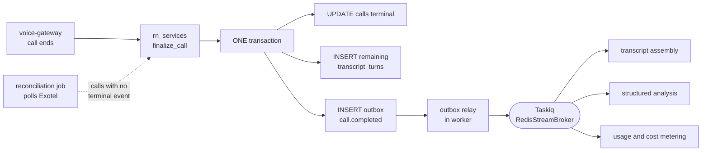

# ADR-008: Transactional outbox instead of dual-writing to Postgres and the broker

- Status: Accepted
- Date: 2026-07-28
- Deciders: Platform architecture
- Supersedes / Superseded by: none

> **Scope:** how a call-state change becomes a published domain event without a dual write.
> **Companions:** [../ARCHITECTURE.md](../ARCHITECTURE.md) §6.4 · [../DATA_MODEL.md](../DATA_MODEL.md) §8 (the `outbox` table and `finalize_call()`) · [ADR-005-taskiq-job-system.md](ADR-005-taskiq-job-system.md) (what the relay publishes into) · [../research/PROVIDER_CONSTRAINTS.md](../research/PROVIDER_CONSTRAINTS.md) (HC-10, HC-11, HC-15).

---

## Context

When a call ends, two things must happen: the `calls` row reaches a terminal state, and the rest of the platform must find out — transcript assembly, structured post-call analysis, usage and cost metering, lead qualification, campaign counters, follow-up actions, CRM webhooks (PRD §6.7, ARCHITECTURE §6.3).

The obvious implementation is two writes: `UPDATE calls ...` then `publish("call.completed")`. **There is no ordering of those two writes that is correct**, because they are not in the same transaction:

- Commit first, publish second → a crash in between leaves a completed call with **no analysis, no metering, no follow-up, forever.** Nothing retries, because nothing knows.
- Publish first, commit second → a rollback leaves an event claiming a call completed that did not. Consumers act on a lie.
- Publish inside the transaction → the publish is not transactional, so a rollback cannot unsend it, and now the failure mode is both.

For most systems this is a theoretical problem that bites occasionally. Here it is a routine one, because the writer is the **voice gateway** — the one component that is killed by deployments, autoscaling events and provider disconnects while holding live state, and the one component whose graceful shutdown can take up to 60 minutes (HC-5, HC-6). Crashes at exactly the wrong moment are not an edge case; they are Tuesday.

Two more verified facts shape the design:

- **HC-10** — Exotel does **not sign** StatusCallback webhooks. No HMAC, no signature header, anywhere in the documentation. Webhook authenticity is weak by construction: HTTPS plus a high-entropy secret path segment plus an IP allowlist whose ranges are unpublished and support-only.
- **HC-11** — Exotel explicitly states StatusCallback delivery **may be delayed or fail, with no documented retry**, and advises polling Call Details as a fallback. **HC-15** adds that only two event types exist (`terminal` and `answered`) — there is no ringing or progress event to fall back on.

So the external world will not reliably tell us a call ended. Our own internal event pipeline had better be reliable, because it is the only half we control.

---

## Options considered

| Option | Real appeal | Why it lost |
|---|---|---|
| **Publish directly from the voice gateway** | Simplest. The gateway knows the call ended; it tells the broker | Requires a broker client **inside the media plane**, which is the one place with a hard latency budget. A broker connection means reconnect logic, backpressure and blocking-on-publish risk on a process that must not stall. It also leaves the dual write fully intact — the gateway would still have to write call state somewhere. This is the option the import-linter contract *"Job broker is owned by rn_api and rn_worker only"* exists to make impossible. |
| **Write to the database, then publish best-effort** | Honest about the ordering, cheap to build, and "we'll add a sweeper later" is a plausible sentence | The sweeper *is* the outbox, built worse and later. Without a durable record of intent-to-publish, a sweeper has to infer missing events by scanning `calls` for rows in a terminal state that no consumer has processed — which means every consumer needs a completion marker anyway, and now the reconstruction logic is spread across five consumers instead of one table. Best-effort publish silently drops the events that matter most: the ones lost during the incident. |
| **Transactional outbox with a relay in the worker** *(chosen)* | The state change and the intent-to-publish commit **atomically**. Either both happened or neither did. The gateway needs no broker at all | Adds a table, a poller, publish latency, and at-least-once semantics that every consumer must handle. All accepted below. |
| **Change data capture** | Zero application code in the write path; the WAL is already the perfect ordered log of what committed | Logical replication is a **second piece of stateful infrastructure** with its own slot management, its own lag failure mode, and a slot that — if a consumer stalls — retains WAL until the primary runs out of disk. It also couples our event contract to our physical schema: a column rename becomes a consumer-breaking change. And it publishes *row changes*, not *domain events*; `call.completed` carries a payload shaped for consumers, not a `calls` row diff. Revisit at much higher volume or if we need cross-system replication for other reasons. |

---

## Decision

**`finalize_call()` writes the terminal call state and one `outbox` row in a single transaction. A relay running in the worker claims unpublished rows, publishes them to Taskiq, and stamps them published. The voice gateway constructs no broker client and opens no database session of its own — enforced by import contract, not by packaging (see below).**

The table is in [../DATA_MODEL.md](../DATA_MODEL.md) §8. The properties that matter here: the backlog index is the **partial index `(created_at, id) WHERE published_at IS NULL`**, so the relay's hot query touches only the backlog and reads it in order straight off the index; `attempt_count` and `last_error` make a poison row diagnosable instead of silently stuck.

**Amended in Phase 1: ordering is on `(created_at, id)`, not on `id` alone.**

The original decision here was `ORDER BY id`, on the reasoning that `uuidv7` carries a timestamp in its high bits and therefore gives time ordering for free. That reasoning is correct about the id and wrong about where correctness should rest: it makes the relay's behaviour depend on a property of the id *generator* rather than on a fact the row records. Swap the generator, replay an id produced elsewhere, or accept an id supplied by an importer, and the ordering silently changes meaning.

So the temporal key is the explicit `created_at` column, and `id` follows it purely as a deterministic tiebreak — which restores the uniqueness and totality that made `ORDER BY id` attractive, without borrowing time from an identifier. The objection that a wall-clock column "does not advance monotonically across concurrent transactions" is real but does not bite: delivery is at-least-once with **no global ordering guarantee** in any case (see `SKIP LOCKED` below), so near-simultaneous rows being claimed in either order is already within contract.

The relay claims with `SELECT ... WHERE published_at IS NULL ORDER BY created_at, id FOR UPDATE SKIP LOCKED LIMIT n`, publishes, then stamps `published_at`. `SKIP LOCKED` is what allows the relay to run in **every worker replica** without a leader lease — replicas take disjoint batches and never block each other. This is deliberately unlike the scheduler ([ADR-005](ADR-005-taskiq-job-system.md)), which *does* need a single leader, and the difference is worth internalising: the scheduler *creates* work from a clock, so duplicates are new phone calls; the relay *forwards* work that already exists, so duplicates are a redelivered message a consumer will deduplicate.

### This is what lets the voice gateway stay clean

The architectural payoff is larger than the correctness one. Because the only thing the gateway needs at end-of-call is "call `finalize_call()` in `rn_services`", it needs:

- **no broker client** — enforced by the import-linter contract *"Job broker is owned by rn_api and rn_worker only"*, which names `taskiq` and `taskiq_redis` as forbidden in `rn_voice`;
- **no database session** — enforced by *"Voice gateway holds no database session of its own"*, which forbids `sqlalchemy`, `asyncpg` and `alembic` in `rn_voice`.

Both contracts are executable (`uv run lint-imports`), not aspirational. Every alternative in the options table would have required relaxing one of them — that is not a side effect of the decision, it is a large part of the reason for it.

**Be precise about what this buys, because the tempting summary is false.** It is *not* true that the media plane's dependency surface is two WebSockets and a service call. `rn_voice` depends on `rn_services`, which depends on `rn_persistence`, so **SQLAlchemy, `asyncpg` and the Redis client are installed inside the voice-gateway image** — `uv sync --package rn-voice` resolves them, and the forbidden contracts run with `allow_indirect_imports = true` precisely because that chain is the intended one. What the contracts prevent is `rn_voice` **writing** those imports: the gateway opens no session, holds no engine, issues no query, and constructs no broker client of its own. The property is *excluded by import contract*, not *absent from the image*, and the distinction matters the moment someone reasons about image size, CVE surface, or "surely we can just do one quick query here".

What the contract does buy is the thing worth buying: no connection pool competing with the audio loop for the event loop, no ORM-flush latency inside a turn, no broker reconnect storm on a process holding live calls, and a single chokepoint (`rn_services`) where tenancy and authorization are applied. Those are runtime properties, and an import contract is a sound way to get them.

**The option we did not take.** We could have split a narrow, gateway-facing subset out of `rn_services` — a `rn_call_api`-shaped package exposing `finalize_call()` and its siblings over a thin interface, with the persistence-heavy remainder left behind — so that the gateway image genuinely stopped containing the ORM. We did not, because today it would buy an honest sentence and a smaller image while costing a real package boundary, a second place for call-lifecycle logic to live, and the risk of the two halves drifting. The trigger that would make us take it: the gateway needing an out-of-band security rebuild for a CVE in a dependency it never calls, **or** a measured event-loop or memory effect traceable to the persistence stack being resident, **or** the day the gateway is deployed somewhere with a materially different trust boundary from the API. Until one of those happens, the honest description is the one above — excluded by contract, present in the image.

### Delivery semantics, stated plainly

**At-least-once. Never exactly-once. There is no ordering guarantee across aggregates.**

- **At-least-once** because the relay can crash after `publish()` returns and before `UPDATE outbox SET published_at`. The row is then re-claimed and re-published. This is not a bug to be fixed; it is the correct trade. The alternative — stamp first, then publish — converts a duplicate into a **permanently lost event**, which is strictly worse.
- **Idempotent consumers are mandatory.** Every consumer keys on the outbox `id` (or on the aggregate's natural terminal state) and is safe to run twice. Concretely: post-call analysis upserts `call_analysis` on `call_id` rather than inserting; usage metering is keyed on `(call_id, meter)`; the follow-up dispatcher checks whether the action already exists before creating it. A consumer that is not idempotent is a bug, and it is the reviewer's job to notice.
- **Ordering is per-aggregate and best-effort, not guaranteed.** The relay reads in uuidv7 order, so events for one call are *published* in the order they were written. But with multiple relay replicas taking disjoint batches, multiple Taskiq workers, and retries, nothing guarantees they are *processed* in that order. **We deliberately do not build a global ordering guarantee**, because it would require a single-threaded relay and per-aggregate serialised consumption — a large cost to buy a property our consumers do not need. Consumers must therefore be **commutative or state-checking**: they read the current row and decide, rather than assuming they are seeing the world's transitions in sequence. If a future consumer genuinely needs ordered delivery, that is a design conversation, not a configuration flag.

### Relay failure modes

| Failure | What happens | Mitigation |
|---|---|---|
| Relay crashes before publish | Row stays `published_at IS NULL`, another replica claims it | none needed — this is the design working |
| Relay crashes **after** publish, before stamp | Event is delivered twice | idempotent consumers |
| Broker unavailable | Rows accumulate unpublished; `attempts` climbs | **alert on backlog age, not backlog size.** A thousand rows published within a second is healthy; one row unpublished for five minutes is an incident |
| Poison row — payload a consumer can never accept | `attempts` climbs on the *consumer* side, not the relay's; the job dead-letters into `dead_letter_jobs` (ADR-005) | the outbox row is marked published; the failure is now visible in the DLQ where it can be replayed after a fix |
| Relay stops entirely, unnoticed | Silent loss of *all* post-call processing platform-wide | this is the worst case, and the reason **oldest-unpublished-row age is a paged alert** |
| Table growth | The outbox grows forever if never pruned | a scheduled job deletes published rows older than a retention window; the partial index means growth does not slow the hot query in the meantime |

### The reconciliation job is not optional, and it is a different problem

The outbox fixes **our** dual write. It does nothing about the fact that Exotel's status callbacks are unsigned (HC-10), may be delayed or dropped with no retry (HC-11), and offer only `terminal` and `answered` (HC-15). A call whose terminal callback never arrives has no `finalize_call()` to trigger, so there is no outbox row to relay.

Therefore a **reconciliation job is a required component**: it periodically finds `calls` rows that are live or queued past a plausible duration with no terminal event, polls Exotel's Call Details as the documentation advises, and drives them to a terminal state through the same `finalize_call()` path — producing the same outbox row, and therefore the same downstream processing. One completion path, two triggers.

Two rules follow. **All callback handling is idempotent on `CallSid`** — a redelivered or duplicated callback must be a no-op. And **a webhook alone never authorizes a state change with financial effect** (HC-10); the callback is evidence, the reconciliation poll is confirmation.

---

## Consequences

**Positive**

- A completed call **always** has a durable, retryable record of what must happen next. Not usually. Always.
- The voice gateway's *runtime* surface at end-of-call is two WebSockets and one service call, and two executable contracts keep it there. Its *dependency* surface is larger — `rn_services` brings SQLAlchemy, `asyncpg` and the Redis client into the image — but no session, engine or broker client is ever opened from `rn_voice`.
- The publish path is debuggable with `SELECT`. When a customer asks why a summary is missing, the answer is a query, not a distributed-tracing expedition.
- One code path (`finalize_call()`) serves the normal end-of-call, the reconciliation sweep, and any future manual repair.

**Negative — accepted knowingly**

- **Latency between commit and publish**, bounded by the relay's poll interval. Post-call work is a seconds-to-minutes workload (ARCHITECTURE §1), so this is free — but it means the outbox must never be used for anything with a sub-second requirement.
- **At-least-once forever.** Idempotency is now a permanent property every consumer must maintain, including ones written by people who have not read this ADR. Mitigated by making it a review checklist item and by testing consumers with deliberate double-delivery.
- **No global ordering.** Deliberate, documented above, and a genuine constraint on future consumer design.
- **Another table with retention and monitoring obligations.** Pruning is a job someone must remember to write.
- **The relay is a single point of silent failure** if nobody watches it. Backlog-age alerting is not a nice-to-have; without it this design's worst failure mode is invisible.

**What this forces us to do**

1. `finalize_call()` stays **deliberately tiny** — terminal `calls` update, un-flushed `transcript_turns`, one `outbox` row, nothing else. At the V1 target of 100 concurrent calls this transaction runs several times a second on the hottest table in the system; anything expensive inside it becomes lock contention that shows up as latency everywhere.
2. Every consumer of an outbox event is written idempotent and tested with a deliberately duplicated delivery.
3. Alerts on **oldest unpublished outbox row age** and on relay liveness, before the first production call.
4. An outbox pruning job, scheduled from day one rather than added after the table gets large.
5. The reconciliation job ships in the same phase as the outbox relay. Shipping one without the other leaves calls that end without anyone noticing.

---

## Revisit when

1. **Relay poll latency shows up in a product requirement** — for example a live dashboard that must reflect call completion within a second. The fix is a notify-style wake-up on insert, not a tighter poll loop; note that `LISTEN/NOTIFY` is unsupported through Neon's transaction-mode pooler (HC-26), so this needs a direct connection or a different mechanism.
2. **Outbox insert or relay throughput becomes a measurable bottleneck on the `calls` table.** That is the first honest argument for CDC — the WAL is already doing this work. Reopen with numbers, not with an architecture-blog link.
3. **A consumer appears that genuinely requires ordered delivery** across events for the same aggregate. Do not quietly add ordering; reopen this ADR, because the cost lands on the relay's concurrency model.
4. **We need to replicate events to a system outside this platform** — a data warehouse, a customer's event stream. At that point CDC or a real log broker earns its operational cost, and the outbox becomes one consumer among several.
5. **Exotel begins signing status callbacks or documenting a retry policy** (HC-10, HC-11). That does not remove the outbox — it is about our internal dual write — but it changes how defensively the reconciliation job must be tuned, and it should be recorded in PROVIDER_CONSTRAINTS the day it is confirmed.
