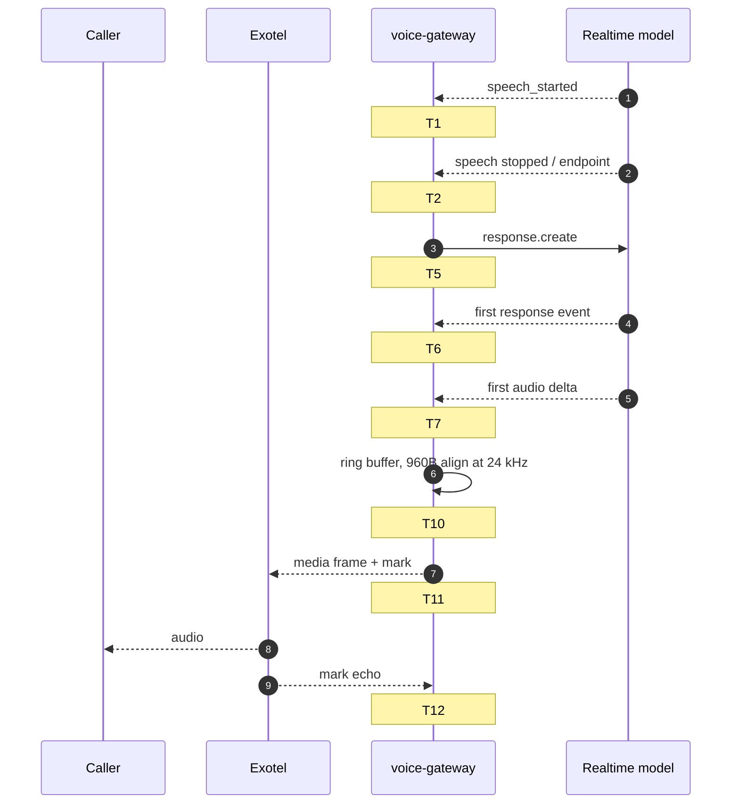
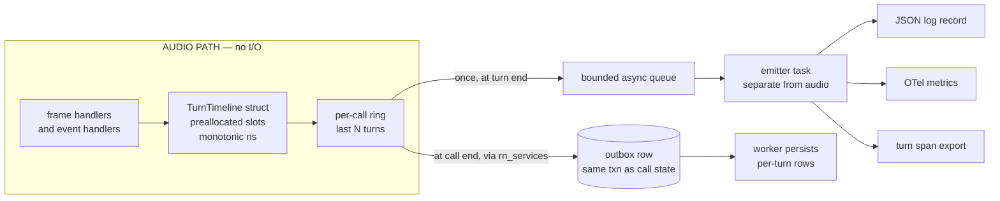
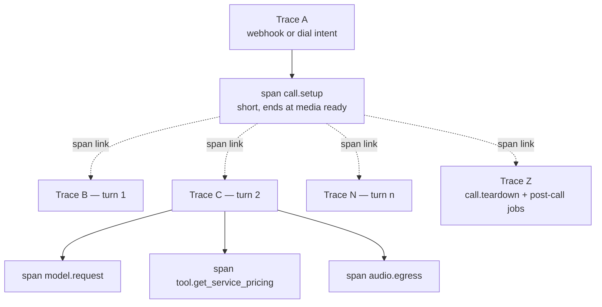

# Observability

> **Status:** Phase 0 — design only. Nothing here is implemented, and **nothing here has been measured.** Every number below is a TARGET or a BUDGET, never an observation.
> **Scope:** how we answer *"why did THIS turn in THIS call take 1.8 seconds?"* — and how we know the platform is healthy without staring at it.
> **Companions:** [ARCHITECTURE.md](ARCHITECTURE.md) (structure) · [REALTIME_VOICE.md](REALTIME_VOICE.md) (the audio path being instrumented) · [research/PROVIDER_CONSTRAINTS.md](research/PROVIDER_CONSTRAINTS.md) (what is verified) · [SECURITY.md](SECURITY.md) · [COMPLIANCE.md](COMPLIANCE.md) · [../PRD.md](../PRD.md) §7, §12.

---

## 1. The organising question

Every design choice in this document exists to make one question answerable in under two minutes, from a call ID, six months from now, by someone who did not write the code:

> **Why did turn 7 of call `c_01J…` take 1.8 seconds instead of the 1.5 s p95 target?**

A generic "we log stuff and have dashboards" setup cannot answer it. Answering it requires that, for every turn, we know *when the caller stopped speaking*, *when we asked the model to respond*, *when the first audio byte came back*, *when the first byte hit the telephony socket*, and *when the caller's phone actually played it* — with a clock we trust and an attribution we can defend.

The secondary requirement is cheaper: know that 100 concurrent calls are healthy without inspecting any of them.

There is a hard constraint on both. **The media plane may not do synchronous I/O** ([CLAUDE.md](../CLAUDE.md) rule 1). So observability in the voice gateway is *record cheaply in memory, emit once, off the critical path* — never *log as you go*.

---

## 2. Correlation identifiers

One vocabulary of IDs, set once, carried everywhere: log fields, span attributes, metric exemplars, outbox rows, job payloads, database columns. If a new subsystem invents its own name for one of these, that is a bug.

| Field | Type | Born | Lifetime | Why it exists |
|---|---|---|---|---|
| `request_id` | ULID | API edge middleware, per HTTP request | one request | Ties a dashboard action to its logs when there is no trace backend to hand. |
| `trace_id` / `span_id` | W3C trace context | first component to touch the work | one trace | The join key across processes. See §7. |
| `organization_id` | UUID (ours) | verified token, or dial-time context | forever | The tenancy axis of every query, metric label and access check. Never Clerk's `org_id` — that is a column, not a key. |
| `agent_id` | UUID | agent definition | forever | "Which agent is slow?" |
| `agent_version_id` | UUID | immutable version row | forever | "Did the prompt change on Tuesday break latency?" Without this, regressions are unattributable. |
| `call_id` | UUID (ours) | at dial intent / inbound `start` | forever | Our key. Distinct from the provider's `call_sid`. |
| `call_sid` | string | Exotel | forever | Foreign key for reconciliation and webhook idempotency (HC-11). |
| `campaign_id` | UUID | campaign | forever | Attribution of cost, outcome, and compliance rejections. |
| `session_id` | opaque string | dial time | one call | The single value we may pass through the Voicebot applet — max 3 params, ≤256 char query string (HC-12). Everything else is looked up server-side. |
| `provider` + `model_id` | enum + string | per provider call | per call/turn | Splits "we are slow" from "OpenAI is slow" from "Sarvam is slow". |
| `turn_id` | ULID, monotonic per call | when a caller utterance opens a turn | one turn | The unit of latency analysis. Sortable by construction so turn order survives out-of-order emission. |
| `tool_call_id` | provider-supplied | per tool invocation | one call | Joins a model request to our audit row. |

### Safe to log vs. never

**Safe (log, span-attribute, and — where cardinality allows, see §6.0 — metric-label):** every identifier in the table above. They are opaque, tenant-scoped, and meaningless to an attacker without database access.

**Never emitted to logs, spans or metrics:**

| Forbidden | Why | What to emit instead |
|---|---|---|
| Phone numbers (caller, ExoPhone, WhatsApp) | Direct PII, and the DPDP exposure that D-1 turns on | `contact_id`, plus `phone_country`/`phone_prefix_2` if a geography breakdown is genuinely needed |
| Transcript content — partial, final, caller or agent | Caller PII and business confidential; also the fastest way to leak a tenant's data into a third-party SaaS | `transcript_len_chars`, `language_detected`, `turn_id` — the text itself lives in Postgres behind tenant authorization |
| Tool arguments and tool results | `create_lead(name, phone, requirement)` is a PII payload with a function signature | `tool_name`, `arg_count`, `args_hash`, `outcome`, `latency_ms`. Full arguments go to the audited `tool_executions` table, not the log stream |
| Raw audio, base64 payloads, audio hashes tied to content | Volume, and it is speech | frame counts and byte counts only |
| Model instructions / system prompt | Tenant configuration; also enormous | `agent_version_id` |
| Secrets, bearer tokens, Exotel Basic auth, webhook path segments | The secret path segment is one of only three transport-level webhook defences (HC-10) | nothing |

The rule to internalise: **an identifier is a pointer; content is a liability.** Observability stores pointers. Postgres stores content, behind authorization.

---

## 3. Structured logging

### 3.1 Shape

JSON to stdout, one object per line, collected by the container runtime. No multi-line tracebacks as separate lines — exceptions are a single `exception` field.

Mandatory envelope on every record: `ts` (RFC 3339, UTC, always tz-aware), `level`, `logger`, `msg` (a *constant* string — never an f-string, so it is groupable), `service`, `version`, `env`, plus whatever of §2's identifiers are bound in the current context. Everything else goes in `ctx`.

Identifiers are bound with a context-local binder (`contextvars`), not passed as arguments. A FastAPI middleware binds `request_id`/`organization_id`; the voice gateway binds `call_id`/`organization_id`/`agent_version_id` once when the session opens; a Taskiq middleware binds the job's IDs from the message headers. **A call site that has to remember to pass `organization_id` will eventually forget.**

### 3.2 Levels, and when each is correct

| Level | Meaning | Examples | Rule |
|---|---|---|---|
| `DEBUG` | Developer-only detail, off in production | provider event names, state-machine transitions | Must be free when disabled — no string building, no serialization at the call site |
| `INFO` | A business fact worth reconstructing later | call started/answered/ended, campaign dispatched, tool executed, agent version loaded, session rollover | Should be a bounded, predictable rate. If a normal call produces more than ~30 INFO lines, the design is wrong |
| `WARNING` | Degraded but handled | provider retry, fallback to cascaded path, `played_ms` divergence beyond threshold, webhook arrived twice | Someone should read these weekly; none should page |
| `ERROR` | We failed something a user or caller would notice | call setup failed, tool raised, job exhausted retries into dead letter | Every ERROR must carry enough IDs to reproduce |
| `CRITICAL` | The platform, not one call | scheduler lost its leader lease, broker unreachable, database pool exhausted | Paging candidates |

Two anti-patterns worth naming because they will otherwise appear: `except Exception: logger.error(...)` swallowing a bug into a metric-shaped log line, and INFO-logging inside a loop that runs per audio frame.

### 3.3 Redaction is a pipeline stage, not discipline

Do not rely on every engineer remembering not to log a phone number. Put redaction in the processor chain, in `rn_core`, so it applies to every record from every service:

```
bind context → add timestamp → add service metadata →
  REDACT (key-name deny-list + value pattern scan + typed-wrapper unwrap refusal) →
  serialize JSON → non-blocking sink
```

Three layers, because each catches what the others miss:

1. **Key deny-list.** Any key matching `phone`, `msisdn`, `to`, `from`, `transcript`, `text`, `content`, `args`, `arguments`, `email`, `token`, `secret`, `authorization`, `payload` is replaced with `"[redacted]"`. Yes, this over-redacts; that is the correct direction to be wrong in.
2. **Value scan.** A regex for E.164-ish digit runs (`\+?\d{10,15}`) over string values, replaced with `"[redacted:phone]"`. Cheap, catches interpolation into a "safe" key.
3. **Typed wrappers.** `PhoneNumber`, `TranscriptText`, `ToolArguments` are domain value objects in `rn_domain` whose `__repr__`/`__str__` return `"[redacted]"`. Getting the real value requires an explicit `.reveal()` that is grep-able in review. This makes accidental leakage require a deliberate act.

**Test it, don't trust it.** A unit test constructs a record containing a phone number in five different shapes (key, nested key, list element, f-string interpolated into `msg`, inside an exception message) and asserts the serialized output contains none of them. That test is a security test and lives with the security suite.

### 3.4 The audio path does no synchronous log I/O

Non-negotiable. A blocking write to stdout is a syscall on the event loop that also drives two WebSockets and a resampler; under container-level log backpressure it can block for tens of milliseconds, which is milliseconds we do not have (ARCHITECTURE §1: ~20 ms of our own work per audio frame).

Mechanism: the voice gateway's logger writes to a **bounded** in-memory queue; a dedicated asyncio task (or `QueueListener` thread) drains it and does the serialization and the write. If the queue is full, the record is **dropped** and a `rn.telemetry.dropped` counter increments.

> Telemetry loss is an acceptable failure. Audio jitter is not. This trade is deliberate; the dropped-record counter exists so we notice when we are making it.

---

## 4. Realtime latency instrumentation

This is the section the document exists for.

### 4.1 Clock discipline

- All *durations* are computed from `time.monotonic_ns()`. Wall-clock is not monotonic, NTP steps happen, and a negative turn latency in a dashboard destroys trust in the whole system.
- All *timestamps that must correlate across processes* (call started, webhook received) use tz-aware UTC wall clock.
- Every `TurnTimeline` stores one wall-clock anchor plus monotonic offsets. Emit both.
- Exotel's inbound media frames carry a `media.timestamp` string [C]. Treat it as *provider-reported*, useful for detecting gaps and reordering, never as our clock — its epoch and precision are the provider's and are not documented for our purposes.

### 4.2 The timestamps we capture, per turn

Recorded into a per-call struct in process memory. Nothing here writes to a socket, a database, or a log at the moment of capture.

| # | Timestamp | Captured when | Source | Availability |
|---|---|---|---|---|
| T0 | `turn_opened` | previous assistant playback completed, or call answered for turn 1 | us | always |
| T1 | `caller_speech_start` | `input_audio_buffer.speech_started` from the model [C] | provider VAD | OpenAI path; cascaded path uses our own VAD |
| T2 | `caller_speech_end` | provider speech-stopped / endpoint commit | provider VAD | **name must be verified against the GA event set** — PROVIDER_CONSTRAINTS §6a-14 |
| T3 | `input_transcript_first_partial` | first interim input transcript | provider | **OpenAI only.** Sarvam STT emits no partials at all (HC-20) — this field is `null` on the cascaded path and analysis must not assume it |
| T4 | `input_transcript_final` | final input transcript for the utterance | provider | both paths |
| T5 | `response_requested` | we send `response.create`, **or** the moment the provider's own turn detection commits | us / provider | if we run `create_response:false` and own turn policy, T5 is ours and is the honest boundary between "their endpointing" and "our decision" |
| T6 | `model_first_event` | first event of the response arrives on the socket | us, at socket read | always |
| T7 | `model_first_audio_delta` | first `response.output_audio.delta` byte read [C] | us, at socket read | always |
| T8a/b | `tool_call_start` / `tool_call_end` | per tool dispatched to `rn_services` | us | 0..n per turn |
| T9 | `tool_result_submitted` | `function_call_output` written back | us | per tool |
| T10 | `first_frame_enqueued` | first rate-aligned chunk lands in the pacing ring buffer — 960-byte quantum at 24 kHz, 320-byte at 8 kHz (HC-2) | us | always |
| T11 | `first_frame_written` | first `{"event":"media"}` frame written to the Exotel socket | us | always — **this is our egress boundary** |
| T12 | `first_mark_echo` | Exotel echoes the mark for that chunk (HC-9) | provider | always; the only playback ground truth we get |
| T13 | `response_done` | `response.done` | provider | implement against `response.done`, not `response.function_call_arguments.done` — PROVIDER_CONSTRAINTS §6a-15 |
| T14 | `last_frame_written` | final aligned chunk written | us | always |
| T15 | `playback_complete_mark` | last mark echoed | provider | closes the turn; T0 of the next turn |
| I1..I4 | `interrupt_detected`, `clear_sent`, `buffer_flushed`, `truncate_sent` | the four steps of the barge-in operation (HC-7, HC-8) | mixed | only on interrupted turns |



### 4.3 Derived metrics — and what each one blames

This is the table to open when a turn is slow. Read it top to bottom; the first segment over budget is the culprit.

| Metric | Measured between | Blames | A regression here means |
|---|---|---|---|
| `endpoint_delay_ms` | T2 − T1(end of speech energy) → T5 | **Turn-detection configuration**, not code | `semantic_vad` `eagerness` is too low for this campaign's speech pattern, or the caller trails off. Tunable per agent without a deploy — that is why it is config (PROVIDER_CONSTRAINTS §5) |
| `model_ttfb_ms` | T5 → T6 | **Network RTT to the model + provider queueing** | Either the ap-south-1 → OpenAI edge path degraded, or we are being throttled. Split by `provider`; correlate with `provider.rate_limited` |
| `model_tta_ms` (time to audio) | T5 → T7 | **Model generation** | Prompt got longer, `reasoning_effort` was raised above `low`, or a bigger model was selected per-agent. Check `agent_version_id` first |
| `tool_blocking_ms` | Σ(T8b − T8a) overlapping [T5, T7] | **A tool, or the service behind it** | A tool ran on the critical path instead of behind a filler utterance. Break down by `tool_name` |
| `bridge_egress_ms` | T7 → T11 | **Us.** Transcode, alignment, pacing | The only segment we own outright. Budget: ≤5 ms transcode + minimum-chunk accumulation (≈80 ms at 24 kHz, ≈200 ms at 8 kHz — PROVIDER_CONSTRAINTS §2). A regression here is a code regression, usually a resampler or an allocation in the frame loop |
| `telephony_playout_ms` | T11 → T12 | **Exotel + PSTN** | Includes the played duration of the marked chunk itself, so subtract the chunk's nominal duration before interpreting it as network delay. A rise without a corresponding rise elsewhere is a provider-side event |
| **`turn_latency_ms`** | **T2 → T11** | the headline number | The PRD §7 target is **< 1.5 s p95**, measured at our egress. This is what alerts fire on |
| `perceived_turn_latency_ms` | T2 → T12 | closest proxy for the caller's ear | Always larger than `turn_latency_ms`. We cannot observe the caller's ear; do not pretend otherwise in a customer-facing dashboard |
| `first_turn_latency_ms` | Exotel `start` → T11 of turn 1 | session setup | Different budget from steady state — it includes model session open and `session.update`. Exotel's bot-must-respond deadline (~10 s, HC-5 [L]) lives here |
| `barge_in_reaction_ms` | I1 → I2 | **Us** | Target ≈200 ms end to end (PRD §7). If our reaction alone approaches that, the audio task is being starved |
| `barge_in_truncate_ms` | I1 → I4 | **Us** | The full three-part operation (HC-8). If I4 lags I2, barge-in has drifted back into three call sites |
| `played_ms_divergence_ms` | our `played_ms` estimate at T12 − mark-implied position | **Correctness, not latency** | See §4.4. Treat as a defect, not a performance number |
| `input_transcript_lag_ms` | T2 → T4 | STT path | Only meaningful on the cascaded path; on the speech-to-speech path transcription is a side channel and must never gate a response |
| `session_open_ms` | WS accept → model session ready | pre-warm logic | Regression here risks Exotel's connect deadline (HC-5) and shows up as failed calls, not slow ones |

### 4.4 `played_ms` divergence is a correctness canary, not a latency metric

On the WebSocket transport OpenAI does **not** auto-truncate on barge-in; we must send `conversation.item.truncate` with a truthful `audio_end_ms` (HC-7). That value comes from our ring-buffer accounting of how much assistant audio was actually delivered. Exotel's echoed `mark` is the only ground truth (HC-9).

If our estimate and the mark disagree, the model's belief about what the caller heard is wrong — and **nothing fails**. The call continues, the agent repeats or skips content, and it reads as "the AI is a bit odd today". This is the highest-risk silent bug in the system.

So: on every mark echo, compute the divergence, keep it as a histogram, and alert on the *distribution*, not on individual calls. A p95 divergence that grows after a deploy means the alignment or accounting changed — before any customer notices.

### 4.5 The turn latency budget

Targets, decomposed from PRD §7. **None of these are measured.** The residual is arithmetic, not evidence.

| Segment | Target | Owner | Basis |
|---|---|---|---|
| Endpointing (T2 → T5) | 300–800 ms | provider config | PROVIDER_CONSTRAINTS §2 |
| Bridge → model RTT, both directions | **UNMEASURED** | network | §6a-17 — blocks closing this budget |
| Model time-to-first-audio | folded into the residual below | provider | no published figure |
| Bridge transcode + alignment | ≤ 5 ms | **us** | §2 |
| Minimum-chunk accumulation | ≈ 80 ms at 24 kHz / ≈ 200 ms at 8 kHz | **us** (rate choice) | HC-2 + §2. At 24 kHz the alignment quantum is 960 B (320 B is 6.667 ms there, and accumulating playback in 6.667 ms units makes `audio_end_ms` drift — §4.4), so the minimum legal chunk is the smallest multiple of 960 that is ≥ 3200: **3840 B = 80 ms**. At 8 kHz it is 3200 B = 200 ms. The widely-repeated "3200 bytes = 100 ms" and "3200 bytes = 66.7 ms at 24 kHz" are both arithmetically false (Anti-fact 1). ADR-003 and REALTIME_VOICE.md are authoritative |
| Exotel ← bridge | ≤ 15 ms | network | §2 |
| **Residual available for RTT + model generation** | **≈ 600 ms** at worst-case endpointing, ≈ 1100 ms at best case | — | 1500 − (800 + 80 + 15 + 5) = 600; 1500 − (300 + 80 + 15 + 5) = 1100 |

That residual is the whole ballgame, and we cannot claim it is achievable until §6a-17 (measured ap-south-1 → OpenAI edge RTT) is answered. **The first thing to instrument in Phase 5 (realtime voice prototype) is a synthetic probe that measures it continuously**, so the budget stops being a guess.

### 4.6 Collection strategy: record in memory, emit once



Rules that make this work:

- **`TurnTimeline` is a fixed-shape struct** (slots, no dict, no dataclass with defaults built per field access), allocated when the turn opens. Recording a timestamp is one attribute assignment.
- **Nothing is emitted mid-turn.** Not a log line, not a metric increment, not a span event. A turn produces exactly one telemetry emission, at T15 (or at interruption, or at call end for a truncated turn).
- **The per-call ring holds the last N turns** (N ≈ 32) so that a call-end emission can include recent history without unbounded memory. Older turns are already emitted and are recoverable from the backend.
- **Emission is enqueue-only** onto the same bounded queue described in §3.4. Full queue → drop + counter. The audio path never awaits the emitter.
- **The durable copy goes through the outbox** (ARCHITECTURE §6.4). The voice gateway has no broker client and opens **no database session of its own**; it calls `rn_services.finalize_call()`, which writes call state and the outbox row in one transaction. Note the precise claim: SQLAlchemy, asyncpg and the Redis client *do* ship inside the gateway image (`rn_voice` → `rn_services` → `rn_persistence`). Session ownership is excluded by an **import contract**, not by packaging. Per-turn timing rows are persisted by the worker. This is why a lost telemetry backend never loses the timing data that matters for billing or for a customer dispute.
- **Cost of instrumentation is itself budgeted:** recording all of §4.2 for a turn should be a few hundred nanoseconds. If anyone proposes a timestamp that requires a lookup, a lock or an allocation, it does not go in the struct.

---

## 5. Answering the organising question in practice

Six months from now, the runbook is:

1. **Get the turn.** `call_id` + `turn_id` → the persisted per-turn timing row. All of §4.3's derived metrics are columns; no reconstruction needed.
2. **Read the table top to bottom.** The first segment over budget names the owner: our code, provider config, the network, a tool, or Exotel.
3. **If it is `model_ttfb_ms`,** check `provider.rate_limited` and the synthetic RTT probe for the same minute before blaming the model.
4. **If it is `tool_blocking_ms`,** open the `tool_executions` audit rows for the call — that is where arguments and results live, behind authorization.
5. **If nothing is over budget but the number is high,** you are looking at `endpoint_delay_ms`: the caller paused mid-sentence and `semantic_vad` waited. That is a product decision, not a bug — and it is per-agent config.
6. **If `played_ms_divergence_ms` is nonzero on that call,** stop looking at latency. You have a correctness bug (§4.4).

---

## 6. Metrics catalogue

### 6.0 Cardinality rules, first

Metrics are cheap only if their label sets are bounded. The split we enforce:

- **Metric labels (bounded):** `service`, `env`, `organization_id`, `agent_id`, `provider`, `model_id`, `tool_name`, `outcome`, `error_class`, `direction`, `language`. Nothing else.
- **Never a metric label:** `call_id`, `turn_id`, `contact_id`, `campaign_id` *(unbounded over time)*, `agent_version_id` *(grows per edit)*, phone number, transcript, `request_id`, raw provider error strings.
- **High-cardinality IDs belong on spans and logs**, and reach metrics only as **exemplars** — a trace ID attached to a single histogram bucket sample, which is exactly the "jump from the p99 spike to the trace" affordance we want.
- `organization_id` as a label is acceptable at the ~50-tenant scale in the PRD and becomes a problem at thousands. Revisit before the tenant count passes ~500; the exit is per-tenant rollups computed in the processing plane rather than emitted from every process.

Types below: **C** counter, **G** gauge, **H** histogram, **UD** up-down counter.

### 6.1 Calls

| Metric | Type | Labels | Why |
|---|---|---|---|
| `rn.call.active` | UD | org, direction | The autoscaling signal for the voice gateway, and the concurrency-cap input |
| `rn.call.started` | C | org, agent, campaign_present, direction | Dial rate; pairs with the Exotel 200 req/min `Calls/connect` limit (HC-13) |
| `rn.call.answered` | C | org, agent | Answer rate = answered/started. A product KPI *and* a list-quality signal |
| `rn.call.ended` | C | org, agent, `end_reason` | `end_reason` ∈ caller_hangup, agent_ended, provider_disconnect, session_cap, error, no_answer, busy, invalid_number |
| `rn.call.duration` | H | org, agent | Drives cost, and the 60-minute caps on both legs (HC-5, HC-6) |
| `rn.call.setup_failed` | C | org, `failure_stage` | stage ∈ dial_rejected, ws_connect, model_session_open, context_resolution |
| `rn.call.session_rollover` | C | org | Approaching or crossing the 60-minute caps; two independent clocks (HC-5/HC-6) |
| `rn.call.reconciled` | C | `reason` | Calls whose terminal state came from the reconciliation poll, not a webhook (HC-11). A rising number means webhook delivery is degrading |

### 6.2 Realtime / turns

| Metric | Type | Labels | Why |
|---|---|---|---|
| `rn.turn.latency` | H | org, agent, provider, model | **The** number. p50/p95/p99. Alert on p95 |
| `rn.turn.segment.latency` | H | org, provider, `segment` | One histogram, `segment` ∈ the §4.3 rows. Lets a dashboard stack the budget |
| `rn.turn.count` | C | org, agent, `outcome` | outcome ∈ completed, interrupted, tool_only, failed |
| `rn.bargein.count` | C | org, agent | Zero barge-ins across a busy hour is suspicious, not good |
| `rn.bargein.latency` | H | org | I1 → I4, the full atomic operation |
| `rn.playback.divergence` | H | org, provider | §4.4. **Correctness canary** |
| `rn.session.reconnect` | C | org, provider, `reason` | Neither provider documents a resume primitive — every reconnect is a fresh session with replayed context (PROVIDER_CONSTRAINTS §3) |
| `rn.session.fallback_engaged` | C | org, `from`, `to` | OpenAI → Sarvam cascade activations. Watch alongside Sarvam's 100-socket STT ceiling (HC-21) |
| `rn.audio.frames_dropped` | C | org, direction | Aggregate only — see §12 |

### 6.3 Providers

One instrumentation layer inside `rn_providers`, applied to every adapter, so a new provider is observable the day it is written.

| Metric | Type | Labels | Why |
|---|---|---|---|
| `rn.provider.request` | C | provider, `operation`, `outcome` | Base rate |
| `rn.provider.latency` | H | provider, operation | Excludes the realtime socket, which is measured per-turn instead |
| `rn.provider.error` | C | provider, operation, `error_class` | Class, not message: `auth`, `rate_limit`, `timeout`, `bad_request`, `server`, `network`, `unknown`. Raw messages are unbounded and often contain payload echoes |
| `rn.provider.timeout` | C | provider, operation | Separated from errors because it drives a different response — budget tuning, not a bug fix |
| `rn.provider.rate_limited` | C | provider, operation | Exotel returns 429 above 200 req/min on `Calls/connect` (HC-13); OpenAI publishes RPM/TPM only (HC-18) |
| `rn.provider.socket.open` | UD | provider | Sarvam STT caps at 100 concurrent sockets (HC-21) — this gauge is the thing that hits a documented wall first |
| `rn.provider.keepalive_sent` | C | provider | Sarvam sockets close after ~60 s idle (HC-22); a stalled keepalive looks like a random provider failure |

### 6.4 Tools

| Metric | Type | Labels | Why |
|---|---|---|---|
| `rn.tool.invoked` | C | org, `tool_name`, `outcome` | outcome ∈ ok, denied, invalid_args, error, timeout |
| `rn.tool.latency` | H | org, tool_name | A slow tool becomes turn latency unless a filler utterance covers it |
| `rn.tool.denied` | C | org, tool_name, `reason` | reason ∈ not_enabled_for_agent, not_enabled_for_org, permission, rate_limit, consent. Not just diagnostics — a **security signal**: a model repeatedly requesting a disabled tool is worth looking at |
| `rn.tool.injected_context_rejected` | C | org | The model tried to supply `organization_id`/`call_id` in tool args. Should be zero. Nonzero is a prompt-injection indicator (ARCHITECTURE §5) |

### 6.5 Queue and jobs

Taskiq ships OTel instrumentation (since 0.12.0) and queue metrics (since 0.12.3) [C] — use them rather than hand-rolling, and add what they do not cover.

| Metric | Type | Labels | Why |
|---|---|---|---|
| `rn.job.enqueued` / `rn.job.completed` | C | `task_name`, outcome | Throughput |
| `rn.job.duration` | H | task_name | |
| `rn.queue.depth` | G | `queue` | Autoscaling signal for the worker pool |
| `rn.queue.oldest_age` | G | queue | **More actionable than depth.** A depth of 5000 draining fast is fine; a depth of 3 where the oldest is 40 minutes old is an incident |
| `rn.job.retried` | C | task_name, attempt | |
| `rn.job.dead_lettered` | C | task_name | Rows in `dead_letter_jobs` (ARCHITECTURE §6.1). Should be zero |
| `rn.outbox.pending` | G | — | Unpublished outbox rows |
| `rn.outbox.relay_lag` | G | — | Age of the oldest unpublished row. If this grows, call-completion events are not flowing and the post-call pipeline is silently stalled |
| `rn.scheduler.is_leader` | G | instance | Must sum to exactly 1 across the fleet. Two leaders means duplicate real phone calls |

### 6.6 Database and Redis

| Metric | Type | Notes |
|---|---|---|
| `rn.db.pool.in_use` / `.size` | G | Per service. Pool exhaustion in `api` presents as latency; in `worker` as stalled jobs |
| `rn.db.query.duration` | H | Labelled by a **statement name we assign**, never by SQL text |
| `rn.db.slow_query` | C | Over a per-service threshold |
| `rn.db.replica_lag` | G | Neon read replicas are asynchronous and eventually consistent (Anti-fact 23). Vector search is routed to a replica, so this is a *retrieval freshness* metric, not just an infra one |
| `rn.vector.search.duration` | H | Labelled by tenant tier (indexed vs. exact scan — PROVIDER_CONSTRAINTS §5) |
| `rn.vector.search.underfill` | C | **Results returned < requested `k`.** The post-filter recall trap (HC-25) is silent by definition; this counter is how it stops being silent |
| `rn.redis.command.duration` | H | |
| `rn.redis.unavailable` | C | Redis is coordination, never truth. This should degrade dispatch, never lose a call |

### 6.7 Campaigns — also a compliance signal

| Metric | Type | Labels | Why |
|---|---|---|---|
| `rn.campaign.dispatch_rate` | C | org, campaign_bucket | Against the eligible-budget computation (ARCHITECTURE §6.5) |
| `rn.campaign.budget_blocked` | C | org, `limiter` | limiter ∈ org_concurrency, platform_concurrency, provider_rate_limit, channel_capacity. Tells you *which* ceiling you are actually hitting — the one thing capacity planning needs |
| `rn.campaign.eligibility_rejected` | C | org, `reason` | reason ∈ no_consent, opted_out, dnd_ncpr, outside_window, retry_policy, duplicate, invalid_number. **This is a compliance artifact, not an ops metric** |
| `rn.contact.opt_out_recorded` | C | org, `channel` | |
| `rn.contact.opt_out_violation` | C | org | A dial attempt against an opted-out contact that reached the gate. **Must be zero.** Any nonzero value is a regulatory incident, not a bug ticket |

The eligibility-rejection breakdown is the evidence trail for Exotel's 24-hour opt-in-proof requirement (HC-14) and for the consent-liability question in **D-3**. Retention of these counters, and of the underlying rejection rows, is part of that unresolved decision — do not set a retention policy for them unilaterally. Likewise, whether "outside_window" is 8 AM–9 PM or 9 AM–9 PM is **D-4** / L-3, unverified; the metric is neutral to the answer because the window is configuration.

### 6.8 Usage and cost

Covered in §8; the metric surface is deliberately thin because the durable `UsageEvent` rows, not the metrics, are the billing substrate.

| Metric | Type | Notes |
|---|---|---|
| `rn.usage.event` | C | By provider + `unit`. A drop to zero for a provider means metering broke, which is invisible otherwise |
| `rn.usage.quantity` | C | Summable quantity by provider + unit |
| `rn.cost.estimated` | C | Only where a price is configured. Labelled `price_source` so an estimate is never mistaken for an invoice |

---

## 7. Tracing

OpenTelemetry, OTLP, to our own collector (§10). Auto-instrumentation for FastAPI, httpx, SQLAlchemy, Redis and Taskiq; hand-written spans for the things that matter.

### 7.1 The long-lived-session problem

The obvious model — one span per call, turn spans nested inside — is wrong here, for four concrete reasons:

1. **A span exports only when it ends.** A 20-minute call means 20 minutes of invisibility, which is exactly the window in which someone is asking why the call is misbehaving.
2. **Tail-based sampling cannot decide** until a trace is complete, so "always keep slow turns" would mean buffering entire calls in the collector.
3. **Unbounded memory** in the gateway: a span accumulating hundreds of child spans and events, per call, times 100 concurrent calls.
4. Several backends impose maximum span durations or drop very long traces. Depending on undocumented tolerances is how you discover them at 2 a.m.

### 7.2 What we do instead: turn-scoped traces, linked to the call



- **`call.setup`** is a short span: dial intent or inbound `start` → media socket ready and model session open. It ends in seconds and exports immediately. Its span context is stored in the call's Redis context blob and in the call row.
- **Each turn is its own trace root**, carrying `call_id`, `organization_id`, `agent_version_id`, `turn_id` as attributes, plus a **span link** to `call.setup`. Turn traces export within seconds of the turn ending.
- **Reconstructing "the whole call"** is a query on the `call_id` attribute, ordered by `turn_id` (ULIDs sort correctly). Not a parent-child walk. This is the deliberate trade: we give up automatic tree rendering, and we get incremental export, working tail sampling, and bounded memory.
- **Turn spans are built from the §4.6 timeline at emission time**, not accumulated live. The span's start/end and its child spans are constructed from recorded monotonic offsets after the turn is over. The audio path never touches the tracer.
- Child spans within a turn: `model.request` (T5→T13), `tool.<name>` (T8a→T8b), `audio.egress` (T7→T11). Three, not thirty.
- **`call.teardown`** is its own short trace covering `finalize_call()` and the outbox write, linked back to `call.setup`.

### 7.3 Context propagation

| Hop | Mechanism | Note |
|---|---|---|
| Browser → API | `traceparent` header from the frontend | |
| **Exotel webhook → API** | **none — we mint a new trace** | Exotel does not send W3C trace context, and its callbacks are unsigned and may be dropped (HC-10, HC-11). We create a root span and correlate by `call_sid`, which we already treat as the idempotency key |
| Exotel media WS → gateway | new trace, correlated by `session_id`/`call_sid` | Same reason |
| API/gateway → **outbox** | **`traceparent` is a column on the outbox row** | This is the part automatic instrumentation cannot do for us. The publish is deferred to the relay, so the ambient context at relay time is the relay's, not the originator's. Store it explicitly at write time and restore it in the relay |
| Relay → Taskiq → worker | `traceparent` in Taskiq message labels; `TaskiqInstrumentor().instrument()` [C] | The relay sets the context it read from the outbox row before kicking the task |
| Worker → LangGraph analysis | ambient context; LangChain tracing routed to OTLP (§10) | Post-call only. LangGraph lives entirely in `rn_orchestration` — `apps/worker` declares no LangGraph dependency of its own, and an import contract keeps LangChain/LangGraph out of every other package. It never runs in the media plane |
| Worker → n8n / CRM webhook | outgoing `traceparent` | Best effort; the far side may ignore it |

---

## 8. Cost and usage metering

PRD §7 requires metering **per call, minute, tenant, agent, campaign and provider from day one** — "billing can be added later, but the measurements cannot be retrofitted." That sentence is the whole design constraint. A `UsageEvent` we failed to emit in August is not recoverable in December.

### 8.1 Why "minutes" is the wrong unit

Our four cost-bearing providers bill on four different bases, all verified:

| Provider | Billing basis | Verified detail |
|---|---|---|
| OpenAI Realtime | **tokens**, with a large cached/fresh spread | ~80× between cached ($0.40/1M) and fresh ($32/1M) audio input; ~3× between `gpt-realtime-2.1-mini` and `gpt-realtime-2.1` audio-in [C] |
| Sarvam | **hours for STT, characters for TTS**, tokens for LLM | ₹30/hr STT, ₹30/10K chars TTS — and the TTS figure is **beta pricing that can move** [C] |
| OpenAI embeddings | tokens | $0.02/1M, `text-embedding-3-small` [C] |
| Exotel voice, AgentStream, WhatsApp | **not public** | Per-minute voice, streaming surcharge, ExoPhone rental and WhatsApp conversation pricing are all unpublished (PROVIDER_CONSTRAINTS §6a-11). **DECISION REQUIRED** — commercial, and it blocks any margin claim |

A schema that assumes "cost = minutes × rate" cannot represent the cached-vs-fresh token spread, which is the single largest cost lever we have (prompt caching of the long system instruction is a *first-order* lever, not an optimisation). It would also be silently wrong for TTS, which is billed by character.

### 8.2 The `UsageEvent`

Immutable, append-only, one row per metered quantity. Not one row per call — a single call emits many.

| Field | Notes |
|---|---|
| `id`, `occurred_at` | ULID + tz-aware UTC |
| `organization_id`, `agent_id`, `agent_version_id`, `campaign_id`, `call_id`, `turn_id` | The attribution axes PRD §7 names. Nullable where genuinely not applicable — a knowledge-base embedding job has an org but no call |
| `provider`, `provider_account_ref` | Exotel subaccount, OpenAI project — needed when a tenant brings their own account |
| `service` | `realtime` \| `stt` \| `tts` \| `llm` \| `embedding` \| `telephony` \| `messaging` \| `storage` |
| `model_id` | `gpt-realtime-2.1-mini`, `bulbul:v3`, … |
| `unit` | `audio_input_token` \| `cached_audio_input_token` \| `audio_output_token` \| `text_input_token` \| `text_output_token` \| `character` \| `second` \| `request` \| `message` \| `byte`. **Cached and fresh are different units, not a discount** — that is what makes the 80× spread visible |
| `quantity` | exact `Decimal`, never float |
| `source` | `provider_reported` \| `measured` \| `estimated`. An engineer must be able to tell a provider's own usage figure from our stopwatch |
| `provider_reference` | response id, `call_sid`, message id — for reconciliation against an invoice |
| `idempotency_key` | Unique. Retries and the reconciliation job both re-emit; the ledger must not double-count |

**Prices are not on the event.** A separate versioned price book (`effective_from`, `currency`, provider, model, unit, unit_price) is joined at read time or by a nightly rollup job. Two reasons: Sarvam's TTS pricing is explicitly beta and will move, and we must be able to **recompute history** when a rate changes or when we discover we were pricing something wrong. Cost is derived; usage is fact.

Cost per call, per minute, per tenant, per agent, per campaign and per provider then all fall out of the same table with different `GROUP BY` clauses — which is precisely the requirement, and precisely what a per-minute assumption would have made impossible.

### 8.3 Where events are emitted

The voice gateway does **not** write usage rows directly. It accumulates counts in the per-call struct and hands them to `rn_services.finalize_call()`, which writes them in the same transaction as the call state and the outbox row. Metering therefore inherits the outbox's atomicity: a call record without its usage rows cannot exist. Provider-reported figures that arrive later (invoice reconciliation, Exotel call-details polling) are appended as additional events with `source = provider_reported`, never as updates to the measured ones.

---

## 9. Sampling

Volume today is a handful of concurrent calls; the V1 target is 100. At that scale, sampling is a premature optimisation that costs debuggability.

**Policy, in order:**

1. **Traces: 100% head sampling now.** Revisit when trace volume, not call volume, becomes the cost driver.
2. **When we do sample, sample tail-based in the collector**, never head-based in the gateway. Head sampling throws away the traces you most want before you know they were interesting.
3. **Always-keep rules, which override any sampling percentage:**
   - any turn where `turn_latency_ms` exceeds the p95 target,
   - any call with a non-clean `end_reason`, or any `call.setup_failed`,
   - any turn containing a tool failure, denial, or an `injected_context_rejected`,
   - any turn with nonzero `played_ms_divergence` beyond threshold,
   - any call with a session rollover, reconnect, or provider fallback,
   - all calls for an organization flagged `debug_tracing = true` (a tenant-level, time-boxed switch — with an expiry, because a permanently-flagged tenant is just 100% sampling with extra steps),
   - the first N calls served by a newly published `agent_version_id`, so a bad prompt change is visible before it is widespread.
4. **Logs are not sampled.** They are already bounded by §3.2's rate discipline. If log volume becomes a problem, the fix is fewer log lines, not sampled ones.
5. **Metrics are never sampled.** They are aggregates.
6. **Usage events are never sampled.** They are money.

---

## 10. Vendor posture and data residency

- **OTLP to our own collector**, running in `ap-south-1` alongside the voice gateway. Every service exports there; the collector is the single place that decides what, if anything, leaves our infrastructure.
- **No transcripts, no PII, no tool arguments in any third-party SaaS by default.** The §3.3 redaction pipeline runs *before* export, so this holds even for a backend we add later without re-reviewing.
- **LangChain/LangSmith tracing is routed to OTLP, not to LangSmith SaaS.** The mechanism is verified: leave `LANGSMITH_TRACING` unset, set `LANGSMITH_OTEL_ENABLED=true` and `LANGSMITH_OTEL_ONLY=true` [C on the env-var mechanism]. Set it in base config, in one place, for every process — not per-instantiation.
- This matters for **D-1 (data residency)**. Post-call analysis in `rn_orchestration` sees full transcripts by construction; if its tracing defaulted to a US SaaS, we would be exporting Indian callers' conversations to a third country *as a side effect of an environment variable* — and discovering it during a DPDP review rather than before. Also note LangSmith self-hosting is not available to us (Anti-fact 25), so OTLP-to-own-collector is the only posture, not the preferred one.
- **Unverified and must be tested before we make any claim:** whether LangGraph OSS emits telemetry independently of `LANGSMITH_TRACING` (PROVIDER_CONSTRAINTS §6a-43). The test is a network-egress capture in a sealed container. Until it passes, we do not tell a customer "no conversation data leaves your region."
- **Also unverified:** ZDR availability for the Realtime API specifically, and any data-processing-region guarantee (§6a-18). Realtime SIP media originates from Europe/US regions with no India presence (HC-17) — one of the reasons we chose the bridge topology.
- Retention: telemetry retention is *shorter* than business-data retention by design — traces days, metrics months, logs weeks — and is set independently of the call/transcript retention policy, which is **D-5** territory.

---

## 11. Alerting

Nine alerts. Each is here because it answers a question an on-call engineer would otherwise answer by guessing. **Every threshold below is a placeholder** — we have measured nothing, so real thresholds are set after two weeks of baseline, and any that has never fired and never would is deleted.

| Alert | Question it answers | Signal | Severity |
|---|---|---|---|
| **Calls not connecting** | "Is the platform placing calls at all?" | `rn.call.setup_failed` ratio over a rolling window | page |
| **Turn latency over budget** | "Can the agent still hold a conversation?" | `rn.turn.latency` p95 above the PRD target, sustained | page |
| **Playback divergence rising** | "Is barge-in silently corrupting conversations?" | `rn.playback.divergence` p95 above threshold — a **correctness** alert that looks like a performance one (§4.4) | page |
| **Provider degraded** | "Is it us or them?" | `rn.provider.error` ratio or `rn.provider.rate_limited`, by provider | page for the primary realtime provider, ticket otherwise |
| **Work not draining** | "Is anything queued going to happen?" | `rn.queue.oldest_age` or `rn.outbox.relay_lag` above threshold — age, not depth | page |
| **No scheduler leader** | "Are campaigns dispatching?" | `sum(rn.scheduler.is_leader) != 1` for more than two tick intervals. Both zero (nothing dispatches) and two (duplicate real phone calls) are emergencies | page |
| **Opt-out violated** | "Did we call someone who said no?" | `rn.contact.opt_out_violation > 0` — any value | page, and it is an incident with a compliance report, not a bug ticket |
| **Dead letters accumulating** | "Is work being lost?" | `rn.job.dead_lettered` sustained above zero | ticket |
| **Cost per completed call deviating** | "Are we bleeding money quietly?" | estimated cost per completed call outside a band — catches prompt-cache misses, an unintended model upgrade, or a retry storm | ticket |

Deliberately **not** alerts: individual slow calls (that is a dashboard and a sampling rule), CPU and memory (autoscaling's job until it fails, at which point one of the above fires), individual tool errors, and any threshold on a metric nobody has agreed to act on.

---

## 12. Dashboards

Two, with different audiences, refresh rates and vocabularies. Do not merge them; a dashboard that serves both serves neither.

**On-call view — "is the platform healthy right now?"** Seconds-fresh, aggregate, no tenant names.
Active calls and trend · call setup success ratio · **turn latency p50/p95/p99 with the §4.5 budget segments stacked** · playback divergence p95 · provider error and rate-limit rates by provider · queue oldest-age and outbox relay lag · scheduler leader count · DB pool utilisation and replica lag · Sarvam socket gauge against the 100 ceiling · dropped-telemetry counter (so we know when we are flying partially blind).

The one non-obvious inclusion is the **stacked latency budget**. A single p95 line tells you something is wrong; the stack tells you *which segment* — which is the whole point of §4.3.

**Product / tenant view — "is my campaign working?"** Minutes-fresh, tenant-scoped, business vocabulary. Calls placed/answered/completed and answer rate · outcome and interest breakdown · meetings booked, callbacks, WhatsApp sent · language mix · average duration · agent and campaign comparison · **eligibility rejections by reason** (a tenant's list quality and consent hygiene, visible to them) · estimated cost per call and per outcome, clearly labelled as an estimate until Exotel pricing is settled.

Both are backed by the same metrics and the same `UsageEvent` table. The product view additionally reads structured post-call analysis fields — never free-form model text (PRD §6.7).

---

## 13. What we deliberately do not instrument

Recorded so it is not re-proposed without new information.

| Not instrumented | Why |
|---|---|
| **Per-audio-frame metrics or spans** | ~10–20 messages/second/direction/call (HC-1). At 100 concurrent calls that is thousands of events per second whose aggregate tells us nothing that per-turn metrics do not. Frame-level counts are aggregated in memory and emitted once per turn |
| **Anything requiring a write per frame** | Explicitly forbidden by [CLAUDE.md](../CLAUDE.md): no per-frame audio events to Postgres or Redis, ever |
| **Audio payloads, or hashes of them** | Volume, and it is speech |
| **Transcript text in spans or logs** | §2. It lives in Postgres behind tenant authorization |
| **Full tool arguments in telemetry** | §2. The audited `tool_executions` table is the correct home |
| **A metric labelled by `call_id` or `turn_id`** | Unbounded cardinality. That is what traces and exemplars are for (§6.0) |
| **Per-tenant × per-tool × per-outcome histograms** | The cross product explodes. Pick two axes per histogram |
| **Synchronous log lines in the audio path** | §3.4 |
| **A distributed profiler in the gateway** | Not until we have measured a CPU problem. Sampling profilers in an event loop that must not jitter is a decision requiring evidence |

---

## 14. Open items this document surfaces

| Item | Status | Where it is tracked |
|---|---|---|
| Measured RTT `ap-south-1` → nearest OpenAI Realtime edge | **UNMEASURED — blocks closing the turn budget** (§4.5). First synthetic probe to build | PROVIDER_CONSTRAINTS §6a-17 |
| GA event name for VAD speech-stop; GA `server_vad` defaults; whether `response.function_call_arguments.done` still exists | **UNVERIFIED** — T2 and T13 depend on them | §6a-14, §6a-15 |
| Whether Exotel's byte-threshold chunk rules scale with sample rate | **UNVERIFIED** — changes the minimum-chunk component of the budget | §6a-4 |
| Exotel pricing: voice per-minute, AgentStream surcharge, ExoPhone rental, WhatsApp | **DECISION REQUIRED** — commercial. No cost-per-call figure is defensible without it | §6a-11 |
| Whether LangGraph OSS emits telemetry independent of `LANGSMITH_TRACING` | **UNVERIFIED** — egress test required before any residency claim | §6a-43 |
| Where telemetry, transcripts and recordings may be stored and exported | **D-1** — every retention and vendor choice here is downstream | PRD §12 |
| Retention and liability for consent/eligibility evidence | **D-3**, **D-4** — shapes §6.7 retention | PRD §12 |
| Whether calls are recorded at all, and per-tenant configurability | **D-5** — changes storage metrics and the cost model | PRD §12 |
| Concurrency ceilings (OpenAI sessions, Exotel channels) | **D-6** — the gauges in §6.3 exist to find them empirically, but the number must be confirmed commercially before any promise | PRD §12 |

---

## 15. Where to look next

| Question | Document |
|---|---|
| What is the audio path actually doing between T7 and T11? | [REALTIME_VOICE.md](REALTIME_VOICE.md) |
| Where do turn timings, usage events and tool executions live? | [DATA_MODEL.md](DATA_MODEL.md) |
| What breaks first as we scale, and what do these gauges feed? | [SCALABILITY.md](SCALABILITY.md) |
| What may we log about a caller? | [SECURITY.md](SECURITY.md) · [COMPLIANCE.md](COMPLIANCE.md) |
| How do we test that instrumentation without placing a paid call? | [TESTING.md](TESTING.md) |
| What did we actually verify about our providers? | [research/PROVIDER_CONSTRAINTS.md](research/PROVIDER_CONSTRAINTS.md) |
