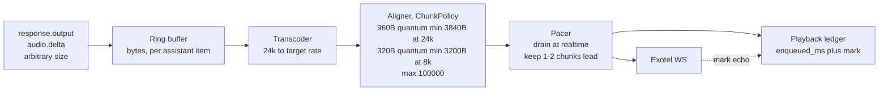
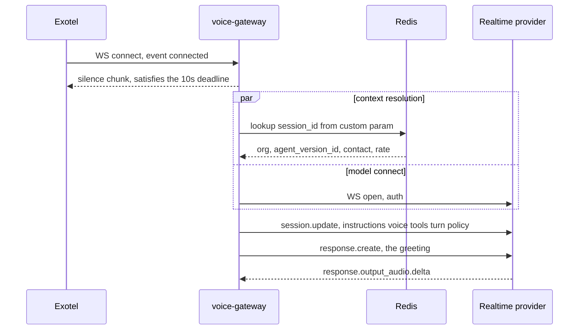
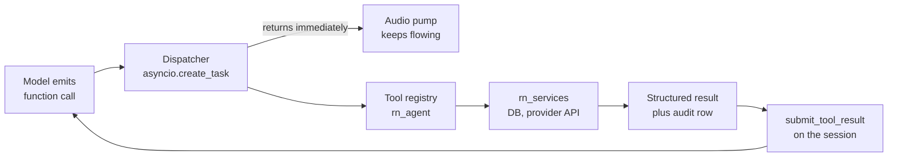
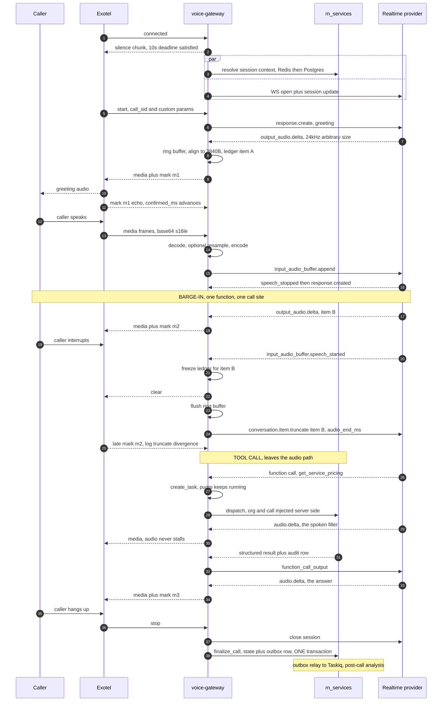

# Realtime Voice — the audio path

> **Status:** Phase 0 — designed, not implemented. Nothing in this document has been measured.
> **Scope:** everything between the caller's mouth and the model's ears, and back. Frame shapes, sample rates, the pacing buffer, barge-in, session lifecycle, turn detection, tool dispatch, the cascaded fallback, and how to test all of it without spending money on phone calls.
> **Not in scope:** how an agent is defined or evaluated ([AGENT_ARCHITECTURE.md](AGENT_ARCHITECTURE.md)), how calls are dispatched ([ARCHITECTURE.md](ARCHITECTURE.md) §6.5), how any of it is stored ([DATA_MODEL.md](DATA_MODEL.md)).
> **Companions:** [../PRD.md](../PRD.md) · [ARCHITECTURE.md](ARCHITECTURE.md) §4 (structural summary — read it first) · [research/PROVIDER_CONSTRAINTS.md](research/PROVIDER_CONSTRAINTS.md) (the verified facts this document is built on) · [OBSERVABILITY.md](OBSERVABILITY.md) · [TESTING.md](TESTING.md)
>
> **Confidence tags** follow PROVIDER_CONSTRAINTS: **[C]** confirmed against a primary source · **[L]** single source · **[A]** our inference · **UNVERIFIED** means exactly that. `HC-n` references are the hard constraints in [research/PROVIDER_CONSTRAINTS.md](research/PROVIDER_CONSTRAINTS.md) §1.

---

## 0. The one thing to understand first

Two providers, two incompatible audio contracts, and no passthrough between them.

Exotel's Voicebot applet speaks **base64 s16le mono PCM inside JSON text frames** at 8000, 16000 or 24000 Hz (HC-1, HC-3) **[C]**. OpenAI Realtime accepts **`audio/pcm` at 24 kHz only**, or G.711 `pcmu`/`pcma` (HC-4) **[C]**. Exotel never emits G.711 on this applet, so the industry-standard "G.711 passes straight through, no resampling" telephony bridge — the pattern in every Twilio tutorial you will find — **does not apply to this stack**. This is anti-fact #2 in PROVIDER_CONSTRAINTS §7 and believing it would produce a bridge that is silently wrong.

Everything else in this document is a consequence of that, plus one more: on the WebSocket transport OpenAI **does not** auto-truncate its own audio when the caller interrupts (HC-7) **[C]**. We must tell it, truthfully, how many milliseconds of its last utterance the caller actually heard. That number is the highest-risk value in the codebase, and getting it wrong produces no error at all.

---

## 1. The media contract, concretely

### 1.1 Inbound frame — Exotel to us

A JSON **text** frame, never a binary frame (HC-1) **[C]**:

```json
{
  "event": "media",
  "sequence_number": 412,
  "stream_sid": "...",
  "media": { "chunk": 411, "timestamp": "8240", "payload": "<base64>" }
}
```

`payload` base64-decodes to raw **s16le, mono, little-endian PCM** at the rate negotiated for this call. Lifecycle events on the same socket: `connected` · `start` · `media` · `dtmf` · `mark` · `stop`; we send `media` · `mark` · `clear`.

Budget **~10–20 messages/second/direction** (HC-1) **[C]**, which implies **50–100 ms of audio per message** (1000 ms ÷ 20 msg/s = 50 ms; 1000 ms ÷ 10 msg/s = 100 ms). HC-1 also records a broader **20–100 ms per message** envelope; that is the provider's documented outer envelope, not a contradiction — 50–100 ms is what the stated message rate actually implies, and the exact cadence is one of the things the Phase 4 wire capture (§13) will settle. Size for 20 msg/s/direction. Every message costs a JSON parse and a base64 decode. At 100 concurrent calls that is a few thousand parse+decode operations per second per gateway process — **the media plane is CPU-bound, not memory-bound**, and you size instances on vCPU. There is no zero-copy path available here; do not go looking for one.

### 1.2 Outbound frame — us to Exotel

Docs say "same structure as incoming" but do **not** confirm whether `sequence_number`, `media.chunk` and `media.timestamp` are required or ignored, or whether `stream_sid` must be echoed (PROVIDER_CONSTRAINTS §6a-3). **UNVERIFIED — blocks implementation of the outbound encoder.** See §13. Implement the encoder behind one function with the field set as a config flag so a test call can settle it in minutes rather than a refactor.

What *is* confirmed: **every outbound audio payload must decode to a multiple of 320 bytes, at least 3200 bytes and at most 100000 bytes** (HC-2) **[C]**. Note that "3200 bytes" is a *byte* floor, not a millisecond floor: it is 200 ms at 8 kHz but only 66.7 ms at 24 kHz, and 66.7 ms is not a legal emission for us — see §1.4 for why the 24 kHz floor is **3840 bytes = 80 ms**. Model deltas arrive at arbitrary sizes. Therefore the pacing/alignment ring buffer of §3 is a **required component**, not an optimisation — it is the single most common way this class of integration fails.

Barge-in uses `{"event":"clear","stream_sid":"..."}` — note the documented example carries no `sequence_number` (HC-8) **[C]**.

### 1.3 Upstream frame — us to OpenAI Realtime

GA interface only. The Beta interface was **removed** on 2026-05-12 (HC-16) **[C]**: no `OpenAI-Beta: realtime=v1` header, no `session.input_audio_format` string, no `g711_ulaw` enum. Assume every tutorial and OSS helper library older than mid-2026 is broken.

```
wss://api.openai.com/v1/realtime?model=gpt-realtime-2.1-mini
Authorization: Bearer <key>
```

Format is declared as an **object**, not a string: `session.audio.input.format = {"type": "audio/pcm", "rate": 24000}` **[C]**. Audio in: `{"type":"input_audio_buffer.append","audio":"<base64 pcm16@24k>"}`. Audio out: `response.output_audio.delta`, base64 pcm16 @ 24 kHz, **arbitrary delta sizes** **[C]**.

Tools are declared **flat** — `{"type":"function","name":...,"parameters":...}` — not nested under a `function` key (HC-19) **[C]**. `langchain_core.utils.function_calling.convert_to_openai_tool()` returns the nested Chat-Completions shape and the Realtime API rejects it, silently as far as your logs are concerned. `rn_agent` generates the flat shape from the Pydantic schema directly, which is one of the reasons `rn_agent` must not depend on LangChain at all.

### 1.4 The three legal sample-rate configurations

Arithmetic, s16le mono: `bytes_per_second = rate × 2`. All millisecond figures below are **derived from the byte thresholds assuming those thresholds are absolute at every rate** — which is open question §13-3.

| Exotel rate | OpenAI leg | Sarvam leg | Byte rate | 320 B = | Smallest legal aligned emission | Max chunk (100000 B) |
|---|---|---|---|---|---|---|
| **8000** | resample 8↔24 both ways | **zero conversion** (STT takes pcm_s16le@8k; TTS emits linear16@8k) | 16 KB/s | 20 ms | 3200 B = **200 ms** | 6.25 s |
| **16000** | resample 16↔24 both ways (2:3) | zero conversion (Sarvam's documented optimal rate) | 32 KB/s | 10 ms | 3200 B = **100 ms** | 3.13 s |
| **24000** | **zero conversion** | downsample 24→16 for STT | 48 KB/s | 6.67 ms | 3840 B = **80 ms** (see below) | 2.08 s |

**Why 3840 and not 3200 at 24 kHz.** At 24 kHz, 320 bytes is 6.667 ms — not a whole number of milliseconds. Accumulating playback accounting in units of 6.667 ms drifts, and the value that drifts is `audio_end_ms` (§4). Use **960-byte frames** (3 × 320 = exactly 20 ms at 24 kHz) as the internal alignment quantum, and the smallest legal emission is then the smallest multiple of 960 that is ≥ 3200, which is **3840 bytes = 80 ms**. At 8 kHz and 16 kHz, 320 bytes is already 20 ms and 10 ms respectively, and 3200 is already a whole number of milliseconds — no adjustment needed.

**Default [A]: sample rate is a per-agent field resolved at dial time.** The applet URL query parameter is per-call and we know which agent is dialling at that moment.

- **24000 Hz for OpenAI-primary agents.** Eliminates resampling entirely on the primary path *and* cuts minimum-chunk buffering from 200 ms to 80 ms — a fifth of the PRD's whole 1.5 s turn target, recovered for free.
- **8000 Hz for Sarvam-primary agents.** Both cascade legs become pure passthrough (HC-23) **[C]**.

There is **no audio-quality argument** in either direction: the source is an 8 kHz PSTN call. 16 kHz and 24 kHz are Exotel upsampling with no added information. The cost of 24 kHz is 3× the base64/JSON CPU and 3× the bandwidth — roughly 512 kbit/s per direction after base64's 4/3 inflation, so ~1 Mbit/s per call on the telephony leg alone, ~100 Mbit/s at the V1 target of 100 concurrent calls, plus a similar amount on the model leg. That is a real NIC and egress-cost consideration, not a rounding error.

**Two things would change this default**, and both are currently unverified:
1. If Exotel's byte thresholds **scale with sample rate** (§13-3), 24 kHz loses its buffering advantage and the choice becomes purely about CPU, favouring 8 kHz.
2. Choosing 24 kHz means a fallback to the Sarvam cascade requires a **24→16 kHz downsample** — the expensive, quality-sensitive direction (§2) — precisely at the moment things are already going wrong. If mid-call fallback ever becomes a supported flow (it is not in V1, see §9), revisit.

---

## 2. Where the transcoder lives, and why the two directions are not equal

**One `AudioTranscoder` at the telephony-adapter boundary.** Never inside a provider client, never inside business logic, never inline in the audio pump. `packages/providers/src/rn_providers/audio/`. Two implementations behind one interface: `PassthroughTranscoder` (rate in == rate out, a no-op that still exists so the call site has no branch) and `PolyphaseTranscoder`.

The transcoder is resolved **at session open**, not at build time: the telephony adapter declares the negotiated rate, the voice adapter declares `accepted_input_formats` / `emitted_output_format`, and the bridge picks the pair. This is what makes a Sarvam-primary agent and an OpenAI-primary agent the same code path.

It operates on **20 ms-aligned frames** — 320 B @ 8k, 640 B @ 16k, 960 B @ 24k — because a resampler with internal state must be fed consistent frame sizes to avoid boundary artefacts, and because 20 ms is the accounting quantum for §3.

### The asymmetry that matters **[A]**

> **Upsampling can be cheap. Downsampling cannot.**

**8k → 24k (inbound, OpenAI path):** adds no information. Any reasonable interpolator is fine. Errors here cost you a little spectral smearing that the model will not notice.

**24k → 8k or 24k → 16k (outbound to telephony at low rates; inbound to Sarvam STT):** requires a **proper anti-aliasing low-pass before decimation**. Naive decimation — taking every third sample — folds everything above the new Nyquist frequency back down into the audible band. At 8 kHz output, Nyquist is 4 kHz, and a 5 kHz component aliases to 3 kHz, sitting directly on top of speech.

This is not an audiophile concern. The energy above 4 kHz in speech is concentrated in **fricatives and sibilants** — `/s/`, `/ʃ/`, `/tʃ/`, aspirated stops. Those are exactly the phonemes that carry contrast in Hindi and Telugu (aspirated vs unaspirated stops are phonemic in both; retroflex vs dental contrasts live in the same band). Aliasing them does not sound like static — it sounds like the agent is mumbling, and it degrades the one thing this product is being judged on.

**Use `soxr` (1.1.0, in the lock) with `numpy` (2.5.1) for both directions. Do not hand-roll a resampler, and do not use naive decimation anywhere.** Both live in the **`rn-providers[audio]` extra**, not in `apps/voice-gateway` — the gateway depends on `rn-providers[openai,audio]`, and the transcoder itself is `rn_providers.audio`. Nothing that needs numpy or soxr is declared by an app. The quality setting is a config value; start at libsoxr's high-quality preset and only lower it if profiling proves the transcoder is actually a cost, which is unlikely at 20 ms frames.

**Budget: ≤ 1 ms per 20 ms frame** (a TARGET — unmeasured). If you exceed it, the problem is almost certainly Python-level per-frame overhead, not soxr.

---

## 3. The outbound pacing and alignment ring buffer

### Why it must exist

Three facts collide:

1. Model deltas arrive at **arbitrary byte sizes** (HC-4 context) **[C]**.
2. Exotel accepts only **320-byte multiples, ≥3200, ≤100000** (HC-2) **[C]** — which at 24 kHz we tighten to **960-byte multiples, ≥3840 (80 ms)** for the alignment reason in §1.4; at 8 kHz the floor is **3200 B = 200 ms**.
3. The model generates **much faster than realtime**. A 20-second spoken response arrives over the wire in a few seconds.

Writing deltas straight through violates (2) and produces choppy audio that every engineer on the team will initially misdiagnose as a network problem. Writing them through *aligned but unpaced* satisfies (2) and creates a different, worse problem: tens of seconds of audio sitting in Exotel's buffer that we cannot see, cannot measure, and can only destroy wholesale.

### Structure



Owned by `rn_voice` (it is bridge logic), **parameterised by a `ChunkPolicy` declared by the telephony adapter** (min bytes, max bytes, alignment, frame quantum) — because those rules are provider-specific and Twilio/Plivo would declare different ones.

### Pacing policy **[A] — decided, worth understanding**

**Drain at approximately realtime, keeping a deliberately shallow lead of 1–2 chunks in Exotel's buffer.**

The tempting alternative is to dump everything as fast as the model produces it and rely on Exotel's own buffer plus `clear` for barge-in. Reject it, for one decisive reason: **the barge-in accounting in §4 is only as accurate as the mark lag**. With a deep sink-side buffer, the gap between "what we handed to Exotel" and "what the caller actually heard" can be fifteen seconds. At barge-in you would be guessing across that entire window, and guessing wrong in the direction that corrupts the conversation. With a 1–2 chunk lead the uncertainty window is 80–160 ms at 24 kHz.

Two supporting reasons: Exotel's 100000-byte maximum chunk (2.08 s at 24 kHz) is a strong hint that the sink is not deep, and its keepalive/idle behaviour on the media socket is undocumented (§6a-8), so we do not want to depend on undocumented buffering behaviour for correctness.

### Playback accounting — `PlaybackLedger`

Count **milliseconds, never bytes**. Milliseconds are rate-invariant, so the resampler cannot corrupt the accounting; bytes are not.

```
ms_of(chunk) = len(chunk) * 1000 / (telephony_rate * 2)     # s16le mono
```

Three quantities, per assistant audio item:

| Field | Meaning | Source |
|---|---|---|
| `enqueued_ms` | assistant audio handed to the Exotel socket | our counter — an **upper bound** on what was heard |
| `confirmed_ms` | assistant audio Exotel has echoed a `mark` for | **the only ground truth** (HC-9) **[C]** |
| `estimate_played_ms(now)` | `min(enqueued_ms, confirmed_ms + wall_clock_since_last_mark)` | what we send as `audio_end_ms` |

> **`PlaybackLedger` is per assistant *item*, and it resets when the assistant item id changes.** `conversation.item.truncate` takes an item id, a content index, and an `audio_end_ms` **relative to the start of that item's audio**. A global monotonic counter here is a guaranteed, silent, unbounded corruption. Track the current assistant audio item id from the delta events and reset on change. If you take one implementation detail from this document, take this one.

**Mark one chunk, not one utterance.** HC-9 confirms Exotel echoes a mark when the audio following it has finished playing. Marking per emitted chunk costs one extra tiny JSON frame per chunk (12.5/s/call at 80 ms chunks) and bounds the barge-in uncertainty window to one chunk. Marking per utterance is cheaper and makes the uncertainty window the whole utterance. The extra frames are worth it. Revisit only if frame overhead is measured to be a real cost.

The wall-clock extrapolation term assumes Exotel plays out in realtime once playback has started. That is **[A], UNVERIFIED** — hence the `min()` clamp, which makes the worst case "we under-report", not "we over-report". See §4 for why that direction is chosen deliberately.

**`enqueued_ms - confirmed_ms` is a first-class health metric** ([OBSERVABILITY.md](OBSERVABILITY.md)). Steady growth means we are outrunning the sink, which is the backpressure signal in §10.

---

## 4. Barge-in: one atomic operation

Barge-in is **three effects with one trigger**, and it must be **one function with one call site**. Three call sites is how you get a system that is correct in testing and corrupt in production.

```python
# rn_voice — the single call site. Nothing else may perform any of these steps.
async def handle_barge_in(self, at: Instant) -> None:
    audio_end_ms = self.ledger.freeze(at)  # (3) freeze BEFORE anything can advance it
    await self.telephony.clear_playback()  # (1) discard Exotel's un-played buffer
    self.ring_buffer.flush()  # (2) discard OUR un-sent audio
    await self.session.truncate(  # (4) tell the model the truth
        item_id=self.ledger.item_id,
        content_index=self.ledger.content_index,
        audio_end_ms=audio_end_ms,
    )
```

Order matters: freeze the ledger first, because the pacer runs on another task and will happily advance `enqueued_ms` while you are awaiting the `clear`.

### Why `audio_end_ms` is the highest-risk value in the system

Everything else that can go wrong in the audio path **announces itself**. A dropped socket raises. A malformed frame raises. Unaligned chunks sound choppy and someone files a bug within an hour.

A wrong `audio_end_ms` produces no error, no log line, and perfectly clean audio. It corrupts the model's *belief* about the shared conversational state, and then the model behaves rationally on false premises:

- **Over-report** (`audio_end_ms` too high): the model believes the caller heard content the caller never heard. It will not repeat it. It will reference it — "as I mentioned, the setup fee is…" — for something never spoken. The caller experiences an agent that is confidently talking about a conversation that did not happen. This is the failure mode that makes a demo unrecoverable, and it is invisible in the transcript, because the transcript records what the model *said*, not what was *played*.
- **Under-report** (`audio_end_ms` too low): the model believes it said less than it did, and may repeat a sentence. Mildly awkward. Recoverable. The caller thinks the agent is being thorough.

They are not symmetric. **Bias low, always** — hence the `min()` clamp in §3 and the choice to extrapolate from the last *confirmed* mark rather than from `enqueued_ms`.

### Marks are the only ground truth

We know what we wrote to a socket. We do not know what came out of a phone. HC-9 **[C]** gives us the single reconciliation signal available: Exotel echoes our mark when that audio has actually finished playing. Use it two ways:

1. **Live**, as the base of `estimate_played_ms`.
2. **After the fact**, as a health metric: when a late mark arrives for audio we already truncated past, log `truncate_divergence_ms`. A consistently large or growing divergence means the pacing lead has drifted or Exotel's buffering behaviour differs from our model, and it will show up as conversational weirdness long before anyone traces it back here. Alert on it.

### Trigger source

`input_audio_buffer.speech_started` from OpenAI **[C]**. That is a server-side VAD decision made by the model provider, so **the round trip to the model is inside our barge-in latency**, and it is unmeasured (§13-4).

**Barge-in latency budget** (TARGET): our own work — freeze, clear, flush, truncate — ≤ 20 ms. Caller-perceived stop is bounded by Exotel's un-played buffer, which the §3 pacing policy holds at 1–2 chunks = **80–160 ms at 24 kHz**. That is what makes the PRD's ~200 ms barge-in requirement achievable at all, and it is the concrete payoff of pacing shallowly.

---

## 5. Session lifecycle

### 5.1 The connect deadline

HC-5 **[C]/[L]**: Exotel's streaming session caps at 60 minutes, and **the bot must respond within 10 seconds of connect** or the session fails, with exactly **one** automatic handshake retry.

Consequences, in order of importance:

1. **No blocking initialisation inside the WebSocket accept path.** Not a Postgres query, not an agent-definition fetch, not a synchronous config load.
2. **Emit a liveness frame immediately.** On `start`, write one aligned chunk of digital silence (3840 bytes at 24 kHz = 80 ms) to satisfy the deadline *independently of whether the model is ready*. This decouples the 10 s telephony deadline from model connect latency entirely, and costs 80 ms of silence that is indistinguishable from normal call setup.
3. **Serverless is disqualified for this endpoint.** Warm, long-running containers behind an LB with health checks ([ARCHITECTURE.md](ARCHITECTURE.md) §10).

### 5.2 Pre-warming, and when *not* to

Open the model session on the Exotel **`connected`/`start`** event, and resolve call context concurrently.



**Do not open the model session at dial time.** Two reasons: it starts the OpenAI 60-minute clock during ringing, which can be 30+ seconds and is pure loss; and on a cold outbound list most dials are never answered, so you would pay for and hold sessions for calls that do not exist.

Context resolution is **Redis first** (written at dial time), Postgres fallback **through `rn_services`** — the gateway holds no database session of its own. Be precise about the mechanism: the ORM *is* in the gateway image (`rn_voice` → `rn_services` → `rn_persistence` pulls in SQLAlchemy, asyncpg and the Redis client), so this is not a packaging guarantee. It is an **executable import contract** forbidding `rn_voice` from importing them directly, which is what stops a session ever being opened here. The agent-definition snapshot comes from a process-local LRU cache keyed by `agent_version_id`; because agent versions are immutable, this cache never needs invalidation, which is precisely why versioning is worth its cost.

Exotel's Voicebot custom parameters are capped at **3 key/value pairs and a 256-character query string** (HC-12) **[C]**, so exactly one opaque `session_id` goes over the wire. Everything else is looked up server-side and joined on `call_sid` from the `start` event.

### 5.3 Three independent clocks

| Clock | Limit | Starts at | On expiry | Mitigation |
|---|---|---|---|---|
| Exotel streaming session | 60 min (HC-5) **[C]** | media stream established | stream terminates | **Cannot be rolled over.** Wind the call down verbally. |
| Exotel call `TimeLimit` | 14400 s (HC-5) **[C]** | call connect | call terminates | Not binding — the stream cap hits first. |
| OpenAI session | 60 min hard (HC-6) **[C]** | model WS open | session closes | **Rollover** (§5.4). |
| Sarvam STT/TTS socket idle | ~60 s **idle** (HC-22) **[C]** | last frame on that socket | socket closes | Keepalives on **both** legs (§9). |

The two 60-minute caps **coincide numerically and are on different clocks**, started at different moments. Do not write code that treats them as one. A `SessionLifecycleManager` owns all of them; each adapter exposes `time_to_forced_close()` and the manager acts on the minimum.

### 5.4 Rollover

Only the **OpenAI** clock is rollable. The Exotel stream cap ends the media path, and there is nothing to roll over to.

At a threshold before the model cap (start at T-minus 3 minutes; it is config, and it must be, because the summarise-and-seed step is unmeasured):

1. **Summarise off-session.** Do *not* ask the live model for a summary — that injects a response into the conversation the caller can hear, and it consumes the very budget you are trying to conserve. Instead, run condensation as a background task against the conversation items we have been persisting as they stream (§10), via `rn_services` → `LLMProvider`. Non-realtime, off the audio path, cancellable.
2. **Open the successor session in parallel** and pre-warm it: `session.update` with the same instructions, voice and tools.
3. **Seed** it with `conversation.item.create` entries carrying the condensed context and the last few verbatim turns.
4. **Swap at a turn boundary — never mid-utterance.** The pacer must be idle and the ledger closed. If the caller is mid-turn, wait.
5. **Voice identity must not change.** OpenAI voices are immutable once audio has been emitted in a session **[C]**, so the successor session must be opened with the same voice id from the same agent version. A voice change mid-call is more jarring than a two-second pause.

For a call approaching the **Exotel** cap, the agent is instructed to land the call — summarise, offer a callback, close. This is a guardrail in the agent definition triggered by a lifecycle signal, not a hard hangup.

---

## 6. Turn detection

Two server-side modes are available on the model leg: **`server_vad`** (acoustic — silence duration and amplitude threshold) and **`semantic_vad`** (the model judges whether the utterance is *complete*, with an `eagerness` control).

**Default [A]: `semantic_vad`, `eagerness: low`, with every VAD parameter exposed as per-agent configuration.**

### Why aggressive endpointing is the wrong default here

Acoustic VAD asks "has this person stopped making noise for N milliseconds?" For our callers that question has the wrong answer surprisingly often **[A]**:

- **Code-switching costs a pause.** "Website toh already hai, … social media management chahiye" — the matrix-language switch at the comma is a real, frequent, several-hundred-millisecond hesitation. It is mid-sentence. Cutting there produces an agent that responds to half a requirement.
- **Hindi and Telugu are verb-final.** The semantically decisive word arrives at the *end* of the clause. An endpointer that fires on a mid-clause pause commits the model to responding before the meaning exists. English speakers get a partial sentence; Hindi and Telugu speakers get a wrong one.
- **Deliberative content is exactly our use case.** Callers are recalling a budget, a timeline, an address, a name. Those pauses are long and they are not turn ends.
- **Indian mobile audio has gaps.** Packet loss and comfort noise both look like silence to an amplitude threshold.

`semantic_vad` at low eagerness asks the better question — "is this a complete thought?" — and it is worth the added endpointing latency (budgeted 300–800 ms in §8, **a target, not a measurement**). Being cut off mid-sentence is the most human-legible failure mode a voice agent has; a caller forgives a slightly slow agent and does not forgive an agent that talks over them.

### What is configurable, and what must not be hardcoded

Per-agent, tunable by ops **without a deploy**, because the right value differs between a fast-moving inbound support line and a deliberative outbound qualification call:

`mode` (`server_vad` | `semantic_vad`) · `eagerness` · `threshold` · `prefix_padding_ms` · `silence_duration_ms` · `idle_timeout_ms` · `create_response` · `interrupt_response`.

> **The GA defaults for `server_vad` — `threshold`, `prefix_padding_ms`, `silence_duration_ms` — and the semantics and default of `idle_timeout_ms` are UNVERIFIED** (§6a-14). **Do not hardcode the beta-era 0.5 / 300 / 200.** Leave them unset unless an agent explicitly configures them, so the provider's own GA defaults apply, and record the effective values from the session-created event so we can see what we actually got.

### Owning turn policy ourselves

Setting `create_response: false` and `interrupt_response: false` **[C]** hands turn-taking to us: the model transcribes and detects speech, but does not automatically start speaking. That seam is where guardrails and compliance checks could run *before* we commit to an expensive spoken response.

**Not in V1** — it adds a round trip inside the turn budget and we have measured nothing. It is documented here because the seam must be preserved in the `VoiceSession` interface, not designed out.

---

## 7. Tool calls during a live call

**The audio pump never awaits a tool.** Ever. This is the rule the whole structure protects.



The tool call is dispatched onto a task tracked in a per-session task set, so a session teardown can account for every outstanding tool. Tool execution goes `rn_agent` registry → `rn_services`, with `organization_id`, `call_id` and `agent_version_id` **injected from server-side session context and never read from model output** ([ARCHITECTURE.md](ARCHITECTURE.md) §5).

**Every tool declares a latency class and a hard timeout.** On timeout, submit a *structured error* as the function call output — never leave the model hanging, and never let the caller sit in silence waiting for a socket that will not answer. A model that receives "lookup unavailable" recovers verbally; a model that receives nothing stalls.

Implement against **`response.done`**, not `response.function_call_arguments.done` — whether the latter still exists in the GA event set is unverified (§6a-15).

### Filler speech for slow tools

**V1 policy: prompt-level filler only.** The agent definition instructs the model to acknowledge before invoking any tool in the `slow` latency class — "let me check that for you" — so the filler is part of the model's own turn.

The tempting alternative is for the bridge to inject pre-synthesised filler audio into the outbound path while a tool runs. **Rejected for V1**, for a specific reason worth writing down so it is not re-proposed: injected audio is not part of any assistant conversation item, so it has no item id and no place in the `PlaybackLedger`. If the caller barges in over injected filler, there is nothing coherent to truncate and the §4 accounting stops being truthful. Fixing that means a second, parallel playback timeline. The complexity is real and the benefit is a prompt instruction away. Revisit only with measurements showing prompt-level filler is insufficient.

### The caller hangs up mid-tool

This is a correctness question, not a cleanup question. Two cases, decided by whether the tool has an external side effect:

| Tool kind | On hangup | Why |
|---|---|---|
| Read-only (`search_knowledge`, `get_service_pricing`) | **cancel the task** | No side effect, no value in completing it, and the session is gone. |
| Side-effecting (`book_meeting`, `send_whatsapp`, `create_lead`) | **let it run to completion, detached; record the outcome; do not submit the result** | It may already have hit an external API. Cancelling mid-flight gives us a half-committed booking we have no record of. |

For the second case: the task is detached from the session, the result is written to the tool-execution log against `call_id`, and the post-call pipeline sees it. Every side-effecting tool carries an **idempotency key derived from `(call_id, tool_name, canonicalised_args)`**, so a retry — from us or from a caller who rings back — cannot double-book. Submitting a `function_call_output` to a closed session is a no-op that will raise; the dispatcher checks session liveness before submitting and swallows the result if the session is gone.

---

## 8. Latency budget, and what is forbidden

### Budget — these are TARGETS. We have measured nothing.

Nothing below is a measurement. There is no p50, no p95, no throughput figure, and no concurrency figure anywhere in this project yet. Treat every number as a design budget that must be replaced by instrumentation ([OBSERVABILITY.md](OBSERVABILITY.md)).

| Segment | Target | Basis |
|---|---|---|
| Exotel edge → bridge (ap-south-1) | ≤ 15 ms | budget **[A]** |
| JSON parse + base64 decode | ≤ 1 ms/frame | budget **[A]** |
| Transcode (when not passthrough) | ≤ 1 ms per 20 ms frame | budget **[A]** |
| base64 encode + serialise + WS write | ≤ 1 ms/frame | budget **[A]** |
| **Bridge (India) → OpenAI nearest edge RTT** | **UNMEASURED** | §13-4 — **blocks the whole budget** |
| Model endpointing (`semantic_vad`, `eagerness: low`) | 300–800 ms | budget **[A]**; GA defaults unverified |
| Model time-to-first-audio-delta | **UNMEASURED** | no published figure |
| Outbound minimum-chunk accumulation | 80 ms @ 24 kHz / 200 ms @ 8 kHz | derived from HC-2, assumes absolute thresholds (§13-3) |
| Exotel playout lead (our pacing choice) | 1–2 chunks | §3 |
| **End of caller speech → first caller-audible agent audio** | **< 1.5 s p95** | PRD §7 — provisional until measured |
| **Detected barge-in → agent audio stops** | **~200 ms** | PRD §7; achievable only because of the shallow pacing lead (§4) |

The single largest unknown is the India→OpenAI RTT, and it sits in the turn budget twice (audio up, audio down). **Until it is measured, no latency planning is real.** OpenAI's *SIP* media originates from northeurope / southcentralus / eastus2 / westus with no India or Asia presence (HC-17) **[C]**; whether the WebSocket API terminates in the same places is not documented.

### Forbidden inside the audio path — no exceptions

- **No Postgres query.** Not a lookup, not a "quick" read. Context is pre-resolved at session open or cached in-process.
- **No vector search.** RAG happens in a tool, on a dispatched task (§7), never in the pump.
- **No LangGraph or LangChain anything, and no `rn_orchestration`, and no business layer.** This is the *permanent* invariant, and it is scoped to the transport layer `rn_voice.media`: import-linter forbids it from importing `langchain`, `langchain_core`, `langchain_openai`, `langchain_protocol`, `langgraph`, `langgraph_sdk`, `langsmith`, `rn_orchestration`, `rn_agent` or `rn_services`. A second contract enforces `runtime → session → media` so the transport cannot be reached around. No benchmark relaxes this one — a framework in the byte loop ends the transport's independent testability, which is a bigger loss than any latency figure. Layers *above* the pump are a different question: `rn_voice.runtime` may consult orchestration subject to the gate in [ADR-009](DECISIONS/ADR-009-orchestration-boundary-for-live-sessions.md), and since no official LangGraph latency benchmark exists (anti-fact #16), that gate is where the measuring happens.
- **No synchronous log write**, no blocking file I/O, no `print`.
- **No blocking network I/O** other than the two (or four, on the cascade) WebSockets.
- **No per-frame write to Postgres or Redis.** Per-frame audio events live in process memory for the call's duration and are persisted as an assembled transcript at the end.
- **No unbounded queue.** Every buffer in §3 and §10 has a hard cap and a defined behaviour when it is hit.
- **No shared mutable state between calls.** No module-level globals. 100 concurrent calls are 100 independent sessions reading the same *immutable* agent snapshot.

---

## 9. The cascaded fallback path

Sarvam STT → LLM → TTS, behind the **same `VoiceSession` seam** as OpenAI Realtime:

```
async open(agent_config)
async push_audio(pcm, rate)
async stream_output() -> AsyncIterator[AudioChunk | ToolCall | TranscriptEvent | TurnEvent]
async truncate(played_ms)
async cancel_generation()
async submit_tool_result(call_id, output_json)
capabilities: SessionCapabilities
```

The bridge, the ring buffer, the ledger, the chunk policy, the tool dispatcher and the barge-in function are all unchanged. What differs is real, and it is exposed through `SessionCapabilities` rather than hidden — an interface that pretends the two are the same produces a fallback path that fails silently at 2 a.m.

### How it actually differs

| Difference | Detail | Consequence |
|---|---|---|
| **No interim transcripts** | Sarvam's STT WebSocket emits **nothing** until VAD `speech_end` or an explicit `flush` — final-per-utterance only (HC-20) **[C]** | No speculative prefill, no early barge-in from partial text. The turn-taking layer needs a genuine VAD-only code path. `capabilities.supports_interim = False`. **Do not fake partials.** |
| **Concurrency ceiling** | STT WebSocket: 20 (Starter) / **100** (Pro and Business) — it does not scale past 100 (HC-21) **[C]**. TTS scales to 1000. | The legs are **asymmetric**; budget capacity per leg, not per call. A Redis semaphore gates entry into the fallback path. When it is exhausted, **do not queue** — a queued caller is a caller listening to silence. Terminate gracefully and schedule a callback. |
| **Idle socket timeouts** | Both STT and TTS sockets close after **~60 s idle** (HC-22) **[C]** | Two independent keepalives: near-zero-amplitude PCM into STT, `ping()` into TTS. Without both, calls drop mid-conversation and look like random provider failures — an expensive week of debugging waiting to happen. |
| **Audio format matrix** | STT: pcm_s16le / pcm_l16 / pcm_raw / wav at 8000 or 16000 Hz, **no mulaw**. TTS: mulaw / alaw / linear16, 8 kHz upward (HC-23) **[C]** | At Exotel 8 kHz **both legs are pure passthrough** — which is why Sarvam-primary agents default to 8 kHz (§1.4). |
| **Barge-in mechanism** | There is no remote conversation state to truncate; the context is **ours** | `cancel_generation()` unifies at the *effect* level: flush the TTS socket, drop buffered text, flush our ring buffer, `clear` to Exotel. |
| **Truncating our own context** | The truncation problem does not disappear — it moves into our context manager. We must record what was *spoken*, not what was *generated*. | Mapping `played_ms` back to a word boundary needs TTS word timings, which Sarvam does not document. **UNVERIFIED.** V1 pragmatic answer: append an explicit `[interrupted by caller]` marker to the assistant turn rather than pretending the whole sentence was heard. Honest and cheap; revisit if word timings turn out to be available. |
| **More moving parts** | Four sockets and an HTTP call instead of two: Exotel + STT + TTS + LLM | Critical path becomes STT-final → LLM TTFT → TTS TTFB, serialised. Strictly worse than speech-to-speech. |
| **No published latency at all** | Sarvam publishes no p50/p95 for time-to-first-transcript or time-to-first-audio-byte; docs say only "milliseconds not seconds" (§6a-20) | **Must be measured in-house on real Indian telephony audio before this path goes anywhere near a customer call.** |
| **Transcription `mode` changes the script** | `codemix` / `transcribe` / `translit` / `translate` / `verbatim` change the script the LLM sees **[C]** | Mode and prompt are **one versioned artifact** per agent. Changing mode silently changes the token distribution and therefore the agent's behaviour. |
| **Voices** | Sarvam bulbul:v3 speakers differ entirely from OpenAI's 10 voices | Agent config carries a `language → (provider, voice_id)` map, never a global voice string. The per-speaker × per-language validity matrix is **not published** (§6a-24) — validate every pair empirically before exposing it. |

### When does fallback engage?

**V1 decision [A]: at session open only.** Chosen when OpenAI is unavailable at connect time, or when the agent is configured Sarvam-primary. A mid-call OpenAI failure gets **one** reconnect attempt to OpenAI (§10), then graceful termination — not a hot swap.

Mid-call provider switching would change the voice mid-conversation, require re-establishing context in a different format, and put a several-second silence in front of the caller. It is a V2 conversation and it needs measurements first.

> **L-9 in PROVIDER_CONSTRAINTS §6b is unresolved:** whether Sarvam is fallback-only or a co-primary. HC-21's 100-socket ceiling makes it unviable as a primary at scale without a negotiated increase. If **PRD D-1** (data residency) forces India-resident processing, this becomes urgent and commercial rather than technical.

---

## 10. Failure handling

**Neither provider documents a session-resume primitive.** Not OpenAI, not Sarvam. So we do not architect around one.

> **The design consequence, stated plainly: persist conversation items as they stream, and on any disconnect open a *fresh* session and replay condensed context.** Reconnect is a cold start with a good briefing, not a resume. Anything that assumes otherwise — a checkpoint, a session token, a replayable offset — is inventing a provider feature (CLAUDE.md rule 6).

Conversation items are accumulated in process memory and flushed asynchronously off the audio path. They are what makes both §5.4 rollover and reconnection possible, and they cost nothing extra because we need them for the transcript anyway.

| Failure | Detection | Response |
|---|---|---|
| **Model provider timeout** (no audio, no events) | per-session watchdog on last-event-received | Cancel the in-flight response, one reconnect attempt with condensed context, spoken bridge phrase from the new session. Exceed the attempt cap → graceful termination. |
| **Model socket drop** | WS close / error on the upstream leg | Same path. The caller hears silence for the duration — budget it, cap it, and count it. Log `reconnect_silence_ms` per occurrence. |
| **Telephony disconnect** | `stop` event **or** socket close without `stop` | **Both must finalise.** `finalize_call()` writes call state + outbox row in one transaction ([ARCHITECTURE.md](ARCHITECTURE.md) §6.4) and is **idempotent** — a `stop` followed by a close must not produce two call completions. |
| **Malformed frame** | JSON parse failure, bad base64, wrong payload length | Count it, drop it, **never crash the pump**. A malformed-frame *rate* above threshold terminates the call with a distinct outcome code — one bad frame is noise, a stream of them is a broken peer. |
| **Sequence gap** | `sequence_number` jumps | **Diagnostic, not a transport error.** These frames arrive over a single WebSocket on TCP, so they cannot be reordered or lost in transit. A gap means the sender skipped, or audio was dropped upstream of the socket. **Never attempt to reorder or buffer for reordering** — you would add jitter to fix a problem that does not exist. Emit as an audio-quality metric. |
| **Backpressure — model outruns the sink** | `enqueued_ms - confirmed_ms` exceeds the high watermark (§3) | Stop draining the ring buffer; let it absorb. This is normal for a long response and is exactly what the buffer is for. |
| **Ring buffer exceeds its hard cap** | bounded queue full | A genuine fault, not a slow moment. `cancel_generation()`, log loudly, let the model re-plan a shorter turn. **Never grow the buffer without bound** — unbounded buffering converts a latency problem into a memory problem and then into an OOM that takes down every call on the instance. |
| **Sarvam socket idle close** | ~60 s idle (HC-22) | Prevented by the two keepalives (§9), not recovered from. If it happens anyway, it is a keepalive bug — alert, do not silently reconnect. |
| **Graceful shutdown / deploy** | SIGTERM | Stop accepting new calls, drain existing ones. Calls run up to 60 minutes, so the ECS deregistration delay and stop timeout must accommodate that ([SCALABILITY.md](SCALABILITY.md)). Never kill a live call for a deploy. |

Telephony **status callbacks** are a separate, unrelated, and weaker channel: unsigned (HC-10) **[C]**, explicitly may be delayed or dropped with no retry (HC-11) **[C]**, and only two event types exist — `terminal` and `answered` (HC-15) **[C]**. **Any finer-grained live call-state UI must be driven from the media socket lifecycle, not from webhooks.** A reconciliation job is a required component, covered in [ARCHITECTURE.md](ARCHITECTURE.md) §6.5.

---

## 11. Testing the audio path without paid calls

PRD §7 makes this a non-functional requirement: *"the full call flow must be exercisable without placing a paid phone call."* The audio path is also the part where a unit test genuinely catches the bugs that matter, because the bugs are arithmetic.

### Three fakes

**`FakeTelephonyClient`** — implements the `TelephonyProvider` seam and replays a **recorded JSON frame sequence** from a fixture file: `connected` → `start` → N × `media` → optional `dtmf` → `stop`. It asserts on everything we send back: chunk alignment, size bounds, event shapes, and the exact `clear`/`mark` ordering. It can inject malformed frames, sequence gaps, and delayed or missing mark echoes on demand.

Fixtures come from a frame recorder behind an env flag, run on **internal consented test numbers only** (CLAUDE.md rule 8), with payloads retained and phone numbers redacted at capture time. Note that whether we retain caller audio at all in production is **PRD D-5**, still open — the recorder is a development tool with a separate, narrower policy.

**`FakeRealtimeProvider`** — implements `VoiceSession`, driven by a declarative script: *emit 1400 ms of audio · emit a tool call · emit `speech_started` at t=740 ms · drop the socket · close.* This is what makes barge-in testable at all, because barge-in is a timing relationship and timing relationships need a controllable clock.

**Injectable clock** — the pacer, the ledger's wall-clock extrapolation, and every timeout take a clock from the session. `freezegun` is already in the dev group. Nothing in the audio path may call `time.monotonic()` directly.

### Golden-file assertions

These are the tests that pay for themselves:

1. **Chunk alignment invariants**, on every emitted frame, at every supported rate: the provider rule `len % 320 == 0` and `3200 <= len <= 100000`, **plus our own stricter policy at 24 kHz** — `len % 960 == 0` and `len >= 3840` (§1.4), because 320 B is 6.667 ms there and only 960 B multiples keep `audio_end_ms` on whole milliseconds. At 8 kHz the floor is 3200 B = 200 ms; at 16 kHz, 3200 B = 100 ms. Property-test it with randomly-sized deltas — that is exactly what the model does.
2. **Byte conservation.** Total audio in == total audio out (modulo resampling ratio and an explicit flush). A ring buffer that silently drops a tail is invisible in listening tests and obvious here.
3. **`played_ms` ledger golden file.** A recorded delta sequence plus a mark-echo schedule produces a deterministic `(item_id, enqueued_ms, confirmed_ms, estimate)` ledger. Diff it. Any accounting change that was not intentional shows up as a diff instead of as a confused caller three weeks later.
4. **Barge-in as a single transaction.** Assert that a `speech_started` at t produces **exactly one** `clear`, **exactly one** ring-buffer flush, and **exactly one** `truncate`, in that order, with `audio_end_ms` inside the expected window — and that `audio_end_ms` is **never greater** than the true played value (the asymmetry in §4 is a testable invariant, not a note).
5. **Ledger reset on item change.** Two assistant items in one response must produce two ledgers, each starting at zero. This is the §3 bug, caught mechanically.
6. **Anti-aliasing.** Synthesise a 5 kHz sine at 24 kHz, downsample to 8 kHz, assert the energy at 3 kHz (where it would fold to) is below −40 dBFS. Naive decimation fails this instantly; soxr passes it. It is ten lines of numpy and it defends the thing §2 says the product is judged on.
7. **Reconnect replay.** Kill the fake provider mid-response; assert a fresh session is opened, seeded with condensed context, and that no conversation item is lost or duplicated.

Markers (already configured in `pyproject.toml`): `unit` for everything above, `provider` for mocked adapters, **`live` for the one real call in §13** — opt-in, never in CI. This is enforced, not merely intended: `addopts` is `-ra --strict-markers --strict-config -m 'not live and not load'`, so a bare `uv run pytest` **cannot** select a `live` test; you must override `-m` explicitly.

---

## 12. The whole thing, end to end

One call, with a greeting, a barge-in, and a tool call.



---

## 13. Open questions that must be answered by an empirical test call

**These are UNVERIFIED and they block implementation and latency planning.** They are cheap to answer — one instrumented `live`-marked call to a consented internal number, with full frame logging on both legs, closes items 1–3 and 5. **This is the Exotel sandbox wire-capture spike, and [ROADMAP.md](ROADMAP.md) puts it in Phase 4** (provider seams, fakes, audio transcoder) — it is what resolves [research/PROVIDER_CONSTRAINTS.md](research/PROVIDER_CONSTRAINTS.md) §6a items 1–4, and it also settles the real message cadence assumed in §1.1. Do it in the first week of Phase 4 and update this section with the answers and the date.

| # | Question | Blocks | Source |
|---|---|---|---|
| **1** | **The exact JSON shape Exotel expects for OUTBOUND media.** Docs say "same structure as incoming" but do not confirm whether `sequence_number`, `media.chunk`, `media.timestamp` are required or ignored, or whether `stream_sid` must be echoed. | The outbound encoder. Cannot be written correctly without this. | §6a-3 |
| **2** | **The exact sample-rate query parameter name** on the Voicebot applet URL. Seen once as `?sample-rate=16000`, uncorroborated; could be `sample_rate` or `samplerate`. Anti-fact #9. Fallback: read `media_format` back from the `start` event. | Every call. Nothing works at a non-default rate until this is known. | §6a-2 |
| **3** | **Whether the 320 / 3200 / 100000-byte chunk rules scale with sample rate**, or are absolute byte thresholds at all rates. | The minimum-chunk latency figures in §1.4 and §8, and therefore **the 24 kHz default itself**. | §6a-4 |
| **4** | **Measured RTT from `ap-south-1` to the nearest OpenAI Realtime edge**, and whether the WebSocket API terminates in the same regions as SIP media (northeurope / southcentralus / eastus2 / westus — no India, no Asia, HC-17). | **The entire latency budget.** It sits in the turn path twice. Until it is measured, §8 is arithmetic on a guess. | §6a-17, HC-17 |
| **5** | **Keepalive, ping and idle-timeout behaviour on the Exotel media WebSocket.** Undocumented. | Whether a long silence in a call drops the stream. | §6a-8 |
| **6** | **GA defaults for `server_vad`** (`threshold`, `prefix_padding_ms`, `silence_duration_ms`) and the semantics and default of `idle_timeout_ms`. **Do not hardcode the beta-era 0.5 / 300 / 200.** | Safe defaults for turn detection. | §6a-14 |
| **7** | **Whether `temperature` still exists in the GA session object** or is fully replaced by `reasoning_effort`. | Agent config schema. | §6a-13 |
| **8** | **Concurrent-session limit for `gpt-realtime-2.1`.** None is documented at any tier (HC-18); only RPM/TPM. Anti-fact #6. | Any concurrency claim. **PRD D-6.** | §6a-12 |
| **9** | **Exotel provisioned concurrency**, how it is purchased, per-account caps and burst behaviour. "Unlimited concurrent calls per ExoPhone" appears **only in a marketing blog** (anti-fact #3). | Capacity planning. **PRD D-6.** | §6a-6 |
| **10** | **Sarvam: recommended STT WebSocket chunk size and cadence for 8 kHz telephony**, and any latency figure at all — none is published. | Whether the cascade is viable on a live turn. | §6a-19, §6a-20 |
| **11** | **Sarvam: max WebSocket session duration / total audio per connection** (only the ~60 s *idle* timeout is documented). | Whether a 30-minute call needs mid-call socket rotation. | §6a-21 |
| **12** | **Speech-to-speech language quality for Hindi, Telugu and code-mixed utterances.** There is **no official speech-to-speech language list for `gpt-realtime-2.1`** and no published code-switching benchmark from any provider (anti-facts #4, #5). | **PRD D-2** — what we are allowed to promise a customer. Highest product risk in the project. | §6b L-2 |

Two of these are commercial rather than technical (8, 9 → **PRD D-6**), and one is a product commitment (12 → **PRD D-2**). The rest need a phone call and an hour.

---

## 14. Where the code lives

| Concern | Package | Note |
|---|---|---|
| Bridge, audio pump, ring buffer, pacer, `PlaybackLedger`, barge-in, `SessionLifecycleManager`, tool dispatcher | `apps/voice-gateway` → `rn_voice` | **`rn_voice` may not directly import SQLAlchemy, asyncpg, Taskiq, a vendor SDK, LangChain/LangGraph or `rn_orchestration`** — executable import contracts in the root `pyproject.toml` (nine in total). Note this is exclusion **by contract, not by packaging**: `rn_voice` → `rn_services` → `rn_persistence` means SQLAlchemy, asyncpg and the Redis client *are present in the gateway image*. What the contracts prevent is the gateway opening a database session of its own or reaching past its service layer. |
| Exotel frame codec, `ChunkPolicy`, `TelephonyProvider` | `packages/providers` → `rn_providers.telephony.exotel` | The alignment *rules* belong to the adapter; the buffer that obeys them belongs to the bridge. |
| OpenAI Realtime client, `VoiceSession`, `SessionCapabilities` | `packages/providers` → `rn_providers.realtime.openai` | The `openai` SDK appears nowhere else. |
| Sarvam STT / TTS / LLM adapters | `packages/providers` → `rn_providers.speech.sarvam` | Same seam, different capabilities. |
| `AudioTranscoder` (`soxr` + `numpy`) | `packages/providers` → `rn_providers.audio` | Resolved at session open, not at build time. `soxr`/`numpy` are the **`rn-providers[audio]` extra**; `apps/voice-gateway` depends on `rn-providers[openai,audio]` and declares neither directly. |
| Tool registry, guardrails, flat Realtime tool export | `packages/agent` → `rn_agent` | **Framework-free.** The flat shape (HC-19) is generated from Pydantic directly. |
| `finalize_call()`, context resolution, tool business logic | `packages/services` → `rn_services` | The only layer that touches the database. |

If a change appears to require relaxing one of those contracts, that is an architecture change: **write an ADR** ([DECISIONS/](DECISIONS/)). Do not edit the contract in passing.
