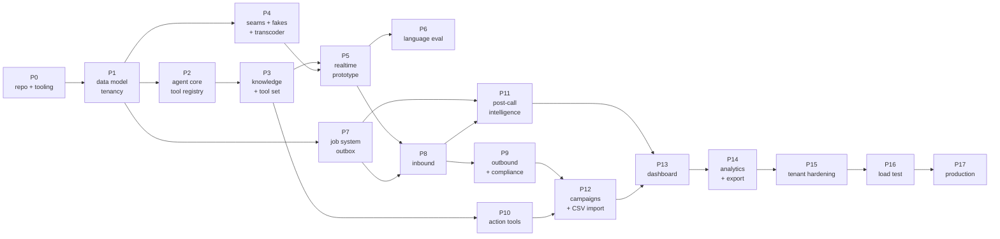

# Roadmap

> **Status:** LIVING STATUS DOCUMENT — this file records where the project actually is, not where we hope it is.
> **Scope:** phase sequence, dependencies, definitions of done, and what is blocked on whom. No dates, no estimates — we have no basis for either.
> **Last updated:** 2026-07-28
> **Companions:** [../PRD.md](../PRD.md) (what and why) · [ARCHITECTURE.md](ARCHITECTURE.md) (how it is structured) · [research/PROVIDER_CONSTRAINTS.md](research/PROVIDER_CONSTRAINTS.md) (what we actually verified) · [DECISIONS/](DECISIONS/) (ADRs) · [TESTING.md](TESTING.md) (how a phase proves itself done)

---

## Current Phase

**Phase 0 — complete. Phase 1 — not started.**

The repository is scaffolded and the toolchain is real. **No product code exists.** To be specific about what "no product code" means, because it is easy to be misled by a well-organised tree:

| Thing | State |
|---|---|
| Python source files in `apps/` and `packages/` | **13 empty `__init__.py` files.** Nothing else. (Ten package roots, plus `rn_voice.media` / `.session` / `.runtime` — module markers that exist so the permanent media-transport boundary in [ADR-009](DECISIONS/ADR-009-orchestration-boundary-for-live-sessions.md) is enforceable by `import-linter`, which requires a module to exist before it can constrain it.) |
| Database schema, Alembic migrations | none |
| API endpoints | none |
| Agent definition, tool registry, guardrails | none |
| Telephony or realtime provider adapters | none |
| Job broker, scheduler, outbox relay | none |
| Frontend pages | none |
| CI workflow file, Dockerfile, `docker-compose.yml` | **These exist and are real.** `.github/workflows/ci.yml` (python job with Postgres + Redis services, plus a web job), `infrastructure/local/docker-compose.yml` (`pgvector/pgvector:pg17`, `redis:8-alpine`), `infrastructure/local/init-db.sql` (`vector`, `pgcrypto`, `pg_trgm` + a test database), `infrastructure/docker/Dockerfile` (multi-stage, `--target api\|voice\|worker`). They build and run nothing product-shaped — there is no application to put in them yet. |
| Repository-level tests and docs | `tests/test_workspace_layout.py` — **15 passing** structural and secret-scanning tests. `README.md`, `.env.example`, and a `README.md` in every package and app. |
| Anything measured — latency, throughput, concurrency, cost | **nothing** |

Every number in this repository is a target or a budget. We have measured nothing.

## Completed

**Phase 0 — Architecture and repository initialization.**

- Monorepo laid out per [ARCHITECTURE.md §3](ARCHITECTURE.md#3-repository-layout): `apps/{api,voice-gateway,worker,web}`, `packages/{core,domain,persistence,providers,services,agent,orchestration}`.
- **uv workspace resolves.** `uv.lock` contains **145 packages** across all ten Python workspace members. The version pins in the PRD and ADRs come from that real lock run, not from memory.
- **npm workspace** declared for the Next.js dashboard.
- **Ten executable `import-linter` contracts** in the root `pyproject.toml` — layering, domain purity, LangChain/LangGraph confinement to `rn_orchestration`, vendor-SDK confinement to `rn_providers`, no DB session in the voice gateway, "HTTP framework stays in the app layer, never in a shared package", no broker client outside `rn_api`/`rn_worker`, and the two that carry the orchestration boundary: **"Media transport layer is framework-free and orchestration-free"** (source `rn_voice.media` — the permanent invariant) and **"Voice gateway internal layering (runtime → session → media)"**. These are the architecture; the prose merely describes them.
  - An earlier contract, *"Live-call path never imports `rn_orchestration`"*, was **removed**: it made "orchestration is unreachable from a live call" a permanent architectural restriction, which over-constrained the roadmap's stateful-orchestration ambitions. [ADR-009](DECISIONS/ADR-009-orchestration-boundary-for-live-sessions.md) replaces it with a narrower rule on the transport layer plus an evidence gate above it, and amends [ADR-004](DECISIONS/ADR-004-langgraph-off-the-hot-path.md) accordingly.
  - The forbidden contracts set `allow_indirect_imports = true`, because they are about **direct** imports — `rn_voice → rn_services → rn_persistence → sqlalchemy` is the intended path and must remain legal.
  - The LangChain forbidden list names the separate top-level distributions explicitly: `langchain`, `langchain_core`, `langchain_openai`, `langchain_protocol`, `langgraph`, `langgraph_sdk`, `langsmith`.
  - `svix` was added to the vendor-SDK forbidden list, and `rn_core`/`rn_persistence`/`rn_orchestration` were added as sources, so "vendor SDKs appear only in `rn_providers`" is now genuinely enforced rather than aspirational.
- **Dependency placement corrected so the contracts are literally true, not merely intended.** `langgraph-checkpoint-postgres` moved from `apps/worker` to `packages/orchestration`; `apps/worker` now has **no LangGraph dependency at all** and is itself listed as a source in the "only `rn_orchestration` may import LangChain/LangGraph" contract. `numpy` and `soxr` moved out of `apps/voice-gateway` into a new **`rn-providers[audio]`** extra — `apps/voice-gateway` depends on `rn-providers[openai,audio]` and the transcoder lives in `rn_providers`. `apps/api` declares `rn-agent` in its `[tool.uv.sources]`.
- **The import contracts were negative-tested, not just run.** A deliberate violating import was added and confirmed to break the build; the relaxed indirect-import behaviour was confirmed to still permit `rn_voice → rn_services → rn_persistence → sqlalchemy`, while a direct `import sqlalchemy` inside `rn_voice` fails. A contract that has never been seen to fail is a comment.
- Shared toolchain configured once at the root: ruff (incl. `ASYNC`, `DTZ`, `S`, `LOG`), `mypy --strict`, pytest with six markers (`unit` · `integration` · `provider` · `live` · `agent_eval` · `load`), coverage. **`addopts` is `-ra --strict-markers --strict-config -m 'not live and not load'`**, so a bare `uv run pytest` *cannot* select `live` or `load` tests — verified by confirming a `live`-marked test is deselected. Running them is an explicit, deliberate act.
- **Local and CI infrastructure exists and is non-empty:** `.github/workflows/ci.yml` (a python job with Postgres and Redis service containers, and a web job), `infrastructure/local/docker-compose.yml` (`pgvector/pgvector:pg17` + `redis:8-alpine`), `infrastructure/local/init-db.sql` (`vector`, `pgcrypto`, `pg_trgm` extensions plus a separate test database), and a multi-stage `infrastructure/docker/Dockerfile` with `--target api|voice|worker`.
- **`tests/test_workspace_layout.py` — 15 passing structural and secret-scanning tests.** The repository layout and the absence of committed secrets are asserted by tests, not by convention.
- `README.md` at the root, `.env.example`, and a `README.md` in every package and every app.
- **The toolchain is verified green, not assumed green:** `ruff`, `mypy --strict`, `lint-imports` (10 contracts), `pytest` (15 passed). The frontend is verified green too: `npm install`, `prettier`, `eslint`, `tsc --noEmit`, `next build`.
- Documentation set: [../PRD.md](../PRD.md), [../CLAUDE.md](../CLAUDE.md), [ARCHITECTURE.md](ARCHITECTURE.md), this file, the supporting docs in `docs/`, and the ADRs in [DECISIONS/](DECISIONS/).
- [research/PROVIDER_CONSTRAINTS.md](research/PROVIDER_CONSTRAINTS.md) — 39 confirmed hard constraints, 48 open provider questions, 25 anti-facts. This is the most valuable artifact produced so far and it should be read before any provider integration work.

## In Progress

Nothing. Phase 0 closed; Phase 1 not started.

## Next

**Phase 1 — Foundations: core, data model, tenancy, migrations.** See [the phase table](#phase-1--foundations-core-data-model-tenancy-migrations).

This is a deliberate change from the originally sketched sequence, which put persistence at Phase 8 and multi-tenancy at Phase 12. Both are wrong for this system — see [Why the order changed](#why-the-order-changed).

Phase 1 is **not blocked by D-1**, because the schema is portable Postgres + pgvector and development runs against local Docker Postgres. What D-1 blocks is *provisioning the managed database*. **Do not create the Neon project until D-1 is answered** — the region is immutable at project creation ([PROVIDER_CONSTRAINTS](research/PROVIDER_CONSTRAINTS.md) HC-27) and Neon has no India region.

## Blocked

Eight open decisions from [PRD §12](../PRD.md#12-open-decisions). Seven need a human with commercial, legal or product authority; **D-8** is different — it is an engineering question, but one that must be answered by *measurement* rather than by choosing during implementation. They are listed here with what they *actually* block, which in several cases is narrower than it first appears.

| ID | Decision | Blocks | Can we work around it meanwhile? |
|---|---|---|---|
| **D-1** | **Data residency** — may recordings, transcripts and caller PII leave India? | Provisioning the managed Postgres (region is immutable, HC-27). Committing to OpenAI Realtime as primary (no Indian media region, HC-17). Phase 5 onward. | **Partially.** Phases 1–4 run on local Docker Postgres + provider fakes. If the answer is "no", Neon is out (→ RDS/Aurora `ap-south-1` or self-hosted Mumbai) and the primary realtime provider may invert to Sarvam — which would rewrite Phase 5, not Phases 1–4. Keep the schema vendor-neutral and every provider behind its seam so that inversion costs adapters, not the platform. |
| **D-2** | **Language commitment** — Telugu at launch, or English+Hindi first? | Any customer-facing language promise; demo messaging. | Yes. **Phase 6 exists to produce the evidence that resolves D-2.** Nothing before Phase 6 needs the answer. Do not let sales pre-announce Telugu — no provider documents speech-to-speech Telugu support (anti-fact #5). |
| **D-3** | **Consent model and liability** — what artifact proves opt-in, retained how long, and who is liable when a tenant uploads a non-consented list? | Phase 9 (outbound dialling). Exotel contractually requires producing opt-in evidence within 24 hours (HC-14). | Partly. Model `consent_records` as a first-class table in Phase 1 with a JSONB evidence payload and a `source`/`captured_at` pair; normalise the evidence shape once D-3 lands. Accept that this costs one migration. |
| **D-4** | **Calling window and DND responsibility** — the permitted IST window, and whether Exotel scrubs NCPR/DND server-side. | Phase 9. Determines whether we must integrate a third-party DND scrubbing service. | Partly. Build the pre-dial compliance gate with the window as **per-organization configuration**, never a constant (anti-fact #11: two different windows appear in secondary sources and neither is on an Exotel page). Assume scrubbing is ours until told otherwise (anti-fact #22). |
| **D-5** | **Recording** — do we record calls at all in V1? Per-tenant configurable? | Phase 8 (inbound), because it changes the disclosure script. Influences Phase 4/5: whether the bridge tees raw audio to object storage. | Yes, cheaply — **if** the bridge is built with a tap point from the start. Retrofitting a media tap into a latency-critical loop is expensive; leaving an unused, disabled-by-default tap is not. |
| **D-6** | **Provisioned capacity** — telephony channel capacity and realtime-model concurrency, confirmed commercially. | Phase 16 (load test), and therefore the entire V1 concurrency claim. | No. OpenAI documents **no** concurrent-session limit at any tier (HC-18), and Exotel's "unlimited concurrent calls" is marketing copy that appears in no developer doc (anti-fact #3). Until both are confirmed in writing we may not state a concurrency figure — see [PRD §7](../PRD.md#7-non-functional-requirements). |
| **D-8** | **Production embedding model and vector storage layout** — model, width, column type, index, partitioning. | The `document_chunks` migration, and therefore all of Phase 3's retrieval work. Nothing earlier. | **Yes, and that is the point.** Phase 1 creates no vector column, so nothing is guessed. Phase 3 opens with the bake-off on real Indic and code-mixed data and closes D-8 before the migration is written. Every row carries `embedding_model` and `embedding_dim` from the first migration so a later re-embed can roll per tenant. The previously-recorded `halfvec(1536)` + LIST partitioning is **withdrawn** — see [ADR-010](DECISIONS/ADR-010-defer-vector-storage-layout.md). |
| **D-7** | **Auth plan tier** — more than 10 custom Clerk roles, or verified-domain auto-join? | Phase 15. | Yes. Keep the role catalog ≤10 platform roles and put per-tenant role customisation in **our** database, not in Clerk claims (HC-31). If we never exceed 10, D-7 never becomes urgent. |

**Also unresolved, but engineering-answerable** (not "blocked" — these are Phase 4 work items): the Exotel endpoint casing conflict, the sample-rate query-param name, the exact outbound media JSON shape, and whether the 320/3200/100000-byte chunk rules are absolute or scale with sample rate ([PROVIDER_CONSTRAINTS §6a](research/PROVIDER_CONSTRAINTS.md) items 1–4). All four are settled by **one** instrumented sandbox call whose wire trace we capture and keep. Phase 4 is built around doing exactly that.

## Future

Beyond Phase 17, and deliberately not scheduled: client self-onboarding, a no-code agent builder, additional telephony and messaging providers, CRM and calendar integrations, plans and billing on top of the metering we collect from Phase 5, A/B testing of prompts and voices, human warm transfer, richer multi-agent orchestration, and additional Indian languages. See [PRD §10](../PRD.md#10-beyond-the-demo).

Two things are recorded as *never* rather than *later*: LangGraph in the audio path, and n8n as the conversation engine. See [ARCHITECTURE.md §11](ARCHITECTURE.md#11-things-we-deliberately-did-not-do).

---

## Why the order changed

The originally sketched sequence was product-shaped: agent → knowledge → voice → telephony → persistence → campaigns → dashboard. That reads well and builds badly, because it defers four things that cannot be retrofitted. Six changes, each with a reason.

| # | Change | Why |
|---|---|---|
| 1 | **Persistence and the data model move from Phase 8 to Phase 1.** | Phase 3 (knowledge + tools) cannot exist without tables. `search_knowledge` needs a `halfvec(1536)` column and a vector index; `create_lead` needs a leads table. More importantly, two schema decisions are effectively irreversible: the embedding dimension is baked into the column type (changing it is a full re-embed plus a table rewrite of every tenant, [PROVIDER_CONSTRAINTS §5](research/PROVIDER_CONSTRAINTS.md)), and `PARTITION BY LIST(organization_id)` on the vector table is near-impossible to retrofit onto live data. You do not get to decide these in Phase 8. |
| 2 | **Multi-tenancy moves from Phase 12 into Phase 1.** | Tenancy is a security boundary, not a filter ([ARCHITECTURE.md §9](ARCHITECTURE.md#9-multi-tenancy)). If Phases 1–11 are written single-tenant, "Phase 12 hardening" means auditing every query ever written by hand, and the ones you miss are cross-tenant data leaks. Every tenant-owned table carries `organization_id` from its first migration, and every read goes through a scoped repository. Phase 15 becomes **adversarial verification** — prompt injection, RLS, partitioning at scale — not the introduction of the concept. |
| 3 | **A new Phase 4 — provider seams, fakes and the audio transcoder — is inserted before the realtime prototype.** | [PRD §7](../PRD.md#7-non-functional-requirements) requires the full call flow to be exercisable without a paid phone call, and `live` tests never run in CI. That is only possible if a fake Exotel media server and a fake realtime session exist first. Separately, the transcoder / ring buffer / `played_ms` accounting is the highest-risk correctness component in the system (HC-2, HC-7, HC-8, HC-9) and it is also the most testable — it is pure byte manipulation with golden files, and it needs no provider at all. Building it under a real socket, mid-prototype, is how you get a silent barge-in bug. |
| 4 | **The job system — Taskiq, outbox relay, scheduler leader lease, dead-letter middleware — is extracted into its own Phase 7.** | It was implicit in "persistence + post-call intelligence" and "campaign engine", but it is the earliest hard dependency of the *reconciliation job*, which [PROVIDER_CONSTRAINTS](research/PROVIDER_CONSTRAINTS.md) HC-11 calls a required component — Exotel status callbacks may be delayed or dropped with no retry. The first real inbound call already needs the outbox relay, because `finalize_call()` writes call state and an outbox row in one transaction. |
| 5 | **Instrumentation is not deferred to Phase 17.** | The p95 turn-latency target is provisional *until measured*, and per-call/per-tenant cost metering "cannot be retrofitted" ([PRD §7](../PRD.md#7-non-functional-requirements)). OTel bootstrap lands in Phase 1 (`rn_core`), turn-latency spans and `UsageEvent` emission land in Phase 5 alongside the first realtime session. Phase 17 is *production* observability — SLOs, dashboards, alerting, on-call — not the introduction of tracing. |
| 6 | **Inbound before outbound is kept, and it matters more than it looks.** | Inbound has no consent record, no DND check, no calling window, no campaign dispatcher and no compliance gate — the caller dialled us. It is by a wide margin the cheapest path to a real phone call working end to end, and it de-risks the media plane before any of D-3/D-4 are answered. |

### Renumbering note — historical context only

The phase numbers in this file (**0–17**) are the source of truth, and [PRD §12](../PRD.md#12-open-decisions) has been updated to match them. The table below is kept **only as historical context for anyone holding an older copy of the docs** — it is not an outstanding action.

| Original | Now | Original | Now |
|---|---|---|---|
| 0 Architecture / repo init | **0** (same) | 8 Persistence + post-call intelligence | **1** (persistence) + **11** (post-call) |
| 1 Local agent foundation | **2** | 9 Campaign engine + CSV/XLSX | **12** |
| 2 RiseNext knowledge + tools | **3** | 10 Minimal dashboard | **13** |
| — | **4** provider seams / fakes / transcoder (new) | 11 Analytics + Excel export | **14** |
| 3 Realtime voice prototype | **5** | 12 Multi-tenant hardening | **1** (design) + **15** (verification) |
| 4 English/Hindi/Telugu evaluation | **6** | 13 Load / performance testing | **16** |
| — | **7** job system (new, extracted) | 14 Production deploy / observability / security | **17** |
| 5 Telephony inbound | **8** | | |
| 6 Telephony outbound | **9** | | |
| 7 WhatsApp / meetings / callbacks | **10** | | |

So an older copy saying "D-1 blocks Phase 3 onward" means **Phase 5 onward** (and provisioning the managed database); "D-3 blocks Phase 6" and "D-4 blocks Phase 6" mean **Phase 9**; "D-5 blocks Phase 5" means **Phase 8**; "D-6 blocks Phase 13" means **Phase 16**; "D-7 blocks Phase 12" means **Phase 15**. Those are the numbers used throughout this file and in the current PRD.

---

## Dependency graph

Phases 2/3, 4 and 7 are independent of one another after Phase 1 and can be worked in parallel by separate people. Everything from Phase 5 onward is a chain.

---

## The phases

### Phase 0 — Architecture and repository initialization ✅ DONE

**Goal.** Make the architecture executable before any code exists, so that the first line written is already inside a boundary.

Deliverables and evidence are listed under [Completed](#completed). Done when `uv sync` resolves, `uv run lint-imports` passes, and the documentation set answers "what, how, where, why" without contradicting itself. All satisfied.

---

### Phase 1 — Foundations: core, data model, tenancy, migrations

**Goal.** Stand up `rn_core`, `rn_domain`, `rn_persistence` and the `rn_services` seam with tenancy and authorization built into the first migration, not bolted on later.

| | |
|---|---|
| **Depends on** | Phase 0 |
| **Needs resolved** | none — runs on local Docker Postgres. **Do not provision Neon until D-1.** |
| **Milestone** | M1 |

**Deliverables**

- `rn_core`: typed settings (two DSNs — pooled and direct, per HC-26), typed error hierarchy, UUIDv7-style ID generation, timezone-aware time helpers (IST-first), structured logging with a **redaction filter that never emits a full phone number**, OTel bootstrap.
- `rn_domain`: organizations, agents, agent versions, calls, contacts, consent records, leads, knowledge bases/chunks, tool executions, campaigns — as pure entities, value objects and policies. No I/O; the `Domain is pure` contract enforces it.
- `rn_persistence`: SQLAlchemy models, Alembic baseline migration, repositories, unit of work. `dead_letter_jobs` and `outbox` tables created now, with `outbox.id` a uuidv7 so `ORDER BY id` is insertion order, and a partial index `(id) WHERE published_at IS NULL`.
- **No vector column and no `document_chunks` table.** The embedding model, width, column type, index and partitioning are open decision **D-8**, resolved in Phase 3 after an Indic bake-off ([ADR-010](DECISIONS/ADR-010-defer-vector-storage-layout.md)). Nothing in Phases 1–2 needs a vector, and these are the two least reversible choices in the system — the width becomes part of the column type and partitioning cannot be retrofitted. Knowledge tables land in Phase 3 with the decision behind them.
- `rn_services`: tenant context object and the authorization policy layer. (The single `vector_search()` helper arrives with the knowledge tables in Phase 3 — but its *interface* is designed so swapping exact search for an ANN index is a change inside it.)
- Extend the **existing** `infrastructure/local/docker-compose.yml` and `infrastructure/local/init-db.sql` as the schema needs them — both already stand up `pgvector/pgvector:pg17` and `redis:8-alpine` with the `vector`, `pgcrypto` and `pg_trgm` extensions. Do not recreate them.
- Extend the **existing** `.github/workflows/ci.yml` — it already runs the python job against Postgres and Redis services — so that it also runs `alembic upgrade head`/`downgrade base` and `pytest -m "unit or integration"` against a real database. Do not recreate it.

**Done when**

- `alembic upgrade head` then `alembic downgrade base` succeeds on a clean container.
- A test asserts that a repository read scoped to org A **cannot** return a row owned by org B, and that the scoping comes from a server-side context object, not a parameter.
- `vector_search()` is the only code path that issues a `<=>` query — asserted by a grep-style test.
- CI is green on all six checks.

**Key risks**

- The temptation to "just add the vector column while we're in here". Don't — that is exactly how D-8 gets decided by accident. Getting the dimension or partitioning wrong is the single most expensive mistake available in this project.
- `vector_search()` and the pooled-connection `SET LOCAL` behaviour move to Phase 3 with the rest of retrieval. Neon's PgBouncer is confirmed to accept `SET LOCAL hnsw.ef_search` but **unverified** for `hnsw.iterative_scan` and friends ([§6a-35](research/PROVIDER_CONSTRAINTS.md)); test against a `-pooler` DSN there.
- Consent-record shape will churn once D-3 lands. Budget one migration.

---

### Phase 2 — Agent core: definitions, versioning, tool registry, guardrails

**Goal.** A framework-free agent that holds a text conversation, calls typed tools with server-injected tenant context, and refuses what it must — with no audio anywhere.

| | |
|---|---|
| **Depends on** | Phase 1 |
| **Needs resolved** | none |
| **Milestone** | M1 |

**Deliverables**

- `rn_agent`: agent definition model (identity, instructions, languages, voice map, turn policy, enabled tools, KB bindings, guardrails) and **immutable versioning** — every conversation records `agent_version_id`.
- Tool registry declared **once** with Pydantic `args_schema`, exported two ways: flat function specs for Realtime and `StructuredTool`s for `rn_orchestration`. The flat shape is generated from the Pydantic schema directly — **`convert_to_openai_tool()` returns the nested Chat-Completions shape and Realtime rejects it** (HC-19, anti-fact #15).
- `ToolRuntime` context injection: `organization_id`, `call_id`, `agent_version_id` come from server-side session context and are excluded from the JSON schema. A model that emits an `organization_id` is ignored and the attempt is logged as a security event.
- Guardrails: AI self-disclosure, refusal-to-claim-human, opt-out recognition in English/Hindi/Telugu, no-invented-price/slot/ID policy.
- `LLMProvider` seam + a text-mode conversation loop.
- `agent_eval` harness: scripted multi-turn conversations asserted against expected tool calls and guardrail outcomes.

**Done when**

- A scripted conversation runs end to end in text with at least two tool calls, in CI, with no network egress.
- A tool not enabled for the agent returns a **structured refusal to the model**, not an exception.
- An `agent_eval` test asserts the agent identifies as an AI when asked "are you a human?" — in each of the three languages.
- Changing an agent's instructions creates a new version; the prior conversation still resolves to the old one.
- `lint-imports` confirms `rn_agent` imports no LangChain and no `rn_persistence`.

**Key risks**

- The tool registry is the seam that must serve three consumers (Realtime, LangGraph, eval harness). If it grows a LangChain dependency to satisfy the second, the whole ADR-004 constraint collapses. The import contract catches this, so trust it.
- Guardrails written as prompt text are not guardrails. They must be asserted in tests, per [PRD §5.3](../PRD.md#53-it-must-say-it-is-an-ai).

---

### Phase 3 — Knowledge base and the RiseNext tool set

**Goal.** Tenant-scoped retrieval that does not silently under-return, plus the first tranche of the **18-tool** V1 registry Aira needs.

| | |
|---|---|
| **Depends on** | Phases 1, 2 |
| **Needs resolved** | none |
| **Milestone** | M1 |

**Deliverables**

- Ingestion pipeline: parse → normalise → chunk → enrich metadata → embed → index, with versioning, re-index and delete.
- **Resolve open decision D-8** ([ADR-010](DECISIONS/ADR-010-defer-vector-storage-layout.md)) *before* the knowledge tables are migrated: a bake-off of candidate embedding models — OpenAI `text-embedding-3-small`/`-large` at native and reduced widths, against Indic-specialised alternatives — on **real Hindi/Telugu/code-mixed content**. Output: model, width, column type, index strategy, and whether partitioning is justified. Record it in a successor ADR with the numbers.
- The `document_chunks` migration, written against that answer. Every row carries `embedding_model`, `embedding_dim`, `embedded_at` so a later re-embed can roll per tenant.
- `EmbeddingProvider` seam over whichever model D-8 selects.
- Retrieval starts **exact** (100% recall, no filtered-ANN exposure) and moves to an ANN index only when a measurement says exact is too slow — at which point `iterative_scan='relaxed_order'` and a raised `ef_search` become mandatory, per HC-25.
- The single `vector_search()` helper — the only code path allowed to issue a `<=>` query, so no caller can forget the tenant filter or the index tuning.
- The tool set: `search_knowledge` · `search_services` · `get_service_details` · `get_service_pricing` · `get_company_information` · `search_faq` · `create_lead` · `update_lead` · `save_customer_requirement` · `check_availability` · `mark_interested` · `mark_not_interested` · `add_call_note` — 13 of the 18. (Booking, callback and WhatsApp tools land in Phase 10; `record_opt_out` lands in Phase 9, where the durable cross-campaign suppression write it needs first exists.)
- RiseNext seeded **as a tenant, through the ordinary org/knowledge APIs** — no `risenext_*` module, no `if org == "risenext"`.

**Done when**

- Tenant A's retrieval cannot return tenant B's chunks, asserted with both tenants holding near-identical content.
- A recall test proves the tiered helper returns `k` rows where a naive `WHERE organization_id = ? ORDER BY embedding <=> ? LIMIT k` under-returns — this is the HC-25 silent bug and it must have a regression test.
- `get_service_pricing` returns a value from the database; an `agent_eval` test asserts the model never states a price it was not given.
- Re-ingesting a document supersedes the old version without orphaning chunks.

**Key risks**

- **Multilingual retrieval quality of OpenAI embeddings on Indic content is unbenchmarked** — no official per-language numbers exist ([L-8](research/PROVIDER_CONSTRAINTS.md)). For an India-first product this is first-class risk, and the dimension is baked into the column. Run a small bake-off on real Hindi/Telugu content **in this phase**, while changing course is still cheap.
- The knowledge/authoritative-tool split is a correctness requirement, not style ([PRD §6.5](../PRD.md#65-knowledge)). Prices come from `get_service_pricing`, never from a retrieved chunk.
- Retrieved text is untrusted input. It is data to be quoted, never instructions to be followed.

---

### Phase 4 — Provider seams, fakes, and the audio transcoder

**Goal.** Build and test the entire media-plane byte pipeline — resampling, alignment, playback accounting, barge-in — offline, against fakes, before a real socket is ever opened.

| | |
|---|---|
| **Depends on** | Phase 1 (can run parallel to 2/3) |
| **Needs resolved** | D-5 influences whether a recording tap is wired (leave the tap point, disabled) |
| **Milestone** | M1 |

**Deliverables**

- `TelephonyProvider`, `VoiceSession` and `SessionCapabilities` seams per [ARCHITECTURE.md §8](ARCHITECTURE.md#8-provider-abstractions). `supports_interim` exists from day one because Sarvam's STT WebSocket emits **no** partial transcripts (HC-20, anti-fact #8).
- `AudioTranscoder` at the telephony-adapter boundary: `PassthroughTranscoder` and `PolyphaseTranscoder` (soxr). **24k→8k downsampling gets a proper anti-aliasing low-pass** — naive decimation aliases on exactly the sibilants Indic intelligibility depends on.
- Outbound ring buffer emitting **320-byte-aligned chunks, ≥3200 and ≤100000 bytes** (HC-2). At 24 kHz the alignment quantum is **960 bytes** — a multiple of 320 that is also a whole millisecond (20 ms), because 320 B at 24 kHz is 6.667 ms and accumulating playback in 6.667 ms units drifts `audio_end_ms` and silently corrupts barge-in truncation (HC-7). The minimum legal chunk therefore rises with the quantum: at 24 kHz it is the smallest multiple of 960 that is ≥3200, i.e. **3840 bytes = 1920 samples = 80 ms**; at 8 kHz it is **3200 bytes = 1600 samples = 200 ms**. See [ADR-003](DECISIONS/ADR-003-audio-transport-and-sample-rate.md) and [REALTIME_VOICE.md](REALTIME_VOICE.md), which are authoritative on this.
- `played_ms` accounting reconciled against echoed Exotel `mark` events (HC-9), and **barge-in as one function with one call site**: clear → flush → truncate (HC-7, HC-8).
- **Fake Exotel media server** and **fake realtime session**, both replaying captured wire traces, driven by `provider`-marked tests.
- **One `live`-marked wire-capture spike** against an Exotel sandbox, whose trace is committed as a fixture. This resolves [§6a items 1–4](research/PROVIDER_CONSTRAINTS.md): endpoint casing, sample-rate param name, outbound media JSON shape, and whether the byte thresholds scale with rate.

**Done when**

- Golden-file tests: a known PCM input produces a byte-exact expected output at 8k/16k/24k, both directions.
- A property test asserts every emitted chunk satisfies the alignment and size bounds, for arbitrary delta sizes.
- A simulated barge-in test asserts all three operations fire, in order, with a `played_ms` within tolerance of the mark-derived ground truth.
- The full bridge loop runs in CI against fakes with **zero paid API calls**.
- The captured Exotel trace is committed and the four §6a questions are answered in `PROVIDER_CONSTRAINTS.md` with confidence tags upgraded.

**Key risks**

- **A wrong `audio_end_ms` fails silently.** The model's belief about what the caller heard diverges and the conversation degrades in ways that look like model quality problems. Log mark-vs-estimate divergence as a health metric from the first day.
- Every pre-2026-05 tutorial and OSS realtime helper is built on the removed Beta interface (HC-16). Assume any example you find is wrong; verify against the GA `session.audio.input.format` **object** shape.
- The "3.2 KB = 100 ms" equivalence is **arithmetically false** at 8 kHz (anti-fact #1). Treat the byte thresholds as authoritative and the millisecond gloss as unreliable.

---

### Phase 5 — Realtime voice prototype

**Goal.** One live speech-to-speech conversation through our own bridge, with tool calls, barge-in and instrumentation — no telephony yet.

| | |
|---|---|
| **Depends on** | Phases 3, 4 |
| **Needs resolved** | **D-1** (this is where PII begins leaving our control) |
| **Milestone** | M1 |

**Deliverables**

- `apps/voice-gateway`: OpenAI Realtime WebSocket adapter against the **GA** interface — `wss://api.openai.com/v1/realtime?model=…`, Bearer auth, **no `OpenAI-Beta` header** (HC-16).
- Session pre-warm: the model connection is established before or during WS accept. Exotel expects a bot response within seconds of connect (HC-5), so no blocking initialisation in the accept path.
- Agent-definition snapshot cache (in-process LRU). **No Postgres query, no vector search, no LangGraph step, no synchronous log write inside the audio path.**
- Tool dispatch on a **separate task** so audio keeps flowing while a tool runs; filler-acknowledgement policy for slow tools.
- Session rollover skeleton for the independent 60-minute clocks on both legs (HC-5, HC-6).
- **Instrumentation lands here, not in Phase 17**: turn-latency spans decomposed per [OBSERVABILITY.md](OBSERVABILITY.md), and a normalized `UsageEvent` per call for cost metering.
- First real measurement: **RTT from `ap-south-1` to the nearest OpenAI Realtime edge** ([§6a-17](research/PROVIDER_CONSTRAINTS.md)) — currently unmeasured and sitting directly in the turn budget.

**Done when**

- A microphone-driven local client holds a multi-turn conversation with a real model session, invoking at least two tools.
- Interrupting mid-response stops audio and the model's next turn responds to the interruption, not the abandoned one.
- A trace shows the decomposed turn latency and names the dominant segment. **This is our first real latency number** — record it in [OBSERVABILITY.md](OBSERVABILITY.md) and stop calling the 1.5 s p95 figure provisional only after it is measured under telephony conditions in Phase 8.
- The gateway is verified by `lint-imports` to hold no DB session and no broker client.

**Key risks**

- D-1 gates this phase. If residency forbids sending audio abroad, the primary provider inverts to Sarvam-cascaded and this phase is largely rewritten — but Phases 1–4 survive, which is the point of building them first.
- GA `server_vad` defaults are undocumented ([§6a-14](research/PROVIDER_CONSTRAINTS.md)). **Do not hardcode the beta-era values.** Expose every VAD parameter as per-agent config; default `semantic_vad` with `eagerness: low` so Indian code-switched, deliberative phrasing is not cut off.
- No concurrency limit is documented (HC-18) and no session-resume primitive exists on either provider. Persist conversation items as they stream; on a drop, open a fresh session and replay condensed context.

---

### Phase 6 — Language evaluation: English, Hindi, Telugu, code-mixed

**Goal.** Produce the evidence that answers D-2 — measured, on real Indian telephony audio, before anything is promised to a customer.

| | |
|---|---|
| **Depends on** | Phase 5 |
| **Needs resolved** | none — **this phase resolves D-2** |
| **Milestone** | M1 |

**Deliverables**

- An evaluation set of real Indian telephony-quality audio: English, Hindi, Telugu, and **code-mixed within a single utterance** (the PRD's own examples are the baseline: *"Website toh already hai, social media management chahiye."*).
- Scored dimensions: understanding, response appropriateness, language matching, code-switch handling, tool-call correctness, barge-in behaviour, and self-disclosure compliance.
- Head-to-head: OpenAI Realtime speech-to-speech vs the Sarvam cascaded path (`saaras:v3` STT in `codemix` mode → LLM → `bulbul:v3` TTS).
- A written recommendation for D-2, with the per-language evidence behind it.

**Done when**

- Every eval case runs reproducibly under the `agent_eval` marker and produces a scored report.
- The report states, per language, whether quality is acceptable — with recordings a non-engineer can listen to.
- D-2 is answered and [PRD §5.2](../PRD.md#52-languages) is updated in the same change.

**Key risks**

- **This is the highest product risk in the project.** There is no official speech-to-speech language list for `gpt-realtime-2.1` at all; the widely-quoted "70+ languages" belongs to `gpt-realtime-translate`, a different model (anti-fact #4). Telugu support is entirely unverified (anti-fact #5).
- Sarvam publishes no WER for code-switched audio and no latency figures whatsoever ([§6a-20](research/PROVIDER_CONSTRAINTS.md)), so the fallback path must be measured here too, not assumed.
- Sarvam's `mode` (`codemix` / `transliterate` / `translate`) **changes the script the LLM sees**. Mode and prompt are one versioned artifact; do not tune them independently.

---

### Phase 7 — Job system: Taskiq, outbox relay, scheduler, dead-letter

**Goal.** Reliable asynchronous execution with acknowledgement, a dead-letter path, and exactly one scheduler — before anything depends on it.

| | |
|---|---|
| **Depends on** | Phase 1 (can run parallel to 2–6) |
| **Needs resolved** | none |
| **Milestone** | M1 |

**Deliverables**

- `apps/worker` on Taskiq with `taskiq-redis` **`RedisStreamBroker`** and `--ack-type when_executed`. The PubSub and List brokers are **prohibited** — they have no acknowledgement and silently drop in-flight work when a worker dies (HC-35).
- Custom dead-letter middleware writing to `dead_letter_jobs`; Taskiq has no DLQ and `SmartRetryMiddleware` only logs a warning on exhaustion.
- **Outbox relay**: polls the `outbox` table and publishes. This is why `rn_voice` has no broker client at all, and why `finalize_call()` can write state and intent in one transaction.
- Scheduler entrypoint (same image, different command) holding a **Postgres advisory-lock leader lease on a direct, non-pooled connection** — advisory locks do not survive transaction-mode pooling (HC-26). `cron_offset='Asia/Kolkata'` at the schedule layer, never IST arithmetic inside job bodies.

**Done when**

- Killing a worker mid-task redelivers that task; an integration test proves it.
- A task exhausting its retries lands in `dead_letter_jobs` with its arguments and the failure.
- **Two scheduler instances started simultaneously result in exactly one leader**, proven by test. Two schedulers means a duplicated dial storm into real phone numbers.
- An outbox row written inside a rolled-back transaction is never published.

**Key risks**

- No official throughput benchmark exists for `RedisStreamBroker` ([§6a-48](research/PROVIDER_CONSTRAINTS.md)); "proven in demanding production environments" is marketing prose. Our own campaign-burst numbers come from Phase 16.
- The leader lease is a correctness boundary with a real-world financial blast radius. Test the failover path, not just the happy path.

---

### Phase 8 — Telephony inbound

**Goal.** A real phone call to an ExoPhone reaches Aira, converses, and produces a durable call record.

| | |
|---|---|
| **Depends on** | Phases 5, 7 |
| **Needs resolved** | **D-5** (recording changes the disclosure script and the storage path) |
| **Milestone** | M1 |

**Deliverables**

- Exotel Voicebot applet wired to the gateway's WSS endpoint; sample rate resolved **per call, per agent** at dial time (HC-3) — default 24000 for OpenAI-primary agents, 8000 for Sarvam-primary.
- Custom parameters carry **one opaque `session_id` only** — the applet allows at most 3 key/value pairs and ≤256 characters of query string (HC-12). All business context is looked up server-side, joined on `call_sid` from the `start` event.
- StatusCallback webhook handler: **idempotent on `CallSid`**, HTTPS + high-entropy secret path segment + IP allowlist. Exotel does **not** sign webhooks — there is no HMAC anywhere in their docs (HC-10), so treat webhook auth as weak and never let a webhook alone authorize a financially consequential state change.
- **Reconciliation job** polling Call Details for calls stuck without a terminal event (HC-11 — a required component, not a safety net).
- `finalize_call()`: call state + outbox row in one transaction.
- Call-state machine in Postgres driven by short jobs and webhook events — explicitly **not** Temporal, not a long-lived LangGraph run.

**Done when**

- A real inbound call from a consented internal number converses and ends with a persisted call record, transcript and per-turn timings.
- Deliberately dropping the status callback still terminalises the call via reconciliation within one job cycle.
- Delivering the same callback three times produces one state change.
- Caller hangs up mid-tool-execution: the call finalises cleanly and the tool's side effect is either completed or not started, never half-applied.
- **Turn latency measured under real telephony conditions** and recorded against the [PRD §7](../PRD.md#7-non-functional-requirements) target.

**Key risks**

- Only two StatusCallback event types exist — `terminal` and `answered` (HC-15). There are no ringing or progress events, so any finer-grained call-state UI must be driven from the media socket lifecycle.
- Exotel's webhook source IP ranges are unpublished and support-only, with no documented change process ([§6a-7](research/PROVIDER_CONSTRAINTS.md)) — and they are the only transport-level auth available.
- Keepalive and idle-timeout behaviour on the Exotel media WebSocket is undocumented ([§6a-8](research/PROVIDER_CONSTRAINTS.md)).

---

### Phase 9 — Telephony outbound and the pre-dial compliance gate

**Goal.** Place a single compliant outbound call, with the compliance gate as code that cannot be bypassed.

| | |
|---|---|
| **Depends on** | Phase 8 |
| **Needs resolved** | **D-3**, **D-4** |
| **Milestone** | M1 |

**Deliverables**

- `POST /v1/Accounts/{sid}/Calls/connect` client with an **idempotency key**, against `api.in.exotel.com` (Mumbai) held as an env var.
- Token-bucket limiter honouring the confirmed **200 req/min** limit on `Calls/connect` (HC-13). No burst-dialling from a worker pool.
- **Pre-dial compliance gate**, all checks in code and all logged: consent record exists → call classified transactional or promotional → IST calling window (**configuration, never a constant**) → NCPR/DND status → 6-month inbound-contact whitelist recency (HC-14) → opt-out list → retry policy → duplicate guard.
- `consent_records` as a first-class entity with the evidence artifact **retrievable within 24 hours**, per Exotel's contractual requirement.
- **`record_opt_out`** — the 18th and last tool in the V1 registry, and a real tool, not a synonym for `mark_not_interested`. It performs a durable, cross-campaign suppression write; `mark_not_interested` records a sales-interest signal. The code-side guardrail matcher stays as a belt-and-braces second path that fires even when the model does not call the tool.
- Durable opt-out honoured across all campaigns, recognised in all three languages.
- Call-context handoff written to Redis at dial time with a Postgres fallback, so the gateway resolves context without a database round-trip in the accept path.

**Done when**

- A real outbound call to a consented internal test number connects and converses.
- Every compliance-gate branch has a test that **blocks the dial**, including one where the number is on the opt-out list and one outside the calling window.
- Saying "don't call me again" mid-call writes a durable opt-out that a subsequent dispatch test proves blocks the number.
- Attempting the same dial twice with the same idempotency key produces one call.

**Key risks**

- **Whether Exotel scrubs NCPR/DND server-side is unstated anywhere** (anti-fact #22). Assume it is ours until D-4 says otherwise; that assumption is the safe one.
- The permitted calling window is not on any Exotel page and secondary sources disagree (anti-fact #11). Hardcoding it is both a compliance risk and an architecture violation.
- Whether DLT registration applies to voice at all is unverified (anti-fact #21, L-4) — all confirmed Exotel DLT documentation concerns SMS.
- An endpoint-casing conflict exists between two Exotel docs ([§6a-1](research/PROVIDER_CONSTRAINTS.md)); Phase 4's captured trace should already have settled it.

---

### Phase 10 — Action tools: WhatsApp, meetings, callbacks

**Goal.** The tools with real external side effects, each idempotent and each refusing to let the model invent the answer.

| | |
|---|---|
| **Depends on** | Phase 3 (integrates in Phase 12) |
| **Needs resolved** | none |
| **Milestone** | M1 |

**Deliverables**

- `MessagingProvider` over Exotel WhatsApp (`POST /v2/accounts/{sid}/messages`, same Basic auth as voice) with template compliance and delivery-status tracking: `send_whatsapp`, `send_service_brochure`.
- `check_availability` / `book_meeting` against **real** availability with duplicate-booking prevention and explicit timezone handling. `check_availability` returns **opaque slot ids issued by the platform**; `book_meeting` accepts **only** an id the platform issued during this same call and rejects anything else. The model may echo an identifier back; it may never originate one.
- `schedule_callback` with careful relative-date resolution (*"Friday evening"* → a concrete IST timestamp) and a **confirmation turn when the reference is ambiguous**.
- Idempotency keys on every one of these; `tool_executions` rows for all of them.

**Done when**

- A WhatsApp message sends on a real call and its delivery status is tracked to a terminal state.
- Booking the same slot twice returns the existing booking, not a duplicate.
- `freezegun`-driven tests pin relative-date resolution across a DST-free but IST-offset calendar, including month and year boundaries.
- An `agent_eval` case proves the agent asks for clarification rather than guessing when the caller says something ambiguous.

**Key risks**

- WhatsApp template rules are provider-specific and do not abstract cleanly; keep them inside the adapter.
- Relative-date resolution is a classic source of silent, embarrassing errors. Confirm, do not infer.

---

### Phase 11 — Post-call intelligence

**Goal.** Every completed call yields schema-constrained structured output that analytics can query without ever parsing free-form model text.

| | |
|---|---|
| **Depends on** | Phases 7, 8 |
| **Needs resolved** | none |
| **Milestone** | M1 |

**Deliverables**

- `rn_orchestration` — **the only package permitted to import LangChain/LangGraph**, and only for non-realtime work.
- Post-call pipeline off the outbox: transcript assembly → structured analysis → usage and cost metering → lead qualification → follow-up actions → campaign metrics.
- Structured output covering every field in [PRD §6.7](../PRD.md#67-post-call-intelligence): summary, interest, qualification, intent, requested services, languages used, sentiment, budget, timeline, requirements, objections, questions asked, meeting booked, callback requested, WhatsApp sent, follow-up required, next action, outcome, confidence.
- `LANGGRAPH_STRICT_MSGPACK=true` in base config (HC-39 — RCE surface on a shared multi-tenant Postgres). `thread_id = f"{org_id}:{campaign_id}:{call_sid}"`, kept under 255 characters.
- Checkpointer policy: `AsyncPostgresSaver` **only** here, with `durability='async'` or `'exit'` — never anywhere a live call can reach it.

**Done when**

- A completed call produces valid structured output; a malformed model response is retried and then dead-lettered, never persisted as garbage.
- Analytics queries read typed columns, and a test asserts no analytics code path parses model prose.
- Re-running analysis for a call is idempotent.

**Key risks**

- **LangGraph issue #7259**: `AsyncPostgresSaver` holds an instance-level `threading.Lock()` during async execution — benchmarked at ~199 req/s versus ~1295 req/s for raw `psycopg_pool` at 500 concurrent users (HC-37). Verify whether the fix landed in 1.2.7–1.2.9 **before sizing worker concurrency** ([§6a-38](research/PROVIDER_CONSTRAINTS.md)).
- `langchain` 1.3.x hard-pins `langgraph <1.3` (HC-36) — they move as one version train and cannot be bumped independently.
- `interrupt()` **restarts the entire node** on resume; any side effect placed before it re-executes (HC-38). On this platform that could mean a duplicate call to a real Indian phone number. Side effects go after the interrupt or behind an idempotency key.

---

### Phase 12 — Campaign engine and CSV/XLSX import

**Goal.** Dispatch many compliant calls under an explicit concurrency budget, from a contact list a human uploaded and previewed.

| | |
|---|---|
| **Depends on** | Phases 9, 10 |
| **Needs resolved** | D-3, D-4 (already resolved by Phase 9) |
| **Milestone** | M1 |

**Deliverables**

- CSV/XLSX import: validation, E.164 normalisation via `phonenumbers`, deduplication by policy, and a **preview of what will be rejected and why, before anything is committed**.
- Campaign dispatcher as a scheduled job. **Never a loop over contacts.** Each tick computes an eligible dial budget from the **minimum** of: per-organization concurrency, platform concurrency, the 200 req/min Exotel limit, and provisioned channel capacity.
- Pause, resume, cancel; scheduled start; timezone-aware (IST first); retry policy.
- Every candidate passes the Phase 9 compliance gate before a dial job is enqueued.

**Done when**

- A file with deliberately bad rows (malformed numbers, duplicates, missing consent) produces an accurate preview and imports only the valid remainder.
- A campaign respects its per-organization concurrency cap under simulated load against the fake telephony provider.
- Pause takes effect within one dispatcher tick and no already-enqueued dial escapes it.
- A campaign spanning the end of the calling window stops dialling and resumes the next day.

**Key risks**

- Exotel's documented campaign limits (default 60 calls/min throttle, max 5000 contacts per campaign) are single-source `[L]`, and **actual provisioned concurrency is a commercial question with no public answer** (D-6, anti-fact #3). Build the budget as configuration.
- This is the phase where a bug dials real people. Every dispatch path needs a fake-provider test before it touches Exotel.

---

### Phase 13 — Dashboard

**Goal.** A working Next.js dashboard for both super-admin and client roles, scoped by the backend and nothing else.

| | |
|---|---|
| **Depends on** | Phases 11, 12 |
| **Needs resolved** | none |
| **Milestone** | M1 |

**Deliverables**

- Clerk behind the `IdentityProvider` seam. One FastAPI dependency verifying with a local `jwt_key` — **networkless verification matters**, because otherwise every request costs a JWKS round trip from India to `api.clerk.com`.
- **Custom claim extractor** handling both the v2 nested `o` claim and the v1 flat shape, normalising the `org:` prefix. **Do not use the SDK's `to_auth()` for org context** — its v2 branch reads the flat names and returns `None` (HC-29). Getting the prefix normalisation wrong is an authorization-bypass class bug.
- Authorization on **custom** `org:<feature>:<action>` permissions — Clerk's system permissions never reach the backend (HC-30).
- Svix webhook verification: HMAC-SHA256 over `{svix-id}.{svix-timestamp}.{raw_body}`, reading `await request.body()` **before** any JSON parsing (HC-32).
- **Lazy tenant provisioning** on first sight of an unknown `clerk_org_id`; the webhook is a reconciler, never the only creation path — Clerk deliveries are explicitly not guaranteed (HC-33).
- Client screens: dashboard, calls, call detail with transcript, campaigns, contacts, agents, knowledge base, team, settings. Super-admin screens: organizations, platform usage, health.

**Done when**

- A CLIENT_ADMIN of org A receives 404/403 — not an empty list — for every org B resource, verified by an API-level test, not a UI check.
- Deleting and recreating a Clerk org does not orphan call records, because the internal PK is our UUID and `clerk_org_id` is only a unique column.
- The dashboard shows a real call with its transcript and structured summary. **This is demo step 14.**

**Key risks**

- Whether v2 tokens also emit flat aliases is in direct, unresolved tension between Clerk's docs and their own SDK (anti-fact #12). **Resolve it by decoding a real token from our instance and printing the claim set** before writing the extractor.
- Custom claims must stay under ~1.2 KB (cookie limit). No tenant config, phone numbers or agent lists in claims (HC-31).

---

### Phase 14 — Analytics and Excel export

**Goal.** Filterable metrics driven by typed columns, with the same filters driving an asynchronous export.

| | |
|---|---|
| **Depends on** | Phase 13 |
| **Needs resolved** | none |
| **Milestone** | **M1 — demo complete at the end of this phase** |

**Deliverables**

- Metrics per [PRD §6.9](../PRD.md#69-analytics--export): call volumes, answer rate, interest breakdown, meetings, callbacks, WhatsApp sent, service interest, language mix, duration, conversion, campaign and agent performance, provider and model usage.
- Filters — date range, campaign, agent, service, language, interest, outcome — sharing **one filter specification** with the export path.
- Large exports run as Taskiq jobs, write to S3-compatible storage, and are delivered via an **expiring link**.
- Cost and usage rollups from the `UsageEvent` stream emitted since Phase 5.

**Done when**

- The same filter set produces identical row counts in the UI and the exported file.
- An export of a deliberately large result set completes asynchronously without holding an HTTP connection.
- An export link expires, and an expired link returns 403 rather than the file.
- Export is refused without a tenant authorization check — asserted by test.
- **All 15 steps of [PRD §9](../PRD.md#9-demo-scope-milestone-1) pass on a real call to a consented number.**

**Key risks**

- Analytics that quietly fall back to parsing model text will pass every test until the model's phrasing changes. Keep the assertion from Phase 11.

---

### Phase 15 — Multi-tenant hardening and adversarial verification

**Goal.** Prove, adversarially, the isolation that was designed in at Phase 1.

| | |
|---|---|
| **Depends on** | Phase 14 |
| **Needs resolved** | **D-7** |
| **Milestone** | M2 |

**Deliverables**

- Postgres **RLS** as defence in depth on top of application authorization — not instead of it. RLS predicates post-filter exactly like any other filter and do **not** rescue ANN recall; iterative scans are still required.
- Prompt-injection test suite: retrieved chunks and caller speech attempting to make the agent emit an `organization_id`, call a disabled tool, or leak another tenant's content.
- Cross-tenant fuzzing across every API endpoint, every tool and every export path.
- Per-organization quotas, rate limits and concurrency caps enforced server-side.
- Audit trail completeness review: every sensitive action and every tool execution attributable to an actor, an organization and a call.
- Second-tenant onboarding rehearsal.

**Done when**

- **Zero cross-tenant data access in an adversarial test, including prompt-injection attempts** ([PRD §13](../PRD.md#13-success-criteria)).
- A second organization is onboarded **with configuration only — no code change.** A grep for `risenext` outside seed data and tests returns nothing.
- Every tool execution has an audit row naming actor, organization and call.

**Key risks**

- RLS on a transaction-pooled connection requires `SET LOCAL` inside an explicit transaction (HC-26). A missed transaction boundary silently disables the policy.
- The role catalog must stay ≤10 or D-7 becomes a paid add-on decision (HC-31).

---

### Phase 16 — Load and performance testing

**Goal.** Replace every target with a measurement, and establish the concurrency ceiling empirically.

| | |
|---|---|
| **Depends on** | Phase 15 |
| **Needs resolved** | **D-6** — this phase cannot conclude without provisioned capacity confirmed |
| **Milestone** | M2 |

**Deliverables**

- Load harness driving the fake telephony provider at scale, plus a smaller `live`-marked run against provisioned capacity.
- Measured: p50/p95/p99 turn latency decomposed per segment; concurrent calls per gateway instance; worker throughput and queue depth behaviour under campaign burst; Postgres and vector-search latency under concurrency; Redis behaviour under coordination load.
- Derived tokens-per-minute per call, then the implied concurrent-call ceiling from our OpenAI TPM tier — **TPM is the binding constraint for audio, because no concurrent-session limit is documented** (HC-18).
- Failure-mode drills: realtime provider outage mid-call, Redis loss, worker pool loss, gateway instance loss with live calls, Postgres failover.
- Whether a single compiled LangGraph is safe to share across concurrent asyncio tasks — compile-per-request vs compile-once, settled by measurement ([§6a-42](research/PROVIDER_CONSTRAINTS.md)).

**Done when**

- **100 concurrent calls sustained** with provisioned provider capacity, or a documented, evidence-backed lower number. Whichever it is, it goes in the PRD.
- p95 turn latency is stated as a measurement, and every "target" label in the docs is replaced or explicitly retained with a reason.
- Losing Redis degrades dispatch and does **not** lose a call record — proven by drill, not by argument.
- The `load` marker suite is runnable on demand and its results are archived.

**Key risks**

- D-6 is a hard gate. Without written confirmation of Exotel channel capacity and OpenAI realtime concurrency, this phase produces a number we still may not publish.
- Sarvam's STT WebSocket caps at **100 concurrent sockets on every tier** (HC-21) — the fallback path has a hard ceiling that is lower than our primary target. Whether it can be raised is a commercial question (L-9).

---

### Phase 17 — Production deployment, observability and security hardening

**Goal.** Run it for real: ECS/Fargate in `ap-south-1`, with SLOs, alerting, secrets management and a tested recovery path.

| | |
|---|---|
| **Depends on** | Phase 16 |
| **Needs resolved** | D-1 (already resolved), D-5, D-6 |
| **Milestone** | M2 |

**Deliverables**

- **Five deployment units** — four self-hosted container services (`api`, `voice-gateway`, `worker`, `scheduler`) plus the Vercel-hosted dashboard. The scheduler is the worker image with a different entrypoint and a single active replica, so the existing multi-stage `infrastructure/docker/Dockerfile` (`--target api|voice|worker`) already covers all four container services. ECS/Fargate in `ap-south-1` — **not Kubernetes**, and **never serverless for the media plane** (cold starts and execution caps are fatal to a 60-minute WebSocket with a seconds-level connect deadline, HC-5).
- Autoscaling: API on RPS, gateway on **active calls**, workers on queue depth, scheduler pinned to **exactly one** replica.
- **Graceful drain for the voice gateway**: stop accepting new calls, let existing ones finish — and calls can run up to 60 minutes. Deployment strategy must accommodate that.
- Neon production branch with **scale-to-zero disabled** (HC-28); pooled and direct DSNs configured separately.
- Observability completed, not begun: SLOs, dashboards, alerting, on-call runbooks. `LANGSMITH_TRACING` unset; `LANGSMITH_OTEL_ENABLED=true` and `LANGSMITH_OTEL_ONLY=true` pointing at our own collector, keeping Indian call transcripts and PII out of a US SaaS by default.
- Security: secrets manager, no secret in the repository, PII redaction verified in every log sink, S3 lifecycle and retention policy, DPDP posture documented in [COMPLIANCE.md](COMPLIANCE.md).
- Backup and restore rehearsed end to end.

**Done when**

- A deploy completes with zero dropped live calls, verified by drain metrics.
- An alert fires and pages for each of: turn-latency SLO breach, dial-failure spike, queue-depth growth, dead-letter arrival, scheduler leader loss.
- A restore from backup is performed into a scratch environment and verified.
- A log-scraping test finds no full phone number, no API key and no transcript content in any log sink.
- Security review complete and its findings closed or explicitly accepted.

**Key risks**

- Neon's region is immutable and is **not** in India (HC-27). If D-1 changed the answer after Phase 5, this is where the cost of a late migration lands — which is why D-1 is a Phase 1 conversation even though it formally gates Phase 5.
- Exotel's webhook IP allowlist is unpublished with no documented change process ([§6a-7](research/PROVIDER_CONSTRAINTS.md)); operationally this needs monitoring, not just configuration.

---

## Milestones

| | **M1 — Demo** ([PRD §9](../PRD.md#9-demo-scope-milestone-1)) | **M2 — V1 production** ([PRD §13](../PRD.md#13-success-criteria)) |
|---|---|---|
| **Phases** | 0 – 14 | 15 – 17 |
| **Definition** | All 15 demo steps pass on a real call to a consented internal number. | 100 concurrent calls load-tested with provisioned capacity; p95 latency measured; zero cross-tenant access adversarially; opt-out honoured 100%; ≥99% of completed calls produce valid structured output; a second org onboarded with configuration only. |
| **Blocking decisions** | D-1 (Phase 5), D-2 (messaging only), D-3 + D-4 (Phase 9), D-5 (Phase 8) | D-6 (Phase 16), D-7 (Phase 15) |
| **Out of scope** | billing, self-service onboarding, human transfer, no-code agent builder, non-Exotel telephony, non-consented numbers | everything in [PRD §10](../PRD.md#10-beyond-the-demo) |

**M1 is not a thin slice.** The demo script exercises campaign import, real telephony in both directions, three languages, barge-in, authoritative tool lookups, WhatsApp, booking, asynchronous post-call analysis, the dashboard and Excel export. That is fourteen phases, and pretending otherwise sets a false expectation. What M1 *does* permit is a reduced cut of several phases — a campaign dispatcher sized for a handful of numbers rather than a concurrency budget, a dashboard without super-admin depth, analytics without cost rollups. Those reductions are legitimate; skipping tenancy, instrumentation or the compliance gate is not, because none of the three can be added afterwards.

---

## How to update this file

**This file is updated at the END of every implementation task, in the same change as the code.** Not in a follow-up commit, not in a weekly review. A roadmap that is edited separately from the work is a roadmap that lies, and this one is read by future sessions that have no other way to know what exists.

When you finish a task:

1. Move the item from **In Progress** to **Completed**, with **evidence** — a command that passes, a test name, a measured number. "Implemented X" is not evidence.
2. Update **Current Phase** if the phase boundary moved. If a phase is partially done, say which deliverables are done and which are not; do not round up.
3. Update **Next** to the single next recommended task.
4. If a decision was resolved, remove it from **Blocked**, record the answer, and update [PRD §12](../PRD.md#12-open-decisions) and any ADR in the same change.
5. If you **measured** something we previously called a target, say so explicitly and update the target's wording wherever it appears — [PRD §7](../PRD.md#7-non-functional-requirements), [OBSERVABILITY.md](OBSERVABILITY.md), and this file.
6. If you resolved a `[?]` or `[A]` item in [research/PROVIDER_CONSTRAINTS.md](research/PROVIDER_CONSTRAINTS.md), upgrade its confidence tag there and cite how you confirmed it.
7. If you changed the phase order, change it here **with the reason**, and update every document that cites a phase number in the same change — the numbering in this file is the source of truth, so a stale number elsewhere is a defect, not a cosmetic drift.

Two things that are never acceptable in this file: a date, and an unlabelled number. We have no basis for the first, and the second is how an estimate becomes a commitment.
