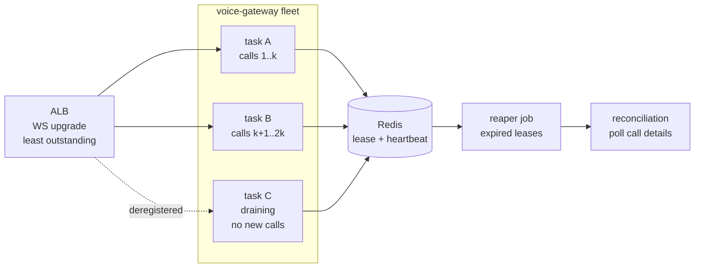
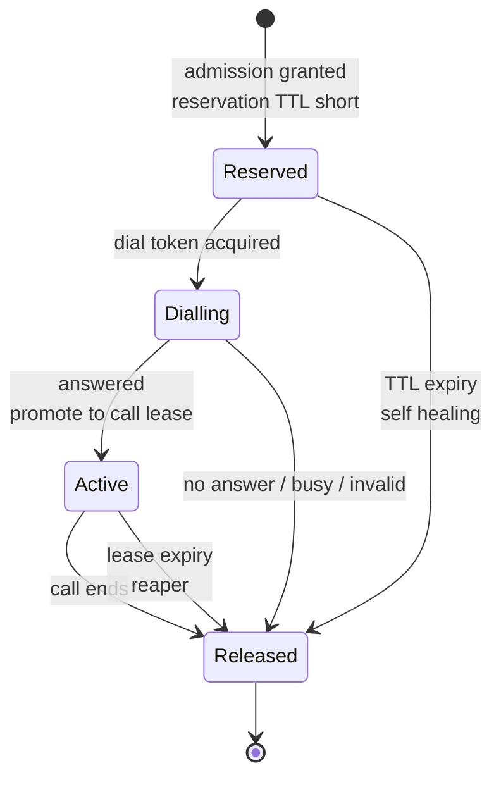
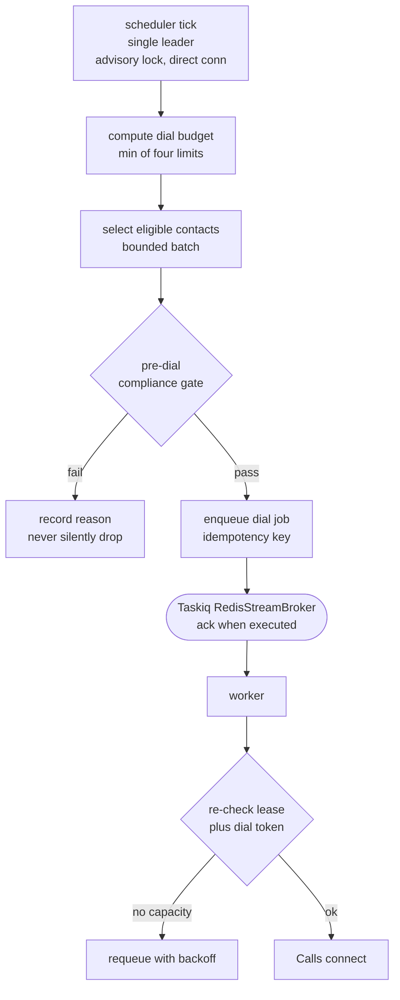

# Scalability

> **Status:** Phase 0 — nothing implemented, nothing measured. Every number in this document is a **target**, a **budget**, or **arithmetic derived from a documented byte rate**. There are no benchmarks yet.
> **Scope:** how this platform gets from 1 concurrent call to 1000+, what breaks at each step, and how we would find out.
> **Companions:** [ARCHITECTURE.md](ARCHITECTURE.md) (structure) · [REALTIME_VOICE.md](REALTIME_VOICE.md) (frame-level audio) · [DATA_MODEL.md](DATA_MODEL.md) (schema, partitioning) · [OBSERVABILITY.md](OBSERVABILITY.md) (the metrics this doc assumes exist) · [TESTING.md](TESTING.md) · [research/PROVIDER_CONSTRAINTS.md](research/PROVIDER_CONSTRAINTS.md) (verified provider facts) · [../PRD.md](../PRD.md) §7, §12.

---

## 0. The claim we are not making

**The V1 target of 100 concurrent calls is UNVERIFIED.** It is a product goal, not an established capability. It cannot be claimed until all three of these are true:

1. A load test sustains 100 concurrent calls end to end against fakes, *and* against a smaller real-provider run that calibrates those fakes (§11).
2. Telephony channel capacity is confirmed **contractually** — "unlimited concurrent calls per ExoPhone" appears only in an Exotel marketing blog and is listed as an anti-fact ([PROVIDER_CONSTRAINTS](research/PROVIDER_CONSTRAINTS.md) §7.3). This is PRD open decision **D-6**.
3. The realtime model provider confirms whether concurrency is gated separately from RPM/TPM. **No concurrent-session limit is documented at any tier** (HC-18). Any concurrency figure you have seen quoted for `gpt-realtime-2.1` is invented (anti-fact §7.6).

Until then, the honest statement is: *"the architecture is designed for 100 concurrent calls and imposes no internal ceiling we know of below that; the external ceilings are unquantified."*

Two further things we have not measured and must not pretend to know: RTT from `ap-south-1` to the nearest realtime edge (§6a-17), and CPU cost per concurrent call. The second one is the whole of §3.

---

## 1. Connection ownership: stateless process, stateful connections

The voice gateway is the only component in this system that cannot be scaled by "add another replica and let the load balancer sort it out." Understanding why is a prerequisite for changing anything in `apps/voice-gateway`.

### 1.1 What a live call actually pins to an instance

A live call holds:

| Socket | Primary path | Cascaded fallback path |
|---|---|---|
| Telephony media WS (Exotel) | 1 | 1 |
| Realtime model WS (OpenAI) | 1 | — |
| Sarvam STT WS | — | 1 |
| Sarvam TTS WS | — | 1 |
| **Sockets per call** | **2** | **3** |

And it holds, **only in that process's memory**:

- the outbound playback ring buffer and its rate-dependent alignment state (960-byte quantum at 24 kHz, 320-byte at 8 kHz — HC-2),
- `played_ms` — our belief about how much assistant audio the caller actually heard, reconciled against Exotel `mark` echoes (HC-9), which is the input to `conversation.item.truncate` (HC-7),
- conversation items not yet flushed to Postgres,
- in-flight tool calls,
- the agent-definition snapshot (shared, immutable, cached — this part is fine).

None of that is recoverable from another instance. **Neither provider documents a session-resume primitive** ([PROVIDER_CONSTRAINTS](research/PROVIDER_CONSTRAINTS.md) §3, "Reconnection"), so there is no failover for a live call and we must not design as if there is.

### 1.2 Consequences

**Load balancing.** The LB must support WebSocket upgrades and must have an idle timeout longer than our maximum call duration. The default idle timeout on a typical ALB is measured in *seconds*; it must be raised, and the maximum configurable value must be confirmed to exceed our call cap before we rely on it — **TO VERIFY in our own account**. A related unknown: Exotel's keepalive/ping behaviour and idle timeout on the media socket are undocumented (§6a-8), so we cannot assume a silent caller keeps the socket "active" from the LB's point of view.

Use a **least-outstanding-requests** style algorithm, not round-robin. For long-lived WebSockets a connection is one outstanding request for the entire call, so least-outstanding approximates least-connections, which is what we want. Round-robin distributes *new* connections evenly and therefore keeps an old, nearly-full instance at the same intake rate as a freshly-scaled-out empty one.

**Deploys and draining.** A call can run up to 60 minutes (HC-5 telephony stream cap, HC-6 model session cap — two independent clocks). Therefore:

- Draining is *stop accepting new upgrades, keep serving existing*. In practice: fail the LB health check / deregister from the target group, keep the process alive.
- **Container orchestrators cap how long they will wait for a task to stop, and that cap is almost certainly shorter than a call.** Confirm the exact Fargate `stopTimeout` maximum and ALB `deregistration_delay` maximum — **TO VERIFY** — but do not build the drain strategy on either. Build it on an explicit blue/green task-set: the old task set keeps running as its own deployment, publishes its active-call count, and a small controller job scales it to zero when the count hits 0 or the drain deadline passes.
- **Set a product-level maximum call duration and make it shorter than 60 minutes.** This is the only lever that bounds drain cost. A 30-minute cap halves the worst-case blue/green overlap and therefore halves the cost of deploying during business hours. Model-session rollover (summarise → new session → replay condensed context) happens *inside* that window and is a separate mechanism.

**Instance failure.** An instance dying kills every call it holds. There is no mitigation, only blast-radius management: **prefer many small tasks over few large ones.** A fleet holding `C` calls across `N` tasks loses `C/N` calls per failure. This aligns with the GIL argument in §3 — one vCPU per process is both the correct CPU model and the correct blast-radius model.

**Orphan cleanup.** When an instance dies, `finalize_call()` never runs for its calls. Three things must catch that:

1. A per-call heartbeat in Redis with a short TTL, so a reaper can find calls whose owner has gone away.
2. The reconciliation job that is already mandatory because Exotel status callbacks may be delayed or dropped with no retry (HC-11) — it polls Call Details for calls stuck without a terminal event.
3. **The concurrency budget must be a lease, not a counter** (§5.2). A process that dies between `INCR` and `DECR` permanently reduces platform capacity, and the symptom — "we can only do 87 calls now, we used to do 100" — is extremely hard to diagnose after the fact.



---

## 2. The progression

Each step below answers the same three questions. The value of this document is the "breaks first" column, not the mitigations — mitigations are easy once you know the order.

### 2.1 One call — the demo

**Breaks first: nothing about capacity. Everything about correctness.** At one call the failures are the ones in [CLAUDE.md](../CLAUDE.md) "Traps": the 10-second connect deadline with exactly one handshake retry (HC-5), ring-buffer alignment (HC-2), `played_ms` accuracy (HC-7), unsigned and droppable webhooks (HC-10, HC-11).

The one capacity-shaped failure that *does* bite at one call: **cold start**. If the model WebSocket is established lazily inside the Exotel accept path, the handshake can miss the 10-second window. Pre-warm, or emit silence while it establishes. This is also why serverless is disqualified for the media plane.

**What we change:** nothing yet — single task, single process, one scheduler replica (which is already mandatory, not a scaling choice: two schedulers means duplicate real phone calls).

**How we would know:** the call connects and audio flows both ways; per-turn timing is instrumented from the first call, not retrofitted.

### 2.2 Ten concurrent

**Breaks first: event-loop head-of-line blocking.** At one call, an accidental synchronous operation — a blocking DNS lookup, a synchronous log write, `json.dumps` of a large object, a `SET LOCAL`-less ORM call that slipped past review — is invisible. At ten calls it adds jitter to the other nine, and the symptom is "audio sounds choppy sometimes" with a flat CPU graph. This is the single most important reason **event-loop lag is the media plane's real utilisation metric, not CPU**.

Second: a single instance is now a single point of failure and any deploy kills ten live conversations.

Third: per-call resource leaks become visible — an unsupervised task per call, a Sarvam keepalive timer that outlives its socket (HC-22: both Sarvam sockets close after ~60 s idle), a ring buffer that is never freed.

**What we change:**
- Two or more gateway tasks behind a WS-capable LB; drain on deploy.
- **Structured concurrency per call**: one task group per call, owning every task and socket, cancelled as one unit. A call must be terminable with a single cancellation, or leaks are guaranteed.
- Ruff's `ASYNC` and `LOG`/`G` rules are already enabled in `pyproject.toml` — they exist precisely for this failure mode. Treat a new `ASYNC` violation in `rn_voice` as a bug, not a lint nit.

**How we would know:**
- `event_loop_lag_p99` per task. Alarm well below anything that sounds bad — the budget for our own work is ~20 ms per audio frame ([ARCHITECTURE](ARCHITECTURE.md) §1), so a p99 loop lag anywhere near that is already a problem.
- `frame_forward_latency` — Exotel media frame received → appended to the model buffer, per task.
- `active_calls` per task, and RSS per task, plotted together. The slope is the memory constant `m` in §3.

### 2.3 One hundred concurrent — the V1 target

**Breaks first, in order, and none of the first three are in our code:**

1. **Telephony channel capacity.** You will get dial failures or busy responses that correlate with *our own* concurrent count rather than with the destination number. This is commercial and undocumented (§6a-6, **D-6**).
2. **Dial rate, not concurrency.** See the arithmetic below — this is the one that surprises people.
3. **Model provider TPM.** RPM/TPM are published per tier; concurrency is not (HC-18). A 429 at session-create is survivable (reject the dial); a 429 mid-call is a dropped conversation.
4. **The fallback path is not a capacity-preserving failover.** Sarvam STT caps at 100 concurrent WebSockets at every tier (HC-21). Failing 100 live calls over to the cascade will exhaust it immediately — and note the asymmetry: TTS scales to ~1000, STT does not. Capacity must be reasoned about **per leg, not per call.**
5. Our own per-task capacity, which is unmeasured (§3).

#### The dial-rate arithmetic — do this before assuming the bottleneck is CPU

Little's Law: to sustain `C` concurrent *connected* calls of mean duration `T` minutes, you must connect `C/T` calls per minute. With an answer rate `a`, that requires `C / (T · a)` **dial attempts** per minute.

Exotel's `Calls/connect` is limited to **200 req/min**, returning 429 on breach (HC-13).

| Concurrent target `C` | Mean duration `T` | Answer rate `a` | Required dials/min | vs 200/min cap |
|---|---|---|---|---|
| 100 | 3 min | 0.50 | 67 | 33% |
| 100 | 3 min | 0.30 | 111 | 56% |
| 100 | 3 min | 0.15 | **222** | **over the cap** |
| 100 | 5 min | 0.30 | 67 | 33% |

**At 100 concurrent with a realistic cold-list answer rate, the provider's dial-rate limit binds before anything in our own system does** — and that is before retries, which consume the same bucket. Two consequences that shape the product, not just the infra:

- Answer rate and mean call duration are **capacity parameters**, not just marketing metrics. A campaign of short unanswered calls is far more expensive in dial-rate terms than a campaign of long conversations.
- Exotel's campaign feature separately defaults to a 60 calls/min throttle with a max of 5000 contacts per campaign (HC-13, tagged **[L]** — single source). If we ever use that path rather than raw `Calls/connect`, the ceiling is three times lower. Verify before depending on it.

#### What is *not* the bottleneck at 100, and why

- **Database connections from the media plane.** The voice gateway holds no DB session of its own; it goes through `rn_services`. (To be precise about what that does and does not mean: `rn_voice` depends on `rn_services`, which depends on `rn_persistence`, so SQLAlchemy, asyncpg and the Redis client *do* ship inside the gateway image. What is prevented is the gateway **opening a session of its own** — that is enforced by an import contract, not by packaging.) It only touches Postgres at call **start** (as a fallback when the Redis context handoff misses) and at call **end** (`finalize_call()`: call state + outbox row, one transaction). So media-plane DB demand is proportional to the **call arrival/completion rate**, not to concurrency. At 100 concurrent with 3-minute calls that is ~0.55 completions/second — trivial.
- **Redis.** Per call: a lease acquire, periodic renewals, a lease release, a context write and read, an idempotency key. Order of hundreds of ops/second at 100 concurrent. Redis does not bind here, and it must not — per-frame audio events in Redis are explicitly forbidden.

The DB bottleneck at 100 concurrent lives in the **processing plane**, not the media plane: every completed call fans out into transcript assembly, structured analysis, and metering. At ~0.55 completions/s that is ~1.7 jobs/s, and each analysis job makes an LLM call taking seconds. The failure mode is a worker **holding a pooled database connection across a provider call**. Under transaction-mode pooling (HC-26) that is how you exhaust a pool with two-digit job concurrency.

> **Rule, enforceable in review:** never hold a database transaction open across a network call to a provider. Read what you need, commit, call the provider, open a new transaction to write the result.

**What we change at 100:**
- Admission control with per-org and platform concurrency budgets, checked before dialling (§5).
- Token-bucket dial limiter sized *below* the provider cap, shared across all workers (§6).
- Sarvam cascade admission capped at a configured number well under 100, with an explicit policy for what happens above it (§4.4).
- OTel sampling: per-turn spans at 100 concurrent calls is a real telemetry bill and a real CPU cost in the media plane.

**How we would know:** §12's bottleneck table lists the leading indicator for each.

### 2.4 One thousand and beyond

**Breaks first: commercial ceilings, then the things we built to be simple at 100.**

1. **Telephony channels and model provider TPM.** Both are contract negotiations. Engineering cannot route around either.
2. **The fallback story collapses entirely.** 100 STT sockets against 1000 concurrent calls is 10% coverage. At this scale the degradation path can no longer be "switch to the cascade" — it has to be a product behaviour: an apology and a callback booking, or a queue, or a human. Either the cap is raised by agreement (§6a-23) or the fallback stops being a capacity story and becomes a *quality* story for a small subset of calls. **This is a decision, not a tuning parameter — see L-9.**
3. **The platform concurrency counter becomes a hot key.** One Redis key mutated on every dial, every answer, every hangup, plus lease renewals from 1000 live calls. Shard it: exact per-org keys plus a platform budget split into N sub-buckets, accepting approximate platform accounting and exact per-org accounting. Per-org exactness is what matters commercially; platform exactness is a safety margin that can absorb a few percent of slop.
4. **The scheduler tick gets long.** A single leader computing eligibility for thousands of contacts per tick is a serial bottleneck, and it is the one component we may never run twice. Fix: the scheduler **enqueues per-campaign or per-org dispatch jobs and does no work itself.** Leadership guards the decision to emit work, not the work.
5. **Time-partitioned tables become mandatory** — and the first table to need it is not `calls` (§7.4).
6. **Deploys become expensive.** Draining 1000 calls means running close to double capacity for the length of the drain window. This is where the product-level max-call-duration cap pays for itself.

**How we would know:** dial-path 429 rate, `sarvam_stt_sockets_active` vs cap, Redis p99 command latency and slowlog, scheduler tick duration vs tick interval, replica lag, and the vacuum/bloat metrics on the highest-churn tables.

---

## 3. Capacity math, honestly

### 3.1 What one call actually costs us per second

This is derivable from documented byte rates, so it is arithmetic rather than guesswork — but the *CPU* it translates into is not.

Exotel carries audio as **base64 inside JSON text frames**, s16le mono, at 8000 / 16000 / 24000 Hz selected per call (HC-1, HC-3). The default for OpenAI-primary agents is 24000, which eliminates resampling on the primary path (OpenAI accepts `audio/pcm` at 24 kHz only — HC-4).

At 24 kHz mono s16le: **48,000 bytes/second per direction.** Base64 inflates that to ~64,000 bytes/second on the wire.

| Leg | Direction | PCM B/s | Messages/s | Per-message work |
|---|---|---|---|---|
| Exotel → gateway | inbound | 48,000 | ~10–20 (HC-1) | JSON parse + base64 decode |
| gateway → model | inbound | 48,000 | our choice | base64 encode + JSON serialise |
| model → gateway | outbound | 48,000 | arbitrary delta sizes | JSON parse + base64 decode |
| gateway → Exotel | outbound | 48,000 | ≤ ~12.5 (3840 B min chunk = 80 ms) | base64 encode + JSON serialise |

The outbound row's arithmetic, because it is the one people get wrong: at 24 kHz the alignment quantum is **960 bytes** (320 bytes is only 6.667 ms there, and accumulating playback in 6.667 ms units makes `audio_end_ms` drift, which silently corrupts barge-in truncation — HC-7). The minimum legal outbound chunk is therefore the smallest multiple of 960 that is ≥ 3200, i.e. **3840 bytes = 80 ms**, giving 48,000 / 3840 = **12.5 outbound messages/second**. At 8 kHz the minimum is 3200 bytes = 200 ms. See [REALTIME_VOICE.md](REALTIME_VOICE.md) and ADR-003, which are authoritative on this.

Roughly **40–75 messages per second per call**, each a JSON parse/serialise plus a base64 transcode of a few KB. Wire throughput is ~256 KB/s ≈ **2 Mbit/s per call at 24 kHz** (a floor: excludes JSON overhead and TLS), so 100 concurrent calls is on the order of 200 Mbit/s of WebSocket traffic through one fleet. At 8 kHz it is one third of that.

Three notes that matter more than the raw numbers:

- **The cost is per-message Python overhead, not per-byte.** Bytes are cheap; 40–75 trips through the interpreter per second per call are not.
- **We control the inbound append cadence to the model.** Exotel delivers ~10–20 messages/second/direction, i.e. 50–100 ms of audio per message (HC-1). Batching to a 100 ms append instead of forwarding each inbound message as it arrives roughly halves message count on that leg, at the cost of up to ~50 ms of added input latency and delayed server-side `speech_started` detection. That is a real latency/CPU trade and it must be a config knob, not a constant. Its effect is *expected*, not measured.
- **Resampling is conditional.** At the default 24 kHz there is none on the OpenAI path. It appears on 8/16 kHz agents and on the Sarvam cascade. The transcoder lives in `rn_providers`, and `numpy`/`soxr` are pulled in via the `rn-providers[audio]` extra — `apps/voice-gateway` depends on `rn-providers[openai,audio]`, so an agent fleet that never resamples still ships the extension. `soxr` is a C extension; **whether it releases the GIL during resampling is UNVERIFIED** and should be checked before assuming resampling parallelises across the interpreter.

### 3.2 The sizing method

Do not guess an instance size. Derive it, and be explicit that two of the inputs are unmeasured.

```
c  = CPU-seconds of our work per wall-clock second of one live call   [UNMEASURED]
m  = resident bytes per live session                                  [UNMEASURED]
U  = target steady-state CPU utilisation per process  (headroom for GC, TLS, bursts)
R  = usable RAM per task after process baseline
F  = file-descriptor limit minus reserve
s  = sockets per call: 2 on the primary path, 3 on the cascade

calls_cpu  = floor(U / c)          <-- per PROCESS, not per task. See below.
calls_mem  = floor(R / m)
calls_fd   = floor(F / s)
calls_per_process = min(calls_cpu, calls_mem, calls_fd)
```

**`calls_cpu` divides by 1, not by vCPU count.** A single Python asyncio process gets one core for interpreted work. Dividing total task vCPU by per-call CPU is the most common sizing error in this class of system. Run **one process per vCPU** — which, conveniently, is also the right answer for blast radius (§1.2). Each process owns its own connections; the LB spreads across tasks, and `SO_REUSEPORT` or one-process-per-task spreads within them. Note that a connection's process affinity is fixed at accept and never changes.

Fleet sizing then adds two reserves:

```
fleet = ceil( target_concurrency / (calls_per_process * (1 - headroom)) )
      + drain_overlap_capacity   (during blue/green deploys)
```

### 3.3 Measure `c` and `m` correctly or not at all

- **Measure under load, not with one call.** Per-message overhead is not linear once the event-loop run queue grows: scheduling overhead and GC pressure both rise. `c` measured at 5 calls will underestimate `c` at 80.
- **`m` is not constant across a call's life.** Conversation history accumulates. A 40-minute call costs more resident memory than a 2-minute one, and `active_calls` alone will not tell you that. Publish `active_call_minutes` alongside `active_calls` and watch RSS against both.
- **The utilisation signal is event-loop lag, not CPU%.** A media-plane process at 70% CPU with p99 loop-lag spikes is already producing audible artefacts while the CPU dashboard looks healthy. Set the operational target on lag; use CPU as a secondary.
- Measure separately for: 24 kHz passthrough, 8 kHz with resampling, and the 3-socket cascade. These are three different values of `c` and the fleet must be sized for the worst one it is allowed to run.

Until §11's load test produces `c` and `m`, **any instance-count in a plan document is a placeholder.**

---

## 4. The real ceilings, in the order they will bite

### 4.1 Telephony channel capacity — commercial, undocumented

**Status:** unknown. Developer docs and limits pages are silent; the only "unlimited concurrency" claim is a marketing blog (anti-fact §7.3). PRD **D-6**.

**Detect:** dial failures or busy responses whose rate correlates with *our own* platform concurrency rather than with destination or time of day. Instrument `dial_outcome` with our concurrent-call count attached so this correlation is visible without a manual investigation.

**Do:** treat the platform concurrency budget as a **configured constant we set conservatively and raise only against contractual evidence**. Never infer it from a good day.

### 4.2 Realtime model provider limits

**Status:** RPM/TPM published per tier. **No documented concurrent-session limit** (HC-18). Do not promise one.

**Detect:** 429 rate split by *session-create* vs *in-session*; tokens/minute derived from `UsageEvent`s against the tier's TPM. Compute `headroom = TPM / (measured tokens_per_min_per_call)` and alarm on the derived concurrent-call ceiling, not on raw token counts.

**Do:** default to `gpt-realtime-2.1-mini` with premium as per-agent opt-in; constrain `reasoning_effort` to `minimal`/`low`. Treat session-create 429 as an admission-control signal — reject the dial (§5). One open question with direct capacity impact: **whether cached input tokens count against TPM the same as fresh ones is UNVERIFIED**; if they do not, prompt caching is a capacity lever as well as a cost lever. Confirm with the provider before planning around it.

### 4.3 Exotel dial rate — 200 req/min

**Status:** confirmed (HC-13), 429 on breach. Campaign-path throttle of 60/min and 5000 contacts/campaign is single-sourced **[L]**.

**Detect:** token-bucket **wait time**, not just 429 count. Time spent waiting for a dial token is the leading indicator; 429s are the lagging one. If wait time is non-zero, campaigns are already being paced by the provider and not by our own plan.

**Do:** a single shared token bucket in Redis, sized below the documented cap, in front of every dial path including retries and reconciliation-triggered redials. See §6.

### 4.4 Sarvam STT — ~100 concurrent sockets

**Status:** confirmed at 20 (Starter) / 100 (Pro) / 100 (Business); it does not scale past 100 at any tier (HC-21). TTS scales to ~1000 — the legs are asymmetric.

**Detect:** `sarvam_stt_sockets_active` as a first-class gauge with the cap as a constant on the same dashboard, plus a counter for cascade-admission rejections.

**Do:** the cascade is a **fallback for a subset of calls, not a failover for the fleet.** Cap cascade admission at a configured number well below 100, and define explicitly what happens when a live call needs the cascade and there is no socket: end the call gracefully with a callback offer, do not silently degrade audio. At 1000 concurrent this ceiling forces the L-9 decision (fallback-only vs co-primary, and whether the cap can be raised — §6a-23).

### 4.5 Database connections under transaction-mode pooling

**Status:** Neon's PgBouncer runs `pool_mode=transaction`; session-level `SET`, `PREPARE`, `LISTEN/NOTIFY`, temp tables and advisory locks are unsupported (HC-26). Two DSNs in config: pooled for app traffic, direct for migrations, index builds, advisory locks and session `SET`.

**Detect:** pool acquisition wait p95 per process, PgBouncer clients-waiting, and — the one that catches the real bug — **transaction duration p99 per job type**. A long tail there means someone is holding a connection across a provider call.

**Do:** small per-process pools sized from `worker_concurrency × (in-transaction time / total job time)`, not from optimism. All vector search goes through the one `vector_search()` helper that opens a transaction and issues `SET LOCAL` — without it, production silently runs the default `hnsw.ef_search` (HC-25, HC-26). Scale-to-zero must be **off** on the production branch (HC-28).

### 4.6 Redis throughput

**Status:** not a bottleneck at 100. Becomes one at 1000+ only through hot keys.

**Detect:** p99 command latency, slowlog, ops/sec, and the latency of the admission Lua script specifically — that script sits in front of every dial.

**Do:** per-org keys rather than one global counter; pipeline where possible; keep the admission script short and O(log n); never write per-frame audio data. If the admission script's p99 becomes visible in dial latency, shard the platform budget before reaching for a bigger Redis.

---

## 5. Backpressure and admission control

### 5.1 The principle

**Reject the dial. Never degrade a live call.**

A rejected dial costs a retry twenty minutes later. A degraded live call costs the caller's patience, the tenant's brand, and — because these are real Indian phone numbers under NCPR rules with a 24-hour opt-in-evidence obligation (HC-14) — potentially a compliance incident. The asymmetry is not close, so the design has exactly one place where load is refused: before the dial.

### 5.2 The budget must be a lease, not a counter

Two org-level and platform-level budgets, both implemented as **leases with expiry**, not as `INCR`/`DECR` counters:

```
ZADD  org:{org_id}:active   score=now+lease_ttl   member=call_id
```

- The owning gateway process **renews** the lease periodically while the call is live.
- Occupancy = `ZCOUNT` above `now`; expired members are pruned in the same script.
- Admission is one Lua script: prune → count → compare against budget → add, atomically.

Why this shape and not a counter: a process that dies mid-call never decrements, and a raw counter therefore leaks capacity permanently and invisibly. A lease self-heals within one TTL. The cost is that a live call whose renewals fail could have its lease expire — so **renewal failure must never terminate a call**; it is logged and the call continues. That asymmetry is deliberate:

| Redis unavailable | Behaviour |
|---|---|
| New outbound dial | **Fail closed** — do not dial. Dialling without a budget risks a dial storm into real phone numbers. |
| Live call | **Unaffected.** Redis is not on the audio path and must never become so. |
| Lease renewal | Log and continue. Never kill a conversation over a coordination store. |

### 5.3 Why the check happens before dialling, not after answering

Between the dial and the answer there is ringing — seconds to tens of seconds — during which the telephony channel is already committed and money is already being spent. Checking capacity after the answer means hanging up on a human who has just said "hello". Done at scale, that is indistinguishable from harassment and is exactly the behaviour Indian telecom regulation exists to prevent.

So the budget is a **reservation** taken at dial-intent, held through ringing, promoted to an active lease on answer, and released on *any* terminal outcome — answered-and-ended, no-answer, busy, invalid number, or lease expiry.



### 5.4 Two dimensions, both required

Concurrency and rate are different constraints and neither implies the other. A burst of 150 dials in ten seconds can sit comfortably inside a 200-concurrent budget while blowing through a 200 req/min rate limit. Admission therefore checks **both**: a concurrency lease *and* a dial-rate token.

### 5.5 Inbound is not symmetric

An inbound call is already ringing; there is no dial to refuse. Therefore **inbound gets a reserved slice of the platform budget that outbound campaigns can never consume.** Without that reservation, a large campaign starves the tenant's own inbound line — a failure the tenant will notice immediately and forgive slowly. Overflow behaviour above the reserved slice (a first-turn apology plus callback booking, versus refusing the applet) is a product decision that depends on what the telephony applet actually permits — **open, see §6a-10 and the Exotel applet capabilities.**

---

## 6. Campaign dispatch at scale

### 6.1 Why the naive loop is catastrophic here

`for contact in contacts: dial(contact)` is a bug class with real-world consequences that no amount of retry logic redeems:

- These are **real phone calls to real people**. A retry storm is not a spike in error rates; it is a person's phone ringing eight times in a minute.
- **Real money** leaves the account on every attempt, answered or not.
- **A real regulator.** Calls to NCPR-registered numbers must be transactional and whitelisted, and Exotel contractually requires producing opt-in evidence within 24 hours of a violation (HC-14). A loop that dials a mis-imported list is a compliance incident with a one-day clock, not a rollback.

There is also a specific technical trap worth naming: **LangGraph `interrupt()` restarts the entire node on resume** (HC-38). Any side effect placed before an interrupt re-executes — which for us means a duplicate outbound call. This is one reason dialling is a plain state machine in Postgres driven by short Taskiq jobs, not a long-lived graph run.

### 6.2 The dispatch loop that is safe



**The budget is the minimum of four separate limits**, recomputed every tick:

1. remaining per-organization concurrency lease headroom,
2. remaining platform concurrency headroom (minus the inbound reservation),
3. available dial-rate tokens (200 req/min shared across everything, including retries),
4. the campaign's own pacing configuration.

**The worker re-checks before dialling.** The queue is durable and can be slow; a job enqueued 90 seconds ago may be about to dial into a budget that no longer exists. The tick-time check paces the campaign; the dial-time check protects the ceiling.

### 6.3 Idempotency and retries

- **Idempotency key is deterministic** — `campaign_id:contact_id:attempt_no` — and enforced by a **unique index in Postgres**, not only by a Redis key. Redis is coordination; Postgres is truth. This matters because `RedisStreamBroker` with `--ack-type when_executed` (the only acceptable configuration — HC-35) redelivers on worker crash, and a redelivered dial job that is not idempotent dials a stranger twice.
- **Retry policy is per-outcome**, not a single exponential curve: busy → retry sooner; no-answer → retry much later, different time of day; invalid number → never, and mark the contact.
- **Bounded attempts per contact**, configured per campaign, with jitter so a paused-then-resumed campaign does not produce a synchronised burst.
- **Retries are window-aware.** A retry must never land outside the permitted IST calling window. The window is **configuration, never a constant** — the permitted hours could not be verified from any official source (L-3, anti-fact §7.11), and DND/NCPR scrubbing responsibility is likewise unconfirmed (L-5). PRD **D-4**.
- **No burst dialling, ever.** Even when the bucket is full and the budget is wide, the dispatcher paces. There is no business reason to fire 200 dials in three seconds and several regulatory reasons not to.

---

## 7. Database scaling

### 7.1 Read routing

Vector search goes to a read replica; OLTP writes go to the primary. The routing seam is two DSNs plus a "read" session factory — deliberately a **configuration-level** concern, because open decision **D-1** (data residency) may move us off Neon entirely, and the routing design must survive that.

### 7.2 Replica lag is eventual consistency — design for it

Neon read replicas are explicitly asynchronous and eventually consistent (anti-fact §7.23). Therefore:

> **Never read-after-write from a replica in a user-visible flow.**

Concretely, the two places we would otherwise get this wrong:

- **Knowledge base ingestion.** After an upload, do not read the chunk count from the replica to decide whether to render "ready". Drive the UI from the ingestion job's status on the primary, and show "indexing" until the job marks it complete. Signalling "indexing" is better UX than a promise of instant availability that intermittently lies.
- **Call context resolution.** Never resolve a call's context from a replica — a call dialled two seconds ago may not exist there yet. The path is Redis first (written at dial time), Postgres **primary** as fallback.

### 7.3 Vector table partitioning

Two facts force the shape:

- With approximate indexes, **filters are applied after the index scan** (HC-25). A naive `WHERE organization_id = $1 ORDER BY embedding <=> $2 LIMIT k` on a shared HNSW index succeeds and returns too few rows. It does not error; the agent simply appears to have forgotten its knowledge base.
- pgvector's own guidance names **partial indexes for few distinct filter values and partitioning for many**. Thousands of per-tenant HNSW indexes means unbounded catalog bloat (anti-fact §7.24).

**But note what that trap is a property of: approximate indexes.** Exact search has no such failure mode — a sequential scan with a tenant predicate returns exactly the top-k for that tenant, always. So it does not argue for partitioning; it argues that the day we adopt an ANN index we owe ourselves iterative scans, a raised `ef_search`, and a measured recall figure.

**Partitioning is therefore NOT adopted.** It was previously recorded as the Phase 1 design; [ADR-010](DECISIONS/ADR-010-defer-vector-storage-layout.md) withdraws that. At single-digit tenants — V1 — and tens to low hundreds long-term, a single `document_chunks` table with a `(organization_id, …)` B-tree and exact search is faster *and* exactly correct. Per-tenant index strategy, the main argument for LIST partitioning, only matters once there is an ANN index to vary, and there is not one yet. The whole physical layout is open decision **D-8**, resolved in Phase 3.

**What does not change: partitioning cannot be retrofitted cheaply onto a live vector table**, and the embedding width becomes part of the column type. So both remain things to decide *before* the corpus is large — which is precisely why they are being decided on evidence in Phase 3 rather than guessed in Phase 1. The trigger to revisit partitioning is a **measured** planner or index-maintenance problem at the actual tenant count, not a projected one.

### 7.4 When the OLTP tables need time partitioning

Row growth is arithmetic, so plan against it rather than waiting for a surprise. At 100 concurrent calls with a 3-minute mean, sustained across a 12-hour calling day:

| Table | Rows/day | Rows/month | Notes |
|---|---|---|---|
| `calls` | ~24,000 | ~720,000 | narrow rows |
| turn/timing rows (~30/call) | ~720,000 | ~21,600,000 | **the real problem** |
| tool execution log | campaign-dependent | millions | |
| transcripts | ~24,000 | ~720,000 | large TOASTed values |

**The per-turn and tool-execution tables need partitioning long before `calls` does.** Partition them by month and **detach-and-archive rather than `DELETE`** — a retention job that deletes tens of millions of rows a month produces bloat and long vacuums, which on a shared instance is felt by every tenant.

Triggers to revisit `calls` itself: the retention delete starts causing measurable bloat; the index no longer fits in RAM so dashboard date-range queries hit disk; or the table is large enough that a migration's lock time becomes a release risk. Review lock behaviour on every migration before it reaches production — this is already a repository convention, and it is the mechanism by which a scaling problem becomes an outage.

---

## 8. Redis: what it may hold and how each use degrades

**Postgres is truth. Redis is coordination.** Nothing that matters may live only in Redis. That is a repository rule, and this section is what it means operationally.

| Allowed in Redis | If Redis is lost | Policy |
|---|---|---|
| Concurrency reservations and call leases | cannot admit new dials | **fail closed** — stop dialling |
| Dial-rate token buckets | same | **fail closed** |
| Call-context handoff written at dial time | Postgres primary fallback; slower call start | fail open |
| Idempotency fast-path keys | Postgres unique index still catches duplicates | fail open, degraded latency |
| Live-call heartbeats for the reaper | reconciliation job + provider polling still close calls out | fail open, slower cleanup |
| Distributed locks (non-leadership) | operation retries later | fail open |
| Cached agent-definition snapshots | Postgres read on session open | fail open, slower start |
| Taskiq stream broker | jobs stop; **outbox rows accumulate in Postgres and replay** | fail open — the outbox is precisely why this is survivable |

**Never in Redis:** transcripts, per-frame audio events, the only copy of any call record, consent or opt-out truth, exact billing counters, scheduler leadership (that is a **Postgres advisory lock on a direct connection** — HC-26 means the pooled DSN cannot hold one).

Two things follow that are easy to state and easy to forget:

- **Redis is not on the audio path.** If a live call's audio ever depends on a Redis round-trip, that is a latency bug and an availability bug at the same time.
- **"Kill Redis during a live call" is a required chaos test**, with exactly two assertions: (1) the call completes and produces a durable record, and (2) no new dial is placed while Redis is down.

Redis persistence (AOF/RDB) is a recovery convenience. Do not let its existence soften any of the above into "well, it probably survives."

---

## 9. Autoscaling signals per deployment unit

There are **five deployment units**: four self-hosted container services (`api`, `voice-gateway`, `worker`, `scheduler`) plus the Vercel-hosted dashboard. The scheduler is the worker image with a different entrypoint and a single active replica, so it is a distinct deployment unit but not a distinct container image.

| Unit | Scale on | Do not scale on | Scale-in behaviour |
|---|---|---|---|
| `apps/web` (Vercel) | CDN/edge; n/a | — | n/a |
| `apps/api` | RPS per task, with p95 latency as a guard | — | ordinary |
| `apps/voice-gateway` | **active calls + reserved dials** per task | CPU, memory, RPS, network | **never terminate a task holding calls** |
| `apps/worker` | queue depth and oldest-message age | CPU | ordinary, drain in-flight job |
| `scheduler` (worker image, alternate entrypoint) | **never** — exactly one replica | anything | n/a |

### Why active-calls is the only correct signal for the media plane

1. **CPU per call is not constant.** It varies with speech-vs-silence ratio, whether resampling is engaged (24 kHz passthrough versus 8 kHz), and whether the call is on the 2-socket primary path or the 3-socket cascade. A single CPU target therefore maps to wildly different call counts, which makes it useless as a capacity proxy.
2. **CPU is a lagging signal for a leading problem.** Scaling out takes tens of seconds during which every new call lands on already-loaded tasks. But we *control* outbound dialling, so we know demand before it exists — scale on `active_calls + reserved_dials` and the fleet grows ahead of a campaign burst rather than behind it.
3. **Scale-in on a utilisation metric will kill live conversations.** Standard target-tracking terminates the task it chooses, not the empty one. Scale-in for the media plane must be: deregister, stop accepting, wait for zero, then terminate — the same controller that handles blue/green drains (§1.2). Treat "scale-in policy" and "drain controller" as one component.
4. **Active calls undercounts long calls.** Memory grows with conversation length. Publish `active_call_minutes` as a second metric and alarm on both; if RSS tracks minutes rather than calls, the memory constant `m` in §3.2 needs to become a function of call age.

---

## 10. Cost scaling and the levers

### 10.1 What we can and cannot compute today

Cost per call = telephony minutes + realtime audio tokens in/out + input transcription + post-call analysis + embeddings + infrastructure.

**We cannot compute a unit cost today.** Exotel's per-minute voice pricing, streaming surcharge, ExoPhone rental and WhatsApp conversation pricing are all non-public (§6a-11). What we *can* do — and what the PRD requires from day one — is **build the meter**: a normalised `UsageEvent` per call, per minute, per tenant, per agent, per campaign, per provider. Billing can be added later; the measurements cannot be retrofitted.

### 10.2 The levers, ranked

1. **Prompt caching of the long system instruction.** [PROVIDER_CONSTRAINTS](research/PROVIDER_CONSTRAINTS.md) §3 records an **80× spread between cached ($0.40/1M) and fresh ($32/1M) audio input tokens [C]**. Nothing else on this list is in that range. It has a direct code consequence: **the system instruction must be prefix-identical across every call for a given agent version.** Per-call dynamic content — customer name, campaign, current time — goes *after* the cacheable prefix or into the first conversation item, never interpolated into the middle of the instruction. Publishing a new agent version invalidates that agent's cache and produces a cost blip; that is expected, and it is another reason agent definitions are versioned.
   > **DECISION REQUIRED / VERIFY:** the exact caching mechanism, eligibility rules and TTL for the *realtime* models are not established in PROVIDER_CONSTRAINTS — only the price spread is. Confirm before designing around it, and confirm whether cached tokens count against TPM (§4.2), because if they do not, this is a capacity lever too.
2. **Model routing.** `gpt-realtime-2.1-mini` by default, premium as a per-agent opt-in — roughly a 3× swing on audio input ($10 vs $32 per 1M [C]). Routing is agent configuration, so it is a per-tenant commercial lever, not a code change.
3. **`reasoning_effort` constrained to `minimal`/`low`.** Cost and latency in the same knob.
4. **Call duration.** The lever nobody counts. A 20% shorter call is ~20% cheaper on both telephony *and* model, and it also shortens the drain window (§1.2). Instruction design and turn policy are cost engineering.
5. **Context growth within a call.** Token-billed context means cost per minute of a call is not flat — a turn at minute 20 carries more history than a turn at minute 2. Session rollover (summarise → new session → replay condensed context), already required by the 60-minute caps, is therefore also a cost mechanism. The exact billing interaction between a growing cached prefix and per-turn input tokens on the realtime models is **UNVERIFIED**.
6. **Input transcription** is a per-minute line item ($0.017/min **[L]**). We need transcripts for the product, so it stays — but it should be a per-agent flag so a tenant who does not need them is not billed for them.
7. **Post-call analysis** is per-call, not per-minute, and uses a small model with schema-constrained output. It scales with call *count*, so it becomes significant exactly when campaigns get large and calls get short — the opposite profile to the realtime spend.

**Rejected optimisation, recorded so it is not re-proposed:** client-side silence suppression on the inbound leg. It would cut audio input tokens, but it fights server-side `semantic_vad` — the model's endpointing depends on receiving the silence. Do not hand-roll it on the primary path.

---

## 11. Load testing: what must exist before we may claim 100

A green load test against fakes proves our own code scales. It proves **nothing** about the providers. Both halves are required.

### 11.1 The fake telephony driver

A WebSocket peer that speaks the Exotel Voicebot shape: JSON **text** frames, base64 s16le at the configured rate, the `connected` / `start` / `media` / `dtmf` / `mark` / `stop` / `clear` vocabulary, realistic inter-frame jitter, and `mark` echoes delayed by a realistic playout time.

Critically, **it must validate our outbound frames and fail the test on violation** — the alignment quantum for the configured rate (960 bytes at 24 kHz, 320 at 8 kHz), the ≤100000 byte upper bound, and the effective lower bound that follows from both (HC-2): **3840 bytes = 80 ms at 24 kHz**, 3200 bytes = 200 ms at 8 kHz — plus frame cadence. A fake that merely accepts whatever we send teaches us nothing; the alignment rules are the most common integration failure in this class of system.

> **The trap to state out loud:** the exact JSON shape Exotel expects for *outbound* media is unverified (§6a-3), as is whether the byte thresholds scale with sample rate (§6a-4) and the exact sample-rate query parameter name (§6a-2, anti-fact §7.9). The fake therefore encodes **our assumptions**. A passing load test against it does not prove Exotel compatibility — only §11.4 does.

### 11.2 The fake model provider

A WebSocket server implementing the **GA** event set we depend on — not the beta shapes, which were removed on 2026-05-12 (HC-16), which is why most tutorials and OSS helpers are wrong. Minimum: `session.update`, `input_audio_buffer.append`, `input_audio_buffer.speech_started`, `response.output_audio.delta` (at deliberately arbitrary delta sizes), `conversation.item.truncate`, function calls, `response.done`.

It must support **injectable faults**, because these are the scenarios that actually break at 100: session-create 429, mid-session close, delta stall, and a slow first byte.

### 11.3 The audio corpus and the scenarios

Real Indian telephony audio — code-mixed, noisy, with overlapping speech for barge-in. Synthetic tones will pass a load test and fail a product; they exercise the transport but not the turn-taking, and turn-taking is where the latency budget is spent.

Required scenarios:

| Scenario | What it is actually testing |
|---|---|
| Steady 100 concurrent, 15+ minutes | `c` and `m`; leak detection |
| Ramp 0 → 100 in 60 s | campaign burst; scale-out lead time; admission control |
| 100 with barge-in on ~10% of turns | the three-part barge-in operation under contention |
| 100 with forced fallback to the cascade | that we correctly **refuse** rather than exceed the ~100 STT socket cap (HC-21) |
| Kill an instance at 100 | lease self-healing, reaper, reconciliation; measured call loss = `C/N` |
| Deploy during 100 | blue/green drain controller; no call dropped by a deploy |
| Kill Redis during 100 | live calls unaffected; new dials refused |

Measure: p50/p95/p99 turn latency; **p99 event-loop lag per process**; CPU and RSS per active call; outbound alignment violations; `played_ms` versus `mark` divergence; dropped calls; DB pool wait; Redis command p99. The output of this test is not "pass" — it is the values of `c` and `m` that feed §3.2.

### 11.4 The small real-provider run that validates the fakes

Five to ten concurrent **real** calls to consented internal test numbers, against real Exotel and real OpenAI, tagged with the `live` pytest marker (opt-in, never in CI, costs money).

That opt-in is enforced by configuration, not by convention: `pyproject.toml` sets `addopts = -ra --strict-markers --strict-config -m 'not live and not load'`, so a bare `uv run pytest` **cannot** select a `live` or `load` test — running either requires an explicit `-m` override. This is verified: a live-marked test is deselected by the default invocation. `.github/workflows/ci.yml` therefore runs the default selection (a python job with Postgres and Redis service containers, plus a web job) and never places a paid call.

Its purpose is not scale — it is **calibration**. Compare the real message cadence, delta size distribution, `mark` echo timing and time-to-first-audio against what the fakes produce. If they differ materially, the fakes' CPU numbers are wrong and the sizing derived from them is wrong. Recalibrate the fakes and re-run.

**And state it plainly in whatever report comes out of this:** passing §11.1–11.3 at 100 concurrent does **not** satisfy PRD §13. That requires provisioned provider capacity (**D-6**).

---

## 12. Bottleneck table

Headroom is "unknown" wherever it genuinely is. That is the point of the table.

| Component | Current headroom | First symptom | Mitigation | Revisit when |
|---|---|---|---|---|
| Telephony channel capacity | **UNKNOWN — commercial, D-6** | dial failures correlating with our own concurrency | conservative configured platform budget; contractual confirmation | before any capacity promise |
| Exotel dial rate | 200 req/min **[C]** | rising token-bucket wait time, then 429s | shared token bucket below the cap; per-outcome retry backoff | answer rate drops or `C/T` rises |
| Realtime model TPM | published per tier; **no documented concurrency limit** | 429 at session create | mini-by-default routing; derive concurrent ceiling from measured tokens/min/call | after the first real TPM measurement |
| Sarvam STT sockets | ~100 at every tier **[C]** | cascade admission rejections | cap cascade admission; graceful call-end, not degraded audio | at 1000 concurrent — forces L-9 |
| voice-gateway per-process capacity | **UNMEASURED (`c`, `m`)** | p99 event-loop lag, then audible jitter | one process per vCPU; many small tasks; scale on active calls | after §11 produces `c` and `m` |
| Gateway network | ~2 Mbit/s per call at 24 kHz (derived floor) | task-level network saturation | run 8/16 kHz agents where 24 kHz buys nothing | at 1000 concurrent per fleet |
| Postgres pooled connections | unknown; transaction-mode pooling **[C]** | pool wait p95; long transaction p99 | never hold a transaction across a provider call; small per-process pools | when worker concurrency changes |
| Vector search recall | tiered index + LIST partitioning | agent "forgets" its knowledge base, no error | mandatory `vector_search()` helper with `SET LOCAL` | before the first large tenant |
| Turn / tool-execution tables | ~21.6M rows/month at 100 concurrent (derived) | slow retention deletes, vacuum pressure | monthly partitions; detach-and-archive | when retention jobs first show bloat |
| Redis | not binding at 100 | admission script p99 in dial latency | per-org keys; shard the platform budget | at 1000 concurrent |
| Scheduler tick | single leader by design | tick duration approaching tick interval | scheduler enqueues, workers do the work | at 1000 concurrent |
| Deploy drain | bounded by max call duration ≤ 60 min | double-fleet cost during business hours | shorter product-level call cap; blue/green controller | when deploy frequency rises |

---

## 13. What would invalidate this document

- **D-1 (data residency).** If caller PII may not leave India, the database moves off Neon and the primary realtime provider may change entirely — §4.2, §7.1 and §7.2 would all be rewritten. Everything else is downstream of this.
- **D-6 (provisioned capacity).** Real numbers for telephony channels and model concurrency turn §4.1 and §4.2 from "unknown" into constraints we can actually plan against — and may make one of them the permanent first bottleneck.
- **The first real measurement of `c` and `m`** (§11). Until then, no instance count in any plan is real.
- **A negotiated Sarvam STT cap** (§6a-23) would restore the cascade as a genuine capacity failover and change §2.4 materially.
- **Confirmation of prompt-caching mechanics on the realtime models** (§10.2) would move it from a cost lever to a cost *and* capacity lever.

When any of these lands, update this document in the same change. A stale scaling document is worse than none, because someone will size a fleet from it.
